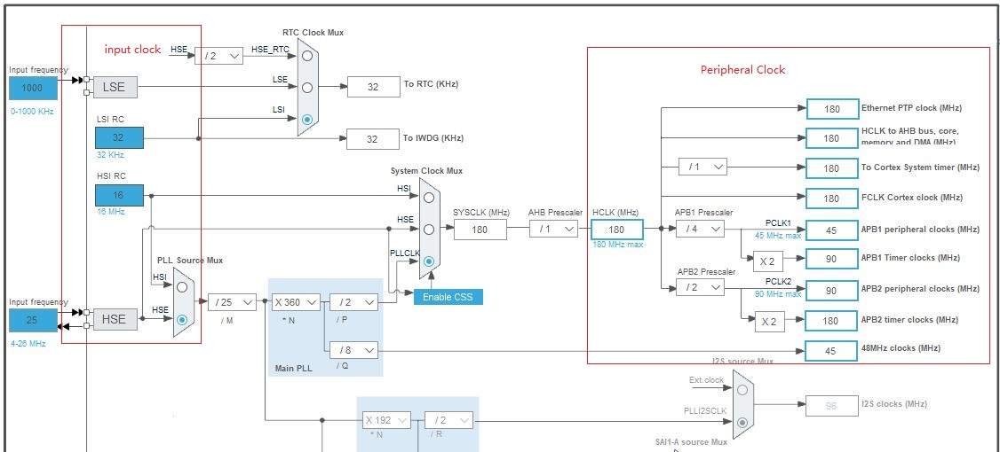

# 单片机总结系列(2) RCC时钟

RCC是驱动系统运行的基础时钟模块；系统内部指令的执行，模块的运行都依赖于时钟的工作。如指令的执行，寄存器的写，读，复位，数据从寄存器到硬件上的移位，都是基于时钟来进行同步和处理。对于STM32的RCC模块，主要包含以下功能.

- 管理系统工作的时钟, 这里包含支持系统SYSTICK时钟以及各外设的AHB，APB1和APB2时钟，内核和所有模块都有其工作的时钟范围，只有时钟满足要求才能正常工作。
- 单独管理每个外设模块的时钟开启，关闭和复位的动作，用于精细化的功率管理和复位处理。

## 时钟源和使能

RCC需要时钟源作为基准时钟才能正常的工作，以STM32为例，支持四种时钟源，具有不同的功能。

- 低速内部时钟LSI，对于STM32F4为32Khz，也有芯片为40Khz，不可配置，固定提供给内部看门狗，也可以作为RTC的工作时钟。
- 低速外部时钟LSE，由OSC32_IN/OSC32_OUT输入的时钟，不可配置，支持范围为0~1Mhz，由晶振和外部电路提供，可作为RTC的工作时钟。
- 高速内部时钟HSI, 由内部振荡器提供的高速时钟，对于STM32F4为16Mhz，可直接提供作为系统时钟，也可以作为PLL的输入时钟经过处理后，产生更高的时钟频率用于系统工作。
- 高速外部时钟HSE，由晶振和外部电路提供，常见支持8M，16M和25M晶振，HSE也可以直接提供给系统时钟，也可以作为PLL的输入时钟经过处理后，产生更高的时钟频率用于系统工作。

对于时钟的配置管理，可以参考STM32CubeMX的Clock Configuration配置功能，详细的展示了Clock的配置方法。



对于外部时钟产生，主要通过晶振提供，至于晶振的使用分为有源晶振和无源晶振。

- 无源晶振是两个引脚的无极性器件，需要配合RC电路(一般为电容配合内部激励时钟)才能产生震荡信号。
- 有源晶振是完整的振荡器，当正确接入电压后，会有引脚输出产生震荡信号。

内部时钟源具有不依赖外部晶振器件，调试简单等优点，但是会因为设计有误差、且受温度的影响，相对来说不精确，对于高精度定时，RTC计时，高波特率串口通讯的场景会引入时钟误差，所以有这些功能需求的产品中一般使用LSE/HSE作为基础时钟源。对于嵌入式RCC开发，主要包含时钟使能，倍频和分频使能，然后将系统时钟，外设模块时钟选中使能的时钟源，下面为HAL库提供的时钟启动和配置的代码。

```c
    RCC_OscInitTypeDef RCC_OscInitStruct = {0};
    RCC_ClkInitTypeDef RCC_ClkInitStruct = {0};

    /** Configure the main internal regulator output voltage
    */
    __HAL_RCC_PWR_CLK_ENABLE();
    __HAL_PWR_VOLTAGESCALING_CONFIG(PWR_REGULATOR_VOLTAGE_SCALE1);

    /** 
    * 开启系统的时钟源，并配置相应值
    * PLL依赖HAE, RTC工作采用LSE，IWDG采用LSI, 所以这些时钟需求开启
    * LSE Clock: 32.768KHz
    * LSI Clock: 32KHz
    * HSE Clock: 25MHz
    * System CLock: 25 / PLLM * PLLN / PLLP = 180MHz
    */
    RCC_OscInitStruct.OscillatorType = RCC_OSCILLATORTYPE_LSI|RCC_OSCILLATORTYPE_HSE
                          |RCC_OSCILLATORTYPE_LSE;

    //硬件HSE和LSE使用的都是无源晶振，
    //RCC_HSE_BYPASS旁路表示只需要一个引脚即可提供时钟，只有有源晶振支持
    RCC_OscInitStruct.HSEState = RCC_HSE_ON;
    RCC_OscInitStruct.LSEState = RCC_LSE_ON;
    RCC_OscInitStruct.LSIState = RCC_LSI_ON;
    RCC_OscInitStruct.PLL.PLLState = RCC_PLL_ON;
    RCC_OscInitStruct.PLL.PLLSource = RCC_PLLSOURCE_HSE;
    RCC_OscInitStruct.PLL.PLLM = 25;
    RCC_OscInitStruct.PLL.PLLN = 360;
    RCC_OscInitStruct.PLL.PLLP = RCC_PLLP_DIV2;
    RCC_OscInitStruct.PLL.PLLQ = 8;
    if (HAL_RCC_OscConfig(&RCC_OscInitStruct) != HAL_OK)
    {
        Error_Handler();
    }

    /** Activate the Over-Drive mode
    */
    if (HAL_PWREx_EnableOverDrive() != HAL_OK)
    {
        Error_Handler();
    }

    /** Initializes the CPU, AHB and APB buses clocks
    * SYSTICK Clock - PLL Clock 180MHz
    * AHB Clock - SYSTICK Clock/DIV 180MHz
    * APB1 Clock - AHB Clock/4 45MHz
    * APB2 Clock - AHB Clock/2 90MHz
    */
    RCC_ClkInitStruct.ClockType = RCC_CLOCKTYPE_HCLK|RCC_CLOCKTYPE_SYSCLK
                            |RCC_CLOCKTYPE_PCLK1|RCC_CLOCKTYPE_PCLK2;
    RCC_ClkInitStruct.SYSCLKSource = RCC_SYSCLKSOURCE_PLLCLK;
    RCC_ClkInitStruct.AHBCLKDivider = RCC_SYSCLK_DIV1;
    RCC_ClkInitStruct.APB1CLKDivider = RCC_HCLK_DIV4;
    RCC_ClkInitStruct.APB2CLKDivider = RCC_HCLK_DIV2;

    if (HAL_RCC_ClockConfig(&RCC_ClkInitStruct, FLASH_LATENCY_5) != HAL_OK)
    {
        Error_Handler();
    }
```

## 外设模块时钟管理

RCC模块提供其它外设的模块管理功能，通过RCC_APBxRSTR, RCC_AHBxRSTR, RCC_APBxENR, RCC_AHBxENR寄存器，可以控制大部分外设的模块使能/关闭和复位/非复位功能，这些在HAL库中被封装成宏进行操作, 下面以GPIO举例来列出些接口说明。

```c
//使能GPIOA的时钟
__HAL_RCC_GPIOA_CLK_ENABLE();

//关闭GPIOA的时钟
__HAL_RCC_GPIOA_CLK_DISABLE();

//复位GPIOA模块
__HAL_RCC_GPIOA_FORCE_RESET();

//释放GPIOA模块复位
__HAL_RCC_GPIOA_RELEASE_RESET();
```

上述就是RCC提供的用于模块时钟管理接口，对于后续使用的外设，如SPI，I2C，Timer等，都需要进行相应的时钟使能和控制.
