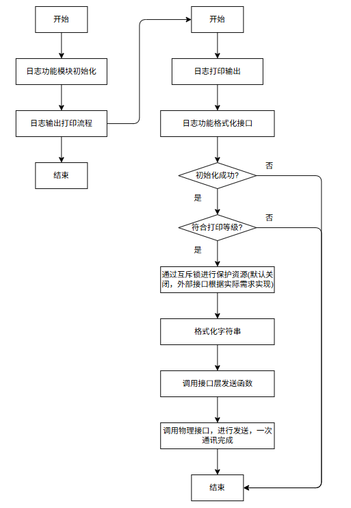
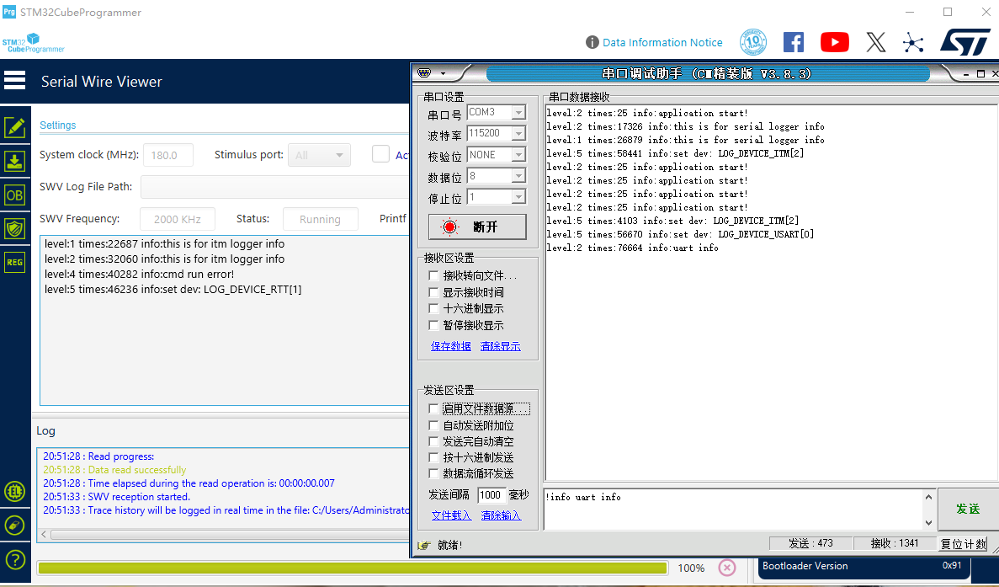

# 单片机技术应用总结(01) 日志库应用实现

在应用开发系列中，日志信息是产品开发中不可或缺的一部分，在发生异常时，可以用于分析用户操作复现场景；同时日志库是比较基础的组件，可以复用到后续其它项目中使用。日志库框架相对简单，但包含的知识技巧也不少，如可变参数处理、调试等级管理、通讯硬件接口、多任务下的线程安全处理等，也适合进行作为应用开发说明。在产品开发中，初期我也是习惯使用printf、segger_printf或ITM接口打印日志；可是当开发面向客户的产品时，并没有串口或者Jlink调试器来进行打印调试，有时外部接口可能使用网口，或者只能使用本地存储SDCard保存日志信息，这就需要一套机制来处理日志信息的输出，也是本篇应用的由来。

本节目录如下所示。

- [需求分析](#demand_analysis)
- [框架搭建和流程图设计](#framework_design)
- [代码实现](#code_design)
  - [日志库初始化](#log_init)
  - [格式化处理](#logger_print)
  - [硬件接口处理](#logger_interface)
  - [串口输出接口](#logger_uart)
- [运行结果](#logger_effect)
- [总结说明](#summary)

本节对应代码如下：**code/00-Application/00-LoggerTools/project/stm32f429.uvprojx**

## demand_analysis

在实现功能之前，首先需要先梳理功能需求，也是很多demo方案缺失的部分。这一步在真实产品开发中很重要，是必须进行的一环，后续所有设计都依赖需求的定义；而且需求并不是在整个设计中一成不变的，在开发中可以根据实际情况进行调整，如增加新的功能接口、移除无法实现或者不合理的需求。当然这些变更都需要讨论决策后依据流程来处理，这样才能保证设计流程的闭环和可靠。

对于日志库应用，主要需求如下所示。

- 格式化输出功能，能够根据指定的格式字符串和参数，将日志信息格式化为字符串，并输出显示。这一步是设计的基础功能，也是后续其他功能的基础。
- 日志等级管理，支持等级设置，可以屏蔽处理打印信息，灵活控制日志输出量。
- 打印接口管理，支持灵活打印到多种接口，提供设置接口管理，如串口、Jlink、STLink、网口、SDCard等。
- 多任务下的线程安全处理，多任务下，需要考虑线程安全，防止多任务同时访问日志库，导致数据错误。

对于上述需求，进一步拆分成嵌入式系统应用的功能实现。

- 格式化输出和日志等级管理功能可以综合成由类似printf的扩展接口实现，在接口中增加日志等级参数，根据等级进行过滤。
- 打印接口管理功能可以由接口层提供，实现数据到具体硬件接口的转换(logger_interface_write)，在内部根据设置的接口进行数据输出。
- 支持设置日志等级和通讯设备的接口，支持动态切换。
- 多线程下的安全处理可以由Mutex机制实现，在接口层增加锁机制，保证多任务下的数据安全。
- 对于硬件、锁相关的接口要兼容不同硬件平台，OS环境实现，可以默认使用__weak只提供接口，具体实现在具体平台由具体驱动实现。

经过这一步，大致对需求有了一定认知，可以进行产品的框架搭建和流程图设计。

## framework_design

根据上述需求，日志库的框架可以设计如下所示。


可以看到，对于日志库应用来说，可以分为三部分，分别是格式化应用层、接口转换层和硬件处理层，对于各层级功能，主要说明如下所示。

- 格式化应用层提供日志打印接口、数据格式化、互斥锁保护功能。
- 接口转换层提供数据到硬件接口的转换，进行数据的发送管理。
- 硬件层提供硬件接口，如串口、Jlink、STLink、网口、SDCard等具体的实现。

整个系统看起来并不复杂，不过到硬件接口，可以看到涉及串口、Jlink、STLink、网口、SDCard等具体的实现，其中前三个还算简单，后面网口就涉及LWIP移植和socket通讯，SDCard就需要掌握SDIO接口和Fatfs文件系统管理，从这里可以看出，应用和模块学习的差别。很多学习起来复杂的模块功能，再应用中往往只代表一个接口API，或者某一种配置下的可选功能，这正是应用和模块设计的区别，应用层只关注功能，但为了实现功能，往往涉及多个模块的组合，这正是难点所在。根据上述框架，可以进行流程图设计，如下所示。



对于上述流程图，整个日志库分为两部分实现；包含初始化流程，创建和初始化日志库需要的资源；另一个就是日志库的打印输出流程，包含格式化数据处理、硬件接口转换和硬件数据管理。考虑到涉及硬件部分，因此本应用也涉及如下章节的硬件说明。

- [综述和内核说明](./../src/ch01.overview_and_kernel.md)中关于调试接口的说明和实现。
- [串口通讯模块](./../src/ch05.usart_com.md)中关于串口通讯的说明和实现，环形队列和串口中断发送。
- [SDIO接口和fatfs应用](./../src/ch14.sdio_interface.md)中关于SD卡通讯的说明和实现，SDIO接口和Fatfs文件系统管理。

另外基础的如rcc、gpio、iwdg，以及扩展实现的rtc、eth、flash、freeRTOS等，再后续更新完善日志应用库时也会涉及，这里先暂且不进行说明。

## code_design

有了框架设计和流程图的概念，就可以进行代码开发了，主要包括如下几个部分。

- 进行STM32项目的基本框架搭建，包含启动文件，HAL库添加，HAL库初始化，以及主函数实现。这一步参考"综述和内核说明"即可，不涉及具体的日志库实现，这里不在详细说明。
- 添加日志库的初始化流程，包含日志库接口初始化、多线程包含初始化和接口初始化。
- 添加日志库的打印流程，包含格式化数据处理、硬件接口转换和硬件数据管理。

关于日志库的初始化流程和打印流程，可以参考如下代码。

### logger_init

日志库的初始化流程，包含日志库接口初始化、多线程包含初始化和接口初始化；对应代码如下：

```c
// logger.c
LOG_STATUS logger_module_init(void)
{
    LOG_STATUS ret;
    
    // 日志库接口初始化
    ret = logger_interface_init();
    if (ret != LOG_STATUS_OK) {
        return ret;
    }

    g_logger_info.ready = 1;
    g_logger_info.level = LOG_DEFAULT_LEVEL;
    
    return ret;
}

// logger_interface.c
LOG_STATUS logger_interface_init(void)
{
    LOG_STATUS ret = LOG_STATUS_OK;

    memset((char *)&logger_interface_info, 0, sizeof(logger_interface_info));
    
    logger_interface_info.device = LOG_DEFAULT_DEVICE;

    // 日志库多线程保护初始化
    ret |= logger_protect_init();

    if (ret != LOG_STATUS_OK) {
        return LOG_STATUS_ERROR;
    }

    // 物理层接口初始化，需要保证至少一个接口成功，才能运行工作
    ret = logger_uart_init();
    ret &= logger_sdcard_init();
    ret &= logger_eth_init();
    
    if (ret != LOG_STATUS_OK) {
        return LOG_STATUS_ERROR;
    }
    
    return LOG_STATUS_OK;
}
```

### logger_print

日志库的打印流程，包含格式化数据处理、硬件接口转换和硬件数据管理；其中格式化的数据处理如下。

```c
// 格式化打印接口应用
int print_log(LOG_LEVEL level, uint32_t tick, const char* fmt, ...)
{
    int len, bufferlen;
    char *pbuf, *buf;
    int outlen = 0;
    va_list	valist;
    LOG_DEVICE device;
    
    // 日志库是否初始化完成
    if (g_logger_info.ready != 1) {
        return -1;
    }

    // 日志打印等级满足输出需求，需要大于等于内部等级
    if (level < g_logger_info.level) {
        return -2;
    }
    
    // 多线程保护锁，确保打印过程中不被其他线程干扰
    if (logger_protect_entry() == LOG_STATUS_OK) {
        
        device = logger_get_interface();
        buf = LogGetMemoryBuffer(LOGGER_MAX_BUFFER_SIZE);
        len = LOGGER_MAX_BUFFER_SIZE;
        bufferlen = len - 1;
        pbuf = buf;
        
        len = snprintf(pbuf, bufferlen, "level:%d times:%d info:", level, tick);
        if ((len <= 0) || (len>=bufferlen)) {
            logger_protect_exit();
            return -3;
        }
        outlen += len;
        pbuf = &pbuf[len];
        bufferlen -= len;
        
        // va_xxxx用于可变参数处理，是格式化的关键函数
        va_start(valist, fmt);
        len = vsnprintf(pbuf, bufferlen, fmt, valist);
        va_end(valist);
        if ((len <= 0) || (len >= bufferlen)) {
            logger_protect_exit();
            return -4;
        } 
        outlen += len;
        pbuf = &pbuf[len];
        bufferlen -= len;
        if (bufferlen < 3) {
            logger_protect_exit();
            return -4;
        }
        
        pbuf[0] = '\r';
        pbuf[1] = '\n';
        outlen += 2;

        // 通过接口转换层发送数据
        if(logger_interface_write(device, (uint8_t *)buf, outlen) != LOG_STATUS_OK) {
            logger_protect_exit();
            return -5;
        }
        
        logger_protect_exit();
    }
   
    return outlen;
}
```

上述是日志库的格式化流程，其中比较关键的就是va_start、va_end、vsnprintf三个函数。它们定义在<stdarg.h>中，用于可变参数处理，并输出到字符串中。其中va_start用于初始化va_list变量，va_end用于结束可变参数处理，vsnprintf用于格式化输出到字符串中。格式化的数据最终通过logger_interface_write发送到实际硬件接口中。

### logger_interface

硬件接口转换层，比较简单，主要就是将数据转换到实际发送地址，以UART为例，具体如下所示。

```c
// logger_interface.c
// 硬件接口转换层，实现数据发送接口到实际硬件接口的转换
LOG_STATUS logger_interface_write(LOG_DEVICE device, uint8_t *buf, int len)
{
    LOG_STATUS ret = LOG_STATUS_OK;

    switch (device)
    {
    case LOG_DEVICE_USART:
        ret = logger_uart_transmit(buf, len);
        break;
    case LOG_DEVICE_RTT:
        ret = logger_rtt_transmit(buf, len);
        break;
    case LOG_DEVICE_ITM:
        ret = logger_itm_transmit(buf, len);
        break;
    case LOG_DEVICE_ETH:
        ret = logger_eth_transmit(buf, len);
        break;
    case LOG_DEVICE_SDCARD:
        ret = logger_sdcard_transmit(buf, len);
        break;
    default:
        ret = LOG_STATUS_ERROR;
        break;
    }
    return ret;
}

// 默认的uart发送函数，需要根据实际硬件接口实现
__weak LOG_STATUS logger_uart_transmit(uint8_t *buf, int len)
{
    LOG_STATUS ret = LOG_STATUS_OK;
    
    return ret;
}
```

可以看到本身接口层中提供的函数为logger_uart_transmit为空，这是硬件接口的实现与平台相关的，需要根据实际硬件接口实现。‘

### logger_uart

关于串口输出这里使用额外的外部函数，利用的是keil的特性，函数前加__weak，表示该函数可以被外部函数覆盖；如果外部函数没有定义，则使用默认的函数。至于串口的发送函数，利用串口发送空中断和环形队列实现。

具体代码如下所示。

```c
// 串口发送函数
LOG_STATUS logger_uart_transmit(uint8_t *buf, int len)
{
    LOG_STATUS ret = LOG_STATUS_OK;

    if (!logger_uart_info.is_ready) {
        return LOG_STATUS_ERROR;
    }

    ret = circular_put_tx_buffer(buf, len);
    
    return ret;
}

// 将数据放入环形队列
static LOG_STATUS circular_put_tx_buffer(uint8_t *ptr, uint8_t size)
{
    uint32_t tx_allow_size, index;

    if (logger_uart_info.is_ready != 1) {
        return LOG_STATUS_ERROR;
    }

    if (size == 1) {
        //if size is 1, not check for efficiency because the macro support check
       CircularBufferPut(&logger_uart_info.tx_buffer_info, ptr[0]);
    } else {
        tx_allow_size = LOGGER_TX_BUFFER_SIZE - CircularBufferSize(&logger_uart_info.tx_buffer_info);
        if (size > tx_allow_size) {
            return LOG_STATUS_ERROR;
        }
        
        for (index=0; index<size; index++) {
            CircularBufferPut(&logger_uart_info.tx_buffer_info, ptr[index]);
        }
		
        __HAL_UART_ENABLE_IT(&logger_uart_info.uart_handle, UART_IT_TXE);
    }
    return LOG_STATUS_OK;  
}

#define LOG_UART_IRQHandler     USART1_IRQHandler

void LOG_UART_IRQHandler(void)
{
    uint8_t data;
    
    // 接收数据，将数据放入接收环形队列
    if (__HAL_UART_GET_FLAG(&logger_uart_info.uart_handle, UART_FLAG_RXNE) != RESET) 
    {
        data = UART_ReceiveData(&logger_uart_info.uart_handle);
        circular_put_rx_buffer(&data, 1);
    }
    
    // 发送数据，将数据从发送环形队列取出发送
    if (__HAL_UART_GET_FLAG(&logger_uart_info.uart_handle, UART_FLAG_TXE) != RESET
    && __HAL_UART_GET_IT_SOURCE(&logger_uart_info.uart_handle, UART_IT_TXE))
    {
        if (circular_get_tx_byte(&data) == RT_FAIL) 
        {
            __HAL_UART_DISABLE_IT(&logger_uart_info.uart_handle, UART_IT_TXE);
        } 
        else 
        {
            UART_SendData(&logger_uart_info.uart_handle, data);
        }
    }
}
```

其它segger和ITM的实现方式比较简单，具体如下所示。

```c
// 定义rtt打印接口
LOG_STATUS logger_rtt_transmit(uint8_t *buf, int len)
{
    LOG_STATUS ret = LOG_STATUS_OK;
    
    if (SEGGER_RTT_Write(0, buf, len) == 0) {
        ret = LOG_STATUS_ERROR;
    }
    
    return ret;
}

// 定义itm打印接口
volatile int32_t ITM_RxBuffer = ITM_RXBUFFER_EMPTY;
LOG_STATUS logger_itm_transmit(uint8_t *buf, int len)
{
    LOG_STATUS ret = LOG_STATUS_OK;
    int index;
    
    for (index=0; index<len; index++) {
        ITM_SendChar((uint32_t)(buf[index]));
    }
    return ret;
}
```

另外还实现了串口接收和处理接口，实现命令行和回调函数的处理；这部分和日志库无关，却可以扩展应用，方便开发，详细代码可见github开源。

## logger_effect

对于完整代码的实际功能应用，运行结果如下所示。



操作流程如下。

```shell
# 设置日志等级，n的范围为0-5，值越大要求输出等级越高
!setlevel [n]

# 设置日志输出设备, 其中dev为0-4，分别对应不同的硬件接口
!setdev [dev]

# 输出debug等级日志，msg为日志内容
!debug [msg]

# 输出info等级日志，msg为日志内容
!info [msg]
```

## summary

至此，关于日志库的实现已经完成，详细代码可见github开源。可以看到日志库结构很清晰，主要包含日志模块初始化、格式化处理、日志等级、接口转换和物理层通讯接口实现处理，最终共同构成了输出功能。另外还在此基础上扩展了命令行处理，通过串口来控制日志输出等级和输出设备并进行输出，算是包含了完整的需求实现。应用虽然代码并不多，但功能已经比较完善，在我曾经开发过的产品中也有实践使用，用来了解产品开发逻辑，作为系统功能的一部分，是值得去学习掌握的。当然如果自己实践的话，可以先体验下功能，再根据流程图自己尝试实现，这样会更清晰，事半功倍。
