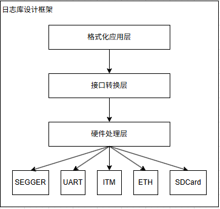

# 可配置带闹钟的电子时钟

## 需求定义

电子时钟的功能并不复杂，这里先定义下需求。

- 显示当前时间，包括年、月、日、时、分、秒，并保证一定精度。
- 时间支持通过按键配置，支持修改时间。
- 支持闹钟功能，闹钟可以设置重复，也可以设置不重复，闹钟能够掉电保持(不支持多个闹钟，会增加菜单需求，这里先不考虑)。
- 电子时钟使用电池供电，支持开关机休眠功能，在休眠状态下，消耗较低的功耗。

## 需求分析和模块功能划分

对于每个需求进行分析，确认涉及的硬件模块，构建软件框架。

- 显示时间，就需要有图形界面，这里选择使用LCD显示。
- 支持按键配置，需要菜单按键和配置界面，支持修改时间和闹钟设置。。
- 支持闹钟功能，可使用RTC Alarm功能。闹钟能够掉电保持，根据修改频率和写入数据需求，可以考虑备份寄存器和FLASH方案。
- 支持按键开关机功能，关机后进入低功耗模式，屏幕断电。
- 支持低功耗功能，上下电关机，屏幕支持关闭。另外使用IWDG功能，解决死机问题。
- 额外附加功能: 支持通过串口打印调试信息，配合调试模块。

那么整个系统硬件组成部分除了MCU和必要的电源模块，需要软件实现的包含RTC时钟处理、按键输入处理、LCD显示模块以及配置的DRAM模块；关于备份寄存器模块和FLASH存储模块等，因为掉电时间同样丢失，因此这里完全掉电不考虑闹钟仍然保持，选择备份寄存器方案。根据需求，整理的输入输出接口如下：

- 输入接口: 按键输入
- 输出接口: LCD显示
- 输入输出接口: RTC时钟，备份寄存器，在正常工作状态作为时钟和闹钟信息源，在设置状态下作为闹钟配置信息源。

整个框架架构如下所示。

除STM32的启动、HAL库模块外，增加驱动模块，包括RTC时钟驱动、按键输入驱动、LCD显示驱动、备份寄存器驱动等。然后再上面扩展应用模块，包含如下模块。

- 时钟读取、显示和设置功能模块。
- 闹钟报警和设置功能模块。
- 按键扫描读取和处理模块，根据不同菜单层级执行不同功能。
- 开关机低功耗处理模块。

然后这些功能组合起来，构建完整的电子时钟系统。下面开始代码的实现。

## 应用框架搭建和驱动实现

