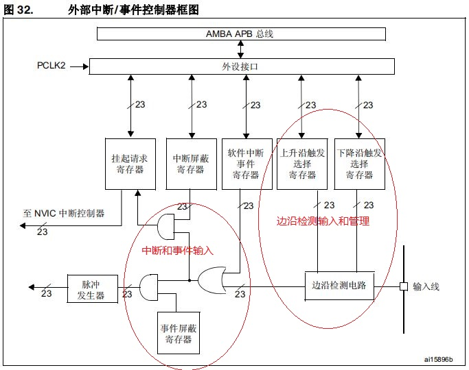
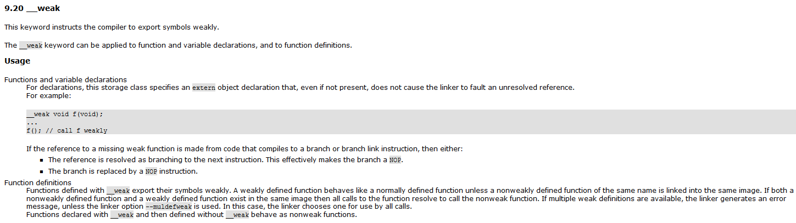

# EXTI外部中断模块

在I/O输入检测中，可以通过接口读取I/O状态；不过这种设计需要周期性的读取，需要更多的资源占用。有没有机制能够在动作时触发，然后应用再去读取消息？对于MCU来说，中断机制正是基于此需求设计的。当有设置的I/O信号产生时，就会产生事件或中断，告知应用去读取，从而不需要持续扫描。

关于外部中断的功能说明，具体如下所示。

- 外部中断触发原理
- 外部中断软件实现
- 中断向量控制器
- 总结说明

本节配合例程: **code/01_03_STM32F429_EXTI/**

## 外部中断触发原理

这里开始讲解中断触发的原理，首先参考流程如下所示。



从上可以看出外部中断的检测由以下步骤组成。

1. GPIO的输入信号通过边沿检测电路(可独立控制开启上升沿或者下降沿检测)，当外边沿变化时触发信号。
2. GPIO变化触发的信号，由软件中断事件寄存器控制，决定是否进一步转换作为中断/事件触发信号。
3. 中断事件触发信号，由中断和事件屏蔽寄存器来控制决定是否传递到NVIC模块或控制脉冲发生器，产生中断/event信号，前者用于软件处理，后者可作为部分外设触发的输入源。

注意: **边沿检测电路基于APB总线的时钟，所以只有电平周期高于APB2时钟的外部信号才能被正确检测，脉冲过短可能不会被检测(一般不需要考虑，因为APB时钟常见为36M以上，外部电平变化远低于该频率)**。

## 外部中断软件实现

关于外部中断在代码中应用实现如下，首先进行硬件的初始化，按照惯例具体流程如下所示。

1. 进行相关时钟使能。
2. 配置I/O为对应的中断模式。
3. 配置中断优先级并使能中断。
4. 定义中断函数，并增加相应的标志位处理。

关于上述流程的代码实现如下所示。

```c
// drv_exit.h 定义硬件相关的配置
typedef struct
{
    uint8_t int_flag;
    uint32_t delay_ticks;
}KEY_INFO;

#define KEY_NUM             2

#define KEY_PRESSED         0
#define KEY_UNPRESSED       1

// KEY0的硬件
#define KEY0_CLK_ENABLE()   __HAL_RCC_GPIOH_CLK_ENABLE()
#define KEY0_PORT           GPIOH
#define KEY0_PIN            GPIO_PIN_2
#define KEY0_IRQn           EXTI2_IRQn
#define KEY0_READ_PIN()     (HAL_GPIO_ReadPin(KEY0_PORT, KEY0_PIN)==GPIO_PIN_SET?1:0)

#define KEY1_CLK_ENABLE()   __HAL_RCC_GPIOH_CLK_ENABLE()
#define KEY1_PORT           GPIOH
#define KEY1_PIN            GPIO_PIN_3
#define KEY1_IRQn           EXTI3_IRQn
#define KEY1_READ_PIN()     (HAL_GPIO_ReadPin(KEY1_PORT, KEY1_PIN)==GPIO_PIN_SET?1:0)

// drv_exit.c 实现硬件相关的初始化
GlobalType_t drv_exti_init(void)
{
    GPIO_InitTypeDef GPIO_InitStruct = {0};

    // 使能时钟
    KEY0_CLK_ENABLE();
    KEY1_CLK_ENABLE();     
    
    // KEY0硬件初始化
    GPIO_InitStruct.Pin = KEY0_PIN;
    GPIO_InitStruct.Mode = GPIO_MODE_IT_FALLING;        // 下降沿触发中断
    GPIO_InitStruct.Pull = GPIO_PULLUP;
    GPIO_InitStruct.Speed = GPIO_SPEED_FREQ_VERY_HIGH;
    HAL_GPIO_Init(KEY0_PORT, &GPIO_InitStruct);  

    HAL_NVIC_SetPriority(KEY0_IRQn, 0, 0);
    HAL_NVIC_EnableIRQ(KEY0_IRQn);
   
    // KEY1硬件初始化
    GPIO_InitStruct.Pin = KEY1_PIN;
    HAL_GPIO_Init(KEY1_PORT, &GPIO_InitStruct); 

    HAL_NVIC_SetPriority(KEY1_IRQn, 0, 0);
    HAL_NVIC_EnableIRQ(KEY1_IRQn);  
    
    memset((char *)&key_info, 0, sizeof(key_info));
    
    return RT_OK;
}
```

可以看到，因为HAL库的集成，Mode即可配置上升/下降沿产生中断。

另外为了避免开机误触中断，符合外部检测的要求，也要相应的配置GPIO上拉电阻保证默认电平(下降沿为高，上升沿为低)。

关于外部中断的引脚配置选项如下所示。

```c
GPIO_MODE_IT_RISING             //输入模式，上升沿触发中断
GPIO_MODE_IT_FALLING            //输入模式，下降沿触发中断
GPIO_MODE_IT_RISING_FALLING     //输入模式，上升沿，下降沿都触发中断
GPIO_MODE_EVT_RISING            //输入模式，上升沿触发事件
GPIO_MODE_EVT_FALLING           //输入模式，下降沿触发事件
GPIO_MODE_EVT_RISING_FALLING    //输入模式，上升沿，下降沿都触发事件
```

对于中断的实际执行，当有外部符合的信号触发时，就会执行对应的中断函数；具体的中断触发和检测代码如下所示。

```c
// 硬件获取按键状态
static uint8_t key_hw_press(uint8_t num)
{
    uint8_t key_press = KEY_UNPRESSED;
    
    switch(num)
    {
        case 0:
            __HAL_GPIO_EXTI_CLEAR_IT(KEY0_PIN);
            HAL_NVIC_EnableIRQ(KEY0_IRQn);
            if (KEY0_READ_PIN() == 0)
            {
                key_press = KEY_PRESSED;
            }
            break;
         case 1:
            __HAL_GPIO_EXTI_CLEAR_IT(KEY1_PIN);
            HAL_NVIC_EnableIRQ(KEY1_IRQn);
            if (KEY1_READ_PIN() == 0)
            {
                key_press = KEY_PRESSED;
            }
            break;
         default:
             break;
    }
    return key_press;
}

uint8_t get_key_press(uint8_t num)
{
    if (key_info[num].int_flag == 1)
    {
        if (drv_tick_difference(key_info[num].delay_ticks, HAL_GetTick()) > 200)
        {
            key_info[num].int_flag = 0;
            
            return key_hw_press(num);
        }
    }
    
    // 未检测到按键时, 不进行处理
    return KEY_UNPRESSED;
}

// KEY0中断处理函数
void EXTI2_IRQHandler(void)
{
    if (__HAL_GPIO_EXTI_GET_IT(KEY0_PIN) != RESET)
    {
        __HAL_GPIO_EXTI_CLEAR_IT(KEY0_PIN);
        
        key_info[0].int_flag = 1;
        
        key_info[0].delay_ticks = HAL_GetTick();
        
        // avoid repeater trigger, just disable until delay
        HAL_NVIC_DisableIRQ(KEY0_IRQn); 
    }   
}

// KEY1中断处理函数
void EXTI3_IRQHandler(void)
{
    if (__HAL_GPIO_EXTI_GET_IT(KEY1_PIN) != RESET)
    {
        __HAL_GPIO_EXTI_CLEAR_IT(KEY1_PIN);
        
        key_info[1].int_flag = 1;
        
        key_info[1].delay_ticks = HAL_GetTick();
        
        // avoid repeater trigger, just disable until delay
        HAL_NVIC_DisableIRQ(KEY1_IRQn); 
    }   
}
```

基于上述代码，就可以在应用中先通过中断状态判断是否检测到按键按下，在根据按键状态进行防抖处理。这是必要的，有经验的开发者应该知道，对于物理按键按下的过程，电平一般是不稳定的，可能有多次跳变。这时候需要对按键进行防抖处理，轮询模式可以通过连续判断来处理，中断模式时中断代码里是不适合做延时的，此时可以通过置标志位，并在主循环中延时检测I/O状态来进行处理。

当然这里只讲解了中断的应用，其实外部信号还可以作为事件触发；对于中断和事件的具体区别如下所示。

1. 中断作为触发信号，传递到中断控制向量NVIC，NVIC置位中断状态位为pending，会查找中断向量表中的函数地址，通过跳转执行对应的中断函数。
2. 事件虽然也作为触发信号，不过传递到脉冲发生器，脉冲发生器根据配置，生成对应的事件。其它硬件模块可以配置基于这个事件进行触发，如ADC外部采样，休眠唤醒等功能。

## 中断向量控制器NVIC

对于外部中断的使用并不难理解，不过关于中断函数是如何被调用的，有着比较复杂的链条，这就涉及到中断向量控制器NVIC。

### 中断向量表

Cortex-M4内核支持NVIC中断向量控制器，其中最大支持240个可编程中断(由芯片厂商定义)；其中包含15个系统中断，这部分声明在startup_xxx.s启动文件中，例如stm32f4的定义如下。

```s
    ; System Interrupts
    DCD     __initial_sp               ; Top of Stack
    DCD     Reset_Handler              ; Reset Handler          #复位中断
    DCD     NMI_Handler                ; NMI Handler            #不可屏蔽中断
    DCD     HardFault_Handler          ; Hard Fault Handler     #硬fault中断
    DCD     MemManage_Handler          ; MPU Fault Handler      #MPU访问异常
    DCD     BusFault_Handler           ; Bus Fault Handler      #总线错误异常
    DCD     UsageFault_Handler         ; Usage Fault Handler    #程序错误异常
    DCD     0                          ; Reserved
    DCD     0                          ; Reserved
    DCD     0                          ; Reserved
    DCD     0                          ; Reserved
    DCD     SVC_Handler                ; SVCall Handler         #系统SVC异常
    DCD     DebugMon_Handler           ; Debug Monitor Handler  #调试监视器异常
    DCD     0                          ; Reserved
    DCD     PendSV_Handler             ; PendSV Handler         #为系统设置的PendSVSS异常
    DCD     SysTick_Handler            ; SysTick Handler        #系统滴答定时器异常

    ; External Interrupts
    DCD     WWDG_IRQHandler            ; Window WatchDog

    ; ...... 其他中断线号定义
```

对于剩余240个中断，则由芯片厂商进行定义，当然也不是全部都存在，厂商根据外设的需求，可以自定义中断对应的线号，这个在芯片设计的时候确认，并在SDK的文件头中包含定义，以STM32F429xx.h为例。

```c
typedef enum
{
/******  Cortex-M4 Processor Exceptions Numbers ****************************************************************/
  NonMaskableInt_IRQn         = -14,    /*!< 2 Non Maskable Interrupt                                          */
  MemoryManagement_IRQn       = -12,    /*!< 4 Cortex-M4 Memory Management Interrupt                           */
  BusFault_IRQn               = -11,    /*!< 5 Cortex-M4 Bus Fault Interrupt                                   */
  UsageFault_IRQn             = -10,    /*!< 6 Cortex-M4 Usage Fault Interrupt                                 */
  SVCall_IRQn                 = -5,     /*!< 11 Cortex-M4 SV Call Interrupt                                    */
  DebugMonitor_IRQn           = -4,     /*!< 12 Cortex-M4 Debug Monitor Interrupt                              */
  PendSV_IRQn                 = -2,     /*!< 14 Cortex-M4 Pend SV Interrupt                                    */
  SysTick_IRQn                = -1,     /*!< 15 Cortex-M4 System Tick Interrupt                                */
/******  STM32 specific Interrupt Numbers **********************************************************************/
  WWDG_IRQn                   = 0,      /*!< Window WatchDog Interrupt                                         */
  PVD_IRQn                    = 1,      /*!< PVD through EXTI Line detection Interrupt                         */
  TAMP_STAMP_IRQn             = 2,      /*!< Tamper and TimeStamp interrupts through the EXTI line             */
  RTC_WKUP_IRQn               = 3,      /*!< RTC Wakeup interrupt through the EXTI line                        */
  FLASH_IRQn                  = 4,      /*!< FLASH global Interrupt                                            */
  RCC_IRQn                    = 5,      /*!< RCC global Interrupt                                              */
  EXTI0_IRQn                  = 6,      /*!< EXTI Line0 Interrupt                                              */

  // ...... 其他中断线号定义
```

以STM32F4为例，如头文件中WWDG_IRQn值为0，在中断向量表中就对应第一个外部中断WWDG_IRQHandler。在中断触发时，就通过查找在中断向量表中的偏移值，找到对应的中断函数入口，触发执行。

这里讲解下查询的方法，例如指定中断向量表在FLASH中(假定0x08000000)，其查找步骤如下所示。

1. 当中断触发时，NVIC模块内部会置位对应的中断标志位。
2. 内核根据触发这个中断的线号可以直接计算偏移地址=起始地址+(中断线号+用户中断起始位置)\*地址指针长度,如WWDG的中断入口地址即为0x08000000+(WWDG_IRQn + 16)*4=0x80000040中读取内部数据，这个就是中断函数的入口地址。
3. 内核进行一系列的压栈工作，然后跳转到中断函数入口地址，即开始执行中断函数。
4. 中断执行完毕后，会进行一系列的出栈动作，即可恢复正常运行流程，一次中断调用结束。

```s
# .map文件中定义的中端函数入口地址
WWDG_IRQHandler                          0x080043f9   Thumb Code     2  stm32f10x_it.o(i.WWDG_IRQHandler)

# bin文件0x08000040起始内部数据，可以看到0x08000040中的数据就是WWDG_IRQHandler的地址
"0x080043f9 0x08000217 0x08000217 0x08000217"
```

至于我们在C文件中声明函数能够被调用，这就涉及到[WEAK]扩展关键字。

MDK的规则中声明__weak以及汇编中导出为[WEAK]的函数为弱定义函数。如果一个函数同时存在普通函数和弱定义函数，则所有的调用都解会指向普通函数。这样就可以保证即使中断函数未定义，也不会发生编译错误；而C语言中定义同名函数后，就可以覆盖启动文件中的弱定义中断函数。这可以解释开启中断后如果未定义中断函数(中断函数名写错)，就会停止在启动文件的`B .`位置，未定义和覆盖的中断函数默认函数体就在此处。

详细的__weak关键字说明可参考下图所示。



对于中断向量表，另一个就是重定位的概念。向量表一直位于代码的最顶端，也就是偏移量0x0的位置，为什么有时还需要重定位呢？在上电启动中，系统会默认跳转0x00000000(flash地址0x08000000映射)，然后读取向量表偏移寄存器，查询向量表。此时向量表的偏移量就是0x0，不需要重定义。

而在IAP应用下，对于BOOT和APP都存在独立的向量表，其中APP代码的起始地址并不是FLASH首地址，而是由偏移量0x8000(假定值)，从上面也可以简单推出应用代码的向量表偏移量也是0x8000，此时向量表偏移寄存器就需要重定义了，常见的偏移执行可以在system_stm32f10x.c或者main函数起始地方定义，常见示例如下所示。

```c
// 重定位向量表偏移寄存器
SCB->VTOR = FLASH_BASE | 0x8000;
```

### 中断优先级

对于Cortex-M4来说支持最大8位优先级，不同中断可以使用相同的优先级，这时根据在中断线号绝对先后执行顺序且互相不会打断，这种被称为非抢占优先级或者子优先级。

中断优先级配置寄存器具体使用位数由芯片厂商定义，但是最少需要3bit。对于STM32F49IG在设计上则支持4bit作为优先级，并进一步可以分类为抢占优先级和子优先级。其中抢占优先级更高的中断，可以打断低优先级的中断；子优先级只影响中断的执行顺序，不会打断现有中断执行。

Cortex-M4支持最多240个可配置中断，中断优先级的数目3~8位，也就是支持8~256个优先级，而事实上一般并没有支持那么多，如8，16，32级，其中最多支持128个抢占级。arm中断及复位控制寄存器中的3~8位设定优先级的部分，通过配置可将其分割为两部分，前面为抢占级，后面为亚优先级，并且亚优先级至少为1位，分组是可以从保留的优先级组开始的。一个中断的优先级可通过以下顺序判断，优先级依此降低。

1. 优先级组：抢占级 > 亚优先级
2. 优先级：  数值小 > 数值大
3. 中断号：  中断号小 > 中断号大

抢占级是在发生在中断嵌套的基础，上面提到了中断打断了线程的流程，但是如果有抢占级的加入，中断本身也会被优先级更高的中断打断，具体流程如下：

主程序暂停  -〉低优先级中断 -〉高优先级中断-〉低优先级中断-〉主程序恢复

亚优先级表示没有发生中断的嵌套，一个中断只有在它结束后另一个亚优先级的中断才会响应，即不会发生中断嵌套。

此外为了加快中断执行的流程，内核提供了基于优先级的四种动作：

1.占先： 主要发生在抢占级中，即高优先级中断低优先级执行，发生中断嵌套
2.末尾连锁： 若占先发生上一个中断的末尾出栈之前，则打断出栈动作，直接执行高优先级中断，结束后如果没有发生抢占，才执行出栈
3.迟来  若占先发生在中断的开始入栈阶段，则继续入栈，低优先级中断挂起。
4.返回  出栈过程，如果收到高优先级中断则停止并产生末尾连锁

从上面可以看出，中断优先级和中断嵌套在加上ARM基于优先级机制的优化，可以让中断中高优先级任务更快执行，正是优先级设定的意义。对于中断处理的函数由内核库提供(代码中的CMSIS库，如core_cm4.h)提供，不过HAL库进行了封装，具体函数接口如下。

```c
/*
设置中断向量的抢占优先级和子优先级
  *         @arg NVIC_PRIORITYGROUP_0: 0 bits for preemption priority
  *                                    4 bits for subpriority
  *         @arg NVIC_PRIORITYGROUP_1: 1 bits for preemption priority
  *                                    3 bits for subpriority
  *         @arg NVIC_PRIORITYGROUP_2: 2 bits for preemption priority
  *                                    2 bits for subpriority
  *         @arg NVIC_PRIORITYGROUP_3: 3 bits for preemption priority
  *                                    1 bits for subpriority
  *         @arg NVIC_PRIORITYGROUP_4: 4 bits for preemption priority
  *                                    0 bits for subpriority
*/
void HAL_NVIC_SetPriorityGrouping(uint32_t PriorityGroup)

// 设置中断的抢占优先级和子优先级，0最高，最低优先级位2^nbit
void HAL_NVIC_SetPriority(IRQn_Type IRQn, uint32_t PreemptPriority, uint32_t SubPriority)

// 使能中断
void HAL_NVIC_EnableIRQ(IRQn_Type IRQn)

// 关闭中断
void HAL_NVIC_DisableIRQ(IRQn_Type IRQn)

// 设置中断向量表位置
SCB->VTOR = SRAM_BASE | ADDRESS; 
```

### 中断管理

对于一个模块需要开启中断，在模块使能正常工作后，以usart为例，需要进行如下操作。

```c
// 开启模块内部中断使能
__HAL_UART_ENABLE_IT(&huart1, UART_IT_RXNE);

// 设置中断对应的优先级
HAL_NVIC_SetPriority(USART1_IRQn, 0, 0);

// 使能中断
HAL_NVIC_EnableIRQ(USART1_IRQn);

// 使能总中断
void __enable_irq(void);

// 关闭总中断
void __disable_irq(void)

// 允许fiq中断
void __enable_fiq(void);

// 禁止fiq中断
void __disable_fiq(void);

// 定义中断的执行函数
void USART1_IRQHandler(void)
{
    uint8_t rx_data;
    
    if (__HAL_UART_GET_FLAG(&huart1, UART_FLAG_RXNE) != RESET)
    {
        //对于接收中断标志位，当读取DR值时自动清除，因此不需要软件再清除
        if (HAL_UART_Receive(&huart1, &rx_data, 1, 100) == HAL_OK)
        {
            //update data to application
        }
    }
}
```

中断开发中常见的问题，就是配置完成后中断并未按预期正常触发，这也是调试面临最常见的问题之一，这里分享下如何解决此类问题的方法。

- 使用非中断模式下判断模块能否正常工作。此方法可以确定模块是否正常配置，包含时钟，GPIO，是否需要重映射，模块配置是否正确。
- 确定模块内部中断使能位是否置位(一般为模块中的[module]->IER寄存器)。
- 确定NVIC中断使能位是否置位(NVIC寄存器)。
- 确定中断入口函数是否和启动文件内命名一致，如果没有对应中断函数，会停止在startup_xxx.s文件中。
- 如果上述4步骤仍然不触发，则判断全局中断使能位是否置位(__enable_irq())，有时错误的退出条件会导致没有打开关闭的中断。

## 总结说明

本节中对于外部中断进行了系统的说明。作为GPIO的延申功能，外部中断并不复杂，驱动开发也不困难。不过从外部中断，我们可以了解到中断的触发和工作流程、中断优先级的配置、中断函数实现等知识，将为后面理解各模块的中断功能打下基础。

## 返回目录

[返回目录](./../README.md)
