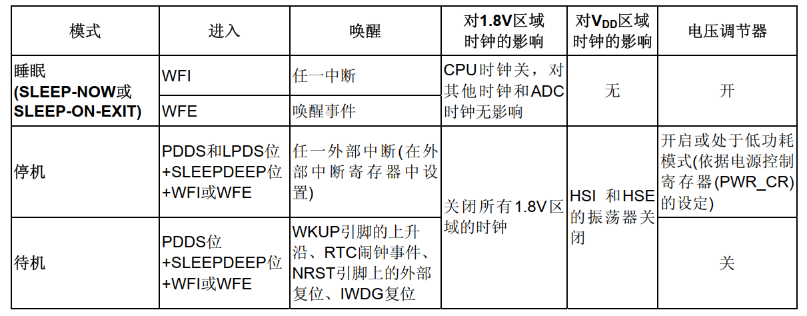

# 电源管理和低功耗应用

低功耗是单片机中比较重要的需求，主要为电池供电的设备，包含智能锁、智能水表、手环、表等；对于这类设备，需要保证在待机状态下足够低，从而满足续航时间的应用需求。

低功耗并不只是芯片对应的休眠模式，还包含外围器件的整机功耗，是软硬件结合的功能。低功耗当然也不是严格的休眠模式，整机功率降低到uA级别，也有些只是降低待机时的发热，对于功耗要求并不严格(例如充电器)，降低到几百uA左右也并非不可。这就需要根据实际情况实际分析，进行整理说明。低功耗是综合的应用，需要根据实际情况进行合理分析，确定方案。

本节中以STM32F4的休眠模式开始，再结合低功耗应用，来进行详细的说明。详细内容如下所示。

- 系统的低功耗模式
- 低功耗应用软件实现
- 低功耗应用的扩展
- 总结说明

本节配合例程: **code/01-15_STM32F429_LP/**。

## 系统的低功耗模式

对于单片机来说，系统复位或者上电复位后，都会进入运行模式；此时提供全部的功能需求，但是功耗也会相应较高。在某些场景下，不需要提供全部的功能，反而需要尽可能低的功耗。

以STM32F4为例，支持的低功耗模式如下所示。



参考上图，可知芯片支持睡眠、停止和待机三种模式。

- 睡眠模式(sleep)，仅内核停止工作，所有外设包括核心的外设SYSTICK、NVIC等仍在工作。睡眠模式根据唤醒方法的不同，又分为WFI和WFE两种方法。
  - WFI: 任意中断都可以唤醒。
  - WFE: 仅外部中断可以唤醒。
- 停止模式(stop)，系统时钟停止，所有外设停止工作，任意外部中断可以唤醒(RTC时钟唤醒也属于外部信号)。
- 待机模式(standby)，系统时钟停止，所有外设停止工作，支持通过WAKEUP信号、RTC时钟唤醒、NRST复位或IWDG复位唤醒。

通常情况下，对于芯片功耗来说，睡眠模式 > 停止模式 > 待机模式，不过待机模式在恢复时相当于设备复位，重新完整初始化动作，在需要保存系统状态的场景并不适合，因此一般使用停止模式来实现低功耗功能。对于睡眠模式，则对于功耗要求不是特别高，且需要周期性恢复的场景。

另外，在运行时，也可以通过降低系统时钟，关闭APB和AHB总线上未被使用的外设时钟，来降低功耗。

对于系统的低功耗模式，HAL库提供以下接口进行管理。

```c
// 进入睡眠模式
// @regulator: 睡眠模式下的regulator选择。
// @SLEEPEntry: 睡眠模式进入方法选择(WFI/WFE)
void HAL_PWR_EnterSLEEPMode(uint32_t Regulator, uint8_t SLEEPEntry)

// 进入停止模式
// @regulator: 停止模式下的regulator选择。
// @SLEEPEntry: 停止模式进入方法选择(WFI/WFE)
void HAL_PWR_EnterSTOPMode(uint32_t Regulator, uint8_t STOPEntry)

// 进入待机模式
void HAL_PWR_EnterSTANDBYMode(void)
```

对于regulator参数主要对于停止模式有效，有如下选择。

- PWR_MAINREGULATOR_ON: 停止模式下使用主调压器
- PWR_LOWPOWERREGULATOR_ON：停止模式下使用低功耗调压器，进一步降低功耗

## 低功耗应用软件实现

对于低功耗应用来说，主要实现两部分功能。

1. 进入低功耗模式的配置
2. 退出低功耗模式的实现

其中进入低功耗模式的配置如下所示。

```c
// 进入睡眠模式
void drv_wkup_enter_sleep(uint8_t Entry)
{
    HAL_SuspendTick();

    __HAL_PWR_CLEAR_FLAG(PWR_FLAG_WU);
    
    HAL_PWR_EnterSLEEPMode(PWR_MAINREGULATOR_ON, Entry);

    HAL_ResumeTick();
}

// 进入停止模式
void drv_wkup_enter_stop(uint8_t Entry)
{   
    HAL_SuspendTick();
    
    __HAL_PWR_CLEAR_FLAG(PWR_FLAG_WU);

    HAL_PWR_EnterSTOPMode(PWR_MAINREGULATOR_ON, Entry);
    
    HAL_ResumeTick();
}

// 进入待机模式
void drv_wkup_enter_standby(void)
{
    __HAL_RCC_PWR_CLK_ENABLE();

    __HAL_PWR_CLEAR_FLAG(PWR_FLAG_WU);

    __HAL_PWR_CLEAR_FLAG(PWR_FLAG_SB);

    HAL_PWR_EnableWakeUpPin(PWR_WAKEUP_PIN1);

    HAL_PWR_EnterSTANDBYMode();
}
```

其中进入停止模式后，恢复后会切换到LSI时钟，需要重新配置系统时钟才能正常工作。对于待机模式，唤醒时则相当于直接复位。

这里提供使用外部唤醒引脚PA0进行唤醒的例程，具体如下所示。

```c
GlobalType_t drv_wkup_init(void)
{
    GlobalType_t result;
    GPIO_InitTypeDef GPIO_Initure;

    __HAL_RCC_GPIOA_CLK_ENABLE();

    GPIO_Initure.Pin = GPIO_PIN_0;
    GPIO_Initure.Mode = GPIO_MODE_IT_RISING;
    GPIO_Initure.Pull = GPIO_PULLDOWN;
    GPIO_Initure.Speed = GPIO_SPEED_FAST;
    HAL_GPIO_Init(GPIOA,&GPIO_Initure);

    HAL_NVIC_SetPriority(EXTI0_IRQn, 0x01, 0x01);
    HAL_NVIC_EnableIRQ(EXTI0_IRQn);
    
    return result;
}

void EXTI0_IRQHandler(void)
{
    HAL_GPIO_EXTI_IRQHandler(GPIO_PIN_0);
}

void HAL_GPIO_EXTI_Callback(uint16_t GPIO_Pin)
{
    if(GPIO_Pin == GPIO_PIN_0) 
    {
        // 唤醒引脚, 仅触发不动作
    }    
}
```

待机模式下，当PA0引脚收到上升沿电平时，即可执行唤醒动作。对于睡眠和停止模式，会在休眠的地方继续执行，其中停止模式需要额外配置时钟。而待机模式，则相当于设备复位，会重新执行复位流程。

## 低功耗应用的扩展

有些设备本身连接是着外部电源，并没有特别严格的待机功耗需求，只是考虑运行状态下的发热情况和使用寿命问题，这时降低主频，关闭非必要的模块功能，就是比较方便的降低功耗的方式。

- 降低主频

对于单片机芯片，主频和功耗就是完全成正比的。在运行状态下，为了满足更快的执行效率，往往使用PLL实现更高的频率，但是在待机状态下，PLL就没有必要开启，此时将系统时钟切换到内部RC振荡器，关闭PLL，就可以直接降低功耗。

```c
GlobalType_t low_power_entry(void)
{
    RCC_OscInitTypeDef RCC_OscInitStruct = {0};
    RCC_ClkInitTypeDef RCC_ClkInitStruct = {0};

    //等待HSE RDY，进入低功耗HSE一般为工作模式
    while(__HAL_RCC_GET_FLAG(RCC_FLAG_HSERDY) != RESET)
    {}

    //将时钟切换到HSE
    RCC_ClkInitStruct.ClockType = RCC_CLOCKTYPE_HCLK|RCC_CLOCKTYPE_SYSCLK
                            |RCC_CLOCKTYPE_PCLK1|RCC_CLOCKTYPE_PCLK2;
    RCC_ClkInitStruct.SYSCLKSource = RCC_SYSCLKSOURCE_HSE;
    RCC_ClkInitStruct.AHBCLKDivider = RCC_SYSCLK_DIV1;
    RCC_ClkInitStruct.APB1CLKDivider = RCC_HCLK_DIV1;
    RCC_ClkInitStruct.APB2CLKDivider = RCC_HCLK_DIV1;

    if (HAL_RCC_ClockConfig(&RCC_ClkInitStruct, FLASH_LATENCY_5) != HAL_OK)
    {
        return RT_FAIL;
    }
  
    //关闭LSE和PLL
    RCC_OscInitStruct.OscillatorType = RCC_OSCILLATORTYPE_LSI|RCC_OSCILLATORTYPE_HSE
                                    |RCC_OSCILLATORTYPE_LSE;
    RCC_OscInitStruct.HSEState = RCC_HSE_ON;    
    RCC_OscInitStruct.LSEState = RCC_LSE_OFF;
    RCC_OscInitStruct.LSIState = RCC_LSI_ON;
    RCC_OscInitStruct.PLL.PLLState = RCC_PLL_OFF;
    if (HAL_RCC_OscConfig(&RCC_OscInitStruct) != HAL_OK)
    {
        return RT_FAIL;
    }
    
    HAL_PWREx_DisableOverDrive();
    return RT_OK;
}
```

- 关闭非必要的功能模块

主要关闭不使用的GPIO，USART，SPI，I2C，ADC，DAC等模块，其中ADC和DAC属于模拟模块，往往需要更多的功耗，是优先关闭的对象。在此类低功耗模式下，系统往往还有一些基础功能，需要检测多个按键或者必要模块的输入，此时就需要保留这些功能，通过外部中断或者轮询的方式进行检测，其中GPIO是最基础重要的模块，需要特别注意。

1. 对于GPIO模块来说，恢复默认设置，且关闭时钟是功耗最低的方式，其次才是开启时钟，配置为浮空输入状态。因此当一路GPIO完全未使用时，直接时钟复位并关闭GPIO时钟功耗最低。如果GPIO中有必须使用的I/O，则只能开启时钟，配置为浮空输入状态。这就要求在硬件设计上，将需要低功耗时工作的I/O尽可能放置在一路I/O上来实现更低功耗。
2. GPIO是有默认电平的，除非特殊功能引脚，大部分都为浮空输入模式，以降低默认功耗。如果有引脚需要默认高电平来关断某些模块和器件，建议外接上拉电阻，避免在低功耗模式下仍然要保证引脚的输出来关闭模块。

对于关闭模块的软件实现，这边建议分三步来实现，分别是复位外设模块时钟，关闭外设模块时钟，重新初始化在低功耗下工作的外设模块，这样比较清晰，也可以避免因为修改配置不符合预期导致的错误。

```c
static GlobalType_t low_power_hw_process(void)
{     
    GPIO_InitTypeDef GPIO_InitStruct = {0};
        
    //模块时钟复位
    __HAL_RCC_GPIOA_FORCE_RESET();
    __HAL_RCC_GPIOB_FORCE_RESET();
    __HAL_RCC_GPIOC_FORCE_RESET();
    __HAL_RCC_GPIOD_FORCE_RESET();
    __HAL_RCC_GPIOE_FORCE_RESET();
    //...
    __HAL_RCC_USART1_FORCE_RESET();
    __HAL_RCC_I2C1_FORCE_RESET();
    
    //模块释放复位
    __HAL_RCC_GPIOA_RELEASE_RESET();
    __HAL_RCC_GPIOB_RELEASE_RESET();
    __HAL_RCC_GPIOC_RELEASE_RESET();
    __HAL_RCC_GPIOD_RELEASE_RESET();
    __HAL_RCC_GPIOE_RELEASE_RESET();
    //...
    __HAL_RCC_USART1_RELEASE_RESET();
    __HAL_RCC_I2C1_RELEASE_RESET();
    
    //除使用中的模块, 其它模块时钟关闭
    __HAL_RCC_GPIOA_CLK_DISABLE();
    __HAL_RCC_GPIOC_CLK_DISABLE();
    __HAL_RCC_GPIOD_CLK_DISABLE();
    __HAL_RCC_GPIOE_CLK_DISABLE();
    //...
    __HAL_RCC_USART1_CLK_DISABLE();
    __HAL_RCC_I2C1_CLK_DISABLE();

    //重新初始化必要的I/O
    /*GPIO Initialize as input*/
    GPIO_InitStruct.Pin = GPIO_PIN_1;
    GPIO_InitStruct.Mode = GPIO_MODE_INPUT;

    //config as default to avoid error trigger
    GPIO_InitStruct.Pull = GPIO_PULLUP; 
    GPIO_InitStruct.Speed = GPIO_SPEED_FREQ_MEDIUM;
    HAL_GPIO_Init(GPIOB, &GPIO_InitStruct);
    
    return RT_OK;
}
```

在退出低功耗时，重新初始化系统和模块即可。通过降低主频的方式降低功耗，可以在低功耗模式下保证足够的功能，基于纯软件的设计，不受芯片本身低功耗模式的限制，可以应用的大部分的单片机方案中，优缺点如下。

- 优点：实现简单，适配广泛
- 缺点: 芯片仍然运行，会有一定的基础功耗

## 总结说明

本节中，主要介绍了STM32支持的低功耗模式，以及如何实现低功耗模式的方法；另外也通过扩展讲解了在产品开发过程中如何降低功耗。这些方法可以配合使用，在进入低功耗模式前，对于部分硬件进行复位和关闭的动作，从而更加有效的降低功耗，这也是在低功耗产品中的常用方法。

## 返回目录

[返回目录](./../README.md)
