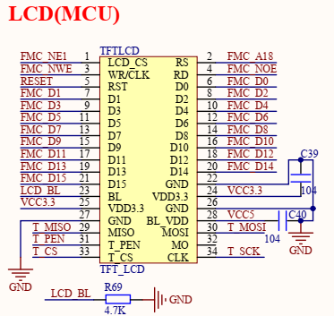

# 基于FMC接口的LCD显示

在嵌入式设备中，屏幕主要用于实时展示硬件数据、系统配置和控制硬件状态等状态等，是常用的人机交互设备之一。

在日常中，常见的屏幕有SPI/I2C-OLED、FMC-LCD、LTDC-LCD屏幕，本节中将以FMC-LCD屏幕，说明LCD和显示相关的功能。

本节目录如下所示。

📑 **LCD显示接口**  
📑 **LCD初始化和读写接口**  

## LCD显示接口

对于STM32F429这类MCU来说，支持通过FMC、LTDC两种不同的接口进行屏幕的刷新显示操作。

💡 FMC接口访问的LCD，其控制器内部需要支持GRAM。配置完成后，就可以如同访问SRAM方式进行图形的修改  
💡 LTDC接口则是由MCU内部环境提供缓存(如外挂SDRAM)，并持续更新到屏幕上，其相关功能将在具体章节进行说明  

本节中主要以支持FMC访问的LCD说明界面显示功能。

### 显示操作FMC接口

对于LCD来说，使用FMC接口用于内部GRAM的更新，典型的FMC-LCD的接口如下所示。



其中接口关系如下所示。

| MCU信号 | LCD接口信号 | I/O特性 | 说明 |
| --- | --- | --- | --- |
| RESET | RST | Output | 复位信号，用于硬件复位 |
| LCD_BL | BL | Output/PWM | 背光控制信号 |
| FMC_D[15:0] | D[15:0] | Bidirectional | 数据通讯线，支持数据读取和写入 |
| FMC_NE1 | LC_CS | Output | LCD片选信号 |
| FMC_NWE | WR | Output | 写使能信号 |
| FMC_A18 | RS/DC | Output | 命令/数据选择信号 |
| FMC_NOE | RD | Output | 读使能信号 |

对于上述信号中，RESET、LCD_BL、FMC_NWE、FMC_NOE这些信号就是字面意思，比较好理解。有过FMC SDRAM的开发经验的，反而会发现有以下的差别。

🧩  片选使用FMC_NE1

这个与FMC模块区域挂钩，在FMC初始化配置时需要使用FMC_NORSRAM_BANK1，具有关联关系。

此外，这个FMC_NE1，还对应着存储0x60000000~0x6FFFFFFF区域，这个决定了后续访问的起始地址

🧩  地址线只使用了FMC_A18，连接的还是命令/数据选择信息

可以看到，对于LCD来说并不需要SDRAM多达十几根的地址线，这是因为LCD控制器支持通过命令来选择行列地址和划定区域，写入时支持自增，那么关键点就需要实现如何控制命令/数据发送，以FMC_A18为例，只需要控制第A18引脚接口，其中1为内存、0为命令，如果使用结构体，则定义如下即可。

```c
typedef struct
{
    volatile uint16_t LCD_REG;
    volatile uint16_t LCD_RAM;
} LCD_TypeDef;

// 定义地址
#define LCD_BASE        ((uint32_t)(0x60000000 | 0x0007FFFE))
#define LCD             ((LCD_TypeDef *) LCD_BASE)
```

💡  LCD->LCD_REG写入时地址为0x6007FFFE，第18位即A18为0，此时即为写入命令。
💡  LCD->LCD_RAM写入时地址为0x60080000，第18位即A18为1，此时即为写入数据。

同理，RS使用其它的地址线也可以，需要同步修改LCD_BASE的地址。


## LCD初始化和读写接口

对于LCD的初始化，是需要读取ID，参考说明手册，实现一套指令完成对于驱动芯片的初始化；在本例中，使用的屏幕驱动为NT35510。

完整的LCD屏幕配置十分复杂，一般也都是使用厂商提供的驱动进行修改进行修改。

主要包含以下流程。

🧩 **配置LCD连接的硬件连接接口**

根据上述硬件连接，配置LCD的硬件接口如下所示。

```c
GPIO_InitTypeDef GPIO_InitStruct = {0};

/* Backlight off while we bring the interface up. */
HAL_GPIO_WritePin(GPIOB, GPIO_PIN_5, GPIO_PIN_RESET);
GPIO_InitStruct.Pin = GPIO_PIN_5;
GPIO_InitStruct.Mode = GPIO_MODE_OUTPUT_PP;
GPIO_InitStruct.Pull = GPIO_PULLUP;
GPIO_InitStruct.Speed = GPIO_SPEED_FREQ_HIGH;
HAL_GPIO_Init(GPIOB, &GPIO_InitStruct);

/* Configure the FMC Bank1 NE1 8080 16-bit data/address/control pins as
    * alternate-function 12.  The data bus (PD/PE) and address lines (PF/PG,
    * PD11..13) are shared with the SDRAM controller on this board, so
    * re-initialising them as FMC AF here is idempotent and safe. */
GPIO_InitStruct.Mode = GPIO_MODE_AF_PP;
GPIO_InitStruct.Pull = GPIO_NOPULL;
GPIO_InitStruct.Speed = GPIO_SPEED_FREQ_VERY_HIGH;
GPIO_InitStruct.Alternate = GPIO_AF12_FMC;

/* PD: D0,D1,D2,D3,NOE,NWE,NE1,D13,D14,D15,A16,A17,A18 */
GPIO_InitStruct.Pin = GPIO_PIN_0 | GPIO_PIN_1 | GPIO_PIN_4 | GPIO_PIN_5 |
                        GPIO_PIN_7 | GPIO_PIN_8 | GPIO_PIN_9 | GPIO_PIN_10 |
                        GPIO_PIN_11 | GPIO_PIN_12 | GPIO_PIN_13 |
                        GPIO_PIN_14 | GPIO_PIN_15;
HAL_GPIO_Init(GPIOD, &GPIO_InitStruct);

/* PE: D4..D12 */
GPIO_InitStruct.Pin = GPIO_PIN_7 | GPIO_PIN_8 | GPIO_PIN_9 | GPIO_PIN_10 |
                        GPIO_PIN_11 | GPIO_PIN_12 | GPIO_PIN_13 |
                        GPIO_PIN_14 | GPIO_PIN_15;
HAL_GPIO_Init(GPIOE, &GPIO_InitStruct);

/* PF: A0..A5, A6..A9 */
GPIO_InitStruct.Pin = GPIO_PIN_0 | GPIO_PIN_1 | GPIO_PIN_2 | GPIO_PIN_3 |
                        GPIO_PIN_4 | GPIO_PIN_5 | GPIO_PIN_12 | GPIO_PIN_13 |
                        GPIO_PIN_14 | GPIO_PIN_15;
HAL_GPIO_Init(GPIOF, &GPIO_InitStruct);

/* PG: A10..A15 */
GPIO_InitStruct.Pin = GPIO_PIN_0 | GPIO_PIN_1 | GPIO_PIN_2 | GPIO_PIN_3 |
                        GPIO_PIN_4 | GPIO_PIN_5;
HAL_GPIO_Init(GPIOG, &GPIO_InitStruct);
```

🛠️ **配置SRAM映射功能，向访问SRAM的模式一样访问显存**

```c
hsram1.Instance = FMC_NORSRAM_DEVICE;               // FMC NORSRAM外部SRAM设备配置
hsram1.Extended = FMC_NORSRAM_EXTENDED_DEVICE;      // 使用NORSRAM扩展配置设备
hsram1.Init.NSBank = FMC_NORSRAM_BANK1;             // 使用FMC Bank1, 对应外部SRAM的片选区域
hsram1.Init.DataAddressMux = FMC_DATA_ADDRESS_MUX_DISABLE;      // 地址线和数据线使用独立的引脚
hsram1.Init.MemoryType = FMC_MEMORY_TYPE_SRAM;      // 外部存储器类型为SRAM
hsram1.Init.MemoryDataWidth = FMC_NORSRAM_MEM_BUS_WIDTH_16;     // 数据总线宽度为16bit
hsram1.Init.BurstAccessMode = FMC_BURST_ACCESS_MODE_DISABLE;    // SRAM不使用突发访问
hsram1.Init.WrapMode = FMC_WRAP_MODE_DISABLE;                   // 禁用Wrap模式
hsram1.Init.WaitSignal = FMC_WAIT_SIGNAL_DISABLE;               // 禁用WAIT信号
hsram1.Init.AsynchronousWait = FMC_ASYNCHRONOUS_WAIT_DISABLE;   // 禁用异步WAIT功能
hsram1.Init.WaitSignalPolarity = FMC_WAIT_SIGNAL_POLARITY_LOW;  // WAIT信号有效电平为低电平(禁用，无效)
hsram1.Init.WaitSignalActive = FMC_WAIT_TIMING_BEFORE_WS;       // WAIT信号在写入周期之前进行检测(禁用，无效)
hsram1.Init.WriteOperation = FMC_WRITE_OPERATION_ENABLE;        // 允许对外部SRAM进行写操作
hsram1.Init.ExtendedMode = FMC_EXTENDED_MODE_ENABLE;            // 启用扩展模式
hsram1.Init.WriteBurst = FMC_WRITE_BURST_DISABLE;               // 禁用Write Burst
hsram1.Init.ContinuousClock = FMC_CONTINUOUS_CLOCK_SYNC_ONLY;   // 同步模式才启用(目前异步)
hsram1.Init.PageSize = FMC_PAGE_SIZE_NONE;                      // SRAM不使用Page Mode

// FMC异步SRAM读时序
Timing.AddressSetupTime = 15;   // 地址建立时间，数值越大，访问速度越慢，但时序裕量越大
Timing.AddressHoldTime = 15;    // 地址保持时间，地址有效保持的时间
Timing.DataSetupTime = 70;      // 数据建立时间, FMC等待外部SRAM数据稳定的时间
Timing.BusTurnAroundDuration = 1; // 总线周转时间, 用于读写方向切换时，避免总线冲突
Timing.CLKDivision = 16;        // 同步模式下的FMC时钟分频，不参与异步访问
Timing.DataLatency = 17;        // 同步存储器的数据延迟, 不参与异步访问
Timing.AccessMode = FMC_ACCESS_MODE_A;  // 使用Mode A异步访问模式

// FMC异步SRAM写时序
ExtTiming.AddressSetupTime = 15;    // 写周期地址建立时间
ExtTiming.AddressHoldTime = 15;     // 写周期地址保持时间
ExtTiming.DataSetupTime = 15;       // 写数据建立时间
ExtTiming.BusTurnAroundDuration = 1; // 写操作总线周转时间
ExtTiming.CLKDivision = 16;         // 同步模式时钟分频
ExtTiming.DataLatency = 17;         // 同步模式数据延迟
ExtTiming.AccessMode = FMC_ACCESS_MODE_A; // 写操作采用Mode A

if (HAL_SRAM_Init(&hsram1, &Timing, &ExtTiming) != HAL_OK)
{
    return RT_FAIL;
}
```

🛠️ **进行LCD的屏幕物理初始化**

执行初始化指令，实现LCD的功能配置，具体流程如下所示。

```c
if (g_lcd_info.lcd_id == 0x8000)
{
    /* ---------- NT35510 (正点原子) ---------- */
    lcd_write_reg_data(0xF000, 0x55);
    lcd_write_reg_data(0xF001, 0xAA);
    lcd_write_reg_data(0xF002, 0x52);
    lcd_write_reg_data(0xF003, 0x08);
    lcd_write_reg_data(0xF004, 0x01);

    //......

    lcd_write_reg_data(0xC901, 0x02);
    lcd_write_reg_data(0xC902, 0x50);
    lcd_write_reg_data(0xC903, 0x50);
    lcd_write_reg_data(0xC904, 0x50);
    lcd_write_reg_data(0x3500, 0x00);
    lcd_write_reg_data(0x3A00, 0x55);  /* 16-bit/pixel */
    lcd_write_reg(0x1100);
    lcd_delay_us(120);
    lcd_write_reg(0x2900);
}
```

可以看到有大量的寄存器配置，这部分一般由原厂根据LCD板级确认，一般开发中不需要进行修改；只需要了解主要使能、配置行、列、色彩信息等数据就可以。

### LCD读写接口

关于LCD的读写接口如下所示。

```c
// 向LCD寄存器中写入配置
static void lcd_write_reg(uint16_t regval)
{
    __NOP();
    LCD->LCD_REG = regval;
}

// 从LCD RAM中读取数据
static uint16_t lcd_rd_data(void)
{
    volatile uint16_t ram;
    __NOP();
    ram = LCD->LCD_RAM;
    return ram;
}

// 向LCD RAM中写入数据
static void lcd_write_data(uint16_t data)
{
    __NOP();
    LCD->LCD_RAM = data;
}

// 同一接口同时写入寄存器配置和数据
static void lcd_write_reg_data(uint16_t reg, uint16_t data)
{
    __NOP();
    LCD->LCD_REG = reg;
    LCD->LCD_RAM = data;
}
```

## 总结说明

## 返回目录

[返回目录](./../README.md)
