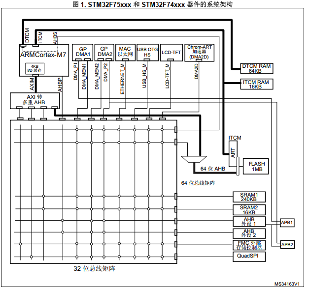
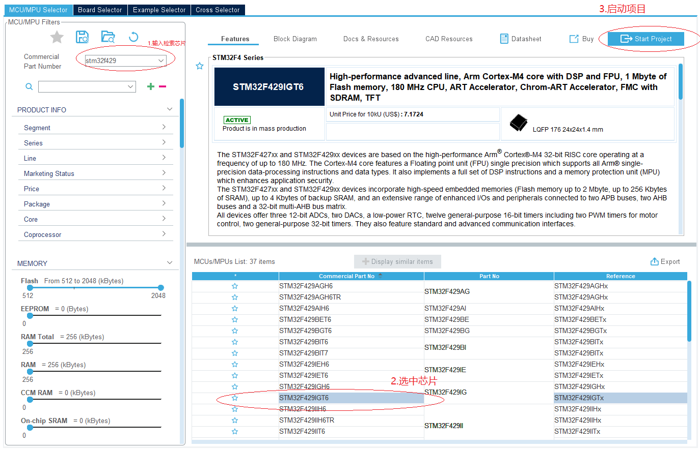
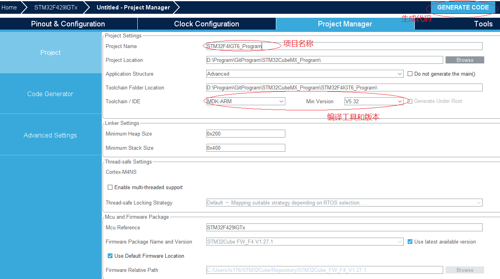

# 单片机总结系列(01) 综述和内核说明

嵌入式是由主控芯片(MCU、DSP或SOC)，电源，外围器件(SDRAM、EPPROM、传感器、SDCard、ETH、CAN和USB等)共同组成的具有外部数据采集、界面显示、逻辑处理和功能输出的软硬件控制系统。在完整的嵌入式产品中，主控芯片实现以下功能。

1. 数据采集，包含ADC采样、I/O Input、触摸输入、DCMI摄像头采集等。
2. 存储管理，包含对SDRAM、Nand-Flash、Nor-Flash、EPPROM的访问。
3. 器件访问交互，包含SPI、I2C等。
4. 设备间通讯，包含CAN、USART/RS432/RS485、MII/RMII等
5. 硬件功能输出，包含PWM、I/O Output、DAC、GUI等。

嵌入式软件开发依托于硬件，再结合驱动、OS系统、应用功能组件，实现具体特定功能的电子设备；是目前应用广泛的技术之一。声控灯、手环、电子表、智能锁、行车记录仪、电动汽车、无人机、飞机、卫星等设备都是涉及嵌入式软件开发的产品。

对于完整的嵌入式系统平台的运行，驱动虽然在整体应用中占比并不高；不过驱动作为整个系统的眼睛和手臂，错误的实现会带来不符合预期的结果，产品的功能也就成了无根之萍。因此深入理解和掌握驱动开发技术，是提升单片机开发能力中重要的一环。为了系统的学习单片机技术，本系列从整体到模块，以STM32芯片的功能为例，描述单片机开发的基本框架。

本节则从整体描述芯片内部框架和基础应用，具体目录如下所示。

- [嵌入式系统构成](#embed_note)
- [芯片内部总线架构说明](#embed_frame)
- [使用STM32CubeMX进行开发](#cubemx_app)
- [构建STM32项目工程](#struct_project)
- [Cortex-M4F内核说明](#cortex_m4_core)
- [参考书籍](#reference_book)
- [下一章节](#next_chapter)

本节配合例程: **code/01-STM32F429_START/project/stm32f429.uvprojx**。

## embed_note

本系列中将以STM32F429IGT6为基础来说明单片机开发中的技术，使用正点原子STM32F4-开发板；当然对于大部分其它类型的单片机或DSP，这些知识也是相通的。在ARM Cortex-M4F架构下，其核心模块由以下几部分组成。

- 内核Core和调试系统
  - 内核部分由内核IP厂商来定义和设计实现。以ARM为例，由系统的架构(哈佛结构)、支持的指令集(ARMv7、ARMv8)、流水线机制、内存模型(RAM和Cache)、调试接口等组成。这些信息一般通过内核IP的形式提供给芯片厂商，用于具体芯片的设计。常见Core IP由ARM、Andes、芯原微电子、平头哥等都是国内外的IP厂商提供。
- 具有特定功能的外设模块
  - 驱动模块一般有通用的SPI、I2C、FSMC、CAN、SDIO、USB、ETH、DCMI等，或者满足特定需求的WIFI、BLE、快充协议模块。这些模块由IP厂商或芯片厂商设计开发，并通过各类总线(AHB、APB、AXI或总线矩阵)与内核Core集成构建完整的芯片功能。常见芯片厂商有高通、联发科、ST、TI、NXP、瑞萨、瑞芯微、全志、乐鑫等。
- 存储器映射实现
  - 存储器一般分为片内存储和片外存储
  - 片内存储主要有芯片自带ROM，内部提供芯片设计时支持的固件(例如ST的ROM支持DFU下载)，SRAM和片内FLASH等。
  - 片外存储则比较多样，包含掉电失去存储数据支持随机读写的SDRAM，PSRAM以及更快速的DDR2， DDR3等，以及非掉电易失的SPI-Flash，Nand-Flash，Nor-Flash，扩展存储的EPPROM，SDCard等。另外，高性能的芯片还会支持I-Cache和D-Cache，以满足更高读写性能的需求(如STM32H7系列)；片外存储厂商主要有三星、海力士、美光、长鑫等。
- 时钟，电源管理和复位系统
  - 时钟和电源是系统工作的基础功能，负责统筹管理所有模块的电源和时钟。主要包含上电时序，系统和模块工作的电压和时钟管理。芯片工作过程中，寄存器的读取、修改和复位都依赖于时钟的触发；内部数据的传输，模块对于外部信号的解析，也依赖时钟作为基础的触发脉冲；这也是我们在使用大部分外设模块时都需要先使能对应时钟的原因。在芯片内部，时钟和电源都由专门的模拟模块实现，并由寄存器对设备进行管理；如STM32F4的RCC，PWR模块就涉及对时钟和电源的控制。

本系列的文章，都将使用HAL库开发，但不一定全部使用ST封装的接口。ST的设计抽象化做的可以，不过有部分显得有些过度封装(主要是中断函数和回调部分，容易引起底层通讯的超时)。另外一些库接口的收发超时是直接基于HAL库时钟进行硬等待。在初始化时使用还好，在循环中使用效率就很差，也会略作调整。这里说下为什么使用HAL库，主要原因有以下几点。

- HAL库可以由STM32CubeMX直接生成，从管脚配置和模块功能都能很好的约束控制，可以避免出现人为实现的错误。
- 对于比较新的芯片(F4，F7以及G系列)，ST的HAL库提供更全面的封装(包含HAL和LL)，简化了开发；而使用寄存器对于复杂模块如ETH、USB等无论开发还是后期维护都是难题，不建议使用。

上述就是我选择HAL的原因，其实这也是未来的趋势。单片机行业开发的发展大约经历三个阶段。

1. 初始阶段，零几年末到一几年初，驱动开发都是从寄存器开始，无论开发还是调试都必须熟练掌握芯片的手册。
2. 发展阶段，标准库开始成为主流，芯片手册成为开发辅助手册，必要时使用。
3. 成熟阶段，使用图形界面+HAL库直接生成驱动，配合库例程快速构建项目。

这是如今单片机行业的大趋势，图形化的方便程度可以大幅度降低开发难度，降低门槛，大幅度提升了开发效率；嵌入式工程师可以和桌面开发一样，专注于业务和功能需求，而不是花费大量时间调试底层的驱动接口。不过这并不是说理解寄存器没有意义，在开发中遇到问题时，最终还是要以寄存器的值作为判断依据的。

一个很场景的问题，HAL库生成的串口接收中断无法触发，如何去分析解决。

1. 串口对应的GPIO配置是否正确，如果使用了映射的端口，是否进行相应配置。- 对应GPIO时钟，AFIO时钟，GPIO工作模式
2. 串口模块是否正确配置，模块总线时钟是否正确，波特率计算值符合预期 - 对应RCC时钟，波特率设置，串口配置
3. 串口接收和接收中断是否使能，中断标志位是否置位，中断函数是否正确 - 对应串口接收中断使能，串口接收中断标志位，串口中断函数和回调处理

可以看到，仅仅只是串口没收到中断数据，就可能由上述这么多问题导致。那么如何定位确定这些问题，就需要理解串口的工作原理以及寄存器的配置。不过HAL仍然是目前的大趋势，类似英飞凌，TI这些公司的也在支持图形化代码生成工具；不仅能覆盖大部分日常驱动的需求，甚至可以快速的构建USB、CAN、NET以及电机驱动这类复杂应用。基于官方开发板进行的项目构建，基本可以做到一行代码不改，实现以前需要大量调试才能正常工作的功能。在十年前因为工作需要开发uC/OS+lwip+Web应用到STM32F1的芯片，翻阅了大量资料，花了一个多月左右才调试稳定运行的web应用。而在去年，使用英飞凌的DAVE工具，通过直接生成项目，仅修改下配置，一两天就实现了可以直接运行的web程序，节省了大量的精力和时间。

这里可能又有人担心，驱动代码、RTOS、网络LWIP、已经USB等这些复杂的代码都可以由芯片厂商的图形工具快速实现，开箱即用；那作为单片机开发的护城河是什么，是不是很容易被替代？其实这个担心不是无的放矢。对于单片机驱动的理解只是配置方法，不理解背后的原理，那么工作基本是被厂商的工具完全取代掉了。

不过对于具体到一款产品的设计，单片机的开发仍然有很多工作。

- 适配不同的外部器件驱动
  - 如果产品硬件套用官方开发板，那例程demo移植下就可以。不过产品中往往因为需求和成本的要求，使用不同的器件。类似CMOS、SPI-FLASH、3-AXIS SENSOR、压力传感器、温/湿度传感器、CAN/ETH PHY芯片，虽然一般器件厂商会提供相应的驱动代码；不过如何移植的项目中，同时保证稳定可靠，也需要一定的经验能力。另外因为硬件和使用场景差别，一些厂商的DEMO并不能开箱即用，需要根据设计和应用要求进行修改和调试。
- 实现与其它设备的交互功能
  - 如有的设备支持网页和远程软件控制，就需要支持通讯协议(如HTTP、MQTT、MQTT等)；还有些需要支持蓝牙、ziggbee、WIFI功能。就算使用蓝牙，wifi转串口模块，也需要移植调试相应的AT指令协议，并在其上扩展通讯命令。对于支持界面显示的功能，需要GUI界面实现和触摸控制处理；有时因为产品的功能需求，也需要定义实现私有协议。在目前嵌入式系统越来越复杂的背景下，多设备交互的功能和可靠性实现越来越重要，也是开发中的主要工作内容。
- 系统异常状态分析
  - 主要指开发中模块功能不正常时，能结合软件、硬件、配合调试设备(如电压表，逻辑分析仪，示波器)进行分析。这是经验积累的问题，例如I2C要带外部上拉，CAN硬件上要有终端匹配电阻；如何确定断路、短路、电阻，器件损坏；这些看似是电子工程师的工作，但即使比较大的团队，电子工程师也无法时刻帮你分析。事实上，在开发中工作不正常确认是软件还是硬件的问题都不是简单的事情。理解软硬件，可以快速让你去定性是软件还是硬件问题，在针对处理，事半功倍。
- 行业内特殊功能要求的实现
  - 主要应对不同行业中的产品应用需求，实现具体的功能。例如数据的存储管理(备份和容错恢复机制)、日志记录、在线升级、运动控制(位置，速度)；还有安全、保护机制、异常处理。这部分是和行业息息相关，对于各种突发情况都要有相应的处理机制，这部分往往在实践后才能够了解。
- 系统性能优化
  - 对于具体的产品，常常有成本，功耗，体积等方面的要求；需要结合自己经验，配合硬件进行代码的优化，满足成本和功耗的平衡，这部分就需要考验嵌入式软硬件的综合能力。

这里举个产品中应用的例子，工业界常用的校准方案来进行说明。

在工业应用领域，经常使用POT(线性的滑动变阻器)来进行位置的计算和行程限制。这种应用很简单，确定零点和满量程的ADC值记录在代码中，然后读取当前ADC值，按照比例反算下行程中的位置，看起来并不困难，应用中计算位置就使用公式: (ADC值-零点ADC值)/(满量程ADC值-零点ADC值)*行程长度就可以计算出当前位置。

如果有量产经验，就会发现这个机制是有隐藏问题的；当只有单台开发设备时，当然可以实现很精确的位置计算。不过产品批量时，可能因为POT硬件、测量电路、安装误差等客观因素，一套参数很难适配所有的设备。这时就要考虑提供校准方案。如比较常用的两点校准，根据物理的零点和满量程位置，满足条件就记录下ADC值，后续就校准的参数进行计算；当然如果传感器满量程不容易满足，也可以选择中间段的一个点进行两点校准，其它方法则一致。在曾经项目中，对于POT和重力传感器校准，我就使用了这个机制，最终满足了需求。

不过当这种机制应用在压力传感器校准中，却遇到了难题。对于压力传感器，零点校准比较简单。但两点校准时，另一个点如何给予固定压力则十分困难。设计产生固定压力的治具倒是可以实现(利用加检气压泵测电路可以保证接触压力)，可方法复杂；如果应用在出厂工艺中，会增加校验时间，提高成本。最终怎么解决了呢？选择单点校准，只校准零点。不过这可不是单纯的降本问题，是通过筛选测试多批传感器；确定只校准零点的情况下，全量程精度仍然能满足测量要求才确定的方案。当然这只是很小的一个例子，校准需求在嵌入式产品中有很多的应用，如果没有经验在设计时往往顾此失彼；而且这部分知识只有经历过产品量产才会了解，是每一个跨过资深门槛工程师必须掌握的知识。

注意:**虽然本系列基本按照模块的难易程度，从易到难讲解单片机开发中涉及的模块，除了基础模块如RCC，NVIC，GPIO，DMA等被大部分模块使用，其它模块的功能大都是相对独立的，因此在学习和理解的时候可以选择需要的章节直接去查看，而且有的章节如果有理解不了的地方，可以直接跳过而不要纠结，等技术水平提高后再回过头来学习，可能之前的天堑已成坦途.**

## embed_frame



下面解析框架中的说明。

1. ARM Cortex-M4: ARM公司推出的Cortex-M内核，是一款基于ARMv7架构的32位RISC处理器内核；具有高性能、低功耗、高安全性等特点。
2. AHB/APB总线桥: 用于连接内部存储，外设的总线。主要包含访问寄存器，读取数据等。
3. SRAM1: 映射到地址0x20010000的SRAM1，可供来自AHB总线矩阵的所有AHB主控主线访问。
4. SRAM2: 映射到地址0x2004C000的SRAM2，可供所有来自AHB总线矩阵的AHB主控主线访问。
5. FLASH: Flash 接口可管理CPU AXI和TCM对Flash进行的访问。该接口可针对Flash执行擦除和编程操作，并实施读写保护机制。
6. ICode/DCode: 用于访问存储指令和数据的Flash区域，哈佛结构，独立的指令和数据总线。

## cubemx_app

本系列虽然是自己实现编译项目框架，不过也依托于STM32CubeMX进行驱动程序的开发，掌握STM32CubeMX的使用也是单片机学习中的必备一环。工欲善其事必先利其器，对于单片机的学习，是需要有相应的硬件配合的。本系列涉及的软硬件如下所示。

1. 单片机的开发板(本文中使用STM32F4)
2. 开发板下载工具(jlink或者stlink)
3. MDK安装包
4. STM32CubeMX安装包

在有上述软硬件，并成功安装环境后，下面讲述STM32CubeMX的使用方法。

- 打开STM32CubeMX，选择New Project>ACCESS TO MCU SELECTOR，弹出芯片选择界面
- 搜索点击所选择的芯片，选中后创建项目，点击右上角的start project。



- 此时可以开始项目的配置，这里先配置Project Manager下的功能。



- 点击generate code，即可生成需要的项目。
- 此外，在Clock Manage下修改时钟配置，Pinout & Configuration下修改I/O配置，这个在后面讲到相应模块时说明。

## struct_project

使用STM32CubeMX生成project方便快捷，而且图形化管理，不易出错；在真实产品开发，十分建议直接使用此方法创建。不过对于学习和本例程来说，通过STM32CubeMX创建的代码分层过多，处理也冗余，不利于讲解说明，因此本系列中主要构建自己的project，详细见目录[代码相关目录](../code/)中STM32F*开头的内容。一个完整的project主要由以下几个部分组成。

1. 启动文件，由芯片设计时确定，系统上电后的入口地址
2. 应用主文件，带有main函数的主应用相关文件，定义在相应project的application目录下
3. 芯片运行支持的库文件，以STM32为例就是HAL库
4. 基于HAL库开发，提供芯片模块和外部器件功能的驱动文件
5. 支持产品功能的第三方库文件，如RTOS，USB Library，LWIP，Fatfs等
6. 综合上面的所有模块，整合进行应用层功能开发

## cortex_m4_core

基于Cortex-M4F内核设计，包含以下特点:

1. 是32位的处理器内核，也就是说内部的寄存器和数据位宽都是32位的
2. 采用哈佛结构，具有独立的数据总线和指令总线，内核可以同时读取数据和指令，提高了效率
3. 支持MPU，存储器保护单元，可以控制对于不同memory的访问权限(需要芯片设计启用)
4. 支持DSP指令集，能够加速浮点运算
5. 支持handler和thread两种模式，分别用于表示异常服务例程和普通用户程序的代码，另外也支持特权分级，privileged和unprivileged模式，其中handler模式只支持privileged模式

### 通用寄存器

Cortex-M4处理器拥有R0-R15寄存器组。

- R0-R12为32位通用寄存器，用于数据操作
- R13为堆栈指针寄存器，且同时指定两个堆栈指针:MSP(主堆栈指针)和PSP(进程堆栈指针)，并通过修改权限指向对应的堆栈指针，堆栈指针的最低两bit永远是0
- R14为LR寄存器，主要在调用子程序时，存储返回地址
- 15为PC寄存器，指向当前的程序地址
- 特殊功能寄存器xPSR,用于记录ALU标志，管理中断以及修改系统的特权状态

这些寄存器的相关知识，主要在实现RTOS或者在调试hardfault时追踪，对于RTOS中，汇编指令如下。

```s
msr psp, r0 #将psp指针值写入r0寄存器，并将当前堆栈切换到PSP
msr msp, r0 #将msp指针值写入r0寄存器，并将当前堆栈切换到MSP
```

对于触发hardfault时，可以使用错误追踪库，则包含对上述寄存器的运用:<https://github.com/armink/CmBacktrace>

### 调试接口

Cortex-M4F内核提供集成再在片上调试支持，包含以下接口。

- SWJ-DP：串行/JTAG 调试端口
- AHP-AP：AHB 访问端口
- ITM：指令跟踪单元
- FPB：Flash 指令断点
- DWT：数据断点触发
- TPUI：跟踪端口单元接口（大封装上提供，其中会映射相应引脚）
- ETM：嵌入式跟踪宏单元（大封装上提供，其中会映射相应引脚）

基于调试工具，支持JTAG-DP(5脚)和SW-DP(2脚)模式，ETM嵌入式追踪单元使用TDI和TDO脚，与JTAG-DP模式下的JTDO和JTDI下一致。所以不能使用ETM作为打印调试。

#### SEGGER-jlink调试

对于调试打印，对于jlink，可以使用segger驱动内提供的SEGGER_RTT进行移植，将内部的**SEGGER_RTT.c**，**SEGGER_RTT_ASM_ARMv7M.S**和**SEGGER_RTT_printf.c**添加到代码中，添加头文件路径，即可使用**SEGGER_RTT.h**即可使用调试接口。

```c
//安装地址
..\SEGGER\JLink\Samples\RTT

//BufferIndex - 写入port，目前为0
//pBuffer - 数据的起始指针
//NumBytes - 数据长度
unsigned SEGGER_RTT_Write (unsigned BufferIndex, const void* pBuffer, unsigned NumBytes);

//类似printf的可变输入函数
int SEGGER_RTT_printf(unsigned BufferIndex, const char * sFormat, ...);
```

使用工具J-Link RTT Client或J-Link RTT Viewer即可进行调试操作。

#### ST-Link调试

对于ST-Link，则可以使用ETM嵌入式跟踪宏单元进行调试，不过要确定以下设计。

- 使用SW-DP连接方式
- 确定调试设备和ARM芯片的的**TDI**和**TDO**引脚连接

然后在代码中即可使用ETM接口进行跟踪调试。

```c
//需要在.c文件中声明ITM数据格式
volatile int32_t ITM_RxBuffer = ITM_RXBUFFER_EMPTY;

//ITM检查是否有数据读取
int32_t ITM_CheckChar (void);

//ITM读取数据
int32_t ITM_ReceiveChar (void);

//ITM发送数据
uint32_t ITM_SendChar (uint32_t ch);
```

之后可以使用调试接口下View->Serial Windows->Debug(printf) viewer进行输出，如果需要再非调试下查看，也可以使用STM32CubeProgrammer->SWV进行查看。

上面从内核，NVIC和调试接口部分讲解内核信息，不过这也仅仅只是内核功能中常用的一部分，如果想继续深入了解，也可以参考其它嵌入式书籍，配合深入学习。

## reference_book

本系列参考书籍如下所示。

- 《Cortex-M3权威指南》
- 《Cortex™-M4 Devices Generic User Guide》
- 《STM32F4x 参考手册》
- 《STM32F4x 数据手册》

## next_chapter

[返回目录](./../README.md)

直接开始下一小节: [RCC系统时钟模块](./ch02.rcc_system_clock.md)
