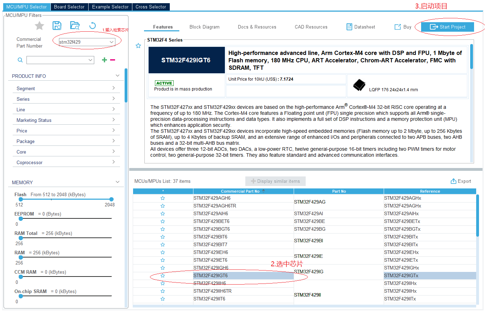
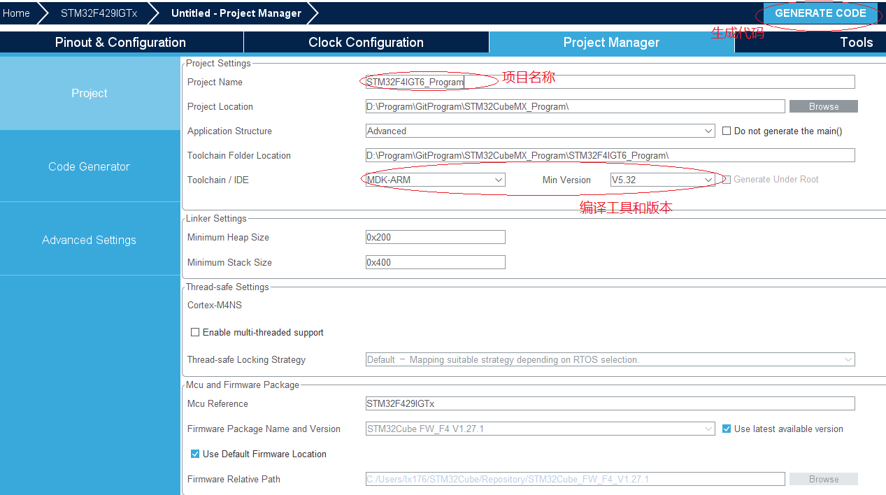

# 单片机总结系列(01) 综述和内核说明

## 系统综述

本节配合例程: [01-STM32F429_START](./../code/01-STM32F429_START/)

嵌入式系统是由主控芯片(MCU, DSP或SOC), 电源, 外围器件(SDRAM, EPPROM, 传感器, SD Card, ETH PHY, CAN Controller, 驱动芯片等)共同组成的具有外部数据采集, 处理和控制输出的软硬件处理系统.在完整的产品中, 主控芯片往往负责处理数据采集(ADC, I/O Input, 触摸输入, DCIM), 存储管理(SDRAM, Nand-Flash, Nor-Flash, EPPROM), 外部器件交互(SPI, I2C), 设备间通讯(CAN, USART/RS432/RS485, MII/RMII等), 功能输出(PWM, I/O Output, DAC, FMC, GUI显示)等功能.嵌入式开发依托于硬件, 再结合驱动, OS系统, 应用组件, 实现具体特定功能的电子设备, 是目前应用广泛的技术之一, 再日常中到处都是, 如声控灯, 手环, 电子表, 智能锁, 行车记录仪等.

作为芯片运行的基础, 驱动是整个产品必不可少的一部分.虽然在应用中占比并不高, 但是驱动作为整个系统的眼睛和手臂, 如果出问题, 系统的构建也就成了无根之萍；因此深入理解和掌握驱动开发, 是提升单片机开发竞争力中重要的一环.本系列中将以STM32F429IGT6为基础来说明单片机开发中的技术, 当然这对于大部分其它类型的单片机或DSP, 知识也是相通的.对于ARM芯片来说, 其核心由以下几部分组成.

- 内核Core和调试系统, 这部分由ARM来定义和设计, 如系统的架构, 支持的指令集, 流水线机制, 内存模型, 调试接口等, 这些信息一般通过内核IP和文档的形式提供给芯片厂商, 用于具体芯片的设计生产 -- Core IP厂商, 如ARM, Andes等.
- 具有特定功能的外设模块, 包含通用的SPI, I2C, FSMC, CAN, SDIO, USB, ETH, DCMI等, 或者满足特定需求的WIFI, BLE, 快充协议模块等, 这些模块由IP厂商或芯片厂商自行设计开发, 并通过各类总线(AHB, APB, 总线矩阵等)与内核集构建完整的芯片功能 -- 芯片厂商, 如ST, TI, NXP, 全志, 乐鑫等.
- 存储器映射, 芯片需要提供数据存储和进行处理的存储空间, 按照功能可以分为如下类型.ROM(只读存储器, 用于存储代码和数据, 可以在掉电后保存), RAM(随机存取存储器, 可以支持系统运行时实时数据修改的内存空间).其中ROM常见的有内部FLASH, 外部的EPPROM, SPI_FLASH, NandFlash和NorFlash,  RAM则有内部的SRAM, 外部的SDRAM, PSARM, 此外对于更高端DDRx系列芯片等, 此外高性能的芯片还会支持I-Cache和D-Cache, 以满足更高读写性能的需求(如STM32F7系列).
- 时钟, 电源管理和复位系统, 为了使芯片能够正常工作, 还需要有统筹管理所有模块的电源和时钟系统.主要负责上电时序, 系统和模块工作的电压和时钟.嵌入式开发中, 寄存器的读取、修改和复位都依赖于时钟的工作, 这也是我们在使用大部分外设模块时都需要先使能对应时钟的原因.在芯片内部, 由专门的模拟器件实现, 并定义寄存器对设备进行管理, 如STM的RCC, PWR模块都涉及对这部分的控制.

另外本系列的文章, 在验证时都将使用HAL库开发, 但不一定全部使用ST封装的接口, ST的设计抽象化做的还可以, 但是部分过度封装, 很多时候我们开发中并不需要处理所有中断, 另外很多库接口的超时是直接基于HAL内部时钟进行硬等待, 在初始化时使用还好, 在循环中使用效率就很差, 因此也会有调整.

这里说下为什么使用HAL库, 主要原因有以下几点.

- HAL库可以由STM32CubeMX直接生成, 从管脚配置和模块功能都能很好的约束控制, 避免出现人为实现的错误.
- 对于比较新的芯片(F4, F7以及G系列), ST的HAL库提供更全面的封装(包含HAL和LL), 简化了开发, 而使用寄存器对于复杂模块无论从开发还是后期维护都是难题, 因此不建议使用.

上述就是我选择HAL的原因, 其实这也是未来的趋势, 类似英飞凌, TI这些公司的也在支持这种图形化代码生成工具, 不仅能覆盖大部分日常驱动的需求, 甚至可以快速的构建USB, CAN, 网络或电机驱动这类复杂应用的代码.如果基于开发板进行构建的硬件设计, 基本可以做到一行代码不改, 实现以前需要大量调试才能正常工作的功能.记得在2014年左右因为工作需要移植调试uC/OS+lwip+Web的应用到STM32F2的芯片, 查阅大量资料, 花了一个多月左右才调试稳定运行的web应用.而在去年, 使用英飞凌的DAVE工具, 通过直接生成, 修改下配置, 两三天就调整成可以直接运行的web程序, 节省了大量的精力和时间.

这里可能又有人担心, 驱动代码, 甚至RTOS和Lwip, USB这些复杂的代码都由芯片厂商实现, 开箱即用 , 那作为单片机开发的意义是什么.这个担心其实有些多余, 单片机的开发仍然有很多工作, 主要归类以下几点.

- 系统异常状态分析.主要指开发中模块功能不正常时, 能结合软件, 硬件, 配合调试设备(如电压表, 逻辑分析仪, 示波器)进行分析.这是经验积累的问题, 例如I2C要带外部上拉, CAN硬件上要有终端匹配电阻, 如何确定断路, 短路, 还是电阻, 器件损坏, 虽然看似是电子工程师的工作, 但即使比较大的团队, 电子工程师也无法时刻帮你分析, 理解软硬件, 可以快速让你去定性是软件还是硬件问题, 在针对处理, 事半功倍.
- 适配不同的外部器件驱动.如果产品硬件套用官方开发板, 那例程demo移植下就可以了, 不过产品中往往因为需求和成本的要求, 使用不同的器件, 如cmos, spi-flash, 3-axis sensor, 压力传感器, 温/湿度传感器, phy芯片, 这就需要在外设驱动基础上, 进一步封装上层的模块驱动, 而且因为硬件和使用场景差别, 这时官方demo大部分情况是不能直接使用的, 需求根据设计和应用要求进行修改和调试.
- 实现与其它设备的交互功能.如有的设备支持网页和远程软件控制, 就需要支持通讯协议(如http, mqtt, modbus等)；还有些支持蓝牙, ziggbee, wifi功能, 既是使用相应的蓝牙, wifi模块, 也需要移植调试相应的AT指令协议, 并在其上扩展定制命令；支持界面显示, 要实现GUI界面和触摸控制；有时也会产品的功能需求, 也需要定义实现私有的协议, 在目前嵌入式系统越来越复杂的背景下, 多设备交互的功能和可靠性实现越来越重要, 也是开发中的主要工作内容.
- 行业内特殊功能要求的实现.主要应对不同行业中的产品应用需求, 实现具体的功能, 例如数据的存储管理(备份和容错恢复机制), 日志记录, 在线升级, 运动控制(位置, 速度), 温湿度控制, 还有安全, 保护机制, 异常的处理, 这部分是和行业息息相关, 对于各种突发情况都要有相应的处理机制, 这部分往往在工作实践时才能够了解.

这里举个产品中应用的例子, 在工业应用领域, 经常使用POT(线性的滑动变阻器)来进行位置的计算和行程限制, 这种应用很简单, 确定零点和满量程的ADC值记录在代码中, 然后读取当前ADC值, 按照比例反算下行程中的位置, 看起来并不困难.但如果有量产经验, 就会发现这个机制是有隐藏问题的, 当只有一台开发设备时, 可以实现很精确的位置计算, 但当产品批量时, 可能因为POT本身产品的差异, 基准电压的偏差, 供电电压的差异, 那一套参数就适配不了所有的设备, 这时就要考虑提供校准方案, 如比较常用的两点校准, 根据物理的零点和满量程位置, 满足条件就记录下ADC值, 后续就校准的参数进行计算.当然这只是很小的一个例子, 校准需求在嵌入式产品中有很多的应用, 如果没有经验在设计时是很容易遗漏的, 而这部分知识只有经历过产品量产才会了解, 是每一个跨过资深门槛工程师必须掌握的知识.

注意:**虽然本系列基本按照模块的难易程度, 从易到难讲解单片机开发中涉及的模块, 除了基础模块如RCC, NVIC, GPIO, DMA等被大部分模块使用, 其它模块的功能大都是相对独立的, 因此在学习和理解的时候可以选择需要的章节直接去查看, 而且有的章节如果有理解不了的地方, 可以直接跳过而不要纠结, 等技术水平提高后再回过头来学习, 可能之前的天堑已成坦途.**

## 使用STM32CubeMX生成project

本系列虽然是自己实现编译结构, 不过和也依托于STM32CubeMX进行驱动程序的开发, 掌握STM32CubeMX的使用也是单片机学习中的必备一环.工欲善其事必先利其器, 对于单片机的学习, 是需要有相应的硬件配合的, 需要的软硬件如下.

1. 基于STM32的开发板
2. 开发板下载工具(jlink或者stlink)
3. MDK安装包
4. STM32CubeMX安装包

在有上述软硬件, 并成功安装环境后, 下面讲述STM32CubeMX的使用方法.

- 打开STM32CubeMX, 选择New Project>ACCESS TO MCU SELECTOR, 弹出芯片选择界面
- 搜索点击所选择的芯片, 选中后创建项目, 点击右上角的start project.



- 此时可以开始项目的配置, 这里先配置Project Manager下的功能.



- 点击generate code, 即可生成需要的项目.
- 此外, 在Clock Manage下修改时钟配置, Pinout & Configuration下修改I/O配置, 这个在后面讲到相应模块时说明.

## 构建自己的project

使用STM32CubeMX生成project方便快捷, 而且图形化管理, 不易出错.如果是产品开发, 十分建议直接使用此方法创建.不过对于学习和本例程来说, 通过STM32CubeMX创建的代码分层过多, 处理也冗余, 不利于讲解说明, 因此本系列中主要构建自己的project, 详细见目录[代码相关目录](../code/)中STM32F*开头的内容.一个完整的project主要由以下几个部分组成.

1. 启动文件, 由芯片设计时确定, 系统上电后的入口地址.
2. 应用主文件, 带有main函数的主应用相关文件, 定义在相应project的application目录下.
3. 芯片运行支持的库文件, 以STM32为例就是HAL库.
4. 基于HAL库开发, 提供芯片模块和外部器件功能的驱动文件.
5. 支持产品功能的第三方库文件, 如RTOS, USB Library, LWIP, Fatfs等.
6. 综合上面的所有模块, 整合进行应用层功能开发.

## 内核概览

基于Cortex-M4F内核设计, 包含以下特点:

1. 是32位的处理器内核, 也就是说内部的寄存器和数据位宽都是32位的.
2. 采用哈佛结构, 具有独立的数据总线和指令总线, 内核可以同时读取数据和指令, 提高了效率.
3. 支持MPU, 存储器保护单元, 可以控制对于不同memory的访问权限(需要芯片设计启用).
4. 支持DSP指令集, 能够加速浮点运算.
5. 支持handler和thread两种模式, 分别用于表示异常服务例程和普通用户程序的代码, 另外也支持特权分级, privileged和unprivileged模式, 其中handler模式只支持privileged模式.

### 通用寄存器

Cortex-M4处理器拥有R0-R15寄存器组.

- R0-R12为32位通用寄存器, 用于数据操作.
- R13为堆栈指针寄存器, 且同时指定两个堆栈指针:MSP(主堆栈指针)和PSP(进程堆栈指针), 并通过修改权限指向对应的堆栈指针, 堆栈指针的最低两bit永远是0.
- R14为LR寄存器, 主要在调用子程序时, 存储返回地址.
- 15为PC寄存器, 指向当前的程序地址.
- 特殊功能寄存器xPSR,用于记录ALU标志, 管理中断以及修改系统的特权状态.

这些寄存器的相关知识, 主要在实现RTOS或者在调试hardfault时追踪, 对于RTOS中, 汇编指令如下.

```s
msr psp, r0 #将psp指针值写入r0寄存器, 并将当前堆栈切换到PSP
msr msp, r0 #将msp指针值写入r0寄存器, 并将当前堆栈切换到MSP
```

对于触发hardfault时, 可以使用错误追踪库, 则包含对上述寄存器的运用:<https://github.com/armink/CmBacktrace>

### 调试接口

Cortex-M4F内核提供集成再在片上调试支持, 包含以下接口.

- SWJ-DP：串行/JTAG 调试端口
- AHP-AP：AHB 访问端口
- ITM：指令跟踪单元
- FPB：Flash 指令断点
- DWT：数据断点触发
- TPUI：跟踪端口单元接口（大封装上提供, 其中会映射相应引脚）
- ETM：嵌入式跟踪宏单元（大封装上提供, 其中会映射相应引脚）

基于调试工具, 支持JTAG-DP(5脚)和SW-DP(2脚)模式, ETM嵌入式追踪单元使用TDI和TDO脚, 与JTAG-DP模式下的JTDO和JTDI下一致.所以不能使用ETM作为打印调试.

#### SEGGER-jlink调试

对于调试打印, 对于jlink, 可以使用segger驱动内提供的SEGGER_RTT进行移植, 将内部的**SEGGER_RTT.c**, **SEGGER_RTT_ASM_ARMv7M.S**和**SEGGER_RTT_printf.c**添加到代码中, 添加头文件路径, 即可使用**SEGGER_RTT.h**即可使用调试接口.

```c
//安装地址
..\SEGGER\JLink\Samples\RTT

//BufferIndex - 写入port, 目前为0
//pBuffer - 数据的起始指针
//NumBytes - 数据长度
unsigned SEGGER_RTT_Write (unsigned BufferIndex, const void* pBuffer, unsigned NumBytes);

//类似printf的可变输入函数
int SEGGER_RTT_printf(unsigned BufferIndex, const char * sFormat, ...);
```

使用工具J-Link RTT Client或J-Link RTT Viewer即可进行调试操作.

#### ST-Link调试

对于ST-Link, 则可以使用ETM嵌入式跟踪宏单元进行调试, 不过要确定以下设计.

- 使用SW-DP连接方式
- 确定调试设备和ARM芯片的的**TDI**和**TDO**引脚连接.

然后在代码中即可使用ETM接口进行跟踪调试.

```c
//需要在.c文件中声明ITM数据格式
volatile int32_t ITM_RxBuffer = ITM_RXBUFFER_EMPTY;

//ITM检查是否有数据读取
int32_t ITM_CheckChar (void);

//ITM读取数据
int32_t ITM_ReceiveChar (void);

//ITM发送数据
uint32_t ITM_SendChar (uint32_t ch);
```

之后可以使用调试接口下View->Serial Windows->Debug(printf) viewer进行输出, 如果需要再非调试下查看, 也可以使用STM32CubeProgrammer->SWV进行查看.上面从内核, NVIC和调试部分应用讲解内核信息, 不过这也仅仅只是内核功能中常用的一部分, 如果想继续深入了解, 也可以参考其它嵌入式书籍, 配合深入学习.

## 参考书籍

本系列参考书籍如下：

- <Cortex-M3权威指南>
- <Cortex™-M4 Devices Generic User Guide>
- <STM32F4x 参考手册>
- <STM32F4x 数据手册>

## 下一章节

[返回目录](./../README.md)

直接开始下一小节: [ch02.RCC系统时钟模块](./ch02.rcc_system_clock.md)
