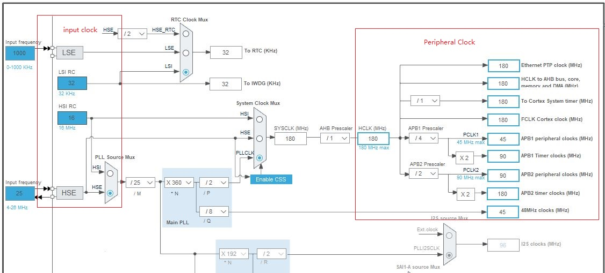

# 单片机总结系列(02) RCC系统时钟模块

RCC是驱动系统运行的基础模块.内核和模块配置, 功能的实现都依赖于时钟模块的工作.如指令的执行, 寄存器的写, 读, 复位, 数据的输入检测和输出, 都基于时钟来进行同步和处理, 可以说时钟就是芯片整体执行的基石, 是遍布所有外设的功能模块.对于STM32F4来说, RCC模块的主要包含以下功能.

- 管理系统工作的时钟, 这里包含系统SYSTICK时钟以及各外设的时钟(AHB, APB1, APB2, USB时钟等), 内核和所有外设模块都有其工作的时钟范围, 才能正常工作.
- 单独管理每个外设模块的时钟开启, 关闭和复位的动作, 用于精细化的功率管理.

## 时钟源和使能

RCC模块需要时钟源作为基准时钟, 以STM32F429为例, 支持四种不同的时钟源.

- LSI, 低速内部时钟, 对于STM32F4为32Khz, 也有芯片为40Khz, 不可配置, 固定提供给内部看门狗, 也可以作为RTC的工作时钟.
- LSE, 低速外部时钟, 由OSC32_IN/OSC32_OUT输入的时钟, 不可配置, 支持范围为0~1Mhz, 由外部晶振电路提供, 可作为RTC的工作时钟.
- HSI, 高速内部时钟, 由内部振荡器提供的高速时钟.对于STM32F4为16Mhz, 可直接提供作为系统时钟, 也可以作为PLL的输入时钟经过处理后, 产生更高的时钟频率用于系统工作.
- HSE, 高速外部时钟, 由外部晶振电路提供, 常见支持8M, 16M, 25M,  50M晶振, HSE也可以直接提供给系统时钟, 也可以作为PLL的输入时钟经过处理后, 产生更高的时钟频率用于系统工作.

对于系统来说, 内部时钟由芯片内部的震荡电路产生, 功能上一直存在, 只要开启即可使用；外部时钟则需要搭配具体的晶振才能正常工作.时钟的配置管理, 可以参考STM32CubeMX的Clock Configuration配置功能, 详细的展示了Clock的配置方法.



对于外部时钟产生, 主要通过晶振提供, 至于晶振的使用分为有源晶振(Bypass)和无源晶振(Crystal/Greamic).

- 无源晶振是两个引脚的无极性器件, 需要配合RC电路(一般为电容配合内部激励时钟)才能产生震荡信号.
- 有源晶振是完整的振荡器, 当正确接入电压后, 会有引脚输出产生震荡信号.

内部时钟源具有不依赖外部晶振器件, 调试简单等优点, 但是会因为设计有误差、且受温度的影响, 相对来说不精确, 不过也能满足大部分场景的需求.不过对于高精度定时, 高波特率串口通讯的场景会引入时钟误差, 有这些功能需求的产品往往使用外部晶振电路作为基础时钟源.对于嵌入式RCC模块的驱动开发, 主要包含时钟使能, 倍频和分频使能, 然后将系统时钟, 外设模块时钟选中使能的时钟源, 下面为HAL库提供的时钟启动和配置的代码.

```c
    RCC_OscInitTypeDef RCC_OscInitStruct = {0};
    RCC_ClkInitTypeDef RCC_ClkInitStruct = {0};

    /** Configure the main internal regulator output voltage
    */
    __HAL_RCC_PWR_CLK_ENABLE();
    __HAL_PWR_VOLTAGESCALING_CONFIG(PWR_REGULATOR_VOLTAGE_SCALE1);

    /** 
    * 开启系统的时钟源, 并配置相应值
    * PLL依赖HAE, RTC工作采用LSE, IWDG采用LSI, 所以这些时钟需求开启
    * LSE Clock: 32.768KHz
    * LSI Clock: 32KHz
    * HSE Clock: 25MHz
    * System CLock: 25 / PLLM * PLLN / PLLP = 180MHz
    */
    RCC_OscInitStruct.OscillatorType = RCC_OSCILLATORTYPE_LSI|RCC_OSCILLATORTYPE_HSE
                          |RCC_OSCILLATORTYPE_LSE;

    //硬件HSE和LSE使用的都是无源晶振, 
    //RCC_HSE_BYPASS旁路表示只需要一个引脚即可提供时钟, 只有有源晶振支持
    RCC_OscInitStruct.HSEState = RCC_HSE_ON;
    RCC_OscInitStruct.LSEState = RCC_LSE_ON;
    RCC_OscInitStruct.LSIState = RCC_LSI_ON;
    RCC_OscInitStruct.PLL.PLLState = RCC_PLL_ON;
    RCC_OscInitStruct.PLL.PLLSource = RCC_PLLSOURCE_HSE;
    RCC_OscInitStruct.PLL.PLLM = 25;
    RCC_OscInitStruct.PLL.PLLN = 360;
    RCC_OscInitStruct.PLL.PLLP = RCC_PLLP_DIV2;
    RCC_OscInitStruct.PLL.PLLQ = 8;
    if (HAL_RCC_OscConfig(&RCC_OscInitStruct) != HAL_OK)
    {
        Error_Handler();
    }

    /** Activate the Over-Drive mode
    */
    if (HAL_PWREx_EnableOverDrive() != HAL_OK)
    {
        Error_Handler();
    }

    /** Initializes the CPU, AHB and APB buses clocks
    * SYSTICK Clock - PLL Clock 180MHz
    * AHB Clock - SYSTICK Clock/DIV 180MHz
    * APB1 Clock - AHB Clock/4 45MHz
    * APB2 Clock - AHB Clock/2 90MHz
    */
    RCC_ClkInitStruct.ClockType = RCC_CLOCKTYPE_HCLK|RCC_CLOCKTYPE_SYSCLK
                            |RCC_CLOCKTYPE_PCLK1|RCC_CLOCKTYPE_PCLK2;
    RCC_ClkInitStruct.SYSCLKSource = RCC_SYSCLKSOURCE_PLLCLK;
    RCC_ClkInitStruct.AHBCLKDivider = RCC_SYSCLK_DIV1;
    RCC_ClkInitStruct.APB1CLKDivider = RCC_HCLK_DIV4;
    RCC_ClkInitStruct.APB2CLKDivider = RCC_HCLK_DIV2;

    if (HAL_RCC_ClockConfig(&RCC_ClkInitStruct, FLASH_LATENCY_5) != HAL_OK)
    {
        Error_Handler();
    }
```

其中SYSTCLK(系统运行的时钟), CPU工作的最小节拍, 也称作时钟周期.不过CPU运行完成一个基础操作需要多个时钟周期, 被称为机器周期, 而CPU执行一条指令又需要若干个机器周期, 被称为指令周期.对于同一颗芯片, 时钟周期越小, 则相应的机器周期也越短, 执行流程也相对更快, 不过时钟频率受限于芯片本身工艺以及外设的限制, 工艺直接限制频率的上限, 外设则可能部分器件需要特定的分频时钟, 导致使用某些器件, 系统不能够运行在更高的频率, 只能运行在器件支持的倍频上, 例如USB需要48M时钟, 导致如果使用USB模块, 系统时钟只能工作在48*7=336M, 否则就要超频到384M, 这就超过了ST允许的芯片最大频率, 是有损坏可能的, 不建议这样使用.至于AHB, APB1, APB2也是因为对应外设的要求, 有着不同的频率限制, 这需要在开发时注意, 当然如果使用官方STM32CubeMX生成工程, 已经进行了详细的限制, 不需要担心.

## 外设模块时钟管理

RCC模块提供其它外设的模块管理接口, 通过RCC_APBxRSTR, RCC_AHBxRSTR, RCC_APBxENR, RCC_AHBxENR寄存器, 可以控制大部分外设的模块使能、关闭、复位、复位释放功能, 这些在HAL库中被封装成宏进行操作, 下面以GPIO举例来列出些接口说明.

```c
//使能GPIOA的时钟
__HAL_RCC_GPIOA_CLK_ENABLE();

//关闭GPIOA的时钟
__HAL_RCC_GPIOA_CLK_DISABLE();

//复位GPIOA模块
__HAL_RCC_GPIOA_FORCE_RESET();

//释放GPIOA模块复位
__HAL_RCC_GPIOA_RELEASE_RESET();
```

上述就是RCC提供的用于模块时钟管理接口, 对于后续使用的外设, 如SPI, I2C, Timer等, 都需要进行相应的时钟使能和控制.

## 下一章节

[返回目录](./../README.md)

直接开始下一小节: [ch03.GPIO输入输出模块](./ch03.gpio_input_output.md)
