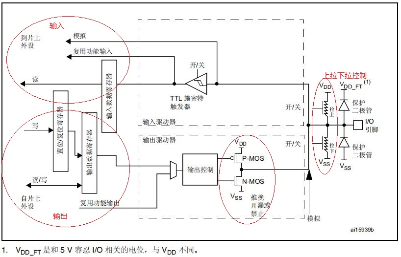
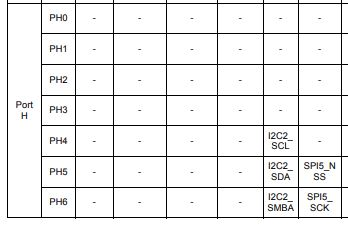

# 单片机技术总结说明(03) GPIO输入输出模块

GPIO是芯片与外部连接的通道；按键输入、LED灯、蜂鸣器、控制继电器开关、以及I2C、SPI、USART、CAN和USB等通讯接口，其底层都依赖于GPIO进行实际信号的输入输出。对于简单的状态读取和控制开关输出，使用GPIO模块就可以完成工作；但是对于通讯相关功能，就需要将GPIO复用到对应的模块功能后；使能配置相应的外设模块，通过更复杂的外设模块(如USART、SPI、I2C、CAN等模块)来解析引脚输入和控制引脚输出，从而实现具体的通讯协议。当然对于不复杂协议直接用I/O也可以模拟实现，这也是SPI和I2C能够通过模拟实现的原理，下面用STM32F4中GPIO设计接口展示更详细的说明。

本节目录如下所示。

- [gpio说明](#gpio_function)
- [gpio应用操作](#gpio_function)
- [总结说明](#summary)
- [下一章节](#next_chapter)

本节配合例程: **code/03-STM32F429_GPIO/project/stm32f429.uvprojx**。

## gpio_function

对于STM32F4，根据用户手册，其GPIO的内部框图如下所示。



1. 当配置输入功能时，引脚上的电平信号会通过施密特触发器写入到数据寄存器中
2. 使用复用功能时，也会同时通过复用功能输入信号到达指定片上外设
3. 使用输出功能时，则可通过复位/置位寄存器写入输出数据寄存器(也可直接写入输出数据寄存器，需要先读后写，不然会误修改)，另外复用功能输出也会直接输出到外部I/O中
4. 输出可以通过控制Vdd的MOS开关，表示I/O为**开漏或者推挽模式**
5. GPIO对应的引脚中也包含可开关的上拉和下拉电阻，分别控制I/O初始化的默认上拉，下拉或浮空，这在输入模式下可以避免启动时的误触发

这里列出GPIO的常见配置信息和说明。

- 开漏输出: 内部Vdd MOS只有0和断开，需要配置外部上拉电阻(内部上拉驱动能力弱，直接配置上拉一般也无法驱动设备高电平)
- 推挽输出: 内部Vdd MOS可以输出0和1
- 复用开漏输出: 用于复用的开漏输出，引脚复用为其它功能使用，如I2C接口
- 复用推挽输出: 用于复用的推挽输出，引脚复用为其它功能使用，如USART输出接口
- 上拉/下拉/浮空输入: 输入模式，用于检测输入电平，配置上拉/下拉是确定初始电平，避免误触
- 模拟输入: 用于ADC采样的引脚，外部电平直接通过引脚进入ADC模块

## gpio_app

将GPIO配置为输出的初始化和控制的代码如下所示。

```c
// 配置GPIOB的引脚0为推挽输出
void drv_gpio_output_init(void)
{
    GPIO_InitTypeDef GPIO_InitStruct = {0};

    //使能GPIOB对应的RCC时钟
    __HAL_RCC_GPIOB_CLK_ENABLE();

    //写入GPIO的默认值
    HAL_GPIO_WritePin(GPIOB, GPIO_PIN_0, GPIO_PIN_RESET);

    GPIO_InitStruct.Mode = GPIO_MODE_OUTPUT_PP;    // 推挽输出, P-MOS, N-MOS都支持控制
    GPIO_InitStruct.Pull = GPIO_NOPULL;            // 无外部上拉/下拉电阻, 关闭PULL
    GPIO_InitStruct.Speed = GPIO_SPEED_FREQ_LOW;   // 控制I/O的输出速率, 作为普通I/O时影响不大, 复用为通讯I/O时需要考虑.

    GPIO_InitStruct.Pin = GPIO_PIN_0;
    HAL_GPIO_Init(GPIOB, &GPIO_InitStruct);
}

// 对于引脚的其它操作
HAL_GPIO_WritePin(GPIOB, GPIO_PIN_0, GPIO_PIN_RESET);   // 设置引脚为低电平
HAL_GPIO_WritePin(GPIOB, GPIO_PIN_0, GPIO_PIN_SET);     // 设置引脚为高电平
HAL_GPIO_TogglePin(GPIOB, GPIO_PIN_0);                  // 引脚电平取反
```

配置为输入则类似，具体代码如下。

```c
// 配置GPIOC的引脚13为上拉输入
void drv_gpio_input_init(void)
{
    GPIO_InitTypeDef GPIO_InitStruct = {0};

     //使能GPIOC对应的RCC时钟
    __HAL_RCC_GPIOC_CLK_ENABLE();
    
    GPIO_InitStruct.Mode = GPIO_MODE_INPUT;         //输入模式
    GPIO_InitStruct.Pull = GPIO_PULLUP;             //开启外部上拉电阻，默认高电平
    GPIO_InitStruct.Speed = GPIO_SPEED_FREQ_LOW;    //控制I/O的输出速率, 作为普通I/O时影响不大, 复用为通讯I/O时需要考虑.
    
    GPIO_InitStruct.Pin = GPIO_PIN_13;
    HAL_GPIO_Init(GPIOC, &GPIO_InitStruct);
}

// 读取引脚状态
GPIO_PinState state = HAL_GPIO_ReadPin(GPIOC, GPIO_PIN_13);
```

其中Pull和Speed分别对应外部上拉/下拉电阻的控制，Speed则对应I/O允许的最大速率，Mode则比较重要，用来配置I/O的具体功能，具体如下。

```c
// 设置引脚的输入输出状态
GPIO_MODE_INPUT                 // 输入模式
GPIO_MODE_OUTPUT_PP             // 推挽输出
GPIO_MODE_OUTPUT_OD             // 开漏模式，需要外部上拉才能输出高
GPIO_MODE_AF_PP                 // 复用为其它外设控制，同时GPIO推挽
GPIO_MODE_AF_OD                 // 复用为其它外设控制，同时GPIO开漏
GPIO_MODE_ANALOG                // 模拟模式，主要用于ADC和DAC应用
// 中断相关配置参考外部中断说明
//......

// 设置引脚的上下拉
GPIO_PULL_UP                    // 上拉
GPIO_PULL_DOWN                  // 下拉
GPIO_NOPULL                     // 浮空

// 配置引脚的输出速率
// 高速度支持更高的输出频率，功耗高，电磁干扰大。
// 普通I/O一般配置为低速
// 复用I/O根据实际情况，例如I2C通讯，高波特率USART等，需要配置为高速。避免不匹配增加通讯异常
GPIO_SPEED_FREQ_LOW             // 低速率
GPIO_SPEED_FREQ_MEDIUM          // 中速率
GPIO_SPEED_FREQ_HIGH            // 高速
GPIO_SPEED_FREQ_VERY_HIGH       // 非常高速
```

对于复用模式，除了将模式配置为复用外，还需要将I/O和对应的外设关联起来。在数据手册上会提供映射的表格，如果使用STM32CubeMX将更为简单，将I/O配置成对应的外设模块对应功能，则代码中会生成对应的复用接口，否则就需要查看数据手册；这也是越来越推荐使用STM32CubeMX进行配置的原因，因为它可以图形化约束管理，自动生成代码，避免手动配置出错，这也是单片机驱动开发中的常见问题。

STM32F429IG对应的数据手册地址为: <https://www.stmcu.com.cn/Designresource/detail/document/696245>。

以I2C2为例，在文档Table 12. STM32F427xx and STM32F429xx alternate function mapping中查找PH4，PH5，复用为I2C2对应AF4，不过我不建议这么查找，通过STM32CubeMX选择指定GPIO直接生成会更简单，且不会出错。



分析查看I/O对外设的映射表进行确认.

```c
// i2c硬件初始化
void drv_i2c2_init(void)
{
    GPIO_InitTypeDef GPIO_InitStruct = {0};

    // 使能I2C2对应的RCC时钟
    __HAL_RCC_I2C2_CLK_ENABLE();
    __HAL_RCC_GPIOB_CLK_ENABLE();
    __HAL_RCC_GPIOH_CLK_ENABLE();

    /*
    I2C2 GPIO Configuration
    PH4     ------> I2C2_SCL
    PH5     ------> I2C2_SDA
    */
    GPIO_InitStruct.Pin = GPIO_PIN_4 | GPIO_PIN_5;
    GPIO_InitStruct.Mode = GPIO_MODE_AF_OD;
    GPIO_InitStruct.Pull = GPIO_NOPULL;
    GPIO_InitStruct.Speed = GPIO_SPEED_FREQ_VERY_HIGH;
    GPIO_InitStruct.Alternate = GPIO_AF4_I2C2;    //PH4，PH5复用到I2C2，使用AF4通道
    HAL_GPIO_Init(GPIOH, &GPIO_InitStruct);

    // 进行i2c2模块的初始化
}
```

## summary

在本章讲述了GPIO的功能，包含初始化、读写、以及如何配合外设模块复用实现具体通讯的功能。可以看到通讯外设模块也是基于GPIO实现最终的功能。这除了在开发软件时注意外，也提供了调试硬件接口连通的方法，当两个芯片通过I2C、USART或SPI连接不通时。

1. 可以先将引脚配置为普通GPIO输入/输出模式，看双方是否能检测到正确的电平，这样就可以快速判断是否为硬件问题。
2. 如果不能检测到，先去排查硬件问题；反之，则查看引脚代码中是否开启的复用功能，且配置是否与芯片的定义一致，一致则再去查上层的模块配置问题，不一致则修改后再调试。

这里全面讲解了GPIO的功能，下一章则在此基础上讲述外部中断。

## next_chapter

[返回目录](./../README.md)

直接开始下一小节: [EXTI外部中断模块](./ch04.exti_interrupt.md)
