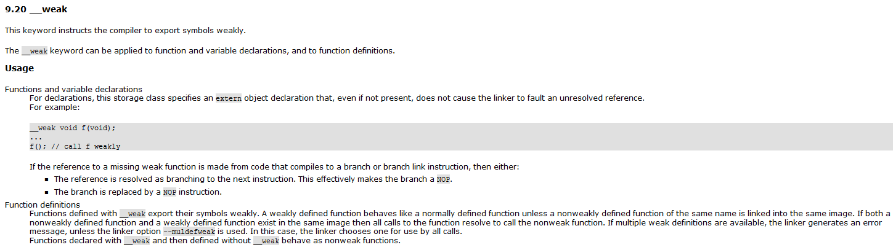

# 单片机总结系列(04) EXTI外部中断模块

在上节讲解GPIO中，可以通过HAL_GPIO_ReadPin读取I/O状态，不过这种设计需要周期性的读取，资源占用多，因此单片机提供触发在通知的模式，不需要周期性的扫描，这就降低了资源的占用，当然外部中断是建立在I/O的基础上，那么中断初始化的流程就比较好理解了，如下所示。

1. 使能GPIO对应的模块时钟
2. 配置I/O指定中断工作模式
3. 开启对应的中断
4. 定义中断函数，并增加相应的标志位处理

目录如下所示。

- [外部中断触发流程](#exit_workflow)
- [外部中断软件实现](#exit_app)
- [中断向量控制器NVIC说明](#interrupt_nvic)

本节配合例程: [04-STM32F429_EXTI](./../code/04-STM32F429_EXTI/)。

## exit_workflow

这里开始讲解中断触发的原理，首先参考流程如下所示。


从上可以看出外部中断的检测由以下步骤组成。

1. GPIO的输入信号通过边沿检测电路(可独立控制开启上升沿或者下降沿检测)，当外边沿变化时触发信号
2. 触发的信号，通过软件中断事件寄存器控制，决定是否进一步转换作为中断事件触发信号
3. 中断事件触发信号，通过中断和事件屏蔽寄存器来控制具体传递到NVIC模块，进行中断处理，还是通过控制脉冲发生器，产生event信号，前者用于软件处理，后者可作为部分外设触发的输入源

另外也可以看到边沿检测基于APB总线的时钟，所以只有频率低于APB2时钟的外部信号才能被正确检测，否则就可能会有遗漏。

## exit_app

关于外部中断在代码中应用实现如下。

```c
    //使能GPIOB的时钟
    __HAL_RCC_GPIOB_CLK_ENABLE();

    /*Configure GPIO pin : PB12 */
    GPIO_InitStruct.Pin = GPIO_PIN_12;
    GPIO_InitStruct.Mode = GPIO_MODE_IT_FALLING; //配置下降沿触发，软件中断事件寄存器
    GPIO_InitStruct.Pull = GPIO_PULLUP;
    HAL_GPIO_Init(GPIOB, &GPIO_InitStruct);

    HAL_NVIC_SetPriority(EXTI15_10_IRQn, 0, 0);
    HAL_NVIC_EnableIRQ(EXTI15_10_IRQn); //配置对应的中断屏蔽寄存器，打开中断
```

可以看到，因为HAL库的集成，Mode即可配置上升/下降沿产生中断，另外为了避免开机误触中断，符合外部检测的要求，也要相应的配置GPIO的外部上拉电阻保证默认电平(下降沿为高，上升沿为低)，关于中断和模式的配置选项如下所示。

```c
    GPIO_MODE_IT_RISING             //输入模式，上升沿触发中断
    GPIO_MODE_IT_FALLING            //输入模式，下降沿触发中断
    GPIO_MODE_IT_RISING_FALLING     //输入模式，上升沿，下降沿都触发中断
    GPIO_MODE_EVT_RISING            //输入模式，上升沿触发事件
    GPIO_MODE_EVT_FALLING           //输入模式，上升沿触发事件
    GPIO_MODE_EVT_RISING_FALLING    //输入模式，上升沿，下降沿都触发事件
```

对于中断的实际执行，当有外部符合的信号触发时，就会执行对应的中断函数，对于EXTI15_10_IRQn来说，执行的中断就是EXTI15_10_IRQHandler，对于共用的中断信号，读取对应的中断的信号，就可以区分并处理对应的外部中断。

```c
void EXTI15_10_IRQHandler(void)
{
    if (__HAL_GPIO_EXTI_GET_IT(GPIO_PIN_12) != RESET)
    {
        __HAL_GPIO_EXTI_CLEAR_IT(GPIO_PIN_12);
        
        //执行具体的中断触发,中断中不建议使用delay函数
        //可以触发后，在其它地方进行超时读取检测
    }
}
```

对于事件，可以作为其它模块的触发条件，如ADC支持外部EXTI线-11进行触发。中断可以通过软件调用函数实现各种功能，事件则提供信号用于作为其它外设的触发条件，例如低功耗模式和事件唤醒就是stm32支持的事件之一。

## interrupt_nvic

外部中断的代码并不难理解，但是在我最初接触的时候，最让我困惑的是中断函数是如何被调用的，这里就涉及NVIC控制器的知识。Cortex-M4内核支持NVIC中断向量控制器，其中最大支持240个可编程中断(由芯片厂商定义)，另外包含15个系统中断，这部分声明在startup_xxx.s启动文件中，例如stm32f4的定义如下。

```s
    DCD     __initial_sp               ; Top of Stack
    DCD     Reset_Handler              ; Reset Handler          #复位中断
    DCD     NMI_Handler                ; NMI Handler            #不可屏蔽中断
    DCD     HardFault_Handler          ; Hard Fault Handler     #硬fault中断
    DCD     MemManage_Handler          ; MPU Fault Handler      #MPU访问异常
    DCD     BusFault_Handler           ; Bus Fault Handler      #总线错误异常
    DCD     UsageFault_Handler         ; Usage Fault Handler    #程序错误异常
    DCD     0                          ; Reserved
    DCD     0                          ; Reserved
    DCD     0                          ; Reserved
    DCD     0                          ; Reserved
    DCD     SVC_Handler                ; SVCall Handler         #系统SVC异常
    DCD     DebugMon_Handler           ; Debug Monitor Handler  #调试监视器异常
    DCD     0                          ; Reserved
    DCD     PendSV_Handler             ; PendSV Handler         #为系统设置的PendSVSS异常
    DCD     SysTick_Handler            ; SysTick Handler        #系统滴答定时器异常

    ; External Interrupts
    DCD     WWDG_IRQHandler            ; Window WatchDog
```

对于剩余240个中断，则由芯片厂商进行定义，当然也不是全部都存在，厂商根据外设的需求，可以自定义中断对应的线号，这个在芯片设计的时候确认，并在SDK的文件头中包含定义，以STM32F429xx.h为例。

```c
typedef enum
{
/******  Cortex-M4 Processor Exceptions Numbers ****************************************************************/
  NonMaskableInt_IRQn         = -14,    /*!< 2 Non Maskable Interrupt                                          */
  MemoryManagement_IRQn       = -12,    /*!< 4 Cortex-M4 Memory Management Interrupt                           */
  BusFault_IRQn               = -11,    /*!< 5 Cortex-M4 Bus Fault Interrupt                                   */
  UsageFault_IRQn             = -10,    /*!< 6 Cortex-M4 Usage Fault Interrupt                                 */
  SVCall_IRQn                 = -5,     /*!< 11 Cortex-M4 SV Call Interrupt                                    */
  DebugMonitor_IRQn           = -4,     /*!< 12 Cortex-M4 Debug Monitor Interrupt                              */
  PendSV_IRQn                 = -2,     /*!< 14 Cortex-M4 Pend SV Interrupt                                    */
  SysTick_IRQn                = -1,     /*!< 15 Cortex-M4 System Tick Interrupt                                */
/******  STM32 specific Interrupt Numbers **********************************************************************/
  WWDG_IRQn                   = 0,      /*!< Window WatchDog Interrupt                                         */
  PVD_IRQn                    = 1,      /*!< PVD through EXTI Line detection Interrupt                         */
  TAMP_STAMP_IRQn             = 2,      /*!< Tamper and TimeStamp interrupts through the EXTI line             */
  RTC_WKUP_IRQn               = 3,      /*!< RTC Wakeup interrupt through the EXTI line                        */
  FLASH_IRQn                  = 4,      /*!< FLASH global Interrupt                                            */
  RCC_IRQn                    = 5,      /*!< RCC global Interrupt                                              */
  EXTI0_IRQn                  = 6,      /*!< EXTI Line0 Interrupt                                              */
```

以STM32F4为例，如头文件中WWDG_IRQn值为0，在中断向量表中就对应第一个外部中断WWDG_IRQHandler，在中断触发时，就通过查找在中断向量表中的偏移值，找到对应的中断函数入口，触发执行。这里讲解下查询的方法，例如指定中断向量表在FLASH中(假定0x08000000),那么当中断触发时，NVIC模块内部会置位对应的中断标志位，这时内核根据触发这个中断的线号偏移地址=起始地址+(中断线号+用户中断起始位置)\*地址指针长度,如WWDG的中断入口地址即为0x08000000+(WWDG_IRQn + 16)*4=0x80000040中读取内部数据，这个就是中断函数的入口地址。

```s
#.map文件中定义的中端函数入口地址
WWDG_IRQHandler                          0x080043f9   Thumb Code     2  stm32f10x_it.o(i.WWDG_IRQHandler)

#bin文件0x08000040起始内部数据，可以看到0x08000040中的数据就是WWDG_IRQHandler的地址
"0x080043f9 0x08000217 0x08000217 0x08000217"
```

至于我们在C文件中声明函数能够被调用，这就涉及到[WEAK]扩展关键字，在MDK扩展中，在C语言声明未__weak的函数，以及汇编中导出为[WEAK]的函数，被称为弱定义函数，如果一个函数同时存在非弱定义函数和弱定义函数，则所有的调用都解析为非弱函数，这部分参考。



另外对于Cortex-M4来说支持最大8位优先级，不同中断可以使用相同的优先级，这时根据在中断线号绝对先后执行顺序且互相不会打断。对于具体使用位数由芯片厂商定义，但是最少支持3bit，对于STM32F49IG设计上则支持4bit作为优先级，并进一步可以分类为抢占优先级和子优先级，其中抢占优先级更高的中断，可以打断低优先级的中断；子优先级只影响中断的执行顺序，不会打断现有中断执行。对于中断处理的函数由内核库提供(代码中的CMSIS库，如core_cm4.h)提供，不过HAL库进行了封装，具体函数接口如下。

```c
/*
设置中断向量的抢占优先级和子优先级
  *         @arg NVIC_PRIORITYGROUP_0: 0 bits for preemption priority
  *                                    4 bits for subpriority
  *         @arg NVIC_PRIORITYGROUP_1: 1 bits for preemption priority
  *                                    3 bits for subpriority
  *         @arg NVIC_PRIORITYGROUP_2: 2 bits for preemption priority
  *                                    2 bits for subpriority
  *         @arg NVIC_PRIORITYGROUP_3: 3 bits for preemption priority
  *                                    1 bits for subpriority
  *         @arg NVIC_PRIORITYGROUP_4: 4 bits for preemption priority
  *                                    0 bits for subpriority
*/
void HAL_NVIC_SetPriorityGrouping(uint32_t PriorityGroup)

//设置中断的抢占优先级和子优先级，0最高，最低优先级位2^bit
void HAL_NVIC_SetPriority(IRQn_Type IRQn, uint32_t PreemptPriority, uint32_t SubPriority)

//使能中断
void HAL_NVIC_EnableIRQ(IRQn_Type IRQn)

//关闭中断
void HAL_NVIC_DisableIRQ(IRQn_Type IRQn)

//设置中断向量表位置
SCB->VTOR = SRAM_BASE | ADDRESS; 
```

对于一个模块需要开启中断，在模块使能正常工作后，以usart为例，需要进行如下操作。

```c
//开启模块内部中断使能
__HAL_UART_ENABLE_IT(&huart1, UART_IT_RXNE);

//设置中断对应的优先级
HAL_NVIC_SetPriority(USART1_IRQn, 0, 0);

//使能中断
HAL_NVIC_EnableIRQ(USART1_IRQn);

//使能总中断
void __enable_irq(void);

//关闭总中断
void __disable_irq(void)

//定义中断的执行函数
void USART1_IRQHandler(void)
{
    uint8_t rx_data;
    
    if (__HAL_UART_GET_FLAG(&huart1, UART_FLAG_RXNE) != RESET)
    {
        //对于接收中断标志位，当读取DR值时自动清除，因此不需要软件再清除
        if (HAL_UART_Receive(&huart1, &rx_data, 1, 100) == HAL_OK)
        {
            //update data to application
        }
    }
}
```

如果中断未正常触发，就可以查看上述步骤是否有缺失。这里描述下检查的方法。

- 查看非中断模式下模块能否正常收发数据，确定模块是否正常配置，包含时钟，GPIO，是否需要重映射，模块配置是否正确
- 确定模块内部中断使能位是否置位
- 确定NVIC中断使能位是否置位
- 确定中断入口函数是否和启动文件内命名一致，如果没有对应中断函数，会停止在启动文件中
- 如果上述4步骤仍然不触发，则判断是否关闭了总中断或者进行了中断屏蔽一直未开启

上述就是分析中断无法执行的主要方式，当中断未正常触发时，一般按照此流程分析中断的触发流程。

## 下一章节

[返回目录](./../README.md)

直接开始下一小节: [ch05.串口通讯模块](./ch05.usart_com.md)
