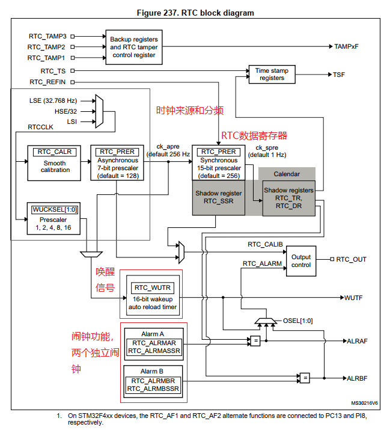
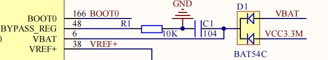

# 单片机技术总结说明(06) RTC时钟模块

实时时钟(RTC)是一个独立的BTC定时器/计数器，其不同于内部时钟，支持独立供电，在芯片休眠和掉电时仍然能够正常工作。对于单片机来说，RTC不仅提供计时的功能，还可以作为唤醒源之一来唤醒休眠设备，是系统中重要的功能模块之一。

对于STM32的RTC模块，主要提供以下功能。

- 日历时钟
- 可编程的闹钟中断
- 具有中断功能的周期性可编程唤醒标志

目录如下所示。

- [RTC功能说明](#rtc_notes)
- [RTC功能配置](#rtc_config)
- [RTC闹钟功能配置](#rtc_alarm_config)
- [总结说明](#summary)
- [下一章节](#next_chapter)

本节配合例程: **code/06-STM32F429_RTC/project/stm32f429.uvprojx**

## rtc_notes

以STM32F4的RTC模块为例，其框架如下所示。



可以看到，RTC模块的时钟源可以选择LSE、HSE或者LSI，其中LSE是一个32.768KHz的晶振，HSE是一个外部时钟源，LSI是一个内部低速时钟源。通过内部分频器提供时钟源。从功能，RTC模块包含时间计数、闹钟唤醒和芯片唤醒功能。

RTC模块支持秒、分钟、小时、星期、日期、月份和年份的记录，并且能够自动补偿月份和天数。RTC模块可以使用外部时钟源（如LSE、HSE）或者内部低速时钟（LSI）作为时钟输入。为了确保RTC的正常工作，需要提供一个1Hz的时钟信号，这个时钟信号是由一个7位的异步预分频器（fdiv_a）和一个15位的同步预分频器（fdiv_s）分频得到的。

注意：为了降低功耗，建议将异步预分频器（fdiv_a）的值设置得尽可能大。

RTC模块的时钟计算公式如下：

```c
rtc_clk = (fclk)/((fdiv_a + 1) * (fdiv_s + 1);
```

当选用LSE(时钟为32.768KHz)时，当fdiv_a值为127，fdiv_s值为255，此时RTC的时钟为32768/((127+1)*(255+1)) = 1Hz，也就是1s增加一个计数。对于RTC的寄存器，上电复位后，所有RTC寄存器均受到写保护。**通过写入PWR_CR的DBP位才能使能RTC寄存器的写访问**。

RTC时钟包含最基础的掉电计时，闹钟以及唤醒功能，可以有独立的电池供电，从而实现在系统掉电后能够正常计时，关于RTC的供电设计一般如下所示。



一般选用外部3.3V和电池通过BAT54c二极管进行切换供电。这是因为使用的纽扣电池电压一般为3V，当系统有供电时，电压高于电池电压，此时使用外部供电；当系统断电时，此时电池端有电，电压就切换到3V，保证RTC模块仍然能正常工作。这种模式可以避免带电工作时仍然使用电池供电，延长电池工作寿命。

RTC同时支持一组20个4字节的备份寄存器，上电和复位数据不丢失，我们可以用这个寄存器来确认RTC是否被配置过，避免重复修改初始时间，导致计时出错。

RTC模块内部使用BCD（Binary-Coded Decimal）模式存储时间信息。BCD格式使用4位二进制数来表示1位十进制数。在实际应用中，需要进行BCD码和二进制数之间的转换。例如，将二进制数21转换为BCD码的过程如下：

```c
//21 => 0x21
//BIN => BCD
out_bcd = ((in_bin/10)<<4 | (in_bin%10)
```

将BCD码0x21转换为二进制数的过程如下:

```c
//BCD => BIN
//0x21 => 21
out_bin = (in_bcd>>4)*10 + (in_bcd&0x0F)
```

## rtc_config

RTC的配置主要流程如下所示。

1. 解锁RTC功能配置：通过调用HAL_PWR_EnableBkUpAccess()函数解锁RTC功能配置。
2. 配置RTC的时钟源：使用RCC_PeriphCLKInitTypeDef结构体配置RTC的时钟源，选择合适的时钟源（如LSE）。
3. 使能RTC时钟并配置功能模式：调用__HAL_RCC_RTC_ENABLE()函数使能RTC时钟，并使用HAL_RTC_Init()函数配置RTC的功能模式，包括时钟分频、计时模式等
4. 根据备份寄存器值确定是否更新RTC时钟：通过读取备份寄存器的值，判断RTC是否已经被配置过。如果没有配置过，则需要设置当前的时间和日期，并将配置标志写入备份寄存器

以下是一个简单的RTC配置示例代码：

```c
#define RTC_SET_FLAGS       0x5B5B
#define RTC_FORMAT_MODE     RTC_FORMAT_BIN

static GlobalType_t rtc_hardware_init(void)
{
    // 1. 解锁RTC功能配置
    HAL_PWR_EnableBkUpAccess();

    // 2. 配置RTC的时钟源
    RCC_PeriphCLKInitTypeDef PeriphClkInitStruct = {0};
    
    PeriphClkInitStruct.PeriphClockSelection = RCC_PERIPHCLK_RTC;
    PeriphClkInitStruct.RTCClockSelection = RCC_RTCCLKSOURCE_LSE;
    if (HAL_RCCEx_PeriphCLKConfig(&PeriphClkInitStruct) != HAL_OK) {
        return RT_FAIL;
    }

    // 3. 使能RTC时钟，配置RTC功能模式
    __HAL_RCC_RTC_ENABLE();

    rtc_handler_.Instance = RTC;
    rtc_handler_.Init.HourFormat = RTC_HOURFORMAT_24;   //设置计时模式，12/24 hours
    rtc_handler_.Init.AsynchPrediv = 127;               //设置异步和同步分频，保证时钟为1Hz.
    rtc_handler_.Init.SynchPrediv = 255;
    rtc_handler_.Init.OutPut = RTC_OUTPUT_DISABLE;      //不需要输出内部时钟用于校准，否则使用RTC_AF1进行输出
    rtc_handler_.Init.OutPutPolarity = RTC_OUTPUT_POLARITY_HIGH;
    rtc_handler_.Init.OutPutType = RTC_OUTPUT_TYPE_OPENDRAIN;
    if (HAL_RTC_Init(&rtc_handler_) != HAL_OK) {
        return pdFAIL;
    }

    // 4. 根据备份寄存器值，确定是否更新RTC时钟
    if (HAL_RTCEx_BKUPRead(&rtc_handler_, RTC_BKP_DR0) != RTC_SET_FLAGS)
    {
        // 写入当前的时:分:秒
        time_.Hours = hour;
        time_.Minutes = min;
        time_.Seconds = sec;
        time_.DayLightSaving = RTC_DAYLIGHTSAVING_NONE;
        time_.StoreOperation = RTC_STOREOPERATION_RESET;
        HAL_RTC_SetTime(&rtc_handler_, &time_, RTC_FORMAT_MODE);

        // 写入当前的年:月:日
        date_.Year = year;
        date_.Month = month;
        date_.Date = date;
        date_.WeekDay = week;
        HAL_RTC_SetDate(&rtc_handler_, &date_, RTC_FORMAT_MODE);

        HAL_RTCEx_BKUPWrite(&rtc_handler_, RTC_BKP_DR0, RTC_SET_FLAGS);
    }
}
```

读取RTC时钟的步骤如下。

1. 读取RTC时间
2. 读取RTC日期

注意: **在设计上为了确保这3个值来自同一时刻点，读取RTC_SSR或RTC_TR时会锁定高阶日历影子寄存器中的值，直到读取RTC_DR。也就是SSR和TR读取后，DR才更新，读取时间后，才能正确的读取日期信息。**

```c
typedef struct
{
    RTC_TimeTypeDef time;
    RTC_DateTypeDef date;
}RTC_INFO;
static RTC_INFO rtc_info_;


// 需要按照顺序读取，否则读取数据未更新
HAL_RTC_GetTime(&rtc_handler_, &time_, RTC_FORMAT_MODE); // 获取RTC时钟
HAL_RTC_GetDate(&rtc_handler_, &date_, RTC_FORMAT_MODE); // 获取RTC日期
```

对于RTC内部，寄存器使用BCD格式来保存上述信息。这里面讲解下BCD码和二进制的转换，二进制数字12转换成BCD就是(1<<4 | 2)，高位为12/10，低位为12%10，下面展示时间的转换。

```C
// RTC_FORMAT_BIN模式对应时间 17:23:00
// RTC_FORMAT_BCD模式对应 
时: (17/10)<<4 | (17%10) = 0x17
分: (23/10)<<4 | (23%10) = 0x23
秒: (00/10)<<4 | (00%10) = 0x00
```

## rtc_alarm_config

RTC模块支持两路独立的闹钟（A和B）功能，可用于实现定时中断或唤醒休眠的内核。闹钟功能除了支持时分秒和星期的配置外，还可以配置是否日期和星期匹配。

以下是一个典型的RTC闹钟配置示例代码。

```c
static void rtc_set_alarm(uint8_t week, uint8_t hour, uint8_t min, uint8_t sec)
{   
    // 设置定时的时分秒
    rtc_arm_handler_.AlarmTime.Hours = hour;  
    rtc_arm_handler_.AlarmTime.Minutes = min; 
    rtc_arm_handler_.AlarmTime.Seconds = sec; 
    rtc_arm_handler_.AlarmTime.SubSeconds = 0;
    rtc_arm_handler_.AlarmTime.TimeFormat = RTC_HOURFORMAT_24;
    
    // 选择对应的RTC闹钟，配置时间
    rtc_arm_handler_.AlarmMask = RTC_ALARMMASK_NONE;
    rtc_arm_handler_.AlarmSubSecondMask = RTC_ALARMSUBSECONDMASK_NONE;
    rtc_arm_handler_.AlarmDateWeekDaySel = RTC_ALARMDATEWEEKDAYSEL_WEEKDAY;
    rtc_arm_handler_.AlarmDateWeekDay = week; 
    rtc_arm_handler_.Alarm = RTC_ALARM_A;     
    
    __HAL_RTC_ALARM_CLEAR_FLAG(&rtc_handler_, RTC_FLAG_ALRAF);
    HAL_RTC_SetAlarm_IT(&rtc_handler_, &rtc_arm_handler_, RTC_FORMAT_MODE);
    
    // 设置RTC优先级并使能
    HAL_NVIC_SetPriority(RTC_Alarm_IRQn, 0x01, 0x02);
    HAL_NVIC_EnableIRQ(RTC_Alarm_IRQn);
}
```

对于RTC时间到达后，触发的中断如下所示。

```c
// RTC闹钟中断处理函数
void RTC_Alarm_IRQHandler(void)
{
    RTC_HandleTypeDef *prtc_handler = &rtc_handler_;

    // 判断定时器A触发
    if (__HAL_RTC_ALARM_GET_IT(prtc_handler, RTC_IT_ALRA))
    {
        if ((uint32_t)(prtc_handler->Instance->CR & RTC_IT_ALRA) != (uint32_t)RESET)
        {
            is_alarm = pdTRUE;
                
            /* Clear the Alarm interrupt pending bit */
            __HAL_RTC_ALARM_CLEAR_FLAG(prtc_handler,RTC_FLAG_ALRAF);
        }
    }

    /* Clear the EXTI's line Flag for RTC Alarm */
    __HAL_RTC_ALARM_EXTI_CLEAR_FLAG();

    /* Change RTC state */
    prtc_handler->State = HAL_RTC_STATE_READY; 
}
```

## summary

STM32的RTC模块提供了强大的实时时钟功能，包括日历时钟、闹钟中断以及周期性唤醒标志。通过合理配置RTC模块，可以满足各种应用场景下的实时计时需求。在实际应用中，需要注意RTC的时钟源选择、寄存器访问权限以及时间格式的转换等问题，才能更好的应用RTC模块。

## next_chapter

[返回目录](./../README.md)

直接开始下一小节: [DAC输出模块](./ch07.dac_output.md)
