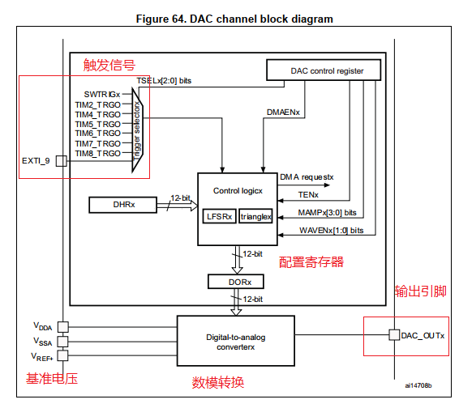

# 单片机技术总结说明(07) DAC输出模块

DAC模块是12位电压输出数模转换器，支持两路DAC输出，对应硬件**DAC1--PA4，DAC2--PA5**。DAC输出电压的公式为: DACoutput = Vref*DOR_REG/4096；其中**Vref是模拟参考电压输入**，由外部电源提供(但要求1.8V和VDDA之间)，DOR_REG是通道输出寄存器值(12bit，只读，由芯片自动移动从保持寄存器写入)。

DOR_REG作为为DAC数据寄存器，写入支持8位右对齐，12位左对齐和12位右对齐方式，具体说明如下。

- 8位右对齐，数据加载到DHR8R[7:0]，被移动到在DOR_REG的[11:4]位。**公式转换为: DACoutput = Vref\*(DHR8R<<4)/4096 = Vref\*DHR8R/256**，这样就通过12位DAC实现8位DAC输出。
- 12位左对齐，数据加载到DHR12L[15:4]，被移动到DOR_REG的[11:0]位；**公式转换为:DACoutput = Vref\*(DHR12L>>4)/4096 = Vref\*DHR12L/2^16**，这就可以将16bit的数据通过12bit的DAC进行输出。这在音频控制DAC输出有重要意义，原始音频为16bit的数据，通过硬件数据右移丢掉4bit，就能驱动12bit DAC工作。
- 12位右对齐，数据加载到DHR12R[11:0]，被移动到DOR_REG的[11:0]位，不需要任何处理；**公式转换为: DACoutput = Vref\*DHR12R/4096**。

了解了这些，基本上对于DAC的常用操作就有了认识，另外下面还有几个知识点。

- 带输出缓冲器(buffer)，可以在不增加外部运放的情况下降低输出阻抗来驱动外部负载，有一定的带载要求时才需要打开。
- 可以生成噪声和三角波，直接软件打开后会耦合到现有DAC输出上，需要在使能DAC之前配置。
- 多种触发方式，定时器，外部中断，软件触发等，可通过DAC_CR寄存器配置。
- 支持DMA方式输出，可通过定时器触发+DMA+DAC来实现音频的输出(输出指定频率的音频)。
- 使用Vref基准电压，虽然一般是LDO输出；如果只是用来测试没有问题，不过如果用于精确控制，就需要进行读取校准，这部分在ADC章节进行详细说明。

本节目录如下所示。

- [DAC电压输出](#dac_output)
- [DAC配合DMA实现正弦波输出](#dac_dma_output)
- [DAC配合DMA实现音频输出](#dac_dma_voice_output)
- [总结说明](#summary)
- [下一章节](#next_chapter)

本节配合例程: **code/07-STM32F429_DAC/project/stm32f429.uvprojx**

## dac_output

对于DAC模块，其框图如下所示。



DAC模块基于基准电压Vref+，通过数模转换，将DHRx中设置的数字量，转换为电平，最终输出到DAC_OUTx引脚。对于DAC模块，支持TIM事件或者外部中断进行触发。对于基本的电压输出，DAC的配置比较简单，步骤如下所示。

1. 使能GPIO和DAC时钟。
2. 配置GPIO引脚为模拟引脚，无上拉。
3. 初始化DAC模块。
4. 使能DAC通道，配置触发源(无触发源则直接更新，其它需要相应事件才更新)。
5. 写入DAC数据寄存器，使能DAC通道，此时相应引脚既有电平输出。

基于上述流程，代码实现如下所示。

```c
// 初始化DAC模块
static BaseType_t drv_dac_init()
{
    DAC_ChannelConfTypeDef sConfig = {0};
    GPIO_InitTypeDef GPIO_InitStruct = {0};

    // 使能DAC对应的引脚和模块时钟
    __HAL_RCC_DAC_CLK_ENABLE();
    __HAL_RCC_GPIOA_CLK_ENABLE();
 
    // 配置DAC对应的引脚为模拟引脚
    GPIO_InitStruct.Pin = GPIO_PIN_4;
    GPIO_InitStruct.Mode = GPIO_MODE_ANALOG;
    GPIO_InitStruct.Pull = GPIO_NOPULL;
    HAL_GPIO_Init(GPIOA, &GPIO_InitStruct);

    // 初始化DAC模块
    dac_handle_.Instance = DAC;
    if (HAL_DAC_Init(&dac_handle_) != HAL_OK)
        return pdFAIL;
    
    // 配置DAC模块的触发方式和输出缓存器
    sConfig.DAC_Trigger = DAC_TRIGGER_NONE;                 // 定义触发方式(更新数据寄存器值到实际硬件的条件)
    sConfig.DAC_OutputBuffer = DAC_OUTPUTBUFFER_DISABLE;    // 关闭输出缓存器
    if (HAL_DAC_ConfigChannel(&dac_handle_, &sConfig, DAC_CHANNEL_1) != HAL_OK)
        return pdFAIL;
    
    return pdPASS;
}
```

初始化完成后，就可以设置输出电压了。这里面有两个配置项需要了解，一个是DAC的触发方式，另一个是输出缓存器。其中DAC支持的触发方式如下所示。

```c
#define DAC_TRIGGER_NONE        // 不触发，写入数据寄存器时即触发更新
#define DAC_TRIGGER_T2_TRGO     // 定时器2触发
#define DAC_TRIGGER_T4_TRGO     // 定时器4触发
#define DAC_TRIGGER_T5_TRGO     // 定时器5触发
#define DAC_TRIGGER_T6_TRGO     // 定时器6触发
#define DAC_TRIGGER_T7_TRGO     // 定时器7触发
#define DAC_TRIGGER_T8_TRGO     // 定时器8触发
#define DAC_TRIGGER_EXT_IT9     // 外部触发
#define DAC_TRIGGER_SOFTWARE    // 软件触发，执行start后软件触发更新
```

对于输出缓存器，开启则会通过内部Buffer电路控制；降低输出阻抗，提高输出能力，不需要外部放大器的情况下直接驱动外部负载。不过在实践中要考虑到增加输出缓冲器会导致整体电压在0.2~Vdda-0.2V之间，因此实践中要根据需求进行选择。另外DAC是基于基准电压分档实现，所以无法高于Vref(输出更高电压则需要搭配电压放大电路实现)。

对于电压输出控制接口，实现如下所示。

```c
//reference voltage, uint:mv
#define DAC_REFERENCE_VOL   3300

//dac max output value
#define DAC_MAX_VALUE       4096

void drv_dac_set_vol(uint16_t mv)
{
    float adc_value;
    
    if (mv > DAC_REFERENCE_VOL)
        mv = DAC_REFERENCE_VOL;
    
    adc_value = (float)mv/DAC_REFERENCE_VOL * DAC_MAX_VALUE;
    
    HAL_DAC_SetValue(&dac_handle_, DAC_CHANNEL_1, DAC_ALIGN_12B_R, (uint32_t)adc_value); 
    HAL_DAC_Start(&dac_handle_, DAC_CHANNEL_1);
}
```

如此，通过drv_dac_set_vol设置电压，单位mv。

## dac_dma_output

在上一小节了解了如何通过软件控制实现DAC输出。在实践中，如果能够以指定时间去修改DAC的输出值，更新电压，那么我们就可以近似的各类波形。这里提供一种近似正弦波的输出方法。

首先需要我们按照一定频率进行电平的输出，如果分解了40个点，以完整的波为2*PI为例，则波形为sin(2*PI/40)；考虑到DAC只能输出正点平，且峰值为4095，则范围为0~4095，且sin值的范围为-1~1，可以将值向上平移转换为0~2，计算公式为val = (sin(n*2*PI/40)+1)*4096/2。后续将这些点以固定时间T/40写入到DAC的输出寄存器即可，这就需要DMA的参与，整个流程的实现原理如下。

对于DAC配合DMA的输出主要实现步骤就如下所示。

1. 配置DAC模块，实现DAC输出功能。
2. 确定DMA和外设的通道关系，配置memory到DAC输出数据寄存器的DMA通道。
3. 使能DAC的DMA功能，同时DMA指定通道开始工作。
4. 配置Timer模块功能，将DAC的数据请求更新与Timer更新就进行了关联。当Timer的更新事件触发后，会触发DAC数据请求，通知DMA进行更新。
5. 开启DAC输出功能和Timer定时器功能，这样Timer触发时，就将数据通过DMA搬运到DAC的数据寄存器内，实现正弦波的输出。

关于DAC通过DMA实现正弦波输出的代码如下所示。

```c
//根据公式计算所得
uint16_t vol_cycle[] = {
    2048, 2368, 2680, 2977, 3251,
    3496, 3704, 3872, 3995, 4070,
    4095, 4070, 3995, 3872, 3704,
    3496, 3251, 2977, 2680, 2368,
    2048, 1727, 1415, 1118, 844,
    599,  391,  223,  100,  25,
    0,    25,   100,  223,  391,
    599,  844, 1118, 1415, 1727,
};

BaseType_t dac_init()
{
    GPIO_InitTypeDef GPIO_InitStruct = {0};
    DAC_ChannelConfTypeDef sConfig = {0};
    TIM_ClockConfigTypeDef sClockSourceConfig = {0};
    TIM_SlaveConfigTypeDef sSlaveConfig = {0};
    TIM_MasterConfigTypeDef sMasterConfig = {0};

    // 使能对应的DAC、GPIO、 DMA、TIM时钟
    __HAL_RCC_DMA1_CLK_ENABLE();
    __HAL_RCC_TIM4_CLK_ENABLE();
    __HAL_RCC_DAC_CLK_ENABLE();
    __HAL_RCC_GPIOA_CLK_ENABLE();
    
    // 配置GPIO为模拟模式
    GPIO_InitStruct.Pin = GPIO_PIN_4;
    GPIO_InitStruct.Mode = GPIO_MODE_ANALOG;
    GPIO_InitStruct.Pull = GPIO_NOPULL;
    HAL_GPIO_Init(GPIOA, &GPIO_InitStruct);

    // 配置DAC模块
    hdac.Instance = DAC;
    if (HAL_DAC_Init(&hdac) != HAL_OK)
        return pdFAIL;

    // 配置DAC通道，使能DMA功能
    sConfig.DAC_Trigger = DAC_TRIGGER_T4_TRGO;              // 定义DAC通过TIM4事件触发
    sConfig.DAC_OutputBuffer = DAC_OUTPUTBUFFER_DISABLE;    // 关闭输出缓存器
    if (HAL_DAC_ConfigChannel(&hdac, &sConfig, DAC_CHANNEL_1) != HAL_OK) {
        return pdFAIL;
    }
    SET_BIT(hdac.Instance->CR, DAC_CR_DMAEN1);

    // 配置DMA通道，使能DMA功能
    hdma_dac1.Instance = DMA1_Stream5;                      // 选择DMA1_Stream5通道
    hdma_dac1.Init.Channel = DMA_CHANNEL_7;                 // 选择DMA通道7
    hdma_dac1.Init.Direction = DMA_MEMORY_TO_PERIPH;        // 选择内存到外设
    hdma_dac1.Init.PeriphInc = DMA_PINC_DISABLE;            // 关闭外设地址自增
    hdma_dac1.Init.MemInc = DMA_MINC_ENABLE;                // 允许内存地址自增
    hdma_dac1.Init.PeriphDataAlignment = DMA_PDATAALIGN_HALFWORD;   // 外设数据宽度为半字(12bit一次传输需要半字)
    hdma_dac1.Init.MemDataAlignment = DMA_MDATAALIGN_HALFWORD;      // 内存数据宽度为半字
    hdma_dac1.Init.Mode = DMA_CIRCULAR;                             // 循环模式
    hdma_dac1.Init.Priority = DMA_PRIORITY_LOW;                     // 优先级低(根据需求选择)
    hdma_dac1.Init.FIFOMode = DMA_FIFOMODE_ENABLE;                  // 允许FIFO模式
    hdma_dac1.Init.FIFOThreshold = DMA_FIFO_THRESHOLD_HALFFULL;     // 设置FIFO阈值为半满
    hdma_dac1.Init.MemBurst = DMA_MBURST_SINGLE;                    // 允许单次传输模式
    hdma_dac1.Init.PeriphBurst = DMA_MBURST_SINGLE;                 // 允许单次传输模式   
    if (HAL_DMA_Init(&hdma_dac1) != HAL_OK)
    {
        return pdFAIL;
    }
    __HAL_LINKDMA(&hdac, DMA_Handle1, hdma_dac1);

    // 配置Timer模块，用于DAC更新触发 
    htim.Instance = TIM4;
    htim.Init.Prescaler = 89; //1M
    htim.Init.CounterMode = TIM_COUNTERMODE_UP;
    htim.Init.Period = 1;
    htim.Init.ClockDivision = TIM_CLOCKDIVISION_DIV2;
    htim.Init.AutoReloadPreload = TIM_AUTORELOAD_PRELOAD_ENABLE;
    if (HAL_TIM_Base_Init(&htim) != HAL_OK)
    {
        return pdFAIL;
    }
    sClockSourceConfig.ClockSource = TIM_CLOCKSOURCE_INTERNAL;      // 选择内部时钟源
    if (HAL_TIM_ConfigClockSource(&htim, &sClockSourceConfig) != HAL_OK)
    {
        return pdFAIL;
    }
    sMasterConfig.MasterOutputTrigger = TIM_TRGO_UPDATE;            // 事件触发，更新DAC数据
    sMasterConfig.MasterSlaveMode = TIM_MASTERSLAVEMODE_DISABLE;
    if (HAL_TIMEx_MasterConfigSynchronization(&htim, &sMasterConfig) != HAL_OK)
    {
        return pdFAIL;
    }
    
    // 启动定时器，DMA和DAC模块
    HAL_TIM_Base_Start(&htim);
    HAL_DMA_Start(&hdma_dac1, (uint32_t)vol_convert_cycle, (uint32_t)&hdac.Instance->DHR12R1, 40);
    __HAL_DAC_ENABLE(&hdac, DAC_CHANNEL_1);
     
    return pdPASS; 
}
```

## dac_dma_voice_output

上一节讲述了DAC如何通过DMA输出正弦波，就可以使用同样方法实现音频输出。

这里先讲解下声音输出的说明，扬声器是基于振动的原理，将电信号转换成声音信号的器件；在真实的环境下，电压的周期性变化，带来扬声器的震荡，从而进行发声。那么声音就来自无数个点共同组成可变电平信号。其中电平信号变化越密集，则还原的声音越真实。不过在实践中，电平信号的变化是受数据存储体积，设备性能等物理限制的；因此在实现音频输出时，需要根据实际情况，只能选取一部分点采样，按照一定的周期取样控制电平输出(这个取样就是音频的采样频率)；以近似的方式模拟音频发声。影响音频的软件因素有两个，采样频率和位数。

1. 音频的采样频率，常见有8k/16k/32k, 对应输出电压DAC的频率，决定输出点的密集程度。
2. 音频的位数，常见有8bit/16bit, 对应输出电压DAC的位数，确定输出电压的精确程度。

理论上采样频率越高，位数越高，就越接近真实音频。不过也会带来过大的体积容量以及设备的性能瓶颈。这里以16k频率，16bit的一段wav音频，进行实现音频的输出，具体其实现步骤如下所示。

- 通过python脚本将将wav音频转成DAC输出数组。

```python
#!/use/bin/python3

import wave
import numpy as np
import sys

def decode_wavtoarray(wavefile, textfile):
    
    # 读取并解析wav文件
    f = wave.open(wavefile, 'rb' )
    params = f.getparams()
    nchannels, sampwidth, framerate, nframes = params[:4]
    print(f"channels:{nchannels}, width:{sampwidth}")
    
    Data_str = f.readframes(nframes)
    Data_num = np.frombuffer(Data_str,dtype=np.int16)

    datalist = list(Data_num)
    f.close()

    # 生成音频文件输出数组
    with open(textfile, 'w+') as outFile:
        outFile.write("#include <stdint.h>\n")
        outFile.write("uint16_t tonePCM_8KHz16bit[{0}] = {{\n".format(len(datalist)+1))
        
        for index, item in enumerate(datalist):
            item += 32768               # 去除音频中的负值(0~65535)
            outFile.write(str(item))
            outFile.write(',')
            if index !=0 and index%16 == 0:
                outFile.write('\n')

        outFile.write('0')
        outFile.write('\n};\n')

if __name__ == '__main__':
    decode_wavtoarray("music.wav", "voice.c")
```

接下来就是单片机中将音频数据输出。这里音频需要以固定的周期输出，这里基于DMA+Timer触发的实现，与上节一致；具体实现如下。

```c
BaseType_t drv_dac_voice_init(void)
{
    DAC_ChannelConfTypeDef sConfig = {0};
    GPIO_InitTypeDef GPIO_InitStruct = {0};
    TIM_ClockConfigTypeDef sClockSourceConfig = {0};
    TIM_MasterConfigTypeDef sMasterConfig = {0}; 
    
    // 使能GPIO, DAC, DMA, Timer时钟 
    __HAL_RCC_DMA1_CLK_ENABLE();
    __HAL_RCC_TIM4_CLK_ENABLE();
    __HAL_RCC_DAC_CLK_ENABLE();
    __HAL_RCC_GPIOA_CLK_ENABLE();

    // 配置DAC对于GPIO引脚为模拟输出模式
    GPIO_InitStruct.Pin = DAC_PIN;
    GPIO_InitStruct.Mode = GPIO_MODE_ANALOG;
    GPIO_InitStruct.Pull = GPIO_NOPULL;
    HAL_GPIO_Init(DAC_PORT, &GPIO_InitStruct);

    // 配置DAC，选择Timer4作为触发引脚
    hdac.Instance = DAC;
    if (HAL_DAC_Init(&hdac) != HAL_OK)
        return RT_FAIL;

    // 配置DAC模块的触发方式和输出缓存器
    sConfig.DAC_Trigger = DAC_TRIGGER_T4_TRGO;
    sConfig.DAC_OutputBuffer = DAC_OUTPUTBUFFER_DISABLE;
    if (HAL_DAC_ConfigChannel(&hdac, &sConfig, DAC_CHANNEL_1) != HAL_OK)
        return RT_FAIL;

    // 配置DAC对应DMA，用于音频输出(和上节一样)
    hdma_dac1.Instance = DMA1_Stream5;
    hdma_dac1.Init.Channel = DMA_CHANNEL_7;
    hdma_dac1.Init.Direction = DMA_MEMORY_TO_PERIPH;
    hdma_dac1.Init.PeriphInc = DMA_PINC_DISABLE;
    hdma_dac1.Init.MemInc = DMA_MINC_ENABLE;
    hdma_dac1.Init.PeriphDataAlignment = DMA_PDATAALIGN_HALFWORD;
    hdma_dac1.Init.MemDataAlignment = DMA_MDATAALIGN_HALFWORD;
    hdma_dac1.Init.Mode = DMA_CIRCULAR;
    hdma_dac1.Init.Priority = DMA_PRIORITY_LOW;
    hdma_dac1.Init.FIFOMode = DMA_FIFOMODE_ENABLE;
    hdma_dac1.Init.FIFOThreshold = DMA_FIFO_THRESHOLD_HALFFULL;
    hdma_dac1.Init.MemBurst = DMA_MBURST_SINGLE;
    hdma_dac1.Init.PeriphBurst = DMA_MBURST_SINGLE;
    if (HAL_DMA_Init(&hdma_dac1) != HAL_OK)
      return RT_FAIL;

    __HAL_LINKDMA(&hdac, DMA_Handle1, hdma_dac1);

    // 配置TIM4作为DAC触发的时基，周期90/(44+1)*1000/(124+1)=16Khz*/        //clock APB1 90M
    htim.Instance = TIM4;
    htim.Init.Prescaler = 44; //2M
    htim.Init.CounterMode = TIM_COUNTERMODE_UP;
    htim.Init.Period = 124;                                      //clock: 2M/125 = 16Khz
    htim.Init.ClockDivision = TIM_CLOCKDIVISION_DIV1;
    htim.Init.AutoReloadPreload = TIM_AUTORELOAD_PRELOAD_ENABLE;
    if (HAL_TIM_Base_Init(&htim) != HAL_OK)
        return RT_FAIL;
    
    sClockSourceConfig.ClockSource = TIM_CLOCKSOURCE_INTERNAL;
    if (HAL_TIM_ConfigClockSource(&htim, &sClockSourceConfig) != HAL_OK)
        return RT_FAIL;
    
    sMasterConfig.MasterOutputTrigger = TIM_TRGO_UPDATE;
    sMasterConfig.MasterSlaveMode = TIM_MASTERSLAVEMODE_DISABLE;
    if (HAL_TIMEx_MasterConfigSynchronization(&htim, &sMasterConfig) != HAL_OK)
        return RT_FAIL;

    // 使能TIM，DAC，DMA输出
    HAL_TIM_Base_Start(&htim);
    
    // 16bit数据输, 保留高位，音频
    HAL_DAC_Start_DMA(&hdac, DAC_CHANNEL_1, (uint32_t *)tonePCM_8KHz16bit, sizeof(tonePCM_8KHz16bit)/sizeof(uint16_t), DAC_ALIGN_12B_L);

    return HAL_OK;
}
```

关于DAC位数，音频中的数据是16bit的，而DAC位数是12bit的；直接使用肯定不行，那么要进行相应的转换才能被使用。

这里有两种可选方法。

1. 使用DAC_ALIGN_12B_R配置，需要将音频原始数据右移4位，丢弃最低4位，输出即可；需要在发送前完成对原始数据进行转换(也可以在python处理时进行)。
2. 使用DAC_ALIGN_12B_L配置，前面提到过，硬件会自动丢弃低4位，右移再输出到DAC中，不需要处理原始数据。

考虑到STM32支持硬件自动转换，因此软件上不需要处理原始数据。

注意1：**因为本例中使用16bit音频数据，所以DMA使用内存和外设端使用的都是"DMA_PDATAALIGN_HALFWORD"配置，半字的宽度。对于8bit音频数据，则DMA就需要配置为DMA_PDATAALIGN_BYTE**

注意2: **正常音频转换后，原始数据为-32768~32767的值。对于DAC是不能输出负电平的，为了保证曲线的完整性，需要将数据整体抬高，也就是加上32768，转换到范围0~65535，这样仍然可以输出符合DAC的输出音频曲线**。  

## summary

本章节中对于DAC模块的输出进行了详细的介绍，包括配置、使用方法、注意事项等。作为数模转换的模块，DAC可以根据需要输出特定的电平的电压；不过更重要的是，DAC配合着DMA和Timer模块，可以产生特定形式的正弦波、方波、三角波，也能够扩展实现音频的输出，值得花费时间去了解学习。

## next_chapter

[返回目录](./../README.md)

直接开始下一小节: [ch08.ADC输入模块](./ch08.adc_input.md)
