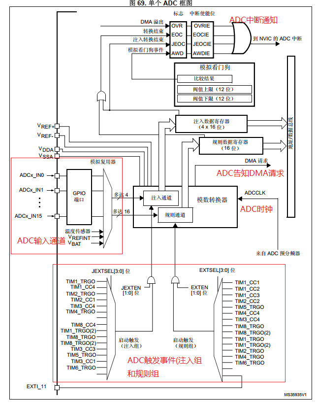
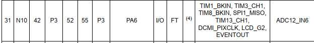
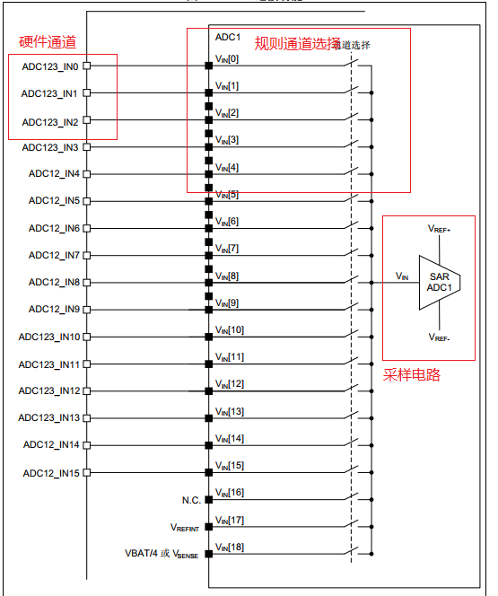

# 单片机技术总结说明(08) ADC模拟电平数字转换模块

STM32F4的ADC模块为12位逐次逼近型模拟数字转换器，同时支持多达19个通道。ADC模块支持单次、连续、扫描和间断模式，同时结果可以左对齐或右对齐方式存储在数据寄存器中。ADC是采样电压的器件，不过配合外部硬件电路，如差分放大器、温敏电阻等，可以用于采集电压、电流、位置、温度等信息。

对于ADC常见的应用中，电流可通过在接地端放置毫欧电阻，再通过差分放大器转换为电压测量；位置则可通过电位计，采集在全部行程的电压占比获得；温度则可以采集NTC电阻电压值，计算NTC电阻阻值，再通过公式反推计算的得出。ADC模块一般用于系统控制(如运动中的电流，位置检测)、设备保护(过压/过流保护)等场景，是系统中重要的输入模块之一。

对于ADC模块，本节目录如下所示。

- [ADC框架说明](#adc_frame)
- [ADC单通道读取](#signal_read)
- [ADC多通道规则组DMA读取](#multi_regular_dma_read)
- [ADC校准和注入通道方式读取](#calibration_inject_read)
- [总结说明](#summary)
- [下一章节](#next_chapter)

本节配合例程: **code/08-STM32F429_ADC/project/stm32f429.uvprojx**

## adc_frame

ADC的框架如下所示。



对于STM32F429来说，支持三路ADC，其中每个ADC都多达19个通道；其中ADCxIn0~ADCxIn15为外部ADC通道，通过引脚采集外部电平信息；其中ADCx指的是ADC1/ADC2模块，In0~In15为通道号。另外三个通道作为芯片温度，基准电压和电池电压检测，具有特定功能，用于内部采集。

对于ADC来说，每个通道都有对应的硬件I/O，可参考STM32F429xx_Reference_Manual.pdf文档中关于引脚复用的说明。本例中，使用的为PA6作为模拟输入引脚，其引脚功能如下所示。



这里的ADC12_IN6，表示可以配置为ADC1_CHANNEL6或者ADC2_CHANNEL6。不过在实践中，引脚同时只能选择其中通道之一，这里使用ADC1_CHANNEL6。

理解了这些，ADC的模块使用并不复杂。在硬件满足的情况下，触发启动ADC采样后，等待转换完成，即可从数据寄存器中读出ADC的采样值；再通过电平转换公式即可获取实际的电压。搭配外部电路参数，可以转换为电流、电阻、行程等信息。

这里其实有几个知识点需求讲解，才能更好理解配置的流程。

- 硬件ADC通道，这个是每个I/O在芯片设计被确定的通道；外部电平经过GPIO，再通过内部ADC硬件通道传递给ADC模块，用于后续的采样。芯片每个I/O支持的ADC硬件通道是不可变的，但一个I/O可以支持多路通道；确定I/O后，可以配置为支持的硬件通道，如上面的PA6对应ADC1_CHANNEL6。
- 通道选择，STM32F4有16条复用通道，这些通道是为了控制硬件ADC通道的读取顺序而增加的功能。它位于模数转换模块和硬件ADC通道之间，类似选择器的设计。ADC对于复用通道的管理可以分为两组，常规转换和注入转换。常规转换一个循环最多支持最多16个转换，每个转换都可以配置独立的硬件ADC通道，在采样中按照转换顺序依次执行。注入转换最多支持4个转换，每个转换会写入的寄存器中，转换完成后读取。注入转换又支持触发注入和自动注入，其中触发注入在当前规则通道转换结束后即执行，自动注入则在规则通道一次全部转换完成后执行。
- 采样时间，ADC上电到开始转换的时间。通道间的切换会有上次电平的残留，为了可靠性，需要预留时间来保证采样电路的稳定。实践中，采样时间过长会降低采样频率，过低会导致采样不准确，需要根据经验和实测来确定。

外部的模拟信号，通过外部I/O输入；经过硬件通道，规则通道到达ADC的采样电路，再转换成数字量获取ADC值。ADC采样的完整流程如下所示。

外部电平 => GPIO接口 => ADC硬件通道 => ADC规则通道 => ADC采样和数字转换电路 => ADC数据寄存器



对于单个ADC模块来说，所有输入模拟信号是共用一路采样电路，这就需要分时进行ADC通道采样。

## adc_single_read

对于单次采样应用，也就是一次触发采样一个通道，此时规则通道任意选择都可。具体的配置流程如下。

1. 配置负责采样的外部ADC引脚为模拟输入，同时确定相应的ADC通道(硬件引脚和ADC通道是对应的)，如PA6对应ADC1_CHANNEL6。
2. 初始化ADC对应的引脚，配置为模拟输入模式。
2. 使能ADC功能，配置ADC参数，如工作模式，触发模式等。
3. 将硬件ADC通道ADC_CHANNELx配置到指定的规则通道，配置采样等待时间。
4. 开启ADC的转换，等待ADC转换结束。
5. 从数据寄存器中读出ADC的值，此即为ADC的数字量ADC_VAL。
6. 基于转换公式获得实际电压值，以基准3.3V，12bit ADC为例，计算出实际电压值:vol = ADC_VAL/pow(2, 12)*Vref, 内部Vref默认为3.3V，可通过功能校准。对于ADC的精度，则为Vref/pow(2, 12) = 3300/4096 = 0.8mV。

参考上述说明，单次读取的驱动代码实现如下所示。

```c
GlobalType_t drv_adc_init(void)
{
    GPIO_InitTypeDef GPIO_InitStruct = {0};
    
    // 使能引脚和ADC模块时钟
    __HAL_RCC_ADC1_CLK_ENABLE();
    __HAL_RCC_GPIOA_CLK_ENABLE();

    // 配置引脚为模拟输入模式，无上拉
    GPIO_InitStruct.Pin = ADC_PIN;
    GPIO_InitStruct.Mode = GPIO_MODE_ANALOG;
    GPIO_InitStruct.Pull = GPIO_NOPULL;
    HAL_GPIO_Init(ADC_PORT, &GPIO_InitStruct);
    
    // 初始化ADC模块
    hadc1.Instance = ADC1;
    hadc1.Init.ClockPrescaler = ADC_CLOCK_SYNC_PCLK_DIV6;   // ADC工作时钟，需要满足时钟要求
    hadc1.Init.Resolution = ADC_RESOLUTION_12B;             // ADC 12bit数据
    hadc1.Init.DataAlign = ADC_DATAALIGN_RIGHT;             // ADC采样数据右对齐
    hadc1.Init.ScanConvMode = DISABLE;                      // 是否工作在扫描模式(扫描模式下会每读取一次切换通道) 
    hadc1.Init.EOCSelection = DISABLE;                      // 在每个常规转换序列结束时将EOC位置1。溢出检测仅在DMA=1时使能
    hadc1.Init.ContinuousConvMode = DISABLE;                // 单次转换，转换完结束
    hadc1.Init.NbrOfConversion = 1;                         // 设置转换的规则通道数目  
    hadc1.Init.DiscontinuousConvMode = DISABLE;             // 不支持不连续转换(根据指定数目每次转换特定通道)
    hadc1.Init.NbrOfDiscConversion = 0;                     // 设置不连续转换单次中转换的数目
    hadc1.Init.ExternalTrigConv = ADC_SOFTWARE_START;       // 触发方式，软件触发
    hadc1.Init.ExternalTrigConvEdge = ADC_EXTERNALTRIGCONVEDGE_NONE;   // 外部触发检测方式
    hadc1.Init.DMAContinuousRequests = DISABLE;             // 只要发生数据转换且DMA = 1，便会发出DAM请求

    if (HAL_ADC_Init(&hadc1) != HAL_OK) {
        return RT_FAIL;
    }

    adc_calibration();
    return RT_OK;  
}

static uint16_t driver_adc_read(uint32_t channel)
{
    ADC_ChannelConfTypeDef sConfig = {0};
    
    // 设置ADC通道
    sConfig.Channel = channel;                          // ADC硬件通道
    sConfig.Rank = 1;                                   // ADC规则通道(1 ~ 16)
    sConfig.SamplingTime = ADC_SAMPLETIME_56CYCLES;     // ADC采样时间
    sConfig.Offset = 0;
    HAL_ADC_ConfigChannel(&hadc1, &sConfig);
    
    // 启动ADC转换
    HAL_ADC_Start(&hadc1);                              
    
    // 等待ADC转换完成
    if (HAL_ADC_PollForConversion(&hadc1, 10) != HAL_OK) {
        return 0;
    }        
    
    return HAL_ADC_GetValue(&hadc1);    
}

uint16_t driver_adc_avg_read(uint32_t channel)
{
    uint32_t temp = 0;
    uint8_t index;
    
    for (index=0; index<ADC_AVG_TIMES; index++) {
        temp += driver_adc_read(channel);
    }
    
    return temp/ADC_AVG_TIMES;
}
```

可以看到，对于ADC的单次转换，配置GPIO，ADC后，将硬件通道和规则通道关联，启动转换后即可获得单次ADC转换数据。

## multi_regular_dma_read

ADC的单次采样模式使用简单，如果通道使用不多(1~3个通道)，问题不大。不过在使用多个通道时，ADC的读取会占用大量的时间。对于高频采样需求，如动态采集电流，压力等信息，上述读取方式就不那么可靠了。对于STM32的ADC模块，支持连续模式；可以扫描所有规则通道，写入数据寄存器，这时就需要有机制把数据读取出来。使用轮询机制检查EOC或EOC中断读取也是一种方法，不过ADC的速度是很快的，这样占用的资源大。

那么最佳的选择就是配合DMA实现。和其它硬件模块的DMA使用类似，ADC的DMA的配置流程如下所示。

1. 配置ADC模块，实现ADC规则组扫描功能
2. 确定DMA和ADC的通道关系，配置DAC到内存的DMA连接
3. 使能外设的DMA功能，同时开启DMA指定通道的工作
4. 启动ADC的转换，到有数据转换完成时会通知DMA进行搬运到SRAM中

不过产品开发中，往往需要采样多路ADC信息，并配合DMA实现无延时的硬件采样，这就需要有一套机制来定义这些通道的先后采样顺序，规则通道就是基于此进行设计的。对于ADC模块，将硬件通道和相应的规则通道关联，基于规则通道的执行顺序，内部采样电路就可以按照顺序轮询硬件通道(设置为开启)，这就是常用的扫描模式。

这里有个小知识点，ADC的通道对于规则通道时扫描的，按照这个设计，以(RANK1 - ADC_CHANNEL_1，RANK2 - ADC_CHANNEL_2)，返回数据内部也是ADC_VALUE_1,ADC_VALUE_2,ADC_VALUE_1...的顺序。DMA只负责搬运数据，并不会管来源，也就是SRAM中转换的数据也是这个格式，在最后计算ADC时，也要根据这个结构去获取转换。

关于ADC DMA读取的应用如下。

```c
uint16_t ADC_Buffer[ADC_BUFFER_SIZE];

static ADC_HandleTypeDef hadc1;
DMA_HandleTypeDef hdma_adc1;

GlobalType_t drv_adc_init(void)
{
    ADC_ChannelConfTypeDef sConfig = {0};
    GPIO_InitTypeDef GPIO_InitStruct = {0};

    // 模块时钟初始化
    __HAL_RCC_ADC1_CLK_ENABLE();
    __HAL_RCC_GPIOA_CLK_ENABLE();
    __HAL_RCC_DMA2_CLK_ENABLE();

    // ADC引脚初始化
    GPIO_InitStruct.Pin = ADC_PIN;
    GPIO_InitStruct.Mode = GPIO_MODE_ANALOG;
    GPIO_InitStruct.Pull = GPIO_NOPULL;
    HAL_GPIO_Init(ADC_PORT, &GPIO_InitStruct);

    // ADC模块初始化
    hadc1.Instance = ADC1;
    hadc1.Init.ClockPrescaler = ADC_CLOCK_SYNC_PCLK_DIV6;   // ADC工作时钟，需要满足时钟要求
    hadc1.Init.Resolution = ADC_RESOLUTION_12B;             // ADC 12bit数据
    hadc1.Init.DataAlign = ADC_DATAALIGN_RIGHT;             // ADC采样数据右对齐
    hadc1.Init.ScanConvMode = ENABLE;                       // 扫描模式，规则通道扫描
    hadc1.Init.EOCSelection = ADC_EOC_SEQ_CONV;             // ADC EOC触发条件, 序列完成触发中断
    hadc1.Init.ContinuousConvMode = ENABLE;                 // 持续模式，循环扫描通道
    hadc1.Init.NbrOfConversion = 2;                         // 循环扫描的通道数目，和涉及到读取通道一致
    hadc1.Init.DiscontinuousConvMode = DISABLE;             // 关闭不连续转换(根据指定数目每次转换特定通道)
    hadc1.Init.NbrOfDiscConversion = 0;                     // 设置不连续转换单次中转换的数目
    hadc1.Init.ExternalTrigConv = ADC_SOFTWARE_START;       // 触发方式，软件触发
    hadc1.Init.ExternalTrigConvEdge = ADC_EXTERNALTRIGCONVEDGE_NONE; // 外部中断触发检测方式(仅外部中断触发有效) 
    hadc1.Init.DMAContinuousRequests = ENABLE;              // 使能DMA请求

    if (HAL_ADC_Init(&hadc1) != HAL_OK)
    {
        return RT_FAIL;
    }

    sConfig.Channel = ADC_CHANNEL_6;
    sConfig.Rank = 1;
    sConfig.SamplingTime = ADC_SAMPLETIME_144CYCLES;
    if (HAL_ADC_ConfigChannel(&hadc1, &sConfig) != HAL_OK)  // 配置规则通道1，对应ADC_CHANNEL_6
    {
        return RT_FAIL;
    }

    sConfig.Channel = ADC_CHANNEL_TEMPSENSOR;
    sConfig.Rank = 2;
    sConfig.SamplingTime = ADC_SAMPLETIME_144CYCLES;
    if (HAL_ADC_ConfigChannel(&hadc1, &sConfig) != HAL_OK)  // 配置规则通道2，对应ADC_CHANNEL_TEMPSENSOR
    {
        return RT_FAIL;
    }
    
    //run adc calibration
    adc_calibration();                                              // 启动ADC校准    
    
    //enable the adc dma
    SET_BIT(hadc1.Instance->CR2, ADC_CR2_DMA);
    
    hdma_adc1.Instance = DMA2_Stream0;                              // 配置DMA模块DMA2_stream0
    hdma_adc1.Init.Channel = DMA_CHANNEL_0;                         // 配置DMA通道
    hdma_adc1.Init.Direction = DMA_PERIPH_TO_MEMORY;                // 外设到内存
    hdma_adc1.Init.PeriphInc = DMA_PINC_DISABLE;                    // 外设地址不增加
    hdma_adc1.Init.MemInc = DMA_MINC_ENABLE;                        // 内存地址增加
    hdma_adc1.Init.PeriphDataAlignment = DMA_PDATAALIGN_HALFWORD;   // 外设数据长度半字，和ADC寄存器位宽一致
    hdma_adc1.Init.MemDataAlignment = DMA_MDATAALIGN_HALFWORD;      // 内存数据长度半字
    hdma_adc1.Init.Mode = DMA_CIRCULAR;                             // 循环模式
    hdma_adc1.Init.Priority = DMA_PRIORITY_HIGH;                    // DMA优先级高
    hdma_adc1.Init.FIFOMode = DMA_FIFOMODE_DISABLE;                 // 不需要队列
    if (HAL_DMA_Init(&hdma_adc1) != HAL_OK)
    {
        return RT_FAIL;
    }
    __HAL_LINKDMA(&hadc1, DMA_Handle, hdma_adc1);
    
    __HAL_DMA_ENABLE_IT(&hdma_adc1, DMA_IT_TC);
    HAL_NVIC_SetPriority(DMA2_Stream0_IRQn, 0, 0);
    HAL_NVIC_EnableIRQ(DMA2_Stream0_IRQn);
    
    HAL_DMA_Start(&hdma_adc1, (uint32_t)&hadc1.Instance->DR, (uint32_t)ADC_Buffer, ADC_BUFFER_SIZE);
    HAL_ADC_Start(&hadc1);
    
    return RT_OK;
}

uint16_t adc_get_avg(uint32_t channel)
{
    uint32_t temp = 0;
    uint8_t index;
    uint16_t *pstart;
    
    switch (channel)
    {
        case ADC_CHANNEL_6:
            pstart = ADC_Buffer;         // 规则通道1
            break;
        case ADC_CHANNEL_TEMPSENSOR:
            pstart = ADC_Buffer+1;       // 规则通道2
            break;
        default:
            pstart = ADC_Buffer;
            break;   
    }
    
    for (index=0; index<ADC_AVG_TIMES; index++)
    {
        temp += pstart[index*2];
    }
    
    return temp/ADC_AVG_TIMES;
}
```

对于ADC+DMA读取的方式，会周期性的将ADC采样数据保存到ADC_Buffer中；因为采用了扫描模式，因此ADC_buffer交替保存着不同通道的数据。软件中隔一段时间读取ADC_Buffer中的值，累加取平均后即为处理后ADC采样值。因为ADC采样由DMA控制，一直读取写入到存储中，并不需要额外的软件干预，因此通道增加并不会增加读取ADC的占用的资源，对于需要多路实时读取ADC的场景，使用DMA方式是更好的实现方式。

## calibration_inject_read

对于STM32F1来说，因为ADC自带校准模块，使用HAL校准比较简单，再初始化ADC模块后，执行完校准即可。

```c
//校准函数
HAL_ADCEx_Calibration_Start(&hadc1);
```

对于STM32F4，已经不存在校准模块，不过提供一路ADC通道用于采样Vref。芯片并在内部定义了基准值，启动ADC采样Vref值，在和基准值进行比对转换，即可重新确定基准电压。可用于高精度ADC采样和电压有范围偏差但仍然能正常工作时保证ADC的可靠性场景。对于硬件校准，在已经配置好ADC的基础上，可通过注入组实现。这样不需要打乱规则组的配置，即可实现ADC的采样。

1. 注入组原理上和规则组相似，也是ADC内部用于读取ADC的通道。不过注入组和规则组不同，每个通道都有独立寄存器，可以单独读取每个通道的内容，不需要像规则通道那样需要按照配置的先后顺序，才能读取到正确的数据。
2. 注入组也支持最多配置4个转换，一次启动后会按照配置的转换数目和顺序完成所有支持的注入转换，并保存在相应的注入通道的寄存器中，后续即可直接读取。

```c
uint32_t vref_val = 0;

BaseType_t adc_calibration_init(void)
{
    ADC_InjectionConfTypeDef sConfigInjected = {0};    

    sConfigInjected.InjectedChannel = ADC_CHANNEL_VREFINT;                          // 注入通道为Vref
    sConfigInjected.InjectedRank = 1;                                               // 注入通道优先顺序
    sConfigInjected.InjectedNbrOfConversion = 1;                                    // 注入通道配置的转换个数
    sConfigInjected.InjectedSamplingTime = ADC_SAMPLETIME_56CYCLES;                 // 注入通道的采样时间
    sConfigInjected.ExternalTrigInjecConvEdge = ADC_EXTERNALTRIGINJECCONVEDGE_NONE; // 触发外部注入通道的边沿
    sConfigInjected.ExternalTrigInjecConv = ADC_INJECTED_SOFTWARE_START;            // 触发外部注入通道的启动方式(软件启动，Start时触发)
    sConfigInjected.AutoInjectedConv = DISABLE;                                     // 关闭注入通道的连续转换(开启后，注入通道会在规则通道完成后自动转换)
    sConfigInjected.InjectedDiscontinuousConvMode = DISABLE;                        // 关闭注入通道的断续转换
    sConfigInjected.InjectedOffset = 0;                                             // 注入通道的偏移量(采样ADC原始值减去偏移量，作为输出值)
    if (HAL_ADCEx_InjectedConfigChannel(&hadc1, &sConfigInjected) != HAL_OK) {
        return pdFAIL;
    }

    // 开启注入通道
    HAL_ADCEx_InjectedStart(&hadc1);
    
    // 等待注入通道转换完成
    if (HAL_ADCEx_InjectedPollForConversion(&hadc1, 100) != HAL_OK) {
        return pdFAIL;
    }

    // vconv_val即可作为转换后的基准电压用于后续的转换
    vref_val = HAL_ADCEx_InjectedGetValue(&hadc, ADC_INJECTED_RANK_1);
    vref_val = __LL_ADC_CALC_VREFANALOG_VOLTAGE(vref_val, LL_ADC_RESOLUTION_12B);
    
    return pdPASS;
}
```

如此，vref_val即可作为新的基准电压用于后续的ADC转换值得计算。

## summary

ADC模块是嵌入式系统中重要得输入模块之一。通过采集ADC输入电压，可以获取电路上的电压、电流、温度、位置等信息；这些信息可用于系统监测、运动控制、过压过流保护、掉电保护等功能得实现。通过配置单片机，单次读取ADC数据十分简单；大致不走只包含配置好ADC模块，使能ADC模块，等待转换完成，即可读取转换后的数据。基于DMA+ADC连续读取的方式，采样数据虽然复杂些，但也仅限软件的范畴，难度并不大。在实际应用中，ADC往往采集到的是控制的输入信息，如电机负载电流，管路的气体/液体压力通过传感器转换的电平信号，这些信号往往是不停波动，基本无法维持稳定，而产品中又需要稳定、直观和可靠。如何选择合适的窗口，以及何种方式处理采集到的数据信息，满足最终应用的需求，就是开发中的难点，也是和行业息息相关的知识点，需要不断积累提高。

## next_chapter

[返回目录](./../README.md)

直接开始下一小节: [ch09.SPI通讯模块](./ch09.spi_com.md)
