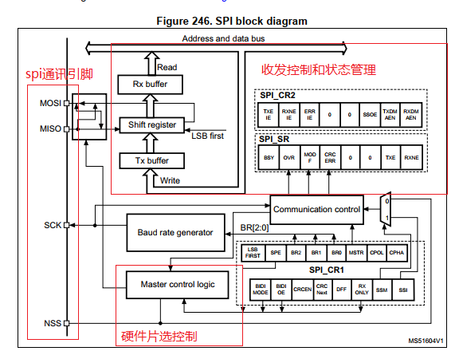
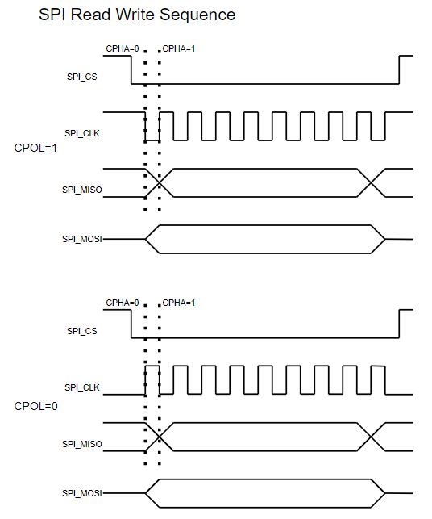
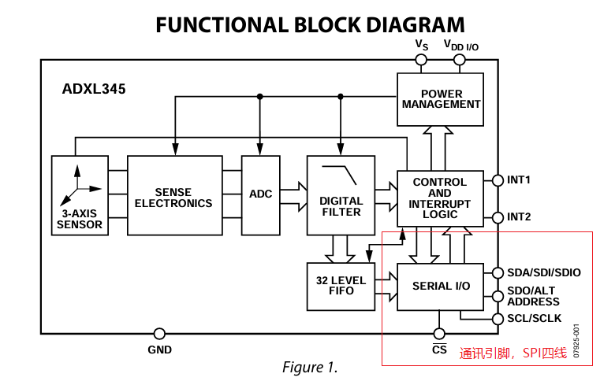
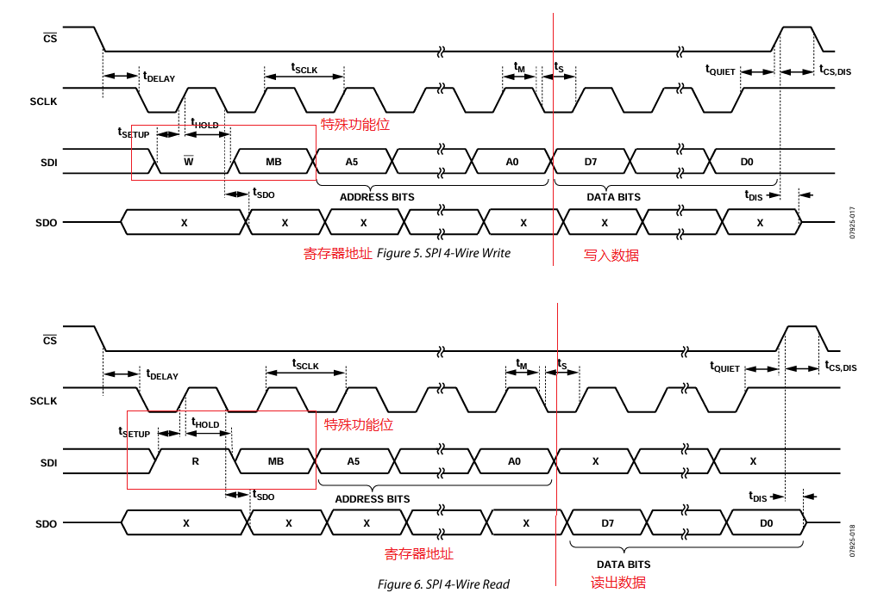
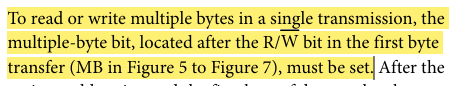
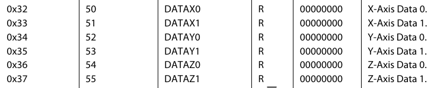

# 单片机总结系列(09) SPI通讯模块

SPI是4-wire全双工的通讯总线，可以用于芯片和芯片，芯片和器件之间的数据传输通讯。对于STM32的SPI接口，支持主从两种模式。

- 主模式时主要用于访问外部器件，常见的有SPI FLASH，3-axis传感器，adc芯片，当然也可以将SPI作为主从设备的通讯交互接口。
- 从模式则只能是被动器件，应答其它主SPI设备的通讯。

SPI设计上为主从结构，在工作时通过主机提供时钟触发信号，发送数据的同时从接收引脚上读取数据，同时实现数据接收和发送功能，因此为全双工模式。SPI设计上没有类似I2C的地址来区分从机设备，对于多从机的通讯，需要依赖CS引脚来选中芯片工作。当SPI总线上有多个芯片使能，写入不影响，但多从机读取时会发生总线竞争，有可能导致接收数据异常。当管理多个器件时，设计上需要每个芯片拥有独立的片选控制CS引脚。

- 片选CS，芯片使能控制脚，低电平有效居多，当CS为高时芯片不工作，可通过多个CS脚，控制芯片的开关从而实现SPI访问多个外部芯片
- 时钟CLK，时钟引脚，由主机发出，为主从机通讯提供同步时钟
- 主机输出接口(MOSI)，主机数据输出脚，配合Clock同步发出数据，从机接收
- 主机输入接口(MISO)，主机数据输入脚，根据Clock接收数据，从机发送

目录如下所示。

- [SPI通讯接口说明](#spi_interface)
- [SPI器件访问驱动](#spi_chip_rw)
  - [三轴传感器adxl345](#adxl345)
- [软件模拟实现SPI功能](#spi_soft_rw)
- [总结说明](#summary)
- [下一章节](#next_chapter)

本节配合例程: **code/09-STM32F429_SPI/project/stm32f429.uvprojx**

## spi_interface

SPI的框架如下所示。



对于STM32F4来说，SPI模块由4个引脚组成，分别是NSS(片选)，SCK(时钟)，MOSI(主输出)，MISO(主输入)。其中片选支持软件和硬件方式，对于硬件方式，会在发送数据时自动拉低，不过一般都选择软件方式，这样更方便驱动来进行管理。在内部通过一些寄存器，控制SPI的时钟，数据收发，实时显示SPI的工作状态。

SPI的通讯作为全双工的通讯协议，其时序图如下所示。



可以看到，对于SPI中最重要的两个参数是CPOL和CPHA，这两个参数的含义如下所示。

- CPOL表示空闲状态下时钟CLOCK的电平，0表示低电平，1表示高电平
- CPHA则表示接收端数据采样的边沿，0表示第一个边沿，1表示第二个边沿

当CPOL和CPHA确认后，即可确定下SPI通讯的时序。

理解了上面知识点，对于SPI驱动应该就能够有些了解。

- 工作模式，主机或者从机。
- 工作使用线缆数量，支持单线模式或者双线模式；双线模式就是上面独立的发送和接口引脚，全双工通讯。单线模式又包含两种，只发送/只接收的单向模式或者单线双向模式，此时为半双工的收发通讯。
- 通讯数据长度8/16bits，大部分情况为8bit模式，不过为了提高效率可以支持16bit模式单次发送。
- CPOL和CPHA配置，需要与器件的手册要求一致。
- NSS功能用于控制CS片选引脚输出和输入功能，设置为Soft可以作为普通引脚控制，也可以通过SSI位控制，硬件模式则作为主SPI时，在发送广播数据时会强制拉低NSS引脚。
- 另外是与数据通讯相关的参数配置，包含波特率，首位先发送，带CRC校验等，这些都是与具体器件有关，需要根据实际情况进行配置。

如此便是SPI需要了解的全部配置信息，对于STM32驱动中具体实现如下。

```c
SPI_HandleTypeDef hspi5;

//SPI硬件初始化
BaseType_t driver_spi_init(void)
{
    GPIO_InitTypeDef GPIO_InitStruct = {0};

    // 使能模块时钟
    __HAL_RCC_GPIOF_CLK_ENABLE();
    __HAL_RCC_SPI5_CLK_ENABLE();
    
    HAL_GPIO_WritePin(GPIOF, GPIO_PIN_6, GPIO_PIN_SET);

    // 配置模块对应引脚I/O
    GPIO_InitStruct.Pin = GPIO_PIN_7 | GPIO_PIN_8 | GPIO_PIN_9;
    GPIO_InitStruct.Mode = GPIO_MODE_AF_PP;
    GPIO_InitStruct.Pull = GPIO_PULLUP;
    GPIO_InitStruct.Speed = GPIO_SPEED_FREQ_VERY_HIGH;
    GPIO_InitStruct.Alternate = GPIO_AF5_SPI5;
    HAL_GPIO_Init(GPIOF, &GPIO_InitStruct);

    GPIO_InitStruct.Pin = GPIO_PIN_6;
    GPIO_InitStruct.Mode = GPIO_MODE_OUTPUT_PP;
    GPIO_InitStruct.Pull = GPIO_PULLUP;
    GPIO_InitStruct.Speed = GPIO_SPEED_FREQ_HIGH;
    HAL_GPIO_Init(GPIOF, &GPIO_InitStruct);

    // 模块具体功能配置
    hspi5.Instance = SPI5;
    hspi5.Init.Mode = SPI_MODE_MASTER;              // 主机模式
    hspi5.Init.Direction = SPI_DIRECTION_2LINES;    // 双线模式(发送和接收数据)
    hspi5.Init.DataSize = SPI_DATASIZE_8BIT;        // 8bit模式
    hspi5.Init.CLKPolarity = SPI_POLARITY_HIGH;     // CPOL Config:1，时钟空闲时为高电平
    hspi5.Init.CLKPhase = SPI_PHASE_2EDGE;          // CPHA Config:1, 数据采样在第二个时钟沿
    hspi5.Init.NSS = SPI_NSS_SOFT;                  // 片选功能为软件控制(硬件模式会在发送是拉低相应的片选引脚)
    hspi5.Init.BaudRatePrescaler = SPI_BAUDRATEPRESCALER_8; // SPI时钟，总线时钟八分频
    hspi5.Init.FirstBit = SPI_FIRSTBIT_MSB;         // 数据从高位开始发送
    hspi5.Init.TIMode = SPI_TIMODE_DISABLE;         // 是否TI数据模式(配置使能后强制兼容TI协议，极性和相位强制按照TI协议，配置无效)
    hspi5.Init.CRCCalculation = SPI_CRCCALCULATION_DISABLE;  // 禁止硬件CRC校验功能
    hspi5.Init.CRCPolynomial = 0;                   // CRC多项式，使能硬件CRC校验功能才有意义
    if (HAL_SPI_Init(&hspi5) != HAL_OK)
        return pdFAIL;

    return pdPASS;  
}
```

完成SPI的初始化配置，下一步进行SPI通讯接口的实现，SPI作为全双工的通讯接口，默认接口提供输入输出的实现，具体实现如下。

```c
#define SPI_RW_TIMEOUT  100

//SPI读写接口
uint8_t spi_rw_byte(uint8_t data, HAL_StatusTypeDef *err)
{
    uint8_t rx_data = 0xff;
    HAL_StatusTypeDef status;

    status = HAL_SPI_TransmitReceive(&hspi5, &data, &rx_data, 1, SPI_RW_TIMEOUT); 
    if (err != NULL) {
        *err = status;
    }
    return rx_data;
}
```

初始化完成后，使用spi_rw_byte即可进行数据通讯，可以说基于SPI实现单次数据收发十分简单。因此SPI的重点在于实现具体的驱动，这就和外部器件相关。

## spi_chip_rw

对于SPI来说，不只需要实现内部模块的驱动，还需要配合外部器件的说明书，实现相应的器件驱动；这就比一些MCU内部独立模块有了更多的要求。对于这类驱动，SPI的配置相当于实现总线的功能，然后操作器件实现具体的驱动，需要掌握更多的知识才能最终实现应用，这里基于典型的SPI应用，来理解SPI的工作方式。

## adxl345

ADXL345是一款用于测量加速度的三轴传感器，其是典型的四线SPI器件。

数据手册地址为：https://www.sparkfun.com/datasheets/Sensors/Accelerometer/ADXL345.pdf

其框图如下所示。



这个主要涉及硬件的连接，对于软件部分，我们更关心如何去读取ADXL345的加速度数据。这个就要去看手册中的读取波形说明，详细图形如下所示。



从上图可以看到，数据的格式如下"地址功能区 + 数据区"，其中地址功能区功能如下。

1. R(1)/W(0)位，表示读写，其中1表示读，0表示写。
2. MB位，用于指定多字节读取，其中0表示单字节，1表示多字节。
3. [A5:A0]位，用于指定寄存器地址。

其中MB的信息来自于文档说明如下。



另外重要的信息，就是内部寄存器的地址，这里最重要的就是0x32~0x37这六个寄存器，表示三轴数据信息。



基于这些信息，可以确定单个读写寄存器的代码如下所示。

```c
// 单字节读取
int adxl345_single_read(uint8_t reg_addr, uint8_t *data) 
{
    HAL_StatusTypeDef status;

    reg_addr |= 0x80; // 设置读位

    ADXL345_CS_LOW;
    status = HAL_SPI_Transmit(&hspi5, &reg_addr, 1, 10);    // 发送寄存器地址和读功能位
    if (status != HAL_OK) {
        return -1;
    }

    status = HAL_SPI_Receive(&hspi5, data, 1, 10);          // 接收数据
    if (status != HAL_OK) {
        return -1;
    }
    ADXL345_CS_HIGH;
    return 0;
}

// 单字节写入
int adxl345_single_write(uint8_t reg_addr, uint8_t data) 
{
    HAL_StatusTypeDef status;

    reg_addr &= 0x7F; // 清除读位

    ADXL345_CS_LOW;
    status = HAL_SPI_Transmit(&hspi5, &reg_addr, 1, 10);    // 发送寄存器地址和写功能位
    if (status != HAL_OK) {
        return -1;
    }
    status = HAL_SPI_Transmit(&hspi5, &data, 1, 10);          // 发送数据
    if (status != HAL_OK) {
        return -1;
    }
    ADXL345_CS_HIGH;
    return 0;
}

// 读取x,y,z轴数据
int drv_adxl345_single_read(int16_t *Data_X, int16_t *Data_Y, int16_t *Data_Z)
{
    uint8_t data[6];
    uint8_t reg_addr = 0x32;
    uint8_t index;
    
    for (index = 0; index < 6; index++) {
        if (!adxl345_single_read(reg_addr + index, &data[index])) {
            return -1;
        }
    }

    *Data_X = (data[0] << 8) | data[1];
    *Data_Y = (data[2] << 8) | data[3];
    *Data_Z = (data[4] << 8) | data[5];
    return 0;
}
```

另外一个就是多字节读取的接口，具体实现如下：

```c
// 支持连续读取的实现
int drv_adxl345_multi_read(int16_t *Data_X, int16_t *Data_Y, int16_t *Data_Z)
{
    HAL_StatusTypeDef status;
    uint8_t addr = 0x32;
    uint8_t buffer[6];

    ADXL345_CS_LOW;
    addr |= 0xC0; // 连续读取数据(RW和MB位)
	status = HAL_SPI_Transmit(&hspi5, &addr, 1, 100);        // 发送寄存器地址和读写功能位，多字节处理位
    if (status != HAL_OK) {
        return -1;
    }
    status = HAL_SPI_Receive(&hspi5, buffer, 6, 100);        // 接收6字节数据
    if (status != HAL_OK) {
        return -1;
    }
    ADXL345_CS_HIGH;

    *Data_X = (buffer[1] << 8) | buffer[0];
    *Data_Y = (buffer[3] << 8) | buffer[2];
    *Data_Z = (buffer[5] << 8) | buffer[4];
    return 0;
}
```

参考手册就实现了ADXL345的读写操作，详细实现可参考配套代码。对于这类外部器件，如何理解文档实现代码才是关键，需要去了解如下信息。

1. 硬件接口和内部框图，一个涉及PCB设计，另一个在软件开发中可以分析问题。
2. 通讯时序图，软件实现需要满足此时序才能正确工作，在开发时需要判断软件能否时序时序。
3. 寄存器和特殊功能位，寄存器影响芯片配置和数据读取，特殊功能则可能是芯片特有功能，如果通讯失败，可以判断是否是未设置相应特殊功能位。

## spi_soft_rw

目前大部嵌入式芯片都支持2~3路SPI接口，但实际应用中因为硬件电路限制，往往可能无法将SPI器件连接到硬件的SPI接口，这就需要由I/O来模拟SPI的实现，下面以配置CPOL=0，CPHA=0为例讲解软件实现的时序。

1. 将SPI时钟下拉，从高位到低位设置MOSI的值
2. 拉高SPI的时钟，同时从第一个边沿后读取数据
3. 循环执行8次，写入8bit数据，同时读取8bit数据
4. 将SPI的时钟拉低，结束一个Byte的数据读取

基于上述流程，实现接口如下.

```c
#define SPI_SCK_H()         HAL_GPIO_WritePin(spi_info_ptr->sck_port, spi_info_ptr->sck_pin, GPIO_PIN_SET)
#define SPI_SCK_L()         HAL_GPIO_WritePin(spi_info_ptr->sck_port, spi_info_ptr->sck_pin, GPIO_PIN_RESET)
#define SPI_MOSI_H()        HAL_GPIO_WritePin(spi_info_ptr->mosi_port, spi_info_ptr->mosi_pin, GPIO_PIN_SET)
#define SPI_MOSI_L()        HAL_GPIO_WritePin(spi_info_ptr->mosi_port, spi_info_ptr->mosi_pin, GPIO_PIN_RESET)
#define SPI_MISO_INPUT()    (HAL_GPIO_ReadPin(spi_info_ptr->miso_port, spi_info_ptr->miso_pin) == GPIO_PIN_SET)

static void spi_delay(uint32_t count)
{
    unsigned int i, j;

    for(i=0; i<count; i++)
    {
        for(j=0; j<3; j++)
        {
        }
    }    
}

//spi引脚初始化
uint8_t spi_soft_init(uint8_t soft_spi_num, SOFT_SPI_INFO *info_ptr)
{
    GPIO_InitTypeDef GPIO_InitStruct = {0};

    if(soft_spi_num >= SOFT_SPI_NUM)
        return SPI_ERROR;
    
    if(is_spi_init[soft_spi_num])
    {
        //spi already init, use same pin
        //support spi with mutliple external device.
        if(memcmp((char *)info_ptr, (char *)&spi_list[soft_spi_num], sizeof(SOFT_SPI_INFO)) != 0)
        {
            return SPI_ERROR;
        }
        return SPI_OK;
    }  
    
    is_spi_init[soft_spi_num] = 1;
    
    spi_info_ptr = &spi_list[soft_spi_num];
    memcpy((char *)spi_info_ptr, (char *)info_ptr, sizeof(SOFT_SPI_INFO));
    
    SPI_MOSI_H();
    if(spi_info_ptr->mode == SPI_MODE_CPOL_H_CPHA_1
    || spi_info_ptr->mode == SPI_MODE_CPOL_H_CPHA_2)
    {
        SPI_SCK_H();
    }
    else
    {
        SPI_SCK_L();
    }
    
    //sck choose
    GPIO_InitStruct.Pin = spi_info_ptr->sck_pin;
    GPIO_InitStruct.Mode = GPIO_MODE_OUTPUT_PP;
    GPIO_InitStruct.Pull = GPIO_NOPULL;
#ifdef GPIO_SPEED_FREQ_VERY_HIGH
    GPIO_InitStruct.Speed = GPIO_SPEED_FREQ_VERY_HIGH;
#else
    GPIO_InitStruct.Speed = GPIO_SPEED_FREQ_HIGH;
#endif
    HAL_GPIO_Init(spi_info_ptr->sck_port, &GPIO_InitStruct);
    
    //mosi
    GPIO_InitStruct.Pin = spi_info_ptr->mosi_pin;
    HAL_GPIO_Init(spi_info_ptr->mosi_port, &GPIO_InitStruct);   

    //miso
    GPIO_InitStruct.Pin = spi_info_ptr->miso_pin;
    GPIO_InitStruct.Mode = GPIO_MODE_INPUT;
    GPIO_InitStruct.Pull = GPIO_NOPULL;
    HAL_GPIO_Init(spi_info_ptr->miso_port, &GPIO_InitStruct);      
    return SPI_OK;
}

//SPI_MODE_CPOL_L_CPHA_1
static uint8_t spi_soft_rw_byte_phase_0(SOFT_SPI_INFO* spi_info_ptr, uint8_t data)
{
    uint8_t index;
    uint8_t rdata = 0;
    
    for (index=0; index<8; index++) {
        SPI_SCK_L();
        
        if (data & 0x80) {
            SPI_MOSI_H();
        } else {
            SPI_MOSI_L();
        }
        data <<= 1;                 //msb first
        spi_delay(SPI_DELAY_COUNT);
        
        SPI_SCK_H();                //default is low, the first edge
        rdata <<= 1;
        rdata |= SPI_MISO_INPUT();  //lock the rx data
        
        spi_delay(SPI_DELAY_COUNT);
    }
    
    SPI_SCK_L();
    return rdata;
}

//SPI_MODE_CPOL_L_CPHA_2
static uint8_t spi_soft_rw_byte_phase_1(SOFT_SPI_INFO* spi_info_ptr, uint8_t data)
{
    uint8_t index;
    uint8_t rdata = 0;
    
    for (index=0; index<8; index++) {
        SPI_SCK_H();              
        
        if(data & 0x80) {
            SPI_MOSI_H();
        } else {
            SPI_MOSI_L();
        }
        data <<= 1;                
        spi_delay(SPI_DELAY_COUNT);
        
        SPI_SCK_L();       //default is low, the second edge         
        rdata <<= 1;
        rdata |= SPI_MISO_INPUT();  
        
        spi_delay(SPI_DELAY_COUNT);
    }
    
    SPI_SCK_L();
    return rdata;    
}

//SPI_MODE_CPOL_H_CPHA_1
static uint8_t spi_soft_rw_byte_phase_2(SOFT_SPI_INFO* spi_info_ptr, uint8_t data)
{
    uint8_t index;
    uint8_t rdata = 0;

    for (index=0; index<8; index++) {
        SPI_SCK_H();
        if(data & 0x80) {
            SPI_MOSI_H();
        } else {
            SPI_MOSI_L();
        }
        data <<= 1;               
        spi_delay(SPI_DELAY_COUNT);
        
        SPI_SCK_L();                //default is high, the first edge       
        rdata <<= 1;
        rdata |= SPI_MISO_INPUT();  //lock the rx data
        
        spi_delay(SPI_DELAY_COUNT);
    }
    
    SPI_SCK_H();
    return rdata;
}

//SPI_MODE_CPOL_H_CPHA_2
static uint8_t spi_soft_rw_byte_phase_3(SOFT_SPI_INFO* spi_info_ptr, uint8_t data)
{
    uint8_t index;
    uint8_t rdata = 0;
    
    for (index=0; index<8; index++) {
        SPI_SCK_L();                   
        if (data & 0x80) {
            SPI_MOSI_H();
        } else {
            SPI_MOSI_L();
        }
        data <<= 1;                
        spi_delay(SPI_DELAY_COUNT);
        
        SPI_SCK_H();                //default is high, the second edge   
        rdata <<= 1;
        rdata |= SPI_MISO_INPUT();   //lock the rx data
        
        spi_delay(SPI_DELAY_COUNT);
    }
    
    SPI_SCK_H();
    return rdata;    
}

typedef uint8_t (*spi_rw_func)(SOFT_SPI_INFO*, uint8_t);

uint8_t spi_soft_rw_byte(uint8_t soft_spi_num, uint8_t *wdata, uint8_t *rdata, uint8_t size)
{
    uint8_t index;
    SOFT_SPI_INFO* spi_info_ptr;
    
    if(soft_spi_num >= SOFT_SPI_NUM)
        return SPI_ERROR;
       
    if(!is_spi_init[soft_spi_num])
        return SPI_ERROR;
    
    spi_info_ptr = &spi_list[soft_spi_num];
    spi_rw_func pfunc = spi_soft_rw_byte_phase_0;
    
    switch(spi_list[soft_spi_num].mode)
    {
        case SPI_MODE_CPOL_L_CPHA_1:
            pfunc = spi_soft_rw_byte_phase_0;
            break;
        case SPI_MODE_CPOL_L_CPHA_2:
            pfunc = spi_soft_rw_byte_phase_1;
            break;
        case SPI_MODE_CPOL_H_CPHA_1:
            pfunc = spi_soft_rw_byte_phase_2;
            break;
        case SPI_MODE_CPOL_H_CPHA_2:
            pfunc = spi_soft_rw_byte_phase_3;
            break;
    }
    
    if (rdata == NULL && wdata == NULL) {
        return SPI_ERROR;
    } else if (rdata == NULL){
        //only wrtie
        for (index=0; index<size; index++) {
            pfunc(spi_info_ptr, wdata[index]);
        }
    } else if(wdata == NULL) {
        //only read
        for (index=0; index<size; index++) {
            rdata[index] = pfunc(spi_info_ptr, 0xff);
        }
    } else {      
        for(index=0; index<size; index++) {
            rdata[index] = pfunc(spi_info_ptr, wdata[index]);
        } 
    }
    return SPI_OK;
}
```

在根据器件的需求，选择对应的接口来读取访问；如此便实现软件模拟的SPI接口。

## summary

至此，关于SPI模块功能说明告一段落。但这些知识只能算入门去了解SPI接口，在实际产品中，支持SPI的接口的如ADC，FLASH，加速度计等芯片，在读取数据后需要进一步处理才能应用到工程开发中，这就需要通过实践去积累总结。

## next_chapter

[返回目录](./../README.md)

直接开始下一小节: [ch10.I2C通讯模块](./ch10.i2c_com.md)
