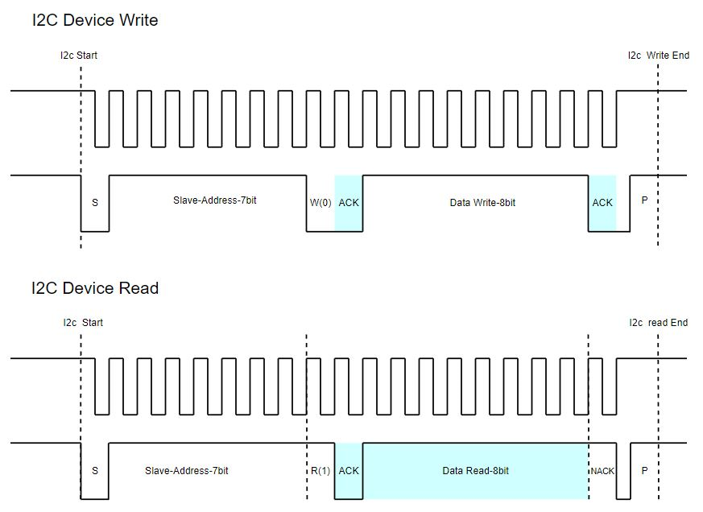
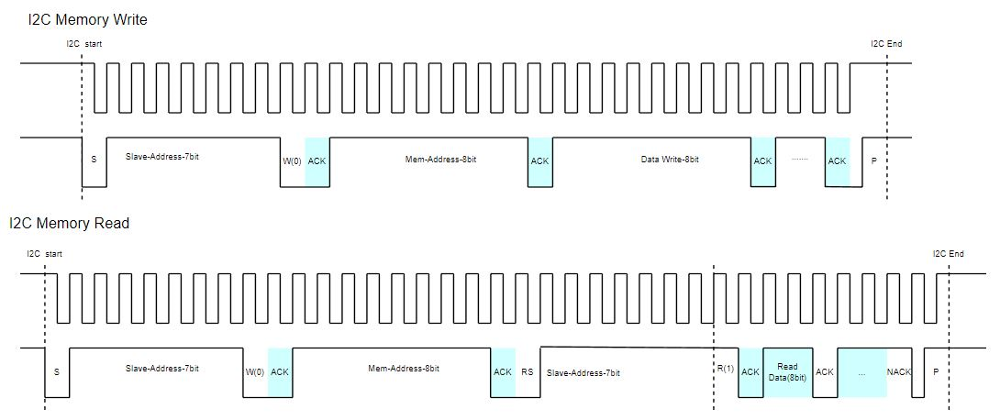
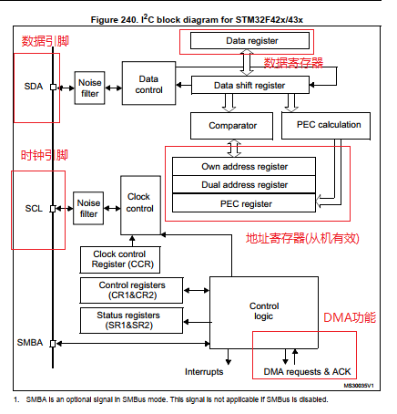
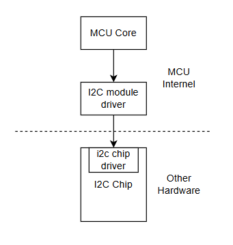
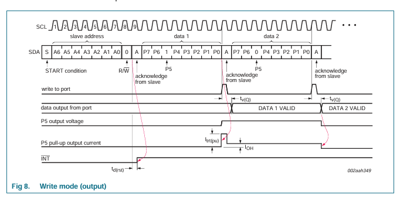
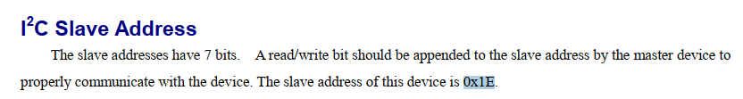
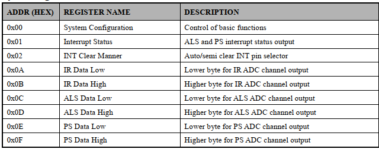

# 单片机技术总结说明(10) I2C通讯模块

I2C是嵌入式中重要通讯接口之一，是嵌入式设备间与外部芯片连接的最常用的接口通道。在开发过的产品中，就遇到过EPPROM芯片AT24C0x系列，支持I/O扩展的PCF8574，光电传感器芯片AP3216c和锂电管理芯片BQ24780S等，这些都使用I2C作为通讯接口。

I2C支持多主多从的设备结构，通过**设备地址**区分，与主设备请求地址不同的设备不会响应主机请求；这样在总线上同时只有一对一的芯片通讯，可以挂载多个不同设备地址的设备。当然，这也要求**总线上不能有两个相同地址的从设备**，否则会导致数据状态异常。当然如果有需要一路i2c扩展使用多路相同地址的设备，可以使用TCA9546A这类多路切换开关进行选择使用。

I2C的器件默认为**开漏模式，需要通过外部上拉电阻实现高电平输出**，从而满足不同长度距离的传输要求。不过I2C更多适用与板级器件或芯片间的通讯。对于长距离通讯，需要外部电路去增强总线(如两端增加电平转换芯片)，避免误码和错帧问题。同时也需要注意I2C的时钟线和数据线需要增加滤波电容，避免干扰。

本节目录如下所示。

- [i2c协议说明](#i2c_protocol)
- [i2c框架和接口驱动](#i2c_frame)
- [i2c器件读写实现](#i2c_chip_rw)
  - [pcf8574器件说明](#pcf8574)
  - [ap3216c器件说明](#ap3216c)
- [i2c软件模拟实现](#soft_i2c_app)
- [总结说明](#summary)
- [下一章节](#next_chapter)

本节配合例程: **code/10-STM32F429_I2C/project/stm32f429.uvprojx**

## i2c_protocol

I2C整个通讯协议由起始条件、终止条件、和中间的数据帧构成，这些条件和数据帧是以SCL和SDA上的电平组合实现的。在功能上则由I2C硬件模块处理来实现。

1. 起始条件(star bit)：由主机发起，在SCL为高电平时，拉低SDA，此时告知I2C通讯启动。
2. 终止条件(stopbit)：由主机发起，当SCL为高电平时，拉高SDA，此时告知I2C通讯停止。
3. 数据帧(databits)，数据帧作为设备之间交互的格式，以字节为基本单位进行发送；其中高位在前(MSB)，低位在后(LSB)。数据传递完毕后，接收端从机数据SDA进入等待状态，另一端拉低作为ACK信号。另外数据帧根据场景和功能的不同，可以分为设备地址，存储地址和实际数据等不同类型。

这三部分共同构成完整的I2C通讯协议。由主机通过起始条件发起，基于设备地址建立设备间连接，然后进行数据交互，并最终由主机发送终止条件结束通讯，这就是I2C通讯的实现流程。

在实际应用中，因为器件的功能需求不同，有些只支持直接的数据通讯，不需要地址的配置，设计比较简单，这一类设备的通讯格式如下所示。



对于上图中，蓝色为从机回复的信号，其它为主机发送的信号。可以看到，**由起始位(S)，设备地址(Slave Addr)，数据，结束信号(P)构成I2C的数据通讯格式**，在通讯中每8bit数据后，对于主机来说，发送时需要检测从机应答的ACK信号，接收时需要发送ACK或NACK信号，来实现设备间的应答处理，这里只展示了7bit数据的设备，有设备为10bit地址，这时就需要2个字节的从机地址进行传输，其它并没有区别，这里不在赘述。像上图的设备操作简单，不需要配置，直接进行数据读取即可工作，像PCF8574，TCA9546使用该方式即可完成通讯。

**PS: ACK和NACK都用于告知接收端8bit数据接收完成，不过NACK用于主机通知从机结束数据读取，因此只在I2C通讯的读取模式末尾由主机发送**。



对于上图中I2C器件因为内部有寄存器表，寄存器需要先定位才能进行数据操作；除了设备地址外，就还需要寄存器地址用于选定存储进行读写。这类器件的通讯由**起始条件(S)，从机设备地址，从机存储地址，数据，结束条件(P)构成发送数据格式**，不过对于接收数据格式则不同，需要是先写入再读取，此时结构为:**结构为起始条件(S)，从机设备地址，设备存储地址选中要读取的内容，再通过RS信号(S)，从机设备地址读取后续的内容，并通过停止条件接收通讯**。涉及的AT24C0x，BQ24780S都是基于这类格式进行通讯，在驱动开发的过程中需要注意。

## i2c_frame

STM32的的I2C框架如下所示。



I2C作为两线制的通讯数据接口，由SCL和SDA构成主从的收发数据结构。

- SCL时钟信号，只能由主机提供，当需要数据收发时产生对应的翻转信号。
- SDA为数据信号，根据所处状态的不同可以置为输入或输出状态，实现数据收发，所以I2C也是半双工接口协议。

对于STM32来说，具有如下特点。

1. 通讯速率上支持标准速度模式(100Khz)和快速模式(400Khz)；不过在实际使用中要根据器件支持得最大速率进行选择。
2. 支持7bit和10bit地址寻址模式，对于7bit地址，低位补0/1表示读写，10bit地址则需要2个字节进行传输。
3. 支持主从模式，主设备可以发起通讯，从设备则需要等待主设备的指令，另外作为从机时可以支持两个设备寄存器地址进行访问。
4. 支持模拟和数字滤波，可以有效抑制干扰信号，提高通讯的稳定性。

了解了I2C的协议机制，使用STM32的HAL库实现I2C主机通讯就比较简单了；这里实现I2C作为主机的实现流程，具体内容如下所示。

1. I2C和GPIO的时钟初始化。
2. 将GPIO配置为I2C复用开漏模式，并建立I2C的关系。
3. 配置I2C的功能，主要包含速度，时钟占空比，滤波功能等。
4. 调用I2C接口，完成数据的通讯收发。

基于HAL库的I2C模式初始化配置代码如下。

```c
// i2c模块硬件初始化
GlobalType_t drv_i2c_init(void)
{

    GPIO_InitTypeDef GPIO_InitStruct = {0};

    // 使能模块时钟
    __HAL_RCC_I2C2_CLK_ENABLE();
    __HAL_RCC_GPIOH_CLK_ENABLE();

    // 配置i2c对应得gpio引脚
    GPIO_InitStruct.Pin = GPIO_PIN_4|GPIO_PIN_5;
    GPIO_InitStruct.Mode = GPIO_MODE_AF_OD;
    GPIO_InitStruct.Pull = GPIO_NOPULL;
    GPIO_InitStruct.Speed = GPIO_SPEED_FREQ_VERY_HIGH;
    GPIO_InitStruct.Alternate = GPIO_AF4_I2C2;
    HAL_GPIO_Init(GPIOH, &GPIO_InitStruct);

    // 配置i2c模块功能
    hi2c2.Instance = I2C2;
    hi2c2.Init.ClockSpeed = 100000;                         // I2C时钟速度，100K
    hi2c2.Init.DutyCycle = I2C_DUTYCYCLE_2;                 // I2C时钟占空比
    hi2c2.Init.AddressingMode = I2C_ADDRESSINGMODE_7BIT;    // 7bit地址模式(主机模式控制访问从机地址宽度)
    hi2c2.Init.DualAddressMode = I2C_DUALADDRESS_DISABLE;
    hi2c2.Init.OwnAddress1 = 0;                             // 0 主机模式不需要考虑地址
    if (HAL_I2C_Init(&hi2c2) != HAL_OK) {
        return RT_FAIL;
    }

    // signal -> analog -> Digital -> i2c module, if enable, and not 
    // fit the bill, the signal will be cast off.
    // 过滤模拟噪声
    if (HAL_I2CEx_ConfigAnalogFilter(&hi2c2, I2C_ANALOGFILTER_ENABLE) != HAL_OK) {
        return RT_FAIL;
    }

    //filter digital noise, 0 not enable, 1~15, filter clock lower than
    //n*T_I2C_Clock, if enable, and peroid lower than n*T_I2C_Clock signal 
    //will not transfer to i2c module.
    if (HAL_I2CEx_ConfigDigitalFilter(&hi2c2, 0) != HAL_OK){
        return RT_FAIL;
    }

    return RT_OK; 
}
```

如此便完成了MCU内部对I2C硬件的配置；对于I2C功能的实现，则由以下接口实现。

```c
// 用于内部不带memory的i2c设备读写接口，仅支持直接读取数据，不需要选择地址再读取
// 基于I2c设备写数据接口
// @hi2c: i2c硬件结构句柄
// @DevAddress: 器件地址
// @pData: 发送数据首地址
// @Size: 发送数据长度
// @Timeout: 超时时间(单位ms)
HAL_StatusTypeDef HAL_I2C_Master_Transmit(I2C_HandleTypeDef *hi2c, uint16_t DevAddress, uint8_t *pData, uint16_t Size, uint32_t Timeout);

// 基于I2c设备写数据接口
// @hi2c: i2c硬件结构句柄
// @DevAddress: 器件地址
// @pData: 读取数据首地址
// @Size: 读取数据长度
// @Timeout: 超时时间(单位ms)
HAL_StatusTypeDef HAL_I2C_Master_Receive(I2C_HandleTypeDef *hi2c, uint16_t DevAddress, uint8_t *pData, uint16_t Size, uint32_t Timeout);

// 用于内部带memory的i2c设备读写接口，需要先选择memory地址，再进行数据读写
// 基于I2c设备写数据接口
// @hi2c: i2c硬件结构句柄
// @DevAddress: 器件地址
// @MemAddress: 内存地址
// @MemAddSize: 内存地址长度，1byte or 2byte
// @pData: 发送数据首地址
// @Size: 发送数据长度
// @Timeout: 超时时间(单位ms)
HAL_StatusTypeDef HAL_I2C_Mem_Write(I2C_HandleTypeDef *hi2c, uint16_t DevAddress, uint16_t MemAddress, uint16_t MemAddSize, uint8_t *pData, uint16_t Size, uint32_t Timeout);

// 基于I2c设备写数据接口
// @hi2c: i2c硬件结构句柄
// @DevAddress: 器件地址
// @MemAddress: 内存地址
// @MemAddSize: 内存地址长度，1byte or 2byte
// @pData: 读取数据首地址
// @Size: 读取数据长度
// @Timeout: 超时时间(单位ms)
HAL_StatusTypeDef HAL_I2C_Mem_Read(I2C_HandleTypeDef *hi2c, uint16_t DevAddress, uint16_t MemAddress, uint16_t MemAddSize, uint8_t *pData, uint16_t Size, uint32_t Timeout);
```

当然还有在这基础上扩展支持的中断，DMA工作模式，这里就不再展开；除了EPPROM外，大部分I2C器件只是读取几个字节，一般不需要使用中断或DMA进行数据传输，直接使用上述接口即可。

## hw_i2c_chip

对于器件来说，主要实现i2作为主机的通讯接口即可, 这部分就是我们常说的器件驱动。最初的时候我也没把器件驱动和i2c模块驱动主观上区分开来，设计上耦合在一起；如果只是一两个器件还好，当i2c总线上逐渐挂载增多后，就发现这种实现方式臃肿；反而独立开来更容易理解。

关于i2c器件和设备的框图如下所示。



### pcf8574

对于PCF8574来说，其属于简单的I/O扩展器件。其内部没有寄存器表，只有一个8位的数据寄存器，用于存储I/O端口的状态。

其芯片手册地址可参考: https://www.nxp.com/docs/en/data-sheet/PCF8574_PCF8574A.pdf

对于I2C器件来说，关键的信息有三部分，分别是器件地址、通讯时序和寄存器内数据功能。

以pcf8574为例，其器件地址如下所示。


可以看到器件地址为0x20, 且最低位为读写位，0表示写，1表示读。实际地址为："(0x20<<1) | rw"。

通讯时序以写入为例，如下所示。



支持直接连续更新数据，则其操作接口如下所示。

```c
//PCF8574, i2c device
#define PCF8574_I2C_TIMEOUT     10
#define PCF8574_ADDR            0x20
BaseType_t pcf8574_i2c_write(uint8_t data)
{
    if (HAL_I2C_Master_Transmit(&hi2c2, PCF8574_ADDR<<1 | 0x00, &data, 1, PCF8574_I2C_TIMEOUT) != HAL_OK)
        return pdFAIL;

    return pdPASS;
}

BaseType_t pcf8574_i2c_read(uint8_t *pdata)
{
    if (HAL_I2C_Master_Receive(&hi2c2, PCF8574_ADDR<<1 | 0x01, pdata, 1, PCF8574_I2C_TIMEOUT) != HAL_OK)
        return pdFAIL;
    
    return pdPASS;
}
```

### ap3216c

对于ap3216c来说，则是上面提到需要访问内部寄存器地址的i2c设备。ap3216c是一个光和距离传感器，内部寄存器支持寻址读写，需要先写入寄存器地址，再读写数据。对于i2c芯片来说，比较关键的知识点有以下几点。

- 作为i2c设备的设备地址，这里是0x1e。



- i2c设备读写通讯时序。


这里展示了写入寄存器的时序，按照顺序写入设备地址、寄存器地址、寄存器数据(即为写入数据)；可以看到ap3216c单次写入只能一个字节，不支持多字节写入。其读取也类似，需要在实现代码时注意。

- i2c器件内部的寄存器功能，这里注意是配置和数据相关的寄存器。



可以看到0x00为系统配置寄存器，0x0A~0x0F为数据寄存器，包含距离、光强度、红外强度数据。基于上述信息，实现ap3216c的访问的器件代码如下所示。

```c
//AP3216, i2c device
#define AP3216C_ADDR            0x1e
#define AP3216C_TIMEOUT         10

#define AP3216C_SYSTEMCONG	    0x00
#define AP3216C_IRDATALOW	    0x0A

GlobalType_t ap3216_driver_init(void)
{
    GlobalType_t res;
    
    HAL_Delay(10);
    
    res = ap3216_reg_write(AP3216C_SYSTEMCONG, 0x03);   //config the ALS+PS+LR
    if (res != RT_OK)  
    {   
        i2c2_driver_init(1);
        return RT_FAIL;
    }
    
    PRINT_LOG(LOG_INFO, HAL_GetTick(), "ap3216 init success!");
    return RT_OK;  
}

// 寄存器写接口
GlobalType_t ap3216_reg_write(uint8_t reg, uint8_t data)
{
    return ap3216_i2c_multi_write(reg, &data, 1);
}

//AP3216, i2c memory device
BaseType_t ap3216_i2c_multi_write(uint8_t reg, uint8_t *data, uint8_t size)
{
    uint8_t res;
    
    res = HAL_I2C_Mem_Write(&hi2c2, AP3216C_ADDR<<1, reg, 1, data, size, AP3216C_TIMEOUT);  
    
    if (res != HAL_OK)
        return pdFAIL;
    
    return pdPASS;
}

BaseType_t ap3216_i2c_multi_read(uint8_t reg, uint8_t *rdata, uint8_t size)
{
    uint8_t res;
    
    res = HAL_I2C_Mem_Read(&hi2c2, AP3216C_ADDR<<1, reg, 1, rdata, size, AP3216C_TIMEOUT);  
    
    if (res != HAL_OK)
        return pdFAIL; 
    
    return pdPASS;
}

void ap3216_loop_run_test(void)
{
    uint8_t buf[6];
    uint8_t index;
    uint8_t is_read_ok = 0;
    AP3216C_INFO ap3216_info; 

    is_read_ok = 1;

    // 读取寄存器数据
    for (index=0; index<6; index++) {
        if (ap3216_i2c_multi_read(AP3216C_IRDATALOW+index, &buf[index], 1) != RT_OK)  {
            is_read_ok = 0;
            PRINT_LOG(LOG_INFO, HAL_GetTick(), "ap3216c i2c device read failed.");
            break;
        }
    }

    // 赋值到相应状态中
    if(is_read_ok == 1) {
        if(buf[0]&(1<<7)) 	
            ap3216_info.ir = 0;					
        else 			
            ap3216_info.ir = (((uint16_t)buf[1])<< 2) | (buf[0]&0X03); 			

        ap3216_info.als = ((uint16_t)buf[3]<<8) | buf[2];

        if(buf[4]&(1<<6))	
            ap3216_info.ps = 0;    													
        else 				
            ap3216_info.ps = ((uint16_t)(buf[5]&0X3F)<<4)|(buf[4]&0X0F);

        PRINT_LOG(LOG_INFO, HAL_GetTick(), "ap3216c info:%d, %d, %d.", ap3216_info.ir, ap3216_info.als, ap3216_info.ps);
    }    
}
```

实现上述驱动接口后，在应用中即可调用相应接口实现读写功能。

## soft_i2c_app

对于软件I2C, 是通过GPIO实现的模拟I2c主设备电平的应用, 根据功能需求的不同, 需要实现如下接口.

```c
//检查i2c空闲状态(i2c默认要高电平)
i2c_idle_check();

//启动条件
i2c_start()

//发送字节数据
i2c_send_byte(byte)

//等待ACK信号
i2c_wait_ack

//读取字节数据
i2c_read_byte()

//发送应答NACK信号
i2c_send_nack()

//发送应答ACK信号
i2c_send_ack()
```

基于上述接口, 就可以组合成上面类似的收发接口, 具体如下.

```c
//device write interface
uint8_t i2c_write_device(uint8_t soft_i2c_num, uint8_t addr, uint8_t *data, uint16_t size)
{
    uint16_t index;
    SOFT_I2C_INFO *i2c_info_ptr;
    
    if (soft_i2c_num >= SOFT_I2C_NUM) {
        return I2C_ERROR;
    }
    
    if (!is_i2c_init[soft_i2c_num]) {
        return I2C_ERROR;
    }
    
    i2c_info_ptr = &i2c_list[soft_i2c_num];
   
    //0.i2c idle check must high.
    if (i2c_idle_check(i2c_info_ptr)) {
       return I2C_ERROR; 
    }

    //1. send start
    i2c_start(i2c_info_ptr);

    //2. send the address
    i2c_send_byte(i2c_info_ptr, addr&0xfe);  //the bit0 is w, must 0
    if (i2c_wait_ack(i2c_info_ptr)) {
        i2c_stop(i2c_info_ptr);
        return I2C_ERROR;
    }

    //3. send the data
    for (index=0; index<size; index++) {
        i2c_send_byte(i2c_info_ptr, data[index]);
        if (i2c_wait_ack(i2c_info_ptr)) {
            i2c_stop(i2c_info_ptr);
            return I2C_ERROR;
        }
    }
    
    //4. send the stop
    i2c_stop(i2c_info_ptr);

    i2c_delay(I2C_DELAY_COUNT);
    return I2C_OK;     
}

//device read interface
uint8_t i2c_read_device(uint8_t soft_i2c_num, uint8_t addr, uint8_t *rdata, uint16_t size)
{
    uint16_t index;
    SOFT_I2C_INFO *i2c_info_ptr;
    
    if (soft_i2c_num >= SOFT_I2C_NUM) {
        return I2C_ERROR;
    }
    
    if (!is_i2c_init[soft_i2c_num]) {
        return I2C_ERROR;
    }
    
    i2c_info_ptr = &i2c_list[soft_i2c_num];
    
    //0.i2c idle check must high.
    if (i2c_idle_check(i2c_info_ptr)) {
       return I2C_ERROR; 
    }

    //1. send start
    i2c_start(i2c_info_ptr);

    //2. send the address
    i2c_send_byte(i2c_info_ptr, addr|0x01);  //the bit0 is r, must 1
    if (i2c_wait_ack(i2c_info_ptr)) {
        i2c_stop(i2c_info_ptr);
        return I2C_ERROR;
    }

    //3. read the data
    for (index=0; index<size; index++) {
        if (index != size-1) {
            rdata[index] = i2c_read_byte(i2c_info_ptr, 1);
        } else {
            rdata[index] = i2c_read_byte(i2c_info_ptr, 0);
        }
    }

    //4. send the stop
    i2c_stop(i2c_info_ptr);
    return I2C_OK;     
}

//memory wrtie interface
uint8_t i2c_write_memory(uint8_t soft_i2c_num, uint8_t addr, uint32_t mem_addr, uint8_t mem_size, uint8_t *data, uint16_t size)
{
    uint16_t index;
    SOFT_I2C_INFO *i2c_info_ptr;
    
    if (soft_i2c_num >= SOFT_I2C_NUM) {
        return I2C_ERROR;
    }
    
    if (!is_i2c_init[soft_i2c_num]) {
        return I2C_ERROR;
    }
    
    i2c_info_ptr = &i2c_list[soft_i2c_num];
    
    //0.i2c idle check must high.
    if (i2c_idle_check(i2c_info_ptr)) {
       return I2C_ERROR; 
    }

    //1. send start
    i2c_start(i2c_info_ptr); 
    
    //2. send the address
    i2c_send_byte(i2c_info_ptr, addr&0xfe);  //the bit0 is w, must 0   
    if (i2c_wait_ack(i2c_info_ptr)) {
        i2c_stop(i2c_info_ptr);
        return I2C_ERROR;
    }

    //3. send the memory address(memory addr can be 2/4byte for epprom)
    for (index=0; index<mem_size; index++) {
        uint8_t mem = (mem_addr>>((mem_size - index - 1)*8))&0xff; //high byte first
        i2c_send_byte(i2c_info_ptr, mem);  
        if (i2c_wait_ack(i2c_info_ptr)) {
            i2c_stop(i2c_info_ptr);
            return I2C_ERROR;
        }
    }
    
    //3. send the data
    for (index=0; index<size; index++) {
        i2c_send_byte(i2c_info_ptr, data[index]);
        if (i2c_wait_ack(i2c_info_ptr)) {
            i2c_stop(i2c_info_ptr);
            return I2C_ERROR;
        }
    }
    
    //4. send the stop
    i2c_stop(i2c_info_ptr);

    i2c_delay(I2C_DELAY_COUNT);
    return I2C_OK;
}

//memory read interface
uint8_t i2c_read_memory(uint8_t soft_i2c_num, uint8_t addr, uint32_t mem_addr, uint8_t mem_size, uint8_t *rdata, uint16_t size)
{
    SOFT_I2C_INFO *i2c_info_ptr;
    uint16_t index;
    
    if (soft_i2c_num >= SOFT_I2C_NUM) {
        return I2C_ERROR;
    }
    
    if (!is_i2c_init[soft_i2c_num]) {
        return I2C_ERROR;
    }
    
    i2c_info_ptr = &i2c_list[soft_i2c_num];

    //0.i2c idle check must high.
    if (i2c_idle_check(i2c_info_ptr)) {
       return I2C_ERROR; 
    }

    //1. send start
    i2c_start(i2c_info_ptr);    
    
    //2. send the address
    i2c_send_byte(i2c_info_ptr, addr&0xfe);  //the bit0 is w, must 0   
    if (i2c_wait_ack(i2c_info_ptr)) {
        i2c_stop(i2c_info_ptr);
        return I2C_ERROR;
    }
    
    //3. send the memory address(memory addr can be 2/4byte for epprom)
    for (index=0; index<mem_size; index++) {
        uint8_t mem = (mem_addr>>((mem_size - index - 1)*8))&0xff;  //high byte first
        i2c_send_byte(i2c_info_ptr, mem);  
        if (i2c_wait_ack(i2c_info_ptr)) {
            i2c_stop(i2c_info_ptr);
            return I2C_ERROR;
        }
    }
    
    //4. send restart
    i2c_start(i2c_info_ptr);  
    
    //5. send the address with read
    i2c_send_byte(i2c_info_ptr, addr | 0x01);  
    if (i2c_wait_ack(i2c_info_ptr)) {
        i2c_stop(i2c_info_ptr);
        return I2C_ERROR;
    }
    
    //6. read the data
    for (index=0; index<size; index++) {
        if (index != size-1) {
            rdata[index] = i2c_read_byte(i2c_info_ptr, 1);
        } else {
            rdata[index] = i2c_read_byte(i2c_info_ptr, 0);
        }
    }
    
    //7. send the stop
    i2c_stop(i2c_info_ptr);  
    return I2C_OK;   
}
```

基于上面模拟接口可以实现的支持I2C设备通讯。基于上述i2c模拟通讯接口，可实现代码如下所示。

```c
#define BQ24780S_SLAVE_ADDRESS      0x12
#define BQ24780S_CHARGE_OPTION_0    0x12
void bq24780s_memory_example(void)
{
    uint8_t wdata[2] = {0};
    uint8_t rdata[2] = {0};
    uint8_t res;
    SOFT_I2C_INFO I2C_Info = {0};
    
    //clock need enable before sd disable irq
    __HAL_RCC_GPIOB_CLK_ENABLE(); 

    I2C_Info.scl_pin = GPIO_PIN_8;
    I2C_Info.scl_port = GPIOB;
    I2C_Info.sda_pin = GPIO_PIN_9;
    I2C_Info.sda_port = GPIOB;
    
    i2c_soft_init(SOFT_I2C3, &I2C_Info); 
    
    //if used in application, need disable irq
    wdata[0] = 0x08;
    wdata[1] = 0x80;
    
    // i2c write memory
    res = i2c_write_memory(SOFT_I2C3, BQ24780S_SLAVE_ADDRESS, BQ24780S_CHARGE_OPTION_0, 1, wdata, 2);
    if(res != I2C_OK)
    {
        i2c_error_handle();
    }
    
    // i2c read memory
    res = i2c_read_memory(SOFT_I2C3, BQ24780S_SLAVE_ADDRESS, BQ24780S_CHARGE_OPTION_0, 1, rdata, 2);
    if(res != I2C_OK)
    {
        i2c_error_handle();
    }
    
    if(memcmp(wdata, rdata, 2) != 0)
    {
        i2c_error_handle();
    }
}
```

## summary

至此, 关于单独的I2C硬件驱动部分的功能进行了综合的说明；这里讲述下在开发中积累的一些I2C通讯失败时的分析方法，具体顺序如下所示。

1. 查看外部硬件, 是否有上拉电平(3.3V)且选择合适的上拉电阻；I2C器件无论主机还是从机默认都是开漏模式, 需要外部上拉才能输出高电平。也就是可以直接使用万用表测试线路电平；如果有示波器, 可直接测试是否有输出即可判断，此外还可以测试外部器件的电源电压和地是否正常。
2. I2C器件地址是否正确, 设备地址默认7bit, 使用时要左移1位。有些驱动会将地址ID定义本身就左移, 后续则不需要手动偏移；地址不正确时, 则在地址发送, 从机无ACK应答，这时可以根据波形确定是否地址是否错误。
3. 对于带寄存器的器件和直接访问器件需要使用不同的接口, 一般器件的手册会有相关的时序图说明；需要根据格式选择正确的接口, 在开发时需要注意。

对于I2C器件，即使成功读取了数据；不过实际产品还要结合应用场景, 去理解器件内部寄存器的功能；进行配置和处理, 才能够满足具体应用的需求。这部分不属于硬件和驱动的范畴，但却和应用息息相关。实现I2C和某个器件的通讯并不困难, 但配合不同的芯片实现具体的功能，却并不简单。例如从压力传感器中读取数据，而现实中环境中的压力是动态，就需要在此基础上进行去抖动处理，如积累一定数目，排序去掉最大最小值，再取平均值；然后在此基础上进行软件滤波处理，才能获取需要的稳定数据；结合具体应用场景, 才能解决实际问题。这些才是嵌入式开发解决现实问题的关键，需要在日常开发中不断积累和总结。

## next_chapter

[返回目录](./../README.md)

直接开始下一小节: [Timer定时模块](./ch11.timer_clock.md)
