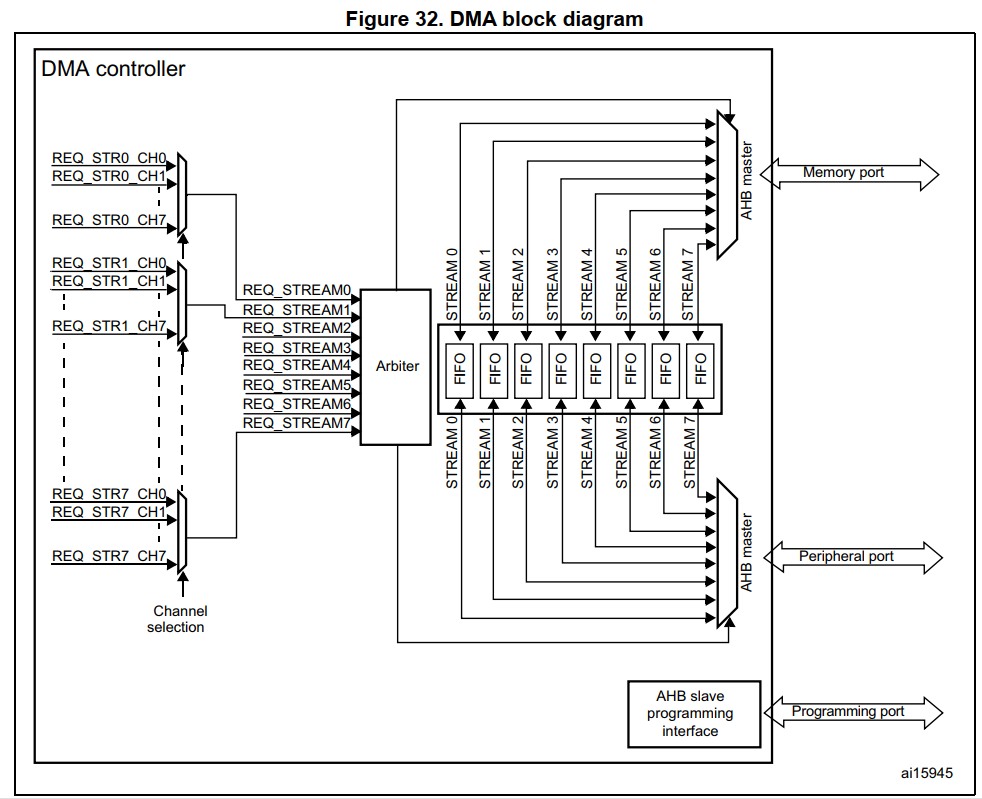

# 单片机总结系列(13) DMA模块

DMA模块在功能上实现独立于内核之外的数据拷贝；根据源地址和目的地址不同，又分为内存到内存，外设到内存，内存到外设三种不同的方式。很多时候DMA可以替代MCU实现数据的拷贝，接收和发送的工作；要实现高效率代码，对于DMA的理解和掌握必不可少。DMA主要实现数据从源地址到目的地址的搬运，只是处理内存数据(SRAM_Addr0->SRAM_Addr1，FLASH_Addr->SRAM_Addr，SRAM_Addr->SDRAM_Addr等)，那么确实不困难，不过这只是DMA中最简单的一部分；当涉及到Cache和外设后，难度则明显增加。

DMA最重要的应用是用于替代MCU对外设的访问，如之前的模块usart，dac，adc都支持DMA操作读写的模式。对于大部分开发者，都是直接从网上移植或者直接使用使用CubeMX生成的代码，并不理解背后的工作逻辑；这不算问题，基于STM32 HAL库的封装使用可以大幅度降低难度。不过对底层工作理解的缺失，代码正常工作还好；遇到工作不正常的情况，在HAL库的框架去查找问题反而更加复杂。对于学习，还是需要理解DMA的工作机制，才能更好的使用。

目录如下所示。

- [内存间的DMA传输](#dma_memory_to_memory)
- [内存和外设间的DMA传输](#dma_peripheral_with_memory)
- [DMA和Cache的配合使用](#dma_cache)
- [下一章节](#next_chapter)

本节配合例程: [13-STM32F429_DMA](./../code/13-STM32F429_DMA/)。

## dma_memory_to_memory

以STM32F429的DMA为例，其控制主体是DMAx_Streamx，也就是使用不同控制流的DMA应用可以同时使能，然后按照通道的优先级和编号由DMA模块自动控制先后工作顺序。在DMA的操作中，如果有外设的参与，则需要选择在芯片设计时已经有的固定通道。而对于没有外设参与的memory间传输，则没有通道限制，可以使用支持数据传输DMA的任意通道。

注意:**STM32F429在的DMA在硬件设计上有两个端口，AHB Peripheral-Port/AHB Memory-Port；其中Memory-Port连接在Bus Matrix上，支持所有Memory的访问，而Periperal-Port则支持大部分外设以及部分Memory的访问。只有DMA2的两个端口都连接Bus-Matrix，因此只有DMA2支持Memory to Memory的应用**

对于DMA内存间搬运，首先要选择支持的控制流；对于STM32F429来说只能使用DMA2，至于StreamX通道则都支持；不过要考虑到被其它硬件占用，因此选择合适的DMA2_Streamx即可。然后配置DMA的工作模式，DMA中的关键配置信息如下。



可以看到对于单个DMA有Stream0~Stream7共8个通道，每个通道都有独立的FIFO用于支持Brust操作，FIFO的大小以4*32bit，共16Byte的缓存，可以将多次搬运组合成一次搬运，提高传输效率。

- Direction，数据搬运方向，包含内存到内存(DMA_MEMORY_TO_MEMORY)、外设到内存(DMA_PERIPH_TO_MEMORY)、内存到外设(DMA_MEMORY_TO_PERIPH)
- PeriphInc/MemInc，这个控制每次搬运结束后，外设端和存储端是否增加，增加长度为选择的位宽
- PeriphDataAlignment/MemDataAlignment，外设和内存端增长的位宽，源地址和目的地址的位宽大部分情况下相等，除非想执行特殊操作，例如源端为8位数据，对端扩展为32位数据
- Mode，传输模式，单次或者循环。DMA_NORMAL就是启动后只进行一次传输；DMA_CIRCULAR则启动后，传输完成后立即进行下一次传输，这个一般用于外设到DMA的读取
- Brust，配合FIFO功能提高DMA性能的功能，对于DMA_MBURST_SINGLE就是每一次搬运都会同时读取或写入，DMA_MBURST_INC4表示每4个Aligment，才执行一次读取或写入。虽然DMA的操作不占用内核的时间，但每个数据传输还是占用总线，对于SRAM的访问感知可能不明显。不过外部的SDRAM或者PSARAM，同时进行大量的数据读写操作，也会影响MCU的访问(我就曾经遇到过，DMA搬运SDRAM数据时，同时在SDRAM执行算法，增加了接近一倍时间)。启用Brust后，就可以基于Brust_Count*Alignment长度才操作一次读取和写入，从访问和寻址角度就减少了大量时间。以DMA_PDATAALIGN_BYTE，DMA_MBURST_INC16为例，就是每次取16字节传输，从而更大的总线占用，当然这里设计上Brust数据长度需要小于DMA FIFO长度

关于DMA的内存间搬运的应用代码如下。

```c
static DMA_HandleTypeDef hdma2_stream0;
#define DMA_DST_SIZE        256

//flash to sram
#define DMA_SRC_ADDRESS     0x8000000
static uint8_t dma_dst[DMA_DST_SIZE];

static BaseType_t dma_hardware_init(void)
{
  /* DMA controller clock enable */
  __HAL_RCC_DMA2_CLK_ENABLE();

  /* Configure DMA request hdma2_stream0 on DMA2_Stream0 */
  hdma2_stream0.Instance = DMA2_Stream0;
  hdma2_stream0.Init.Channel = DMA_CHANNEL_0;
  hdma2_stream0.Init.Direction = DMA_MEMORY_TO_MEMORY;
  hdma2_stream0.Init.PeriphInc = DMA_PINC_ENABLE;
  hdma2_stream0.Init.MemInc = DMA_MINC_ENABLE;
  hdma2_stream0.Init.PeriphDataAlignment = DMA_PDATAALIGN_BYTE;
  hdma2_stream0.Init.MemDataAlignment = DMA_MDATAALIGN_BYTE;
  hdma2_stream0.Init.Mode = DMA_NORMAL;
  hdma2_stream0.Init.Priority = DMA_PRIORITY_MEDIUM;
  hdma2_stream0.Init.FIFOMode = DMA_FIFOMODE_ENABLE;
  hdma2_stream0.Init.FIFOThreshold = DMA_FIFO_THRESHOLD_FULL;
  hdma2_stream0.Init.MemBurst = DMA_MBURST_INC16;
  hdma2_stream0.Init.PeriphBurst = DMA_PBURST_INC16;
  if (HAL_DMA_Init(&hdma2_stream0) != HAL_OK)
    return pdFAIL;
  
  return pdPASS;    
}

BaseType_t dma_translate(uint32_t SrcAddress, uint32_t DstAddress, uint32_t DataLength)
{
    if (HAL_DMA_Start(&hdma2_stream0, SrcAddress, DstAddress, DataLength) != HAL_OK)
        return pdFAIL;
    
    return pdPASS;
}

static BaseType_t dma_test(void)
{
    BaseType_t type = pdFAIL;
    
    dma_translate(DMA_SRC_ADDRESS, (uint32_t)dma_dst, DMA_DST_SIZE);
    
    while (__HAL_DMA_GET_FLAG(&hdma2_stream0, DMA_FLAG_TCIF0_4) == RESET)
    {
        HAL_Delay(1);
    }
    __HAL_DMA_CLEAR_FLAG(&hdma2_stream0, DMA_FLAG_TCIF0_4);
    
    if (memcmp((char *)DMA_SRC_ADDRESS, dma_dst, DMA_DST_SIZE) == 0)
    {
        PRINT_LOG(LOG_INFO, "dma memory to memory test success!");
        type = pdPASS;
    }
    
    return type;  
}
```

## dma_peripheral_with_memory

在上节主要讲述DMA处理内存间的搬运，这节就在此基础上讲解DMA处理内存和外设间的交互。内存和外设的交互主要包含以下两种。

1. 内存到外设；主要用于输出，如Timer_DMA控制PWM输出，DAC_Timer_DMA控制正弦波输出，USART/CAN/SPI/I2C等接口的DMA通讯接口输出
2. 外设到内存；主要用于输入读取，如ADC采样，USART数据采集，SPI接口读取，I2C输入读取等

内存和外设之间的DMA交互涉及范围广，调试不直观，可以说是十分繁杂的知识点。对于模块或者DMA中任意一个不熟悉，都会给理解操作带来很大的问题。这里有个我个人的经验，外设的DMA功能虽然看起来是和外设驱动是混合在一起的。去看HAL库的驱动，也都是放置在一起，但外设和DMA从设计上仍然是完全独立的模块。也就是说，即使确定要实现DMA功能上操作外设，但外设的本身的功能也一定是独立且完好的，也就是在外设配置后，DMA使能前，你使用内核的方式去访问外设的数据寄存器，工作一定是正常的。这个观点很重要，你就可以在出问题时，先不管DMA功能，以内核调用读写外设的数据寄存器，来区分是外设的问题，还是DMA的问题。

另外，上面DMA处理内存的搬运是启动后立即执行，而DMA对于外设和内存间的操作则不同，需要有信号触发才会执行。以Memory to Peripheral为例，当使能外设和DMA后，DMA并不是立即启动，而是外设满足某些条件，会触发signal通知DMA，DMA再执行搬运动作，下面来自于USART DMA的文档有相关说明。

- 在DMA控制寄存器上将USART_DR寄存器地址配置成DMA传输的目的地址，**在每个TXE事件后，数据将被传送到这个地址**
- 通过DMA控制寄存器把USART_DR寄存器地址配置成传输的源地址，**在每个RXNE事件后，将从此地址读出数据并传输到存储器**

了解了这些，就可以知道DMA对于外设的操作包含以下步骤。

1. 进行外设的配置，对应时钟，GPIO和外设功能配置，使其能够独立正常工作
2. 使能外设和DMA的关联信号，此时外设满足对应事件条件后，会通知DMA执行动作
3. 将DMA按照上节说明配置符合功能的需求，根据表格选择对应的DMAx_Streamx和Channelx，Direction根据需求改为DMA_PERIPH_TO_MEMORY或DMA_MEMORY_TO_PERIPH，其它按照需求配置
4. 启动DMA功能，外设地址一般是对应外设的数据寄存器的地址，此时外设的DMA功能就能够正常工作

当然，如果DMA不能够正常工作，也可以根据这个流程分析。首先单独检测外设部分，能否正常工作，对应事件能否正常触发(标志位)；如果都正常，就看DMA的配置是否正确，Streamx和通道是否符合外设连接要求，源端地址和目的地址是否正确等。下面以Usart的DMA发送去理解这个流程。

```c
#define DMA_BUFFER_SIZE  256

static UART_HandleTypeDef huart1;
static DMA_HandleTypeDef hdma_usart1_tx;
static char dma_tx_buffer[DMA_BUFFER_SIZE];

BaseType_t usart_driver_init(void)
{
    GPIO_InitTypeDef GPIO_InitStruct = {0};

    __HAL_RCC_USART1_CLK_ENABLE();
    __HAL_RCC_GPIOA_CLK_ENABLE();

    //外设初始化
    GPIO_InitStruct.Pin = GPIO_PIN_9|GPIO_PIN_10;
    GPIO_InitStruct.Mode = GPIO_MODE_AF_PP;
    GPIO_InitStruct.Pull = GPIO_NOPULL;
    GPIO_InitStruct.Speed = GPIO_SPEED_FREQ_VERY_HIGH;
    GPIO_InitStruct.Alternate = GPIO_AF7_USART1;
    HAL_GPIO_Init(GPIOA, &GPIO_InitStruct);

    huart1.Instance = USART1;
    huart1.Init.BaudRate = 115200;
    huart1.Init.WordLength = UART_WORDLENGTH_8B;
    huart1.Init.StopBits = UART_STOPBITS_1;
    huart1.Init.Parity = UART_PARITY_NONE;
    huart1.Init.Mode = UART_MODE_TX_RX;
    huart1.Init.HwFlowCtl = UART_HWCONTROL_NONE;
    huart1.Init.OverSampling = UART_OVERSAMPLING_16;
    if (HAL_UART_Init(&huart1) != HAL_OK)
        return pdFAIL;

    //关联DMA和USART的发送功能
    ATOMIC_SET_BIT(huart1.Instance->CR3, USART_CR3_DMAT);

    //使能DMA功能
    hdma_usart1_tx.Instance = DMA2_Stream7;
    hdma_usart1_tx.Init.Channel = DMA_CHANNEL_4;
    hdma_usart1_tx.Init.Direction = DMA_MEMORY_TO_PERIPH;
    hdma_usart1_tx.Init.PeriphInc = DMA_PINC_DISABLE;
    hdma_usart1_tx.Init.MemInc = DMA_MINC_ENABLE;
    hdma_usart1_tx.Init.PeriphDataAlignment = DMA_PDATAALIGN_BYTE;
    hdma_usart1_tx.Init.MemDataAlignment = DMA_MDATAALIGN_BYTE;
    hdma_usart1_tx.Init.Mode = DMA_NORMAL;
    hdma_usart1_tx.Init.Priority = DMA_PRIORITY_LOW;
    hdma_usart1_tx.Init.FIFOMode = DMA_FIFOMODE_ENABLE;
    hdma_usart1_tx.Init.FIFOThreshold = DMA_FIFO_THRESHOLD_FULL;
    hdma_usart1_tx.Init.MemBurst = DMA_MBURST_SINGLE;
    hdma_usart1_tx.Init.PeriphBurst = DMA_PBURST_SINGLE;
    if (HAL_DMA_Init(&hdma_usart1_tx) != HAL_OK)
    {
      return pdFAIL;
    }

    //enable uart idle interrupt
    __HAL_DMA_ENABLE_IT(&hdma_usart1_tx, DMA_IT_TC);
    HAL_NVIC_EnableIRQ(DMA2_Stream7_IRQn);
    HAL_NVIC_SetPriority(DMA2_Stream7_IRQn, 0, 1);
}

void DMA2_Stream7_IRQHandler(void)
{
    if (__HAL_DMA_GET_FLAG(&hdma_usart1_tx, DMA_FLAG_TCIF3_7) != RESET)
    {      
        //close the dma and all flags, also interrupt
        //need enable next
        HAL_DMA_Abort(&hdma_usart1_tx);   
    }
}

void usart_translate(char *ptr, uint16_t size)
{
    memcpy((char *)dma_tx_buffer, ptr, size);

    //clear the flag related to translate
    __HAL_DMA_CLEAR_FLAG(&hdma_usart1_tx, DMA_FLAG_TCIF3_7);
    __HAL_DMA_CLEAR_FLAG(&hdma_usart1_tx, DMA_FLAG_TCIF3_7);
    __HAL_UART_CLEAR_FLAG(&huart1, UART_FLAG_TC);

    //enable dma tc interrupt
    __HAL_DMA_ENABLE_IT(&hdma_usart1_tx, DMA_IT_TC);

    //start dma translate
    HAL_DMA_Start(&hdma_usart1_tx, (uint32_t)dma_tx_buffer, (uint32_t)&huart1.Instance->DR, size);
}
```

## dma_cache

对于STM32F4来说，因为并没有D-Cache，所以DMA的使用不用考虑这个问题。不过对于更高端的STM32F7或STM32H7等带D-Cache的设备，就需要考虑和DMA的配合问题。这部分原理并不复杂，Cache提供了内核到Memory之间的缓存，当读取数据在Cache覆盖区域时，先查找Cache，如果存在则直接读取(这就叫命中)，如果不存在，会将数据加载到Cache，然后在读取。另外Cache的加载往往是按照CacheLine长度的(一般为32或64字节)，等下次访问在CacheLine范围内数据时，就可以直接Cache内读取，可以比内存读取带来数量级的性能提升。对于写入也是类似，如果未命中，则先从内存加载到Cache后修改，操作也在Cache中执行，如果Cache不足，则将一部分长时间不使用的数据回写到内存中。

整个Cache操作的流程还是比较繁琐的，不过幸运的是这些工作都由内核自动完成，所以在我们在开启D-Cache设备编写代码时，除了为了极端的性能要求，考虑Cache Line对齐问题，大部分情况下memory的访问并不需求考虑。不过当使用DMA时，情况就又不一样了。内核对于Cache的访问是自动完成的，但是DMA的机制却是访问实际的内存地址。这就带来问题，如果我们的操作数据是在Cache中，并没有修改到实际内存中，此时当DMA操作中内存是源端，则会读取错误的数据；反之如果DMA操作的内存是目的端，则内核访问的就是部分Cache的数据，也会读取错误的数据。

- 内核 - 缓存 - 内存
- DMA - 内存

在芯片设计时当然会考虑这个问题，这里就提到了内核对Cache的两个操作，Invalidate和Clean，下面进行详细说明.

- 当内存作为DMA源地址时，就需要将数据写回到实际内存中，这样DMA就可以搬运实际数据；这个术语就在WriteBack，使用接口SCB_CleanDCache_by_Addr即可指定范围写回.
- 当内存作为DMA目的地址时，当搬运完成后，内存访问时就需要直接访问内存而不通过Cache，这是就需要无效化掉数据；使用接口SCB_InvalidateDCache_by_Addr即可指定范围无效.

如此就可以配合DMA和Cache实现正常的功能，不过需要注意Cache的写回和无效都是Cache Line对齐的，所以DMA数据的首地址和长度也要符合这个要求，否则在使用时就有可能错误的更新数据，带来隐性问题。不过STM32也支持通过MPU关闭整块的Memory的写入方法，如修改为WriteThrough，这就不需要在DMA读取时执行CleanDCache动作，当然也可以直接关闭D-Cache，不过这就享受不到Cache带来的速度提升了，这就需要实际应用中根据需求进行配置确定。

## next_chapter

[返回目录](./../README.md)

直接开始下一小节: [SDIO接口模块](./ch14.sdio_interface.md)
