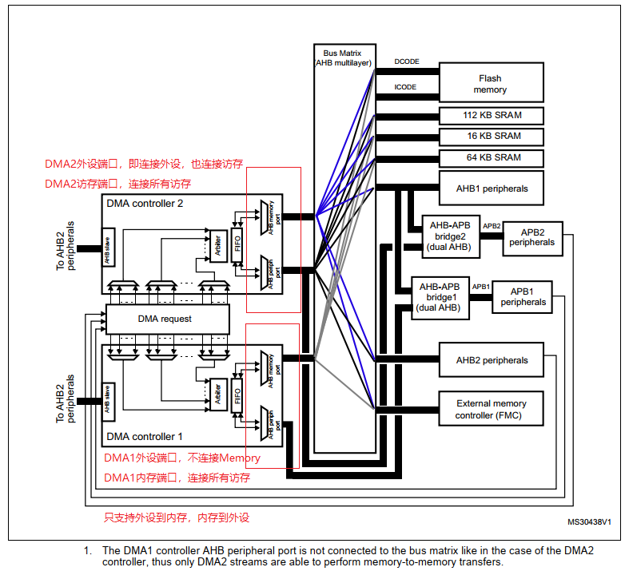

# 单片机技术总结说明(13) DMA模块

DMA模块在功能上实现独立于内核之外的数据拷贝；根据源地址和目的地址不同，又分为内存到内存、外设到内存、内存到外设三种不同的方式。很多时候DMA可以替代MCU实现数据的拷贝，接收和发送的工作；要实现高效率代码，对于DMA的理解和掌握必不可少。

DMA主要实现数据从源地址到目的地址的搬运，只是处理内存数据(SRAM_Addr0->SRAM_Addr1，FLASH_Addr->SRAM_Addr，SRAM_Addr->SDRAM_Addr等)，那么确实不困难；不过这只是DMA中最简单的一部分，当涉及到Cache和外设后，难度则明显增加。其中涉及外设部分，就需要理解相应模块的工作原理；在此基础上，在结合DMA模块去实现，这部分就需要涉及多模块综合的知识；例如ADC，DAC的DMA使用，就还涉及TIM事件触发功能。另一部分涉及Cache的，就需要结合Cache工作原理操作，也是DMA中容易误用的部分。虽然目前使用STM32CubeMX能够直接生成大部分DMA的代码，不过学习和了解背后的逻辑，对于高效开发仍然具有重要意义。

目录如下所示。

- [DMA模块框架](#dma_frame)
- [内存间的DMA传输](#dma_memory_to_memory)
- [内存和外设间的DMA传输](#dma_peripheral_with_memory)
- [DMA和Cache的配合使用](#dma_cache)
- [总结说明](#summary)
- [下一章节](#next_chapter)

本节配合例程: **code/13-STM32F429_DMA/project/stm32f429.uvprojx**。

## dma_frame

以STM32F429的DMA为例，其控制主体是DMAx_Streamx；这里每个StreamX都有独立的通道，也就是使用不同控制流的DMA应用可以同时使能；然后按照通道的优先级和编号由DMA模块自动控制先后工作顺序。在DMA的操作中，如果有外设的参与，则需要选择在芯片设计时已经有的固定通道。而对于没有外设参与的memory间传输，则没有通道限制，可以使用支持数据传输DMA的任意通道进行通讯。

DMA在MCU中框架如下所示。



STM32F4支持两路独立的DMA，分别是DMA1和DMA2。对于每个DMA，在硬件设计上有两个端口：AHB Peripheral-Port/AHB Memory-Port；

1. Memory-Port连接在Bus Matrix上，支持所有存储空间的访问；如FLASH，SRAM，SDRAM等，这部分DMA1和DMA2一致。
2. Periperal-Port则不一致，对于DMA1，Periperal-Port仅连接AHB、APB1、APB2这些外设总线上，并未连接到Bus Matrix，即不支持存储空间的访问。DMA2则即支持外设访问，也支持存储空间访问。

基于上述逻辑，对于DMA1/DMA2，都支持内存到外设，外设到内存的数据搬运，不过仅DMA2支持内存到内存的搬运。

DMA模块内部框图如下所示。


可以看到对于单个DMA有Stream0~Stream7共8个数据流，每个数据流都有独立的FIFO用于支持Brust操作，FIFO的大小以4*32bit，共16Byte的缓存，可以将多次搬运组合成一次搬运，提高传输效率。对于每个数据流，可以支持的配置如下。

- Direction，数据搬运方向，包含内存到内存(DMA_MEMORY_TO_MEMORY)、外设到内存(DMA_PERIPH_TO_MEMORY)、内存到外设(DMA_MEMORY_TO_PERIPH)。
- PeriphInc/MemInc，这个控制每次搬运结束后，外设端和存储端是否增加，增加长度为选择的位宽。
- PeriphDataAlignment/MemDataAlignment，外设和内存端增长的位宽，源地址和目的地址的位宽大部分情况下相等，除非想执行特殊操作，例如源端为8位数据，对端扩展为32位数据。
- Mode，传输模式，单次或者循环。DMA_NORMAL就是启动后只进行一次传输；DMA_CIRCULAR则启动后，传输完成后立即进行下一次传输，这个一般用于外设到DMA的读取。
- Brust，配合FIFO功能提高DMA性能的功能，只有开启FIFO才有意义。对于DMA_MBURST_SINGLE就是每一次搬运都会同时读取或写入，DMA_MBURST_INC4表示每次读取或写入都会锁定总线，直到完成4个数据传输，依次类推。

DMA的操作不占用内核的时间，但每个数据传输还是占用相应总线。对于SRAM的访问感知可能不明显，不过外部的SDRAM或者PSARAM，同时进行大量的数据读写操作，也会影响MCU的访问；我就曾经遇到过，DMA搬运SDRAM数据时，同时在SDRAM执行算法，测试增加了接近一倍时间。启用Brust后，就可以基于"Brust_Count\*Alignment"长度才进行一次读取和写入，这样不需要频繁的进行寻址。例如Brust Signal每个字节都要锁定一次总线，再释放；而DMA_MBURST_INC4设置4字节锁定依次总线，再释放，这样就降低了请求的次数，提高了效率。以DMA_PDATAALIGN_BYTE，DMA_MBURST_INC16为例，就是每次读取16字节在进行实际传输，从而降低总线占用。不过这里设计上"Brust\*Alignment"的数据长度需要小于DMA FIFO长度，也就是16字节。

注: 必须选择地址指针（ DMA_SxPAR 或 DMA_SxM0AR 寄存器），以确保一个突发块内的所有传输在等于传输大小的地址边界对齐。

对于外设的数据搬运，除了对应数据流外，还为每个外设分配固定的通道；这样DMA就能够区分搬运的数据来源，以STM32F429的DMA通道为例，其DMA数据流通道和外设的关系如下所示。


以ADC1为例，可选择的数据流和通道如下所示。

1. 数据流DMA2_Stream0，通道DMA_CHANNEL_0
2. 数据流DMA2_Stream4，通道DMA_CHANNEL_0

任意选择其中一个即可，在前面ADC文档中，使用的就是DMA2_Stream0，其通道为DMA_CHANNEL_0，其来源就是于此。

## dma_memory_to_memory

对于DMA内存间搬运，首先要选择支持的数据流；由上面可知，对于STM32F429来说只能使用DMA2。之前提到了数据流和通道的概念，这是因为对于每个外设，都被分配了固定的数据流和通道，这样才能正确的触发DMA请求进行数据搬运。而内存间搬运，不需要外部的触发请求，因此只要没有被其它配置占用，就可以选择DMA2的任意数据流和通道；这里选择的设置如下。

数据流：DMA2_Stream0，通道DMA_CHANNEL_0

结合上面DMA配置相关知识，驱动实现代码如下。

```c
static DMA_HandleTypeDef hdma2_stream0;
#define DMA_DST_SIZE        256

//flash to sram
#define DMA_SRC_ADDRESS     0x8000000
static uint8_t dma_dst[DMA_DST_SIZE];

static BaseType_t drv_dma_init(void)
{
    /* DMA controller clock enable */
    __HAL_RCC_DMA2_CLK_ENABLE();

    /* Configure DMA request channel0 on DMA2_Stream0 */
    hdma2_stream0.Instance = DMA2_Stream0;                        // 选择DMA2_Stream0
    hdma2_stream0.Init.Channel = DMA_CHANNEL_0;                   // 选择通道0
    hdma2_stream0.Init.Direction = DMA_MEMORY_TO_MEMORY;          // 内存到内存
    hdma2_stream0.Init.PeriphInc = DMA_PINC_ENABLE;               // 源端地址增长(memory to memory模式下，外设端口为源端)
    hdma2_stream0.Init.MemInc = DMA_MINC_ENABLE;                  // 目标地址增长
    hdma2_stream0.Init.PeriphDataAlignment = DMA_PDATAALIGN_BYTE; // 源端数据单字节
    hdma2_stream0.Init.MemDataAlignment = DMA_MDATAALIGN_BYTE;    // 目的端数据单字节
    hdma2_stream0.Init.Mode = DMA_NORMAL;                         // 正常模式，单次传输
    hdma2_stream0.Init.Priority = DMA_PRIORITY_MEDIUM;            // 中等优先级
    hdma2_stream0.Init.FIFOMode = DMA_FIFOMODE_ENABLE;            // 启用FIFO
    hdma2_stream0.Init.FIFOThreshold = DMA_FIFO_THRESHOLD_FULL;   // FIFO阈值为满(支持16个字节FIFO深度)
    hdma2_stream0.Init.MemBurst = DMA_MBURST_INC16;               // 源端burst长度为16个数据
    hdma2_stream0.Init.PeriphBurst = DMA_PBURST_INC16;            // 目标端burst长度为16个数据
    if (HAL_DMA_Init(&hdma2_stream0) != HAL_OK) {
        return pdFAIL;
    }

    return pdPASS;    
}

BaseType_t dma_translate(uint32_t SrcAddress, uint32_t DstAddress, uint32_t DataLength)
{
    if (HAL_DMA_Start(&hdma2_stream0, SrcAddress, DstAddress, DataLength) != HAL_OK)
        return pdFAIL;
    
    return pdPASS;
}

static BaseType_t dma_test(void)
{
    BaseType_t type = pdFAIL;
    
    dma_translate(DMA_SRC_ADDRESS, (uint32_t)dma_dst, DMA_DST_SIZE);
    
    // 等待传输完成(阻塞方式并没有提高效率，逻机下应该使用回调或者状态查询的方式处理)
    while (__HAL_DMA_GET_FLAG(&hdma2_stream0, DMA_FLAG_TCIF0_4) == RESET) {
        HAL_Delay(1);
    }
    __HAL_DMA_CLEAR_FLAG(&hdma2_stream0, DMA_FLAG_TCIF0_4);
    
    if (memcmp((char *)DMA_SRC_ADDRESS, dma_dst, DMA_DST_SIZE) == 0)
    {
        PRINT_LOG(LOG_INFO, "dma memory to memory test success!");
        type = pdPASS;
    }
    
    return type;  
}
```

## dma_peripheral_with_memory

在上节主要讲述DMA处理内存间的搬运，这节就在此基础上讲解DMA处理内存和外设间的交互。内存和外设的交互主要包含以下两种。

1. 内存到外设模块：主要用于输出，如Timer_DMA控制PWM输出，DAC_Timer_DMA控制正弦波输出，USART/CAN/SPI/I2C等接口的DMA通讯接口输出
2. 外设模块到内存：主要用于输入读取，如ADC采样，USART数据采集，SPI接口读取，I2C输入读取等

内存和外设模块之间的DMA交互涉及范围广，调试也相对困难，可以说是十分繁杂的知识点。对于外设模块或者DMA中任意一个不熟悉，都会给理解操作带来很大的问题。

以我个人的经验来看，外设的DMA功能虽然看起来是和外设驱动是混合在一起的，去看HAL库的驱动，也都是放置在一起，但外设和DMA从设计上是完全独立的模块。也就是说，即使确定要实现DMA功能上操作外设，但外设的本身的功能也一定是独立且完好的。也就是在外设配置DMA支持DMA后，使用内核的方式访问外设的数据寄存器，工作一定是正常的。这个经验其实很重要，实践中就可以在出问题时，先不管DMA功能，以MCU的方式调用读写外设的数据寄存器，来区分是外设模块驱动或者硬件的问题，还是DMA配置的问题。

DMA处理内存的搬运是启动后立即执行，但是其对于外设和内存间的操作则不同，需要有信号触发才会执行。以Memory to Peripheral为例，当使能外设和DMA后，DMA并不是立即启动，而是外设满足某些条件，会触发signal通知DMA，DMA再执行搬运动作。这里以USART模块文档中的DMA说明为例。

- 在DMA控制寄存器上将USART_DR寄存器地址配置成DMA传输的目的地址，**在每个TXE事件后，数据将被传送到这个地址**
- 通过DMA控制寄存器把USART_DR寄存器地址配置成传输的源地址，**在每个RXNE事件后，将从此地址读出数据并传输到存储器**

可以看到USART模块接收和发送的DMA功能，分别来自于TXE和RXNE两个信号。这两个信号由USART模块内部产生，如果DMA使能且关联指定通道后，就会再满足条件后执行相应的DMA传输。

了解了这些，就可以知道外设模块使能DMA的操作包含以下步骤。

1. 进行外设的配置，对应时钟，GPIO和外设功能配置，使其能够独立正常工作。
2. 使能外设模块的DMA的功能，关联DMA模块；此时外设满足对应事件条件后，会通知DMA模块相应的信号。
3. 将DMA根据表格选择对应的DMAx_Streamx和Channelx，Direction根据需求改为DMA_PERIPH_TO_MEMORY或DMA_MEMORY_TO_PERIPH，其它按照需求配置
4. 启动DMA功能，外设地址一般是对应外设的数据寄存器的地址，此时外设的DMA功能就能够正常工作

当然，如果DMA不能够正常工作，也可以根据这个流程分析。

1. 首先单独检测外设部分，能否正常工作，对应事件能否正常触发(标志位)；
2. 如果都正常，就看DMA的配置是否正确，时钟是否开启，Streamx和通道是否符合外设连接要求，源端地址和目的地址是否正确等。

下面以Usart的DMA发送去理解这个流程。

```c
#define DMA_BUFFER_SIZE  256

static UART_HandleTypeDef huart1;
static DMA_HandleTypeDef hdma_usart1_tx;
static char dma_tx_buffer[DMA_BUFFER_SIZE];

BaseType_t drv_usart_init(void)
{
    GPIO_InitTypeDef GPIO_InitStruct = {0};

    __HAL_RCC_USART1_CLK_ENABLE();
    __HAL_RCC_GPIOA_CLK_ENABLE();

    // 配置USART相关的引脚
    GPIO_InitStruct.Pin = GPIO_PIN_9 | GPIO_PIN_10;
    GPIO_InitStruct.Mode = GPIO_MODE_AF_PP;
    GPIO_InitStruct.Pull = GPIO_NOPULL;
    GPIO_InitStruct.Speed = GPIO_SPEED_FREQ_VERY_HIGH;
    GPIO_InitStruct.Alternate = GPIO_AF7_USART1;
    HAL_GPIO_Init(GPIOA, &GPIO_InitStruct);

    // 配置USART1
    huart1.Instance = USART1;                       // USART1定义
    huart1.Init.BaudRate = 115200;                  // 波特率115200
    huart1.Init.WordLength = UART_WORDLENGTH_8B;    // 字长8bit
    huart1.Init.StopBits = UART_STOPBITS_1;         // 停止位1位
    huart1.Init.Parity = UART_PARITY_NONE;          // 无奇偶校验位
    huart1.Init.Mode = UART_MODE_TX_RX;             // 收发模式
    huart1.Init.HwFlowCtl = UART_HWCONTROL_NONE;    // 无硬件流控制
    huart1.Init.OverSampling = UART_OVERSAMPLING_16;    // 16倍采样率
    if (HAL_UART_Init(&huart1) != HAL_OK)
        return pdFAIL;

    // 使能USART的DMA功能位，进行关联
    ATOMIC_SET_BIT(huart1.Instance->CR3, USART_CR3_DMAT);

    // 使能DMA功能
    hdma_usart1_tx.Instance = DMA2_Stream7;                         // 数据流: DMA2_Stream7
    hdma_usart1_tx.Init.Channel = DMA_CHANNEL_4;                    // 通道: DMA_CHANNEL_4
    hdma_usart1_tx.Init.Direction = DMA_MEMORY_TO_PERIPH;           // 数据方向: DMA_MEMORY_TO_PERIPH
    hdma_usart1_tx.Init.PeriphInc = DMA_PINC_DISABLE;               // 外设地址不自增
    hdma_usart1_tx.Init.MemInc = DMA_MINC_ENABLE;                   // 内存地址自增
    hdma_usart1_tx.Init.PeriphDataAlignment = DMA_PDATAALIGN_BYTE;  // 外设数据单字节
    hdma_usart1_tx.Init.MemDataAlignment = DMA_MDATAALIGN_BYTE;     // 内存数据单字节
    hdma_usart1_tx.Init.Mode = DMA_NORMAL;                          // 正常模式，单次传输
    hdma_usart1_tx.Init.Priority = DMA_PRIORITY_LOW;                // 优先级低
    hdma_usart1_tx.Init.FIFOMode = DMA_FIFOMODE_DISABLE;            // 不启用FIFO 
    if (HAL_DMA_Init(&hdma_usart1_tx) != HAL_OK)
    {
      return pdFAIL;
    }

    // 使能相应的中断
    __HAL_DMA_ENABLE_IT(&hdma_usart1_tx, DMA_IT_TC);
    HAL_NVIC_EnableIRQ(DMA2_Stream7_IRQn);
    HAL_NVIC_SetPriority(DMA2_Stream7_IRQn, 0, 1);
}

void DMA2_Stream7_IRQHandler(void)
{
    if (__HAL_DMA_GET_FLAG(&hdma_usart1_tx, DMA_FLAG_TCIF3_7) != RESET)
    {      
        //close the dma and all flags, also interrupt
        //need enable next
        HAL_DMA_Abort(&hdma_usart1_tx);   
    }
}

void usart_translate(char *ptr, uint16_t size)
{
    memcpy((char *)dma_tx_buffer, ptr, size);

    //clear the flag related to translate
    __HAL_DMA_CLEAR_FLAG(&hdma_usart1_tx, DMA_FLAG_TCIF3_7);
    __HAL_DMA_CLEAR_FLAG(&hdma_usart1_tx, DMA_FLAG_TCIF3_7);
    __HAL_UART_CLEAR_FLAG(&huart1, UART_FLAG_TC);

    //enable dma tc interrupt
    __HAL_DMA_ENABLE_IT(&hdma_usart1_tx, DMA_IT_TC);

    //start dma translate
    HAL_DMA_Start(&hdma_usart1_tx, (uint32_t)dma_tx_buffer, (uint32_t)&huart1.Instance->DR, size);
}
```

## dma_cache

对于STM32F4来说，因为并没有D-Cache，所以DMA的使用不用考虑这个问题。不过对于更高端的STM32F7或STM32H7等带D-Cache的设备，就需要考虑和DMA的配合问题。这部分原理并不复杂，Cache提供了内核到Memory之间的缓存；当读取数据在Cache覆盖区域时，先查找Cache，如果存在则直接读取(这就叫命中)；如果不存在，会将数据加载到Cache，然后在读取。另外Cache的加载往往是按照CacheLine长度的(一般为32或64字节)，等下次访问在CacheLine范围内数据时，就可以直接Cache内读取，可以比内存读取带来数量级的性能提升。对于写入也是类似，如果未命中，则先从内存加载到Cache后修改，操作也在Cache中执行，如果Cache不足，则将一部分长时间不使用的数据回写到内存中。

整个Cache操作的流程还是比较繁琐的，不过幸运的是这些工作都由内核自动完成。对于内核和DMA访问内存的机制如下所示。

1. 带Cache下的内核访问内存机制: 内核 - 缓存 - 内存
2. DMA访问内存机制: DMA - 内存

当开启D-Cache设备编写代码时，除了为了极端的性能要求，考虑Cache Line对齐问题，大部分情况下对于memory的使用和访问并不需求考虑Cache问题，可以无感知的使用。不过当使用DMA时，情况就又不一样了。内核对于Cache的访问是自动完成的，但是DMA的机制却是访问实际的内存地址；这就带来问题，如果我们的操作数据是在Cache中，并没有修改到实际内存中，此时当DMA操作中内存是源端，则会读取错误的数据；反之如果DMA操作的内存是目的端，则内核访问的就是部分Cache的数据，也会读取错误的数据；这种问题再产品中是不可接受的。

在芯片设计时当然会考虑这个问题，提供了三种方式来可以解决这类问题。

1. 禁止D-Cache，可以和之前一样使用DMA。这样最简单，不过完全抛弃了缓冲的优点，不推荐选择。
2. 基于MPU功能，配置DMA访问的内存区域为禁止缓存，这样只影响到小范围区域，属于可选方法之一。
3. 使用内核支持对Cache的操作，Invalidate和Clean操作，在DMA开始和结束时执行，解决缓存一致性问题。这也是可选方法之一。当内存作为DMA源地址时，就需要将数据写回到实际内存中，这样DMA就可以搬运实际数据；这个术语就在WriteBack，使用接口SCB_CleanDCache_by_Addr即可指定范围写回。当内存作为DMA目的地址时，当搬运完成后，内存访问时就需要直接访问内存而不通过Cache，这是就需要无效化掉数据；使用接口SCB_InvalidateDCache_by_Addr即可指定范围无效。

基于上述方法，就可以在支持D-Cache的MCU中正确的实现DMA功能。不过需要注意Cache的写回和无效都是Cache Line对齐的；所以DMA数据的首地址和长度也要符合这个要求，否则在使用时就有可能错误的更新数据，带来隐性问题。另外通过MPU关闭整块的Memory的写入方法，如修改为WriteThrough，这就不需要在DMA读取时执行CleanDCache动作，当然也可以直接关闭D-Cache，不过这就享受不到Cache带来的速度提升了，这就需要实际应用中根据需求进行配置确定。

## summary

本节中对于DMA模块进行了介绍，实现了内存到内存，外设和内存之间的数据传输应用。此外还讨论了DMA和Cache配合下引入的问题和解决办法。DMA作为独立于MCU之外的数据传输方法，其功能上能够实现非干预性的完整包处理；对于性能要求高、连续处理的场景(如网络、串口接收、音频输出、存储写入等)，可以说是主流的解决方式。熟练掌握DMA程序设计和调试方法，也是实现稳定复杂应用必要方式，值得花时间积累验证总结。

## next_chapter

[返回目录](./../README.md)

直接开始下一小节: [SDIO接口模块](./ch14.sdio_interface.md)
