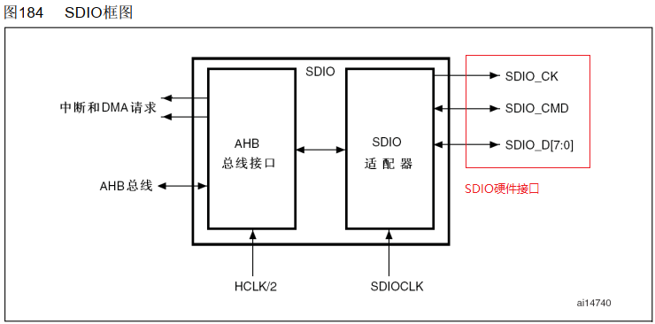
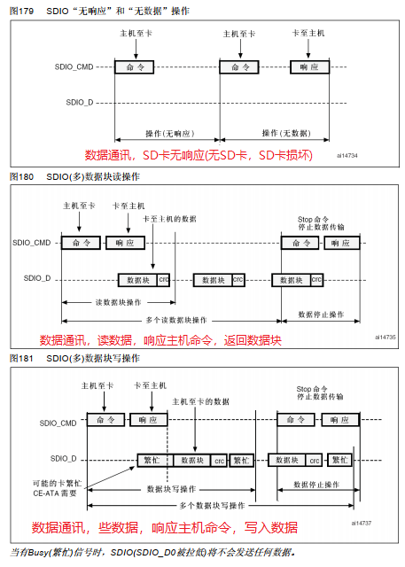
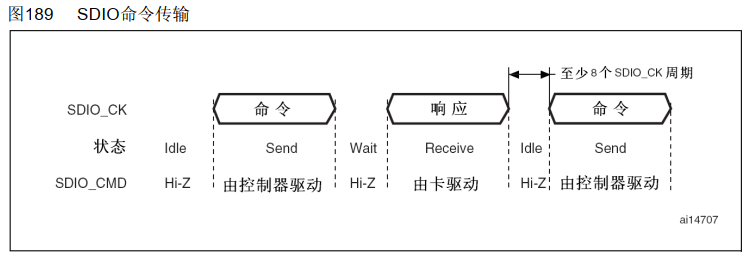
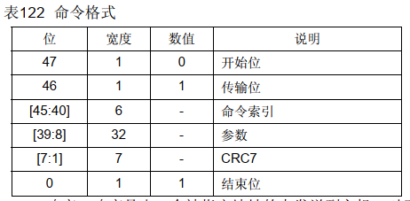
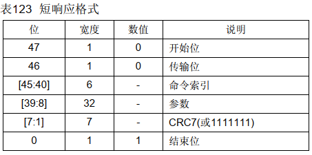
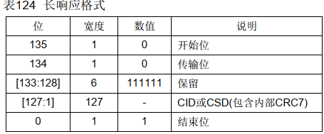
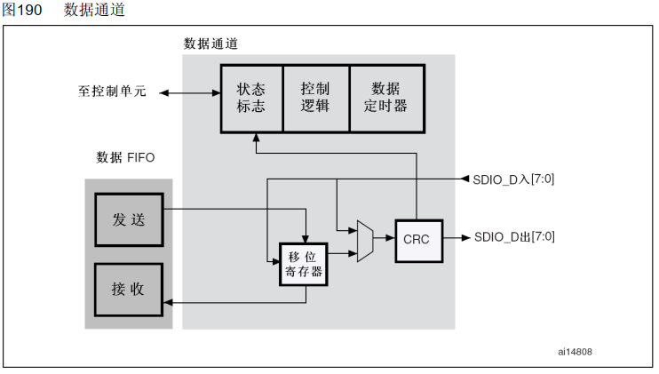
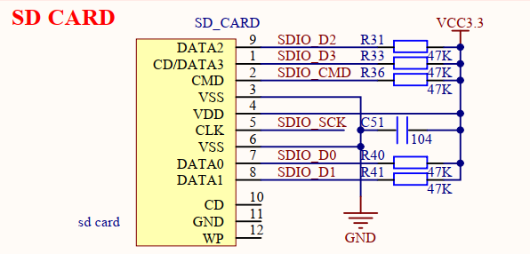
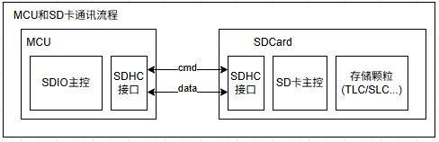
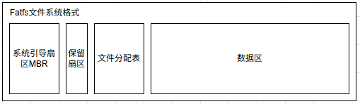

# 单片机技术总结说明(14) SDIO接口和fatfs应用

SD/SDIO/MMC是主机提供的用于访问多媒体卡(MMC)、SD存储卡和SDIO卡的接口。这里MMC是MultiMediaCard的简称，从本质上看，它是一种用于固态非易失性存储的内存卡(memory card)规范，定义了诸如卡的形态、尺寸、容量、电气信号、和主机之间的通信协议等方方面面的内容。MMC、SD、SDIO的技术本质是一样的(使用相同的总线规范，等等)，都是从MMC规范演化而来，它们的区别如下所示。

1. MMC强调的是多媒体存储(MM，MultiMedia)，主要用于存储音频、视频、图片等多媒体文件。
2. SD强调的是安全和数据保护(S，Secure)，主要针对数据安全，数据传输过程中，数据被加密，数据传输过程中，数据被加密。
3. SDIO是从SD演化出来的，强调的是接口(IO，Input/Output)，不再关注另一端的具体形态(可以是WIFI、BLE、GPS，SD卡等)。

对于单片机来说，SDIO接口主要用于访问SDCard以及部分支持SDIO接口的WIFI、网口灯，本篇中则以SD卡为例进行说明；具体目录如下所示。

- [SDIO框架说明](#sdio_frame)
  - [SDIO命令通讯说明](#sdio_cmd)
  - [SDIO数据通讯说明](#sdio_data)
- [SDIO驱动实现](#sdio_app)
  - [SDIO接口初始化](#sdio_init)
  - [SDIO数据读写](#sdio_rw)
- [fatfs文件系统和应用](#sd_fatfs)
  - [fatfs模块说明和移植](#fatfs_feature)
  - [fatfs模块应用](#fatfs_app)
- [总结说明](#summary)
- [下一章节](#next_chapter)

本节配合例程: **code/14-STM32F429_SDIO/project/stm32f429.uvprojx**。

## sdio_frame

对于STM32设备，SD/SDIO MMC卡主机模块(SDIO)在AHB外设总线和多媒体卡(MMC)、SD存储卡、SDIO卡和CE-ATA设备间提供了操作接口，其结构如下所示。



1. SDIO适配器模块：实现所有MMC/SD/SD I/O卡的相关功能，如时钟的产生、命令和数据的传送。
2. AHB总线接口：操作SDIO适配器模块中的寄存器，并产生中断和DMA请求信号。

对于SDIO的接口，主要功能和说明如下所示。

| 接口 | 引脚功能定义 | 详细说明 |
| --- | --- | --- |
| SDIO_CK | 输出 | SDIO时钟接口，主机到卡的时钟线 |
| SDIO_CMD | 双向 | SDIO命令接口，双向的命令响应数据线 |
| SDIO_D[7:0] | 双向 | SDIO数据DATA接口，双向的数据总线 |

复位后默认情况下SDIO_D0用于数据传输，初始化后主机可以改变数据总线的宽度。多媒体卡接到了总线上，则可以使用SDIO_D[3:0]或SDIO_D[7:0]进行数据传输。对于MMC版本V3.31和之前版本的协议则只支持单根DATA线，所以只能用SDIO_D0。

总线上的通信是通过传送命令和数据实现。在多媒体卡/SD/SD I/O总线上的基本操作是命令/响应结构，这样的总线操作在命令或总线机制下实现信息交换。另外，某些操作还具有数据令牌。在SD/SDIO存储器卡上传送的数据是以数据块的形式传输；在MMC上传送的数据是以数据块或数据流的形式传输；在CE-ATA设备上传送的数据也是以数据块的形式传输。



由上图可以看出，SDIO接口的命令和数据都是通过SDIO_CMD和SDIO_D[7:0]线进行传输的。通过SDIO_CMD和SD卡进行状态、容量、数据读写的实现，通过SDIO_D接口以数据块和数据流的传输。

### sdio_cmd

其中SDIO命令由SDIO_CMD命令通道管理，向卡发送命令并从卡接收响应。写入命令寄存器并设置使能位，开始发送命令。命令发送完成时，命令通道状态机(CPSM)设置状态标志并在不需要响应时进入空闲状态。当收到响应后，接收到的CRC码将会与内部产生的CRC码比较，然后设置相应的状态标志。

DIO命令收发方式如下所示。



SDIO的命令格式包含发送命令格式和响应命令格式，发送命令固定为48位，响应命令则支持两种格式，48位短格式和136位长格式，具体如下。

- SDIO命令格式



其中命令索引即为主机下发的命令，根据SD卡协议，支持的命令如下所示。

| 命令 | 命令说明 | 响应类型 |
| --- | --- | --- |
| CMD0 | 重置SD卡，使SD卡进入Idle状态 | R1 |
| CMD1 | 读OCR寄存器，获取OCR寄存器里面的必要信息 | R1 |
| CMD2 | 广播获取卡的CID信息 | R2 |
| CMD3 | 分配SD卡的 RCA（Relative Card Address），用于后续通信（如数据传输） | R6 |
| CMD5 | CMD0 之后执行 CMD5，CMD5 只有 SDIO 类型卡才会有响应（SD 存储卡不响应） | R1 |
| CMD6 | CMD6 主要就是用于SD卡高速模式的切换了，先查询是否支持高速模式，再设置 | R1 |
| CMD7 | 发送 CMD7，使能SD卡，如果参数值为0，即使取消所有选中SD卡 | R1b |
| CMD8 | 发送主机供电电压信息的SD存储卡接口条件，并询问被访问的卡是否可以在供电电压范围内工作 | R7 |
| CMD9 | 读取CSD寄存器获取卡的相关信息，获取SD相关的存储信息,如块大小,容量等 | R2 |
| CMD10 | 读取CID信息 | R2 |
| CMD12 | 强制停止所有传输，停止多块传输操作 | R1b |
| CMD13 | 要求已选中的卡发送它的状态，其实本质就是读 Card_Status 寄存器 | R1 |
| CMD15 | 重置SD卡，使SD卡进入 Inactive 状态 | R1 |
| CMD16 | 设置SD卡的块大小 | R1 |
| CMD17 | 设置SD卡按照单个区块进行操作， 使SD卡进入传输状态，读取单个块 | R1 |
| CMD24 | 单块写，传输大小由CMD16指定 | R1 |
| CMD25 | 多块传输写，不断地将数据块从主机写到卡，直到被 STOP_TRANSMISSION（CMD12） 命令中断 | R1 |
| CMD55 | 通知SD卡，紧接着的下一个命令是应用命令（ACMD）| R1 |
| ACMD6 | 设置SD卡的总线宽度 | R1 |
| ACMD13 | 要求已选中的卡发送它的状态，其实本质就是读 Card_Status 寄存器 | R1 |
| ACMD23 | 设置SD卡的块大小 | R1 |
| ACMD41 | 使SD卡进入初始化状态 | R1 |

- SDIO命令响应短格式



- SDIO命令响应长格式



其中命令响应格式的状态标志如下所示。

| 标志 | 说明 |
| --- | --- |
| CMDREND  | 响应的CRC正确 |
| CCRCFAIL | 响应的CRC错误 |
| CMDSENT | 命令(不需要响应的命令)已经送出 |
| CTIMEOUT | 响应超时 |
| CMDACT | 正在发送命令 |

CRC发生器计算CRC码之前所有位的CRC校验和，包括开始位、发送位、命令索引和命令参数(或卡状态)。对于长响应格式，CRC校验和计算的是CID或CSD的前120位；注意，长响应格式中的开始位、传输位和6个保留位不参与CRC计算。CRC校验和是一个7位的数值：

```C
CRC[6:0] = 余数[(M(x) * x7) / G(x)]
G(x) = x7 + x3 + 1
M(x) = (开始位) * x39 + … + (CRC前的最后一位) * x0, 或
M(x) = (开始位) * x119 + … + (CRC前的最后一位) * x0, 或
```

### sdio_data

数据通道子单元在主机与卡之间传输数据。下图是数据通道的框图。



在时钟控制寄存器中可以配置卡的数据总线宽度。如果选择了4位总线模式，则每个时钟周期四条数据信号线(SDIO_D[3:0])上将传输4位数据；如果选择了8位总线模式，则每个时钟周期八条数据信号线(SDIO_D[7:0])上将传输8位数据；如果没有选择宽总线模式，则每个时钟周期只在SDIO_D0上传输1位数据。

## sdio_app

前面大致对于SDIO的通讯原理进行说明，SDIO通讯包含命令接口和数据接口、命令接口包含发送命令和响应命令；实现卡识别过程、数据接口实现写入和读取数据块，实现数据传输。对于SDIO硬件接口，如下所示。



从原理图上可以看到，包含了SDIO标准接口SCK、SDIO_CMD、SDIO_D[3:0]的连接，不过SDIO_CD脚并未连接，其实这是可靠SD卡读写的关键。SDIO_CD信号的主要作用是指示一个SDIO/MMC卡是否存在。当SDIO/MMC卡被正确插入到对应的插槽中时，SDIO_CD信号会被激活，从而通知系统卡已经到位，可以进行后续的卡识别和数据传输等操作。在SDIO卡的应用中，除了可以插入SD存储卡进行数据存储外，还可以插入各种SDIO接口设备，如蓝牙、WIFI、GPS等，以扩展设备的功能。这些设备在插入后，同样会通过SDIO_CD信号进行识别和初始化。SDIO_CD主要用于硬件上检测SD卡移除和插入，设计上可通过在软件上监视处理，避免在SD插拔过程中进行写入操作，从而降低SD卡损坏风险。对于部分SD卡可靠性要求高的场景，具有重要意义。

### sdio_init

对于SD卡的具体驱动实现，主要流程如下所示。

1. SDIO时钟使能，接口对应的GPIO进行配置。
2. SDIO模块功能初始化，满足命令和数据通讯功能。
3. SDIO命令交互和卡识别，理论上需要SDIO_CD检测后执行，初始化SD卡时会通过CMD命令读取卡信息，不存在则会初始化失败。
4. 如果需要使用DMA功能，再SDIO初始化正常的基础上，进行相关DMA模块的初始化。

相应的初始化代码如下所示。

```c
#define SDMMC_CLOCK_DIV                 2

static SD_HandleTypeDef hsdcard1;
static DMA_HandleTypeDef hdma_sdio_rx;
static DMA_HandleTypeDef hdma_sdio_tx;

GlobalType_t sdcard_driver_init(void)
{
    GPIO_InitTypeDef GPIO_InitStruct = {0};

    // 复位SDIO模块
    __HAL_RCC_SDIO_FORCE_RESET();
    HAL_Delay(1);
    __HAL_RCC_SDIO_RELEASE_RESET();
    
    // 使能SDIO对应的GPIO和模块时钟
    __HAL_RCC_SDIO_CLK_ENABLE();
    __HAL_RCC_GPIOC_CLK_ENABLE();
    __HAL_RCC_GPIOD_CLK_ENABLE();
    
    // 复用GPIO为SDIO接口(参考硬件为四线模式)
    /**SDIO GPIO Configuration
    PC8     ------> SDIO_D0
    PC9     ------> SDIO_D1
    PC10     ------> SDIO_D2
    PC11     ------> SDIO_D3
    PC12     ------> SDIO_CK
    PD2     ------> SDIO_CMD
    */
    GPIO_InitStruct.Pin = GPIO_PIN_8 |GPIO_PIN_9 | GPIO_PIN_10 | GPIO_PIN_11
                          | GPIO_PIN_12;
    GPIO_InitStruct.Mode = GPIO_MODE_AF_PP;
    GPIO_InitStruct.Pull = GPIO_PULLUP;
    GPIO_InitStruct.Speed = GPIO_SPEED_FREQ_HIGH;
    GPIO_InitStruct.Alternate = GPIO_AF12_SDIO;
    HAL_GPIO_Init(GPIOC, &GPIO_InitStruct);

    GPIO_InitStruct.Pin = GPIO_PIN_2;
    GPIO_InitStruct.Mode = GPIO_MODE_AF_PP;
    GPIO_InitStruct.Pull = GPIO_PULLUP;
    GPIO_InitStruct.Speed = GPIO_SPEED_FREQ_HIGH;
    GPIO_InitStruct.Alternate = GPIO_AF12_SDIO;
    HAL_GPIO_Init(GPIOD, &GPIO_InitStruct);
    
    // 配置SDIO功能，识别卡(默认1b模式，兼容大部分卡)
    hsdcard1.Instance = SDIO;                                                   // SDIO模块
    hsdcard1.Init.ClockEdge = SDIO_CLOCK_EDGE_RISING;                           // 时钟上升沿(上升沿产生SCLK_CK)
    hsdcard1.Init.ClockBypass = SDIO_CLOCK_BYPASS_DISABLE;                      // 不使用时钟旁路(使用分频，SDMMC_CLOCK_DIV)
    hsdcard1.Init.ClockPowerSave = SDIO_CLOCK_POWER_SAVE_DISABLE;               // 不使能省电配置(使能后，无数据传输时关闭SDIO_CK时钟)
    hsdcard1.Init.BusWide = SDIO_BUS_WIDE_1B;                                   // 默认1B模式，用于兼容大部分卡(完成初始化)
    hsdcard1.Init.HardwareFlowControl = SDIO_HARDWARE_FLOW_CONTROL_DISABLE;     // 不使能硬件流控制
    hsdcard1.Init.ClockDiv = SDMMC_CLOCK_DIV;

    if (HAL_SD_Init(&hsdcard1) != HAL_OK)
        return RT_FAIL;

    // 修改位4B模式，提高通讯速率
    if (HAL_SD_ConfigWideBusOperation(&hsdcard1, SDIO_BUS_WIDE_4B) != HAL_OK)
        return RT_FAIL;

#ifdef _SDIO_DMA_SUPPORT
    // 使能DMA时钟
    __HAL_RCC_DMA2_CLK_ENABLE();

    /* SDIO_RX Init */
    // 支持DMA模式，配合TX，RX数据DMA通讯
    hdma_sdio_rx.Instance = DMA2_Stream3;                           //DAM2_Stream3
    hdma_sdio_rx.Init.Channel = DMA_CHANNEL_4;                      //DMA_CHANNEL_4通道4
    hdma_sdio_rx.Init.Direction = DMA_PERIPH_TO_MEMORY;             //外设到内存
    hdma_sdio_rx.Init.PeriphInc = DMA_PINC_DISABLE;                 //外设地址不变
    hdma_sdio_rx.Init.MemInc = DMA_MINC_ENABLE;                     //内存地址递增    
    hdma_sdio_rx.Init.PeriphDataAlignment = DMA_PDATAALIGN_WORD;    //外设数据宽度为WORD(4字节，接收寄存器位宽一致)
    hdma_sdio_rx.Init.MemDataAlignment = DMA_MDATAALIGN_WORD;       //内存数据宽度为WORD(4字节，接收寄存器位宽一致)
    hdma_sdio_rx.Init.Mode = DMA_PFCTRL;                            //优先级控制 
    hdma_sdio_rx.Init.Priority = DMA_PRIORITY_HIGH;                 //高优先级
    hdma_sdio_rx.Init.FIFOMode = DMA_FIFOMODE_ENABLE;               //使能FIFO
    hdma_sdio_rx.Init.FIFOThreshold = DMA_FIFO_THRESHOLD_FULL;      //FIFO阈值为FULL
    hdma_sdio_rx.Init.MemBurst = DMA_MBURST_INC4;                   //外设突发传输宽度为INC4
    hdma_sdio_rx.Init.PeriphBurst = DMA_PBURST_INC4;                //外设突发传输宽度为INC4
    if (HAL_DMA_Init(&hdma_sdio_rx) != HAL_OK)
    {
        return RT_FAIL;
    }
    __HAL_LINKDMA(&hsdcard1, hdmarx, hdma_sdio_rx);

    /* SDIO_TX Init */
    hdma_sdio_tx.Instance = DMA2_Stream6;                           //DAM2_Stream6
    hdma_sdio_tx.Init.Channel = DMA_CHANNEL_4;                      //DMA_CHANNEL_4通道4
    hdma_sdio_tx.Init.Direction = DMA_MEMORY_TO_PERIPH;             //内存到外设
    hdma_sdio_tx.Init.PeriphInc = DMA_PINC_DISABLE;                 //外设地址不变
    hdma_sdio_tx.Init.MemInc = DMA_MINC_ENABLE;                     //内存地址递增    
    hdma_sdio_tx.Init.PeriphDataAlignment = DMA_PDATAALIGN_WORD;    //外设数据宽度为WORD(4字节，发送寄存器位宽一致)
    hdma_sdio_tx.Init.MemDataAlignment = DMA_MDATAALIGN_WORD;       //内存数据宽度为WORD(4字节，发送寄存器位宽一致)
    hdma_sdio_tx.Init.Mode = DMA_PFCTRL;                            //优先级控制 
    hdma_sdio_tx.Init.Priority = DMA_PRIORITY_HIGH;                 //高优先级
    hdma_sdio_tx.Init.FIFOMode = DMA_FIFOMODE_ENABLE;               //使能FIFO
    hdma_sdio_tx.Init.FIFOThreshold = DMA_FIFO_THRESHOLD_FULL;      //FIFO阈值为FULL
    hdma_sdio_tx.Init.MemBurst = DMA_MBURST_INC4;                   //外设突发传输宽度为INC4
    hdma_sdio_tx.Init.PeriphBurst = DMA_PBURST_INC4;                //外设突发传输宽度为INC4    
    if (HAL_DMA_Init(&hdma_sdio_tx) != HAL_OK)
    {
        return RT_FAIL;
    }
    __HAL_LINKDMA(&hsdcard1, hdmatx, hdma_sdio_tx);

    NVIC_SetPriority(DMA2_Stream3_IRQn, 0);
    NVIC_EnableIRQ(DMA2_Stream3_IRQn);
    NVIC_SetPriority(DMA2_Stream6_IRQn, 0);
    NVIC_EnableIRQ(DMA2_Stream6_IRQn);
#endif

    return RT_OK;
}
```

### sdio_rw

对于SD卡的读写，主要包含普通轮询接口、DMA读写接口以及状态查询接口，其中普通轮询读写接口如下所示。

```c
// sdio读取数据接口
// @hsd: SDIO句柄
// @pData: 读取数据的缓存
// @BlockAdd: 读取数据的块地址
// @NumberOfBlocks: 读取的块个数(每个块为512字节)
// @Timeout: 超时时间
// return: 返回SD卡读取状态
HAL_StatusTypeDef HAL_SD_ReadBlocks(SD_HandleTypeDef *hsd, uint8_t *pData, uint32_t BlockAdd, uint32_t NumberOfBlocks, uint32_t Timeout)

// sdio写入数据接口
// @hsd: SDIO句柄
// @pData: 写入数据的缓存
// @BlockAdd: 写入数据的块地址
// @NumberOfBlocks: 写入的块个数(每个块为512字节)
// @Timeout: 超时时间
// return: 返回SD卡写入状态
HAL_StatusTypeDef HAL_SD_WriteBlocks(SD_HandleTypeDef *hsd, uint8_t *pData, uint32_t BlockAdd, uint32_t NumberOfBlocks, uint32_t Timeout)

// sdio状态查询接口
// @hsd: SDIO句柄
// return: 返回SD卡状态
HAL_SD_CardStateTypeDef HAL_SD_GetCardState(SD_HandleTypeDef *hsd)
```

根据上述接口，SD卡的普通读写接口封装如下所示。

```c
// sdio读取数据接口
// @buf: 读取数据的缓存
// @startBlocks: 起始块的地址
// @NumberOfBlocks: 写入的块个数
// @return: 返回SD卡读取状态
HAL_StatusTypeDef sdcard_read_disk(uint8_t *buf, uint32_t startBlocks, uint32_t NumberOfBlocks)
{
    HAL_StatusTypeDef status = HAL_OK;
    uint16_t tick = 0;
    
    status = HAL_SD_ReadBlocks(&hsdcard1, (uint8_t*)buf, startBlocks, NumberOfBlocks, SDMMC_READ_WRITE_TIMEOUT);
    if (status != HAL_OK) {
        return status;
    }

    // 等待卡状态结束传输状态(异常下会持续循环等待)
    while((HAL_SD_GetCardState(&hsdcard1) != HAL_SD_CARD_TRANSFER)
    && (tick < SDMMC_READ_WRITE_TIMEOUT)) {
        hal_delay_ms(1);
        tick++;
    }

    if (tick >= SDMMC_READ_WRITE_TIMEOUT) {
        return HAL_TIMEOUT;
    }
    return status;
}

// sdio写入数据接口
// @buf: 写入数据的缓存
// @startBlocks: 起始块的地址
// @NumberOfBlocks: 写入的块个数
// @return: 返回SD卡读取状态
HAL_StatusTypeDef sdcard_write_disk(const uint8_t *buf, uint32_t startBlocks, uint32_t NumberOfBlocks)
{
    HAL_StatusTypeDef status = HAL_OK;
    uint16_t tick = 0;

    status = HAL_SD_WriteBlocks(&hsdcard1, (uint8_t*)buf, startBlocks, NumberOfBlocks, SDMMC_READ_WRITE_TIMEOUT);
    if (status != HAL_OK) {
        return status;
    }
    
    // 等待卡状态结束传输状态(异常下会持续循环等待，直到超时)
    while ((HAL_SD_GetCardState(&hsdcard1) != HAL_SD_CARD_TRANSFER)
    && (tick < SDMMC_READ_WRITE_TIMEOUT)) {
        hal_delay_ms(1);
        tick++;
    }
    if (tick >= SDMMC_READ_WRITE_TIMEOUT) {
        return HAL_TIMEOUT;
    }

    return status;
}
```

SDIO对应DMA模式通讯交互接口主要包含支持DMA传输的数据接收接口和数据发送接口，主要接口说明如下所示。

```c
// sdio DMA读取数据接口
// @hsd: SDIO句柄
// @pData: 读取数据的缓存
// @BlockAdd: 读取数据的块地址
// @NumberOfBlocks: 读取的块个数(每个块为512字节)
// return: 返回SD卡读取状态
HAL_StatusTypeDef HAL_SD_ReadBlocks_DMA(SD_HandleTypeDef *hsd, uint8_t *pData, uint32_t BlockAdd, uint32_t NumberOfBlocks)

// sdio DMA写入数据接口
// @hsd: SDIO句柄
// @pData: 写入数据的缓存
// @BlockAdd: 写入数据的块地址
// @NumberOfBlocks: 写入的块个数(每个块为512字节)
// return: 返回SD卡写入状态
HAL_StatusTypeDef HAL_SD_WriteBlocks_DMA(SD_HandleTypeDef *hsd, uint8_t *pData, uint32_t BlockAdd, uint32_t NumberOfBlocks)
```

根据以上接口，SDIO对应DMA模式通讯交互接口封装如下所示。

```c
//DMA2_Stream3 SDIO DMA RX中断
void DMA2_Stream3_IRQHandler(void)
{
    HAL_DMA_IRQHandler(&hdma_sdio_rx);
}

//DMA2_Stream3 SDIO DMA TX中断
void DMA2_Stream6_IRQHandler(void)
{
    HAL_DMA_IRQHandler(&hdma_sdio_tx);
}

//sdio DMA读取数据接口
//buf: 读取数据的缓存
//startBlocks: 起始块的地址
//NumberOfBlocks: 写入的块个数
HAL_StatusTypeDef sdcard_read_disk(uint8_t *buf, uint32_t startBlocks, uint32_t NumberOfBlocks)
{
    HAL_StatusTypeDef status = HAL_OK;
    uint16_t tick = 0;
    
    ReadCallback_Status = 0;
    status = HAL_SD_ReadBlocks_DMA(&hsdcard1, (uint8_t*)buf, startBlocks, NumberOfBlocks);
    if (status != HAL_OK) {
        return status; 
    }
    
    // 等待DMA接收完成                                                                                      
    while (HAL_DMA_GetState(&hdma_sdio_rx) != HAL_DMA_STATE_READY
    && (tick < SDMMC_READ_WRITE_TIMEOUT)) {
        hal_delay_ms(1);
        tick++;
    }
    if (tick >= SDMMC_READ_WRITE_TIMEOUT) {
        return HAL_TIMEOUT;
    }
    
    // 等待卡状态结束传输状态(异常下会持续循环等待，直到超时)
    tick = 0;
    while((HAL_SD_GetCardState(&hsdcard1) != HAL_SD_CARD_TRANSFER)
    && (tick < SDMMC_READ_WRITE_TIMEOUT)) {
        hal_delay_ms(1);
        tick++;
    }
    if(tick >= SDMMC_READ_WRITE_TIMEOUT) {
        return HAL_TIMEOUT;
    }
    return status;
}

//sdio DMA写入数据接口
//buf: 写入数据的缓存
//startBlocks: 起始块的地址
//NumberOfBlocks: 写入的块个数
HAL_StatusTypeDef sdcard_write_disk(const uint8_t *buf, uint32_t startBlocks, uint32_t NumberOfBlocks)
{
    HAL_StatusTypeDef status = HAL_OK;
    uint16_t tick = 0;

    WriteCallback_Status = 0;
    status = HAL_SD_WriteBlocks_DMA(&hsdcard1, (uint8_t*)buf, startBlocks, NumberOfBlocks);
    if (status != HAL_OK) {
        return status; 
    }
    
    //wait tx finished
    while(HAL_DMA_GetState(&hdma_sdio_tx) != HAL_DMA_STATE_READY
    && (tick < SDMMC_READ_WRITE_TIMEOUT)) {
        hal_delay_ms(1);
        tick++;
    }
    if(tick >= SDMMC_READ_WRITE_TIMEOUT) {
        return HAL_TIMEOUT;
    }
    
    //wait card ok.
    tick = 0;
    while((HAL_SD_GetCardState(&hsdcard1) != HAL_SD_CARD_TRANSFER)
    && (tick < SDMMC_READ_WRITE_TIMEOUT)) {
        hal_delay_ms(1);
        tick++;
    }
    if(tick >= SDMMC_READ_WRITE_TIMEOUT) {
        return HAL_TIMEOUT;
    }

    return status;
}
```

在上层软件中，可以调用sdcard_read_disk和sdcard_write_disk函数进行SD卡数据操作。

注意：**SDIO初始化会检测SD卡是否存在，不存在会初始化失败。对于开机SD卡不存在的情况，可以在循环中周期性初始化用于判断SD卡是否存在，存在再进行通讯和初始化。当然如果由SDIO_CD引脚检测SD卡插入状态，可以在插入后再进行初始化。**

另外，这里其实还有个问题需要说明，那就是SD卡读写后为什么要检查是否在传输状态？这是由SD卡读写特性决定的，其工作流程如下所示。



对于SD卡的通讯流程(包含读写数据)，都是由MCU主控通过cmd命令发起，在通过数据块传输交互；至于SD卡内部，则由其内部主控进行相应的读写数据处理，这就表示无论是普通，还是DMA模式，只表示数据交互已经通知SD卡主控了，并不表示SD卡主控已经将数据处理完毕，读写相应的存储颗粒；这时主控想进行下一次操作，就需要通过cmd命令进行状态查询，直到SD卡主控已经处理完毕，才能进行下一次操作。而SD状态查询的标志位，正是通过HAL_SD_GetCardState接口实现的，如果不进行查询，当SD内部正在读写时继续进行其它操作，则可能不响应，导致操作失败。这也就是上面通讯完成后，仍然要查询SD卡状态，直到处于允许传输状态的原因；对于SD卡的工作状态，支持如下所示。

| SD状态 | 描述 |
| --- | --- |
| HAL_SD_CARD_READY | SD卡就绪状态， 可以进行下一次处理 |
| HAL_SD_CARD_IDENTFICATION | SD卡识别状态，复位默认状态，需要进行主机识别，识别后进入待机状态 |
| HAL_SD_CARD_STANDBY | SD卡待机状态，等待主机命令进入传输状态 |
| HAL_SD_CARD_TRANSFER | SD卡在数据传输状态，只有在此状态下，才可以进行下一次cmd读写命令 |
| HAL_SD_CARD_SENDING | SD卡正在发送数据 |
| HAL_SD_CARD_RECEIVING | SD卡正在接收数据 |
| HAL_SD_CARD_PROGRAMMING | SD卡正在写入数据 |
| HAL_SD_CARD_DISCONNECTED | SD卡未连接 |
| HAL_SD_CARD_ERROR | SD卡错误状态 |

上述讲解了SDIO接口的数据操作，下面以fatfs为例，介绍如何使用sdio接口进行文件操作。

## sd_fatfs

上一节使用SDIO接口读取SD卡数据，不过这类操作是将SD卡当成FLASH、EPPROM这类存储使用。此类应用下，SD卡只能被单片机读取，不能被其它设备如PC或者手机读取。为了满足SD卡的一般存储功能需求，就需要使用文件系统来进行管理SD卡，这里以单片机常用的FAT文件系统为例，介绍如何使用sd_fatfs进行文件操作。

FATFS是一个专为小型嵌入式系统设计的FAT文件系统模块，它提供了对FAT12、FAT16和FAT32文件系统的支持。这个模块是用标准C语言编写的，因此具有很好的可移植性，可以很容易地集成到各种微控制器和嵌入式系统中。依据FAT表中每个簇链的所占位数(有关概念，后面会讲到)分为FAT12、FAT16、FAT32三种格式"变种"，但其基本存储方式是相似的，对于fatfs的存储格式如下所示。



各块的功能介绍如下。

- 系统引导扇区MBR：引导程序，以及文件系统信息(扇区字节数/每簇扇区数/保留扇区数等)。
- 文件分配表：记录文件存储中簇与簇之间连接的信息。
- 数据区：包含文件目录表和文件数据区，目录表存储文件夹、文件信息；文件数据区则存储具体文件数据。

上述各区域内容决定了SD卡文件存储格式，在文件系统创建、文件目录、文件创建、读写、删除等操作中，也是修改相应的区域。对于SD卡的损坏，也可能发生在上述三个区域。最严重的当然是短路，彻底无法读写，不过破坏了引导扇区MBR、文件分配表FAT或者单独数据区中的某个文件，此时并不是全盘损坏，就可以进行恢复。这也是部分恢复软件如fdisk的工作原理。

在嵌入式中，我们一般使用开源的fatfs库进行移植开发，fatfs库的地址: <https://www.elm-chan.org/fsw/ff/>

### fatfs_feature

关于fatfs目录的文件说明。

| 文件 | 详细说明 |
| --- | --- |
| ff.c | fatfs核心功能模块，格式化，挂载，文件创建，读/写，删除，接口实现 |
| ff.h | fatfs共用的系统数据结构定义，接口定义 |
| ffconf.h | fatfs配置文件，定义支持的功能  |
| ffsystem.c | 扩展系统和RTOS的扩展接口，大部分情况下不使用 |
| ffunicode.c | 实现了 FatFs 文件系统的字符编码转换功能 |
| diskio.c | 平台相关的代码，这里将文件系统库和硬件关联，实现具体功能 |
| diskio.h | 平台相关数据结构和宏定义 |

作为使用库的开发者，需要修改和实现的内容若下。

1. ffconf.h，配置文件系统支持的接口
2. diskio.c，配置操作硬件的接口功能，操作具体的硬件

关于ffconf.h的，主要配置项和功能如下所示。

| 配置宏 | 功能说明 |
| --- | --- |
| FF_FS_READONLY | 文件系统只读，定义后涉及修改相关的函数会被移除，非特殊情况一般为0 |
| FF_USE_MKFS | 支持格式化接口f_mkfs，需要使用为1 |
| FF_USE_CHMOD | 设置文件的读写权限 |
| FF_VOLUMES | 文件系统支持的逻辑卷数目，每个对应相应硬件 |
| FF_MIN_SS/FF_MAX_SS | 文件系统允许的最小/最大分区大小 |
| FF_USE_LABEL | 支持是否用盘符名称(磁盘名称)读取相应的物理盘 |
| FF_FS_EXFAT | 是否支持exfat的格式处理 |

关于diskio.c，则实现相应的交互接口，即可完成对于fatfs的移植；主要包含如下接口。

| 接口 | 功能说明 |
| --- | --- |
| xx_disk_status | 查询硬盘状态 |
| xx_disk_initialize | 硬盘接口初始化 |
| xx_disk_read | 硬盘读取数据接口 |
| xx_disk_write | 硬盘写入数据接口 |
| xx_disk_ioctl | 读取硬盘参数接口 |

以SD卡为例，如果初始化已经在fatfs模块外实现，则diskio.c相应直接返回0即可。

具体移植代码实现如下所示。

```c
#define MMC_SECTOR_SIZE     512                                          // 扇区大小
#define MMC_SECTOR_COUNT    ((4*1024*1024*1024)/MMC_SECTOR_SIZE))        // 扇区数       

// 查询SDCard状态
// sd卡未检测或者未初始化返回-1，其它返回0
int MMC_disk_status(void)
{
    return 0;
}

// SDCard接口初始化
// sdio接口和sd卡初始化，成功返回0，失败返回-1
// 若sd卡单独初始化，可以直接返回0
int MMC_disk_initialize(void)
{
    return 0;
}

// SDCard读取接口
int MMC_disk_read(BYTE *buff, LBA_t sector, UINT count)
{
    if (sdcard_read_disk(buff, sector, count) != HAL_OK){
        sdcard_driver_init();
        return -1;
    }
    return 0;
}

// SDCard写入接口
int MMC_disk_write(const BYTE *buff, LBA_t sector, UINT count)
{
    if(sdcard_write_disk(buff, sector, count) != HAL_OK) {
        sdcard_driver_init();
        return -1;
    }
    return 0;
}

// 读取SDCard功能
int MMC_disk_ioctl(BYTE cmd, void *buff)
{
    switch (cmd) {
        // 擦除块长度，对于SDCard长度和扇区一致
        case GET_BLOCK_SIZE:
            *(DWORD *)buff = MMC_SECTOR_SIZE;
            break;

        // 返回SDCard扇区的长度，512字节
        case GET_SECTOR_SIZE:
            *(WORD *)buff = MMC_SECTOR_SIZE;
            break;

        // 返回SDCard扇区的个数，总容量/512字节
        case GET_SECTOR_COUNT:
            *(DWORD *)buff = MMC_SECTOR_COUNT;
            break;
        case CTRL_SYNC:
            break;
    }
    return 0;
}
```

### fatfs_app

对于fatfs应用，主要包含以下文件接口、目录接口、文件和目录管理接口和系统管理接口。

- 文件接口

| 函数 | 功能说明 |
| --- | --- |
| f_open | 创建或打开一个文件 |
| f_close | 关闭一个已经打开的文件对象 |
| f_read | 从已打开的文件中读取数据 |
| f_write | 将缓冲区中的数据写入到已经打开的文件中 |
| f_lseek | 改变文件指针的位置 |
| f_truncate | 截断文件大小 |
| f_sync | 刷新文件写缓存，确保数据从缓存区写入到存储介质中 |
| f_forward | 
| f_expand | 扩展文件大小 |
| f_gets | 从文件中读取一个字符串 |
| f_putc | 写入一个字符到文件 |
| f_puts | 写入一个字符串到文件 |
| f_printf | 格式化输出字符串到文件 |
| f_tell | 获取当前的文件指针 |
| f_eof | 判断文件是否结束 |
| f_size | 获取文件大小 |
| f_error | 获取文件系统错误状态 |

- 文件目录接口

| 函数 | 功能说明 |
| --- | --- |
| f_opendir | 用于打开目录 |
| f_readdir | 用于读取目录项 |
| f_closedir | 用于关闭目录 |
| f_findfirst | 用于查找目录项 |
| f_findnext | 用于查找下一个目录项 |

- 文件和目录管理

| 函数 | 功能说明 |
| --- | --- |
| f_stat | 用于获取文件或目录的属性 |
| f_unlink | 用于删除文件 |
| f_rename | 用于重命名文件或目录 |
| f_chmod | 用于改变文件权限 |
| f_utime | 用于改变文件时间 |
| f_mkdir | 用于创建目录 |
| f_chdir | 用于改变当前目录 |
| f_chdriver | 用于改变当前驱动器 |
| f_getcwd | 用于获取当前目录 |

- 系统管理接口

| 函数 | 功能说明 |
| --- | --- |
| f_mount | 用于挂载或卸载一个逻辑卷 |
| f_mkfs | 指定的逻辑驱动器上创建文件系统，即格式化存储介质 |
| f_fdisk | 用于获取指定逻辑驱动器的信息 |
| f_getfree | 用于获取指定逻辑驱动器的空闲空间 |
| f_getlabel | 用于获取指定逻辑驱动器的标签 |
| f_setlabel | 用于设置指定逻辑驱动器的标签 |
| f_setcp | 用于设置当前代码页 |

这里以SD卡读写为例，进行相应的说明。

```c
void fatfs_app(void)
{
    FATFS fs;
    FIL fil;
    UINT bw;  
    FRESULT res;
    
    // 挂载文件系统，这里的"1:"表示diskio.c中定义的物理磁盘编号
    res = f_mount(&fs, "1:", 1);
    if (res == FR_OK) {
       goto __mount;
    } else {
        // 格式化，创建文件系统
        res = f_mkfs("1:", 0, work, FF_MAX_SS);
        if (res == FR_OK) {
            res = f_mount(&fs, "1:", 1);

            if (res == FR_OK) {
 __mount:
                // 以支持对写的方式打开文件
                res = f_open(&fil, "1:hello.txt", FA_READ | FA_WRITE);
                if (res != FR_OK) {
                   PRINT_LOG(LOG_DEBUG, HAL_GetTick(), "f_mount open failed!");
                } else {
                    // 读取文件内容
                    f_read(&fil, work, 64, &bw);
                    if(bw != 0) {
                        work[bw] = 0;             
                        PRINT_LOG(LOG_DEBUG, HAL_GetTick(), "%s", work); 
                    }
                    f_close(&fil);
                }
                f_mount(0, "1:", 0);
            } else {
               PRINT_LOG(LOG_DEBUG, HAL_GetTick(), "f_mount failed:%d", res); 
            }
        } else {
            PRINT_LOG(LOG_DEBUG, HAL_GetTick(),  "f_mkfs failed:%d", res); 
        }
    }
}
```

## summary

本节中主要讲述了STM32的SDIO接口通讯，以及fatfs文件系统的应用。SDIO作为高速的接口，支持SD卡、MMC卡、多媒体卡的写入，也可以作为通讯接口访问SDIO WIFI模块等。SDIO通讯包含命令和数据两大类，由芯片来完成命令部分的处理，只需要调用上层接口即可实现数据的交互，相对来说软件驱动开发难度并不高；反而难点在无法识别卡时，如何分析出现的问题，进行坏块屏蔽处理。对于fatfs文件系统，则包含底层驱动移植适配和上层应用实现两个部分；其中底层驱动移植主要包含初始化、读写、控制等接口的实现；上层应用实现则主要包含文件系统的挂载、格式化、文件和目录的读写等操作，共同完成文件系统的功能。关于SDIO接口的功能说明完毕，不过在实践中，要考虑异常断电保存，SD卡损坏报警等功能，才能更好的实现应用。

## next_chapter

[返回目录](./../README.md)

直接开始下一小节: [CAN通讯接口模块说明](./ch15.can_interface.md)
