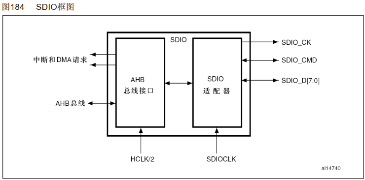
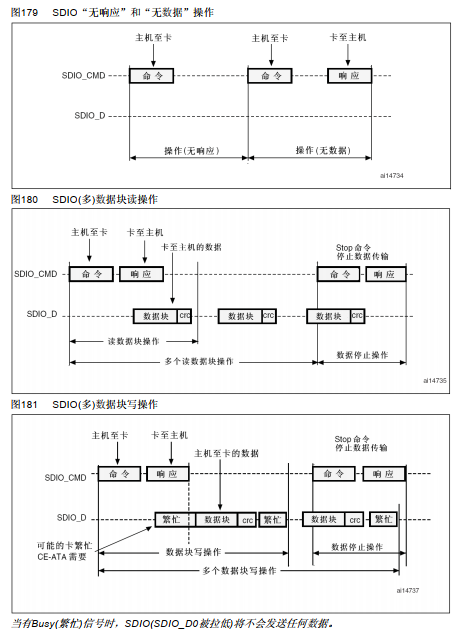
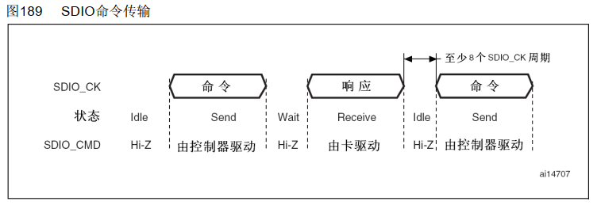
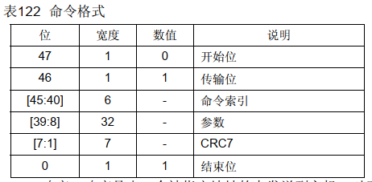
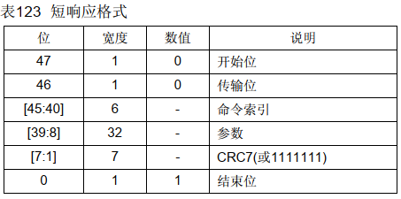
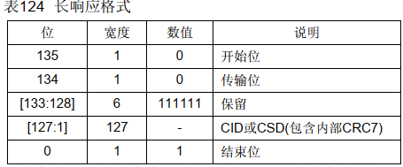
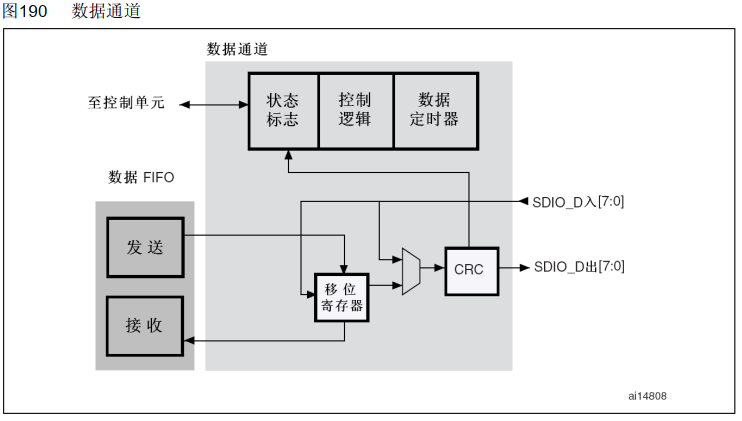
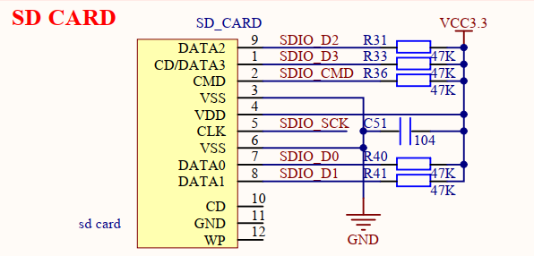

# 单片机总结系列(14) SDIO接口和Fatfs应用

SD/SDIO/MMC是主机提供的用于访问多媒体卡(MMC), SD存储卡和SDIO卡的接口。这里MMC是MultiMediaCard的简称，从本质上看，它是一种用于固态非易失性存储的内存卡(memory card)规范，定义了诸如卡的形态、尺寸、容量、电气信号、和主机之间的通信协议等方方面面的内容。MMC、SD、SDIO的技术本质是一样的(使用相同的总线规范，等等)，都是从MMC规范演化而来；MMC强调的是多媒体存储(MM，MultiMedia)。SD强调的是安全和数据保护(S，Secure)；SDIO是从SD演化出来的，强调的是接口(IO，Input/Output)，不再关注另一端的具体形态(可以是WIFI、BLE、GPS，SD卡等)。对于单片机来说，SDIO接口主要用于访问SDCard以及部分支持SDIO接口的wifi或ETH接口，本篇中以SD卡为例进行说明。

- [SDIO框架说明](#sdio_frame)
  - [SDIO命令通讯说明](#sdio_cmd)
  - [SDIO数据通讯说明](#sdio_data)
- [SDIO驱动实现](#sdio_app)
  - [SDIO驱动初始化实现](#sdio_init)
  - [SDIO轮询模式通讯传输接口](#sdio_poll_rw)
  - [SDIO DMA模式通讯传输接口](#sdio_dma_rw)
- [fatfs文件系统和应用](#sd_fatfs)
- [下一章节](#next_chapter)

## sdio_frame

对于STM32设备，SD/SDIO MMC卡主机模块(SDIO)在AHB外设总线和多媒体卡(MMC)、SD存储卡、SDIO卡和CE-ATA设备间提供了操作接口，其结构如下所示。



1. SDIO适配器模块：实现所有MMC/SD/SD I/O卡的相关功能，如时钟的产生、命令和数据的传送
2. AHB总线接口：操作SDIO适配器模块中的寄存器，并产生中断和DMA请求信号

对于SDIO的接口，主要功能和说明如下所示。

| 接口 | 引脚功能定义 | 详细说明 |
| --- | --- | --- |
| SDIO_CK | 输出 | SDIO时钟接口，主机到卡的时钟线 |
| SDIO_CMD | 双向 | SDIO命令接口，双向的命令响应数据线 |
| SDIO_D[7:0] | 双向 | SDIO数据DATA接口，双向的数据总线 |

复位后默认情况下SDIO_D0用于数据传输；初始化后主机可以改变数据总线的宽度。多媒体卡接到了总线上，则可以使用SDIO_D0、SDIO_D[3:0]或SDIO_D[7:0]进行数据传输。对于MMC版本V3.31和之前版本的协议则只支持单根DATA线，所以只能用SDIO_D0。

总线上的通信是通过传送命令和数据实现。在多媒体卡/SD/SD I/O总线上的基本操作是命令/响应结构，这样的总线操作在命令或总线机制下实现信息交换。另外，某些操作还具有数据令牌。在SD/SDIO存储器卡上传送的数据是以数据块的形式传输；在MMC上传送的数据是以数据块或数据流的形式传输；在CE-ATA设备上传送的数据也是以数据块的形式传输。



### sdio_cmd

其中SDIO命令由SPI命令通道管理，向卡发送命令并从卡接收响应。

写入命令寄存器并设置使能位，开始发送命令。命令发送完成时，命令通道状态机(CPSM)设置状态标志并在不需要响应时进入空闲状态。当收到响应后，接收到的CRC码将会与内部产生的CRC码比较，然后设置相应的状态标志。SDIO命令收发方式如下所示。



SDIO的命令格式包含发送命令格式和响应命令格式，发送命令固定为48位，响应命令则支持两种格式，48位短格式和136位长格式，具体如下。

- SDIO命令格式



- SDIO命令响应短格式



- SDIO命令响应长格式



其中命令响应格式的状态标志如下所示。

| 标志 | 说明 |
| --- | --- |
| CMDREND  | 响应的CRC正确 |
| CCRCFAIL | 响应的CRC错误 |
| CMDSENT | 命令(不需要响应的命令)已经送出 |
| CTIMEOUT | 响应超时 |
| CMDACT | 正在发送命令 |

CRC发生器计算CRC码之前所有位的CRC校验和，包括开始位、发送位、命令索引和命令参数(或卡状态)。对于长响应格式，CRC校验和计算的是CID或CSD的前120位；注意，长响应格式中的开始位、传输位和6个保留位不参与CRC计算。CRC校验和是一个7位的数值：

```C
CRC[6:0] = 余数[(M(x) * x7) / G(x)]
G(x) = x7 + x3 + 1
M(x) = (开始位) * x39 + … + (CRC前的最后一位) * x0, 或
M(x) = (开始位) * x119 + … + (CRC前的最后一位) * x0, 或
```

### sdio_data

数据通道子单元在主机与卡之间传输数据。下图是数据通道的框图。



在时钟控制寄存器中可以配置卡的数据总线宽度。如果选择了4位总线模式，则每个时钟周期四条数据信号线(SDIO_D[3:0])上将传输4位数据；如果选择了8位总线模式，则每个时钟周期八条数据信号线(SDIO_D[7:0])上将传输8位数据；如果没有选择宽总线模式，则每个时钟周期只在SDIO_D0上传输1位数据。

## sdio_app

前面大致对于SDIO的通讯原理进行说明，SDIO通讯包含命令接口和数据接口、命令接口包含发送命令和响应命令，实现卡识别过程、数据接口实现写入和读取数据块，实现数据传输。对于具体的驱动实现，则实现如下。

1. SDIO接口I/O初始化
2. SDIO功能初始化，满足命令和数据通讯功能
3. SDIO命令交互和卡识别
4. SDIO数据通讯交互实现



从原理图上可以看到，除了SDIO标准接口外，还有SDIO_CD脚未连接，SDIO_CD信号的主要作用是指示一个SDIO/MMC卡是否存在。当SDIO/MMC卡被正确插入到对应的插槽中时，SDIO_CD信号会被激活，从而通知系统卡已经到位，可以进行后续的卡识别和数据传输等操作。在SDIO卡的应用中，除了可以插入SD存储卡进行数据存储外，还可以插入各种SDIO接口设备，如蓝牙、WIFI、GPS等，以扩展设备的功能。这些设备在插入后，同样会通过SDIO_CD信号进行识别和初始化。

### sdio_init

SDIO接口功能初始化主要包含时钟，命令和数据口的初始化，配置SDIO模块，识别卡，配置通讯数据线，初始化DMA相关功能。

```c
static SD_HandleTypeDef hsdcard1;
static DMA_HandleTypeDef hdma_sdio_rx;
static DMA_HandleTypeDef hdma_sdio_tx;

GlobalType_t sdcard_driver_init(void)
{
    GPIO_InitTypeDef GPIO_InitStruct = {0};

    //clock rst and enable
    __HAL_RCC_SDIO_FORCE_RESET();
    HAL_Delay(1);
    __HAL_RCC_SDIO_RELEASE_RESET();
    
    // 1. 使能SDIO和I/时钟
    __HAL_RCC_SDIO_CLK_ENABLE();
    __HAL_RCC_GPIOC_CLK_ENABLE();
    __HAL_RCC_GPIOD_CLK_ENABLE();
    
    // 2. 配置I/O位SDIO模式
    /**SDIO GPIO Configuration
    PC8     ------> SDIO_D0
    PC9     ------> SDIO_D1
    PC10     ------> SDIO_D2
    PC11     ------> SDIO_D3
    PC12     ------> SDIO_CK
    PD2     ------> SDIO_CMD
    */
    GPIO_InitStruct.Pin = GPIO_PIN_8|GPIO_PIN_9|GPIO_PIN_10|GPIO_PIN_11
                          |GPIO_PIN_12;
    GPIO_InitStruct.Mode = GPIO_MODE_AF_PP;
    GPIO_InitStruct.Pull = GPIO_PULLUP;
    GPIO_InitStruct.Speed = GPIO_SPEED_FREQ_HIGH;
    GPIO_InitStruct.Alternate = GPIO_AF12_SDIO;
    HAL_GPIO_Init(GPIOC, &GPIO_InitStruct);

    GPIO_InitStruct.Pin = GPIO_PIN_2;
    GPIO_InitStruct.Mode = GPIO_MODE_AF_PP;
    GPIO_InitStruct.Pull = GPIO_PULLUP;
    GPIO_InitStruct.Speed = GPIO_SPEED_FREQ_HIGH;
    GPIO_InitStruct.Alternate = GPIO_AF12_SDIO;
    HAL_GPIO_Init(GPIOD, &GPIO_InitStruct);
    
    // 3. 配置SDIO功能，识别卡(默认1b模式，兼容大部分卡)
    hsdcard1.Instance = SDIO;
    hsdcard1.Init.ClockEdge = SDIO_CLOCK_EDGE_RISING;
    hsdcard1.Init.ClockBypass = SDIO_CLOCK_BYPASS_DISABLE;
    hsdcard1.Init.ClockPowerSave = SDIO_CLOCK_POWER_SAVE_DISABLE;
    hsdcard1.Init.BusWide = SDIO_BUS_WIDE_1B;
    hsdcard1.Init.HardwareFlowControl = SDIO_HARDWARE_FLOW_CONTROL_DISABLE;
    hsdcard1.Init.ClockDiv = SDMMC_CLOCK_DIV;

    if (HAL_SD_Init(&hsdcard1) != HAL_OK)
        return RT_FAIL;

    // 4. 修改位4B模式，提供通讯速率
    if (HAL_SD_ConfigWideBusOperation(&hsdcard1, SDIO_BUS_WIDE_4B) != HAL_OK)
        return RT_FAIL;

#ifdef _SDIO_DMA_SUPPORT
    __HAL_RCC_DMA2_CLK_ENABLE();

    /* SDIO_RX Init */
    // 5. 支持DMA模式，配合TX，RX数据DMA通讯
    hdma_sdio_rx.Instance = DMA2_Stream3;
    hdma_sdio_rx.Init.Channel = DMA_CHANNEL_4;
    hdma_sdio_rx.Init.Direction = DMA_PERIPH_TO_MEMORY;
    hdma_sdio_rx.Init.PeriphInc = DMA_PINC_DISABLE;
    hdma_sdio_rx.Init.MemInc = DMA_MINC_ENABLE;
    hdma_sdio_rx.Init.PeriphDataAlignment = DMA_PDATAALIGN_WORD;
    hdma_sdio_rx.Init.MemDataAlignment = DMA_MDATAALIGN_WORD;
    hdma_sdio_rx.Init.Mode = DMA_PFCTRL;
    hdma_sdio_rx.Init.Priority = DMA_PRIORITY_HIGH;
    hdma_sdio_rx.Init.FIFOMode = DMA_FIFOMODE_ENABLE;
    hdma_sdio_rx.Init.FIFOThreshold = DMA_FIFO_THRESHOLD_FULL;
    hdma_sdio_rx.Init.MemBurst = DMA_MBURST_INC4;
    hdma_sdio_rx.Init.PeriphBurst = DMA_PBURST_INC4;
    if (HAL_DMA_Init(&hdma_sdio_rx) != HAL_OK)
    {
        return RT_FAIL;
    }
    __HAL_LINKDMA(&hsdcard1, hdmarx, hdma_sdio_rx);

    /* SDIO_TX Init */
    hdma_sdio_tx.Instance = DMA2_Stream6;
    hdma_sdio_tx.Init.Channel = DMA_CHANNEL_4;
    hdma_sdio_tx.Init.Direction = DMA_MEMORY_TO_PERIPH;
    hdma_sdio_tx.Init.PeriphInc = DMA_PINC_DISABLE;
    hdma_sdio_tx.Init.MemInc = DMA_MINC_ENABLE;
    hdma_sdio_tx.Init.PeriphDataAlignment = DMA_PDATAALIGN_WORD;
    hdma_sdio_tx.Init.MemDataAlignment = DMA_MDATAALIGN_WORD;
    hdma_sdio_tx.Init.Mode = DMA_PFCTRL;
    hdma_sdio_tx.Init.Priority = DMA_PRIORITY_HIGH;
    hdma_sdio_tx.Init.FIFOMode = DMA_FIFOMODE_ENABLE;
    hdma_sdio_tx.Init.FIFOThreshold = DMA_FIFO_THRESHOLD_FULL;
    hdma_sdio_tx.Init.MemBurst = DMA_MBURST_INC4;
    hdma_sdio_tx.Init.PeriphBurst = DMA_PBURST_INC4;
    if (HAL_DMA_Init(&hdma_sdio_tx) != HAL_OK)
    {
        return RT_FAIL;
    }
    __HAL_LINKDMA(&hsdcard1, hdmatx, hdma_sdio_tx);

    NVIC_SetPriority(DMA2_Stream3_IRQn, 0);
    NVIC_EnableIRQ(DMA2_Stream3_IRQn);
    NVIC_SetPriority(DMA2_Stream6_IRQn, 0);
    NVIC_EnableIRQ(DMA2_Stream6_IRQn);

#endif

    return RT_OK;
}
```

### sdio_poll_rw

SDIO轮询模式通讯交互接口主要包含数据接收接口和数据发送接口。

```c
// sdio读取数据接口
// @buf: 读取数据的缓存
// @startBlocks: 起始块的地址
// @NumberOfBlocks: 写入的块个数
// @return: 返回SD卡读取状态
HAL_StatusTypeDef sdcard_read_disk(uint8_t *buf, uint32_t startBlocks, uint32_t NumberOfBlocks)
{
    HAL_StatusTypeDef status = HAL_OK;
    uint16_t tick = 0;
    
    status = HAL_SD_ReadBlocks(&hsdcard1, (uint8_t*)buf, startBlocks, NumberOfBlocks, SDMMC_READ_WRITE_TIMEOUT);
    
    //wait card ok.
    while((HAL_SD_GetCardState(&hsdcard1) != HAL_SD_CARD_TRANSFER)
    && (tick < SDMMC_READ_WRITE_TIMEOUT))
    {
        hal_delay_ms(1);
        tick++;
    }
    if(tick >= SDMMC_READ_WRITE_TIMEOUT)
    {
        return HAL_TIMEOUT;
    }
    return status;
}

// sdio写入数据接口
// @buf: 写入数据的缓存
// @startBlocks: 起始块的地址
// @NumberOfBlocks: 写入的块个数
// @return: 返回SD卡读取状态
HAL_StatusTypeDef sdcard_write_disk(const uint8_t *buf, uint32_t startBlocks, uint32_t NumberOfBlocks)
{
    HAL_StatusTypeDef status = HAL_OK;
    uint16_t tick = 0;

    status = HAL_SD_WriteBlocks(&hsdcard1, (uint8_t*)buf, startBlocks, NumberOfBlocks, SDMMC_READ_WRITE_TIMEOUT);
    
    //wait card ok.
    while((HAL_SD_GetCardState(&hsdcard1) != HAL_SD_CARD_TRANSFER)
    && (tick < SDMMC_READ_WRITE_TIMEOUT))
    {
        hal_delay_ms(1);
        tick++;
    }
    if(tick >= SDMMC_READ_WRITE_TIMEOUT)
    {
        return HAL_TIMEOUT;
    }

    return status;
}
```

### sdio_dma_rw

SDIO对应DMA模式通讯交互接口主要包含支持DMA传输的数据接收接口和数据发送接口。

```c
//DMA2_Stream3 SDIO DMA RX中断
void DMA2_Stream3_IRQHandler(void)
{
    HAL_DMA_IRQHandler(&hdma_sdio_rx);
}

//DMA2_Stream3 SDIO DMA TX中断
void DMA2_Stream6_IRQHandler(void)
{
    HAL_DMA_IRQHandler(&hdma_sdio_tx);
}

//sdio DMA读取数据接口
//buf: 读取数据的缓存
//startBlocks: 起始块的地址
//NumberOfBlocks: 写入的块个数
HAL_StatusTypeDef sdcard_read_disk(uint8_t *buf, uint32_t startBlocks, uint32_t NumberOfBlocks)
{
    HAL_StatusTypeDef status = HAL_OK;
    uint16_t tick = 0;
    
    ReadCallback_Status = 0;
    status = HAL_SD_ReadBlocks_DMA(&hsdcard1, (uint8_t*)buf, startBlocks, NumberOfBlocks);
    if (status == HAL_ERROR)
    {
       return HAL_ERROR; 
    }
    
    //wait rx finished                                                                                          
    while(HAL_DMA_GetState(&hdma_sdio_rx) != HAL_DMA_STATE_READY
    && (tick < SDMMC_READ_WRITE_TIMEOUT))
    {
        hal_delay_ms(1);
        tick++;
    }
    if(tick >= SDMMC_READ_WRITE_TIMEOUT)
    {
        return HAL_TIMEOUT;
    }
    
    //wait card ok.
    tick = 0;
    while((HAL_SD_GetCardState(&hsdcard1) != HAL_SD_CARD_TRANSFER)
    && (tick < SDMMC_READ_WRITE_TIMEOUT))
    {
        hal_delay_ms(1);
        tick++;
    }
    if(tick >= SDMMC_READ_WRITE_TIMEOUT)
    {
        return HAL_TIMEOUT;
    }
    return status;
}

//sdio DMA写入数据接口
//buf: 写入数据的缓存
//startBlocks: 起始块的地址
//NumberOfBlocks: 写入的块个数
HAL_StatusTypeDef sdcard_write_disk(const uint8_t *buf, uint32_t startBlocks, uint32_t NumberOfBlocks)
{
    HAL_StatusTypeDef status = HAL_OK;
    uint16_t tick = 0;

    WriteCallback_Status = 0;
    status = HAL_SD_WriteBlocks_DMA(&hsdcard1, (uint8_t*)buf, startBlocks, NumberOfBlocks);
    if (status == HAL_ERROR)
    {
       return HAL_ERROR; 
    }
    
    //wait tx finished
    while(HAL_DMA_GetState(&hdma_sdio_tx) != HAL_DMA_STATE_READY
    && (tick < SDMMC_READ_WRITE_TIMEOUT))
    {
        hal_delay_ms(1);
        tick++;
    }
    if(tick >= SDMMC_READ_WRITE_TIMEOUT)
    {
        return HAL_TIMEOUT;
    }
    
    //wait card ok.
    tick = 0;
    while((HAL_SD_GetCardState(&hsdcard1) != HAL_SD_CARD_TRANSFER)
    && (tick < SDMMC_READ_WRITE_TIMEOUT))
    {
        hal_delay_ms(1);
        tick++;
    }
    if(tick >= SDMMC_READ_WRITE_TIMEOUT)
    {
        return HAL_TIMEOUT;
    }

    return status;
}
```

注意：**SDIO初始化会检测SD卡是否存在，不存在会初始化失败，对于开机SD卡不存在的情况，可以在循环中周期性检测SD卡是否存在，存在再进行通讯和初始化。**

## sd_fatfs

FATFS是一个专为小型嵌入式系统设计的FAT文件系统模块，它提供了对FAT12、FAT16和FAT32文件系统的支持。这个模块是用标准C语言编写的，因此具有很好的可移植性，可以很容易地集成到各种微控制器和嵌入式系统中。依据FAT 表中每个簇链的所占位数(有关概念，后面会讲到)分为FAT12、FAT16、FAT32三种格式"变种"，但其基本存储方式是相似的。在嵌入式中，我们一般使用开源的fatfs库进行移植开发，fatfs库的地址如下所示。

- fatfs库下载地址: <http://elm-chan.org/fsw/ff/arc/ff15.zip>

### fatfs_feature

关于fatfs目录的文件说明。

| 文件 | 详细说明 |
| --- | --- |
| ff.c | fatfs核心功能模块，格式化，挂载，文件创建，读/写，删除，接口实现 |
| ff.h | fatfs共用的系统数据结构定义，接口定义 |
| ffconf.h | fatfs配置文件，定义支持的功能  |
| ffsystem.c | 扩展系统和RTOS的扩展接口，大部分情况下不使用 |
| ffunicode.c | 实现了 FatFs 文件系统的字符编码转换功能 |
| diskio.c | 平台相关的代码，这里将文件系统库和硬件关联，实现具体功能 |
| diskio.h | 平台相关数据结构和宏定义 |

作为使用库的开发者，需要修改和实现的内容若下。

1. ffconf.h，配置文件系统支持的接口
2. diskio.c，配置操作硬件的接口功能，操作具体的硬件

关于ffconf.h的，主要配置项和功能如下所示。

| 配置宏 | 功能说明 |
| --- | --- |
| FF_FS_READONLY | 文件系统只读，定义后涉及修改相关的函数会被移除，非特殊情况一般为0 |
| FF_USE_MKFS | 支持格式化接口f_mkfs，需要使用为1 |
| FF_USE_CHMOD | 设置文件的读写权限 |
| FF_VOLUMES | 文件系统支持的逻辑卷数目，每个对应相应硬件 |
| FF_MIN_SS/FF_MAX_SS | 文件系统允许的最小/最大分区大小 |
| FF_USE_LABEL | 支持是否用盘符名称(磁盘名称)读取相应的物理盘 |
| FF_FS_EXFAT | 是否支持exfat的格式处理 |

关于diskio.c，则实现相应的交互接口，以SDCard为例。

```c
// 查询SDCard状态
// sd卡未检测或者未初始化返回-1，其它返回0
int MMC_disk_status(void)
{
    return 0;
}

// SDCard接口初始化
// sdio接口和sd卡初始化，成功返回0，失败返回-1
// 若sd卡单独初始化，可以直接返回0
int MMC_disk_initialize(void)
{
    return 0;
}

// SDCard读取接口
int MMC_disk_read(BYTE *buff, LBA_t sector, UINT count)
{
    if(sdcard_read_disk(buff, sector, count) != HAL_OK)
    {
        sdcard_driver_init();
        return -1;
    }
    return 0;
}

// SDCard写入接口
int MMC_disk_write(const BYTE *buff, LBA_t sector, UINT count)
{
    if(sdcard_write_disk(buff, sector, count) != HAL_OK)
    {
        sdcard_driver_init();
        return -1;
    }
    return 0;
}

// 读取SDCard功能
int MMC_disk_ioctl(BYTE cmd, void *buff)
{
    switch(cmd)
    {
        //擦除块长度，对于SDCard长度和扇区一致
        case GET_BLOCK_SIZE:
            *(DWORD *)buff = MMC_SECTOR_SIZE;
            break;

        // 返回SDCard扇区的长度，512字节
        case GET_SECTOR_SIZE:
            *(WORD *)buff = MMC_SECTOR_SIZE;
            break;

        // 返回SDCard扇区的个数，总容量/512字节
        case GET_SECTOR_COUNT:
            *(DWORD *)buff = MMC_SECTOR_COUNT;
            break;
        case CTRL_SYNC:
            break;
    }
    return 0;
}
```

### fatfs_app

对于fatfs应用，主要包含以下接口。

| 接口 | 功能说明 |
| --- | --- |
| f_mount | 用于挂载或卸载一个逻辑卷 |
| f_mkfs | 指定的逻辑驱动器上创建文件系统，即格式化存储介质 |
| f_open | 创建或打开一个文件 |
| f_read | 从已打开的文件中读取数据 |
| f_write | 将缓冲区中的数据写入到已经打开的文件中 |
| f_sync | 刷新文件写缓存，确保数据从缓存区写入到存储介质中 |
| f_close | 关闭一个已经打开的文件对象 |

具体应用如下。

```c
void fatfs_app(void)
{
    FATFS fs;
    FIL fil;
    UINT bw;  
    FRESULT res;
    
    // 挂载文件系统
    res = f_mount(&fs, "1:", 1);
    if(res == FR_OK)
    {
       goto __mount;
    }
    else
    {
        // 格式化，创建文件系统
        res = f_mkfs("1:", 0, work, FF_MAX_SS);
        if(res == FR_OK)
        {
            res = f_mount(&fs, "1:", 1);

            if(res == FR_OK)
            {
 __mount:
                // 以支持对写的方式打开文件
                res = f_open(&fil, "1:hello.txt", FA_READ | FA_WRITE);
                if(res != FR_OK)
                {
                   PRINT_LOG(LOG_DEBUG, HAL_GetTick(), "f_mount open failed!");
                }
                else
                {
                    // 读取文件内容
                    f_read(&fil, work, 64, &bw);
                    if(bw != 0)
                    {
                        work[bw] = 0;             
                        PRINT_LOG(LOG_DEBUG, HAL_GetTick(), "%s", work); 
                    }
                    f_close(&fil);
                }
                f_mount(0, "1:", 0);
            }
            else
            {
               PRINT_LOG(LOG_DEBUG, HAL_GetTick(), "f_mount failed:%d", res); 
            }
        }
        else
        {
            PRINT_LOG(LOG_DEBUG, HAL_GetTick(),  "f_mkfs failed:%d", res); 
        }
    }
}
```

本例程详细代码见：[SDIO接口通讯代码实现](./../code/14-STM32F429_SDIO/)。

## next_chapter

[返回目录](./../README.md)

直接开始下一小节: [FMC接口模块](./ch15.fmc_interface.md)
