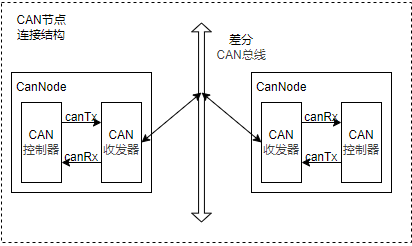
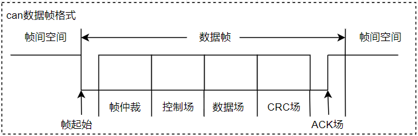
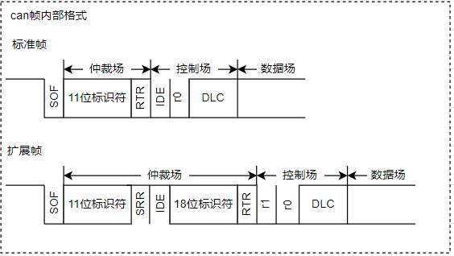
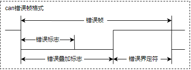
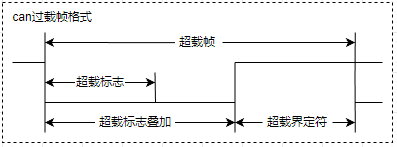
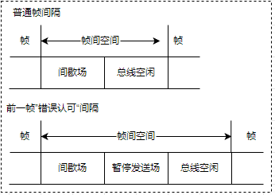
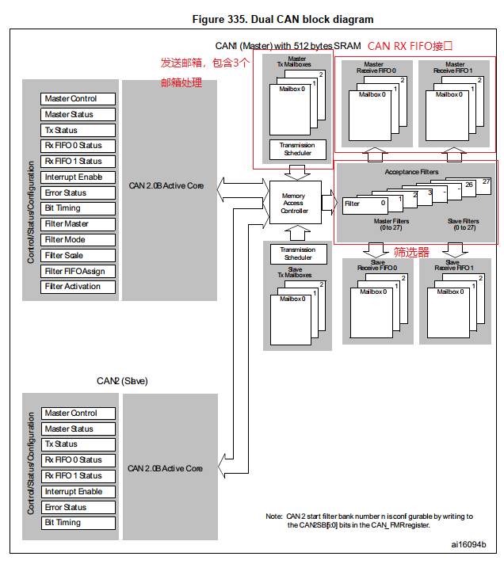
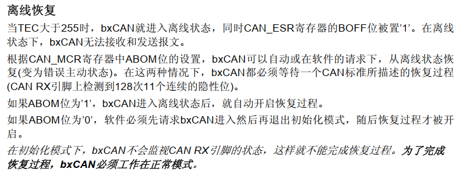
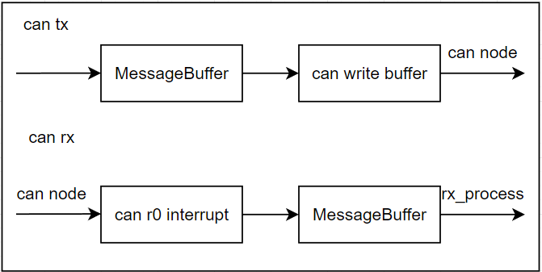

# 单片机技术总结说明(15) CAN通讯接口模块说明

CAN协议(Controller Area Network)，全称控制器局域网协议，是一种串行通讯协议；广泛用于汽车、工业控制、船舶、航空航天等领域。理解CAN协议，首先要对通信协议有一定的概念；通信协议又称通信规程，是指通信双方对数据传送控制的一种约定。对于协议约定，可以包括数据格式、同步方式、传送速度、传送步骤、检验纠错方式以及控制字符定义等；通过统一格式规定，通信双方必须共同遵守，它也叫做链路控制规程。CAN总线传输协议定义了物理接口和帧结构说明，对应通讯协议中的物理层和数据链路层。至于更上层的协议，则由用户根据需求重新定义，如CanOpen协议等。

CAN通信(控制局域网接口)用来在局域网中传递信息，具有高效传输、处理报文迅速特点。它废除了传统的站编码地址，而采用通讯数据块编码，理论上网络上的节点数目可以达到一百多个；但在实际应用中，CAN总线受电气特性、总线设计和协议层限制，一般最多几十个节点。

CAN数据块的标识符由标准位(11位)和扩展位(19位)组成，可选11或29位。其中数据段长度最多为8个字节，可采用CRC校验并提供相应的错误处理功能，保证了数据的可靠性。另外CAN通信采用多主机竞争总线结构；数据发送过程中，具有最低二进制数标识符的数据帧具有最高的优先级，且这些标识符在系统确定后就不得更改。

CAN的位流是按照非归零(NRZ)码方式编码，一个完整的位电平有显性和隐性两种方式。对于电平的显性和隐性是根据CAN总线上的差分电压"VCAN1H-VCAN1L"来进行判断，若小于阈值则为隐性位，代表逻辑1；大于阈值则为显性位，代表逻辑0。对于CAN总线来说，空闲时处于隐性状态，此时CAN节点可以进行发送操作。

本节目录说明如下所示。

- [CAN总线协议](#can_bus_protocol)
  - [CAN数据帧](#can_package)
- [STM32 CAN框架结构](#stm32_can_frame)
- [STM32 CAN应用实现](#stm32_can_app)
  - [STM32 CAN读写接口](#can_rw_interface)
- [总结说明](#summary)
- [下一章节](#next_chapter)

## can_bus_protocol

对于CAN总线通讯协议，可以分为物理层和数据链路层；常见的连接拓扑如下所示。



由上图可以看到，CAN是以CAN Node为单个节点挂载在CAN Bus上。对于每个CAN Node来说，又由CAN收发器和CAN控制器两部分组成。

1. CAN收发器，对应物理层设备，对于发送，将逻辑数据转换为差分信号；对于接收，将差分信号转换为逻辑数据。
2. CAN控制器，对应数据链路层设备，用于控制CAN收发器，实现CAN协议的物理层和数据链路层规范；如帧同步、帧传输、帧接收、帧发送以及总线仲裁功能实现。一般来说CAN控制器集成在SOC或者MCU芯片中，由软件进行控制。

上述器件对应的协议框架如下所示。

- 物理层，包含了CAN协议的物理层规范，规定了CAN协议的电气特性，如信号的传输方式，信号的电平、传输距离、编码方式等
  - 信号的传输方式：差分信号传输，通过CANH和CANL两根线传输差分信号，通过两者电压差值判断信号状态。若VCANH-VCANL小于阈值为隐性位（逻辑 1），大于阈值为显性位（逻辑 0），总线空闲时处于隐性状态，这种编码方式又称为非归零编码。
- 数据链路层，包含了CAN协议的数据链路层规范，规定了CAN协议的帧结构，帧格式，帧同步方式，帧传输方式等
  - 帧结构：CAN协议的帧结构由帧起始、仲裁场、控制场、数据场、CRC场、应答场组成。
  - 帧同步：CAN协议的帧同步方式为显性同步方式，即发送器在发送帧起始标志（SOF）时，将CANH和CANL两根线同时拉低，从而使总线处于显性状态。
  - 帧传输：CAN协议的帧传输方式为异步方式，即发送器和接收器可以同时发送和接收数据，不需要同步。
  - 帧接收：CAN协议的帧接收方式为总线监听方式，即接收器在总线空闲时，检测总线电平，如果总线电平为显性，则接收器认为总线处于空闲状态，此时接收器可以接收数据。

对于应用来说，主要理解数据链路层即可，具体内容如下。

### can_package

CAN数据帧由7个段组成，分别是帧起始（SOF）标志，仲裁场，控制场，数据场，CRC场和ACK场组成，具体格式如下所示。



- 帧起始（SOF）标志数据帧或远程帧的开始，仅由一个“显性”位组成。只有在总线空闲时才允许节点开始发送（信号）。所有节点必须同步于首先开始发送报文的节点的帧起始前沿。
- 仲裁场 由标识符和传送帧类型(RTR)组成的仲裁场，RTR位在数据帧中为显性，在远程帧中为隐性。
- 控制场 由标识符类型控制位IDE，保留位r0，以及帧长度选择位DLC构成的。
- 数据场 由数据帧里的发送数据组成。
- CRC场 由CRC序列（CRC Sequence），以及CRC界定符（CRC Delimiter）。CRC序列之后是CRC界定符，它包含一个单独的“隐性”位。
- ACK场（ACK Field） 2位，包含应答间隙（ACK Slot）和应答界定符（ACK Delimiter），当接收器正确地接收到有效的报文，接收器就会在应答间隙（ACK Slot）期间向发送器发送1“显性”位以示应答。
  - 应答间隙，所有接收到匹配CRC序列的节点会在应答间隙期间用“显性”的位写入发送器的“隐性”位来做出回答。
  - 应答界定符，应答界定符是应答场的第二个位，必须为“隐性”的位。因此，应答间隙（ACK Slot）被两个“隐性”的位所包围，也就是CRC界定符和应答界定符。

其中标准帧和扩展帧的主要区别是仲裁场的不同，具体格式如下所示。



上图中的参数解析如下。

1. 标识符字段由11位或29位组成，代表着在CAN总线中的ID；其中11位标识符为标准标识符，29位标识符为扩展标识符(由11位和18位两部分组成)。
2. RTR位用于区分远程帧和数据帧，其中RTR位为显性位(逻辑0)，代表数据帧；RTR位为隐性位(逻辑1)，代表远程帧。
3. IDE位用于区分标准帧和扩展帧，显性位(逻辑0)，代表标准帧；IDE位为隐性位(逻辑1)，代表扩展帧。
4. 对于扩展帧，在RTR位置填充为隐形位的SRR，用于保证确保扩展帧优先级更低
5. r0和r1为保留位，保留位必须为显性位。

在通讯过程中，"显性"具有"优先"的意味，只要有一个单元输出显性电平，总线上即为显性电平。

当节点检测到线上电平与发送位电平不一致时，如果此时在仲裁场或控制场，则退出总线竞争；如果不在此场段，则产生错误事件(在帧ACK场和错误帧传输时除外)。基于上述机制，实现CAN的总线仲裁。

1. 对目的不同ID的CAN节点发送数据，因为ID从高位到低位发送，ID值小的节点会更晚发送隐形位，因此具有更高的优先级。
2. 数据帧的RTR为显性位，遥控帧RTR为隐性位，目的ID相同时，数据帧具有更高优先级
3. 标准帧的IDE为显性位，扩展帧的IDE为隐性位，目的ID相同时，标准帧具有更高的优先级。
4. 对于目的ID，帧类型都相同的情况，当总线电平不一致时，为显性位的继续发送，隐形位的会产生错误，错误累积一定时则触发bus off事件，从CAN总线掉线，直到软件进行复位或者相应处理。

这就是数据帧仲裁的主要机制。参考上述格式，CAN报文包含数据帧，遥控帧，错误帧和过载帧四种类型。

- 数据帧：数据帧将数据从发送器传输到接收器，其格式就是完整的CAN报文格式。
- 遥控帧：总线节点发出遥控帧，请求发送具有同一识别符的数据帧，请求帧除了不带数据场，其它字段与数据帧相同。
- 错误帧：任何节点检测到总线错误就发出错误帧。
- 过载帧：过载帧用以在先行的和后续的数据帧（或远程帧）之间提供附加的延时。
- 帧间隔：帧间隔是用于分隔数据帧和遥控帧的帧。数据帧和遥控帧可通过插入帧间隔将本帧与前面的任何帧（数据帧、遥控帧、错误帧、过载帧）分开。

数据帧和遥控帧的格式属于上面的标准帧和扩展帧格式，这里不在赘述。

错误帧由不同节点提供的错误标志（Error Flag）的叠加以及错误界定符两部分组成，格式如下。



- 错误标志：有两种形式的错误标志：激活错误标志和认可错误标志。
  - "激活错误”标志由6个连续的“显性”位组成
  - “认可错误”标志由6个连续的“隐性”的位组成，除非被其他节点的“显性”位重写。
- 错误界定符：错误界定符包括8个“隐性”的位。
- 错误标志传送了以后，每一个节点就发送一个“隐性”的位，并一直监视总线直到检测出一个“隐性”的位为止，然后就开始发送其余7个“隐性”位。

过载帧（Overload Frame）包括两个位场：过载标志和过载界定符，其结构如图所示：



有三种过载的情况会引发过载标志的传送。

1.接收器的内部情况，需要延迟下一个数据帧和远程帧。
2.在间歇的第一和第二字节检测到一个“显性”位。
3.如果CAN节点在错误界定符或过载界定符的第8位（最后一位）采样到一个显性位，节点会发送一个过载帧。该帧不是错误帧，错误计数器不会增加。

过载标志:过载标志由6个“显性”的位组成。过载标志的所有形式和“激活错误”标志的一样
过载界定符：过载界定符包括8个“隐性”的位，具体动作与错误界定符一致

帧间隔：数据帧（或远程帧）与遥控帧的隔离是通过帧间空间实现的，无论此先行帧类型如何（错误帧、过载帧）。所不同的是，过载帧与错误帧之前没有帧间空间，多个过载帧之间也不是由帧间空间隔离的。



帧间空间包括间歇、总线空闲的位场。如果“错误认可”的节点已作为前一报文的发送器，则其帧间空间除了间歇、总线空闲外，还包括称作“挂起传送”（暂停发送）的位场。

1. 间歇场，包含3个位隐性位
2. 总线空闲，全隐性电平，没有限制
3. 暂停发送场，8个位隐性位，只在处于被动错误状态的单元刚发送一个消息后的帧间隔中包含的段

上述信息基本包含CAN协议包的数据包格式，仲裁机制，算协议中比较核心的部分；不过如果没有整个CAN通讯的概念，理解起来仍然很迷惑，这很正常，因此这里以STM32的应用实践来显示协议的实现处理。

## stm32_can_frame

对于STM32中CAN模块，其框架如下所示。



其特性如下所示。

- 支持2.0A及2.0B Active 版本CAN协议。
- 包含三个独立的发送邮箱，可配置根据先后顺序或者标识符顺序控制发送优先级。
- 两个具有三级深度的接收FIFO，每个都支持可调整的筛选器组，可以处理接收两个设置目的ID不同的地址。
- 支持可配置的重发机制，禁止后，每个发送仅启动一次。如果第一次尝试失败，由于仲裁丢失或错误，硬件将不会自动重新启动消息发送。

## stm32_can_app

对于CAN模块的，初始化格式步骤如下。

1. 使能GPIO和CAN相关时钟
2. 初始化GPIO接口，复用为CAN功能
3. 初始化为CAN模块功能
4. 配置CAN过滤器功能，用于定义允许的接收ID范围

具体实现如下。

```c
static CAN_HandleTypeDef hcan1;
static CAN_FilterTypeDef  hcan1_filter;

//------ global function ------
GlobalType_t can_driver_init(void)
{
    GPIO_InitTypeDef GPIO_InitStruct = {0};
    
    // 使能GPIO和CAN相关时钟
    __HAL_RCC_CAN1_CLK_ENABLE();
    __HAL_RCC_GPIOA_CLK_ENABLE();
    
    // 复用GPI功能为CAN模式
    GPIO_InitStruct.Pin = GPIO_PIN_11 | GPIO_PIN_12;
    GPIO_InitStruct.Mode = GPIO_MODE_AF_PP;
    GPIO_InitStruct.Pull = GPIO_NOPULL;
    GPIO_InitStruct.Speed = GPIO_SPEED_FREQ_VERY_HIGH;
    GPIO_InitStruct.Alternate = GPIO_AF9_CAN1;
    HAL_GPIO_Init(GPIOA, &GPIO_InitStruct);
    
    // CAN模式初始化
    hcan1.Instance = CAN1;
    hcan1.Init.Mode = CAN_MODE_LOOPBACK;        // 环回模式，在此模式下，bxCAN 将执行从发送输出到接收输入的内部反馈

    //CAN模块的波特率为 45M/6/(1+6+8) = 500K, 高速CAN是在125K~1M之内，满足要求
    //BitTime = tq + tbs1 + tbs2；tq为同步段，tbs1为同步段到采样点时间，tbs2为采样点到发送点时间
    hcan1.Init.Prescaler = 6;                   // 波特率预分频器，定义时间片的长度
    hcan1.Init.SyncJumpWidth = CAN_SJW_1TQ;     // 再同步跳转宽度，执行再同步时最多可以将位加长或缩短的时间片数目。
    hcan1.Init.TimeSeg1 = CAN_BS1_8TQ;          // 时间段1，定义时间段1中的时间片数目
    hcan1.Init.TimeSeg2 = CAN_BS2_6TQ;          // 时间段2，定义时间段2中的时间片数目
    hcan1.Init.TimeTriggeredMode = DISABLE;     // 用于为接收和发送邮箱生成时间戳值
    
    // 管理功能配置
    hcan1.Init.AutoBusOff = ENABLE;             // 自动的总线恢复管理，一旦监测到128次连续11个隐性位，即通过硬件自动退出总线关闭状态
    hcan1.Init.AutoWakeUp = DISABLE;            // 自动唤醒模式，控制CAN硬件在睡眠模式下接收到消息时的行为。
    hcan1.Init.AutoRetransmission = ENABLE;     // 禁止自动重发送 (No automatic retransmission)
    hcan1.Init.ReceiveFifoLocked = DISABLE;     // 接收FIFO上溢后不锁定，下一条传入消息将覆盖前一条消息，否则丢弃
    hcan1.Init.TransmitFifoPriority = DISABLE;  // 发送FIFO优先级 (Transmit FIFO priority)，0由消息标识符确定，1由时间顺序确定
    if (HAL_CAN_Init(&hcan1) != HAL_OK)
    {
        return RT_FAIL;
    }

    // 配置过滤器，关联接收FIFO0
    // 设置ID和屏蔽位都为全0，表示允许接收所有ID的CAN消息，用于测试
    hcan1_filter.FilterIdHigh = 0x0000;                     // 32位ID
    hcan1_filter.FilterIdLow = 0x0000;
    hcan1_filter.FilterMaskIdHigh  = 0x0000;                // 32位掩码，0不使用此位进行比较，1表示必须匹配
    hcan1_filter.FilterMaskIdLow = 0x0000;  
    hcan1_filter.FilterFIFOAssignment = CAN_FILTER_FIFO0;   // 过滤器0关联到FIFO0
    hcan1_filter.FilterBank = 0;                            // 过滤器0
    hcan1_filter.FilterMode = CAN_FILTERMODE_IDMASK;
    hcan1_filter.FilterScale = CAN_FILTERSCALE_32BIT;
    hcan1_filter.FilterActivation = ENABLE;                 // 激活滤波器0
    hcan1_filter.SlaveStartFilterBank = 14;
    if(HAL_CAN_ConfigFilter(&hcan1, &hcan1_filter) != HAL_OK)
    {
        return RT_FAIL;    
    }

    // 使能中断接受
    HAL_NVIC_SetPriority(CAN1_RX0_IRQn, 0, 0);
    HAL_NVIC_EnableIRQ(CAN1_RX0_IRQn);
    
    // 使能CAN工作和接收中断
    HAL_CAN_ActivateNotification(&hcan1, CAN_IT_RX_FIFO0_MSG_PENDING);
    HAL_CAN_Start(&hcan1);

    return RT_OK;
} 
```

对于自动总线恢复管理，这里涉及CAN协议相关的知识点，其功能说明如下所示。



CAN协议规定作为CAN节点，当积累的发送错误达到255个时(无论是因为硬件错误、总线抢占还是其它问题)，节点就会进入Bus off状态，不在响应CAN收发功能；如果设置使能，只需要等待128个连续11个隐性位，即可自动恢复到正常状态；否则需要先初始化CAN在退出CAN初始化模式，然后等待128个连续11个隐性位，才可自动恢复到正常状态。在节点数目较少、通讯频率低时，其实很难触发bus off异常。不过在实际应用中，因为节点数目高，通讯频率也比较多的场景，运行一段时间是有可能Bus off的，这时就会显示为节点上的设备故障了，需要执行初始化再使能流程才能恢复，比较复杂。这里建议是打开自动恢复，不过也要增加日志记录，可以统计下出错的概率，来分析是否CAN线、匹配电阻或软件是否有问题。

### can_rw_interface

对于STM32来说，错误帧和过载帧由硬件处理；其中数据帧和遥控帧由软件处理，由内部结构体"CAN_TxHeaderTypeDef"管理，其定义如下所示。

```c
typedef struct
{
  uint32_t StdId;   // 标准ID，0x0 ~ 0x7FF   
  uint32_t ExtId;   // 扩展ID，0x0 ~ 0x1FFFFFFF
  uint32_t IDE;     // 类型CAN_ID_STD和CAN_ID_EXT
  uint32_t RTR;     // 类型CAN_RTR_DATA和CAN_RTR_REMOTE
  uint32_t DLC;     // 数据长度0 ~ 8
  FunctionalState TransmitGlobalTime; // 时间戳使能，ENABLE/DISABLE
} CAN_TxHeaderTypeDef;
```

注意： 时间戳使能时，驱动中会替换数据帧的"第六、七字节"为时间戳，此时数据长度DLC则必须设置为8才有效。

对于CAN通讯，其流程如下所示。



可以看到发送节点负责将应用层协议数据通过CAN总线发送出去，而接收节点则负责从CAN总线上接收数据，并将其解析为应用层协议数据。关于CAN发送和接收的数据接口如下所示。

```c
// 数据发送接口
// @hcan: CAN句柄
// @pHeader: 指向CAN_TxHeaderTypeDef结构体的指针，包含发送的帧头信息
// @aData: 指向要发送数据的数组指针
// @pTxMailbox: 指向用于存储发送邮箱索引的变量指针
// @return: HAL状态枚举值，指示操作是否成功
HAL_StatusTypeDef HAL_CAN_AddTxMessage(CAN_HandleTypeDef *hcan, CAN_TxHeaderTypeDef *pHeader, uint8_t aData[], uint32_t *pTxMailbox);

// 数据接收接口
// @hcan: CAN句柄
// @RxFifo: 接收FIFO编号，CAN_RX_FIFO0或CAN_RX_FIFO1
// @pHeader: 指向CAN_RxHeaderTypeDef结构体的指针，用于存储接收的帧头信息
// @aData: 指向用于存储接收数据的数组指针
// @return: HAL状态枚举值，指示操作是否成功
HAL_StatusTypeDef HAL_CAN_GetRxMessage(CAN_HandleTypeDef *hcan, uint32_t RxFifo, CAN_RxHeaderTypeDef *pHeader, uint8_t aData[]);
```

这里以数据帧通讯接口进行说明，包含标准帧和扩展帧的发送、数据接收等，具体如下所示。

```c
#define MAX_CAN_DLC   8

// 数据帧的发送接口，每帧的数据最大长度不得超过8字节
GlobalType_t can_write_std(uint8_t *data, uint8_t len)
{
    CAN_TxHeaderTypeDef txHeader;
    uint32_t mailbox;
    uint8_t index;
    
    if (len > MAX_CAN_DLC) {
        return RT_FAIL;
    }
    
    // 初始化标准帧帧头数据
    txHeader.IDE = CAN_ID_STD;          // 指定为标准帧
    txHeader.StdId = CAN_STD_ID_DATA;   // 标准ID值
    txHeader.RTR = CAN_RTR_DATA;        // 数据帧
    txHeader.DLC = len;                 // 数据长度
    
    // 发送数据，等待发送完成
    while (HAL_CAN_AddTxMessage(&hcan1, &txHeader, data, &mailbox) != HAL_OK) {
        index++;
        if (index > 50) {
            return RT_FAIL;
        }
        vTaskDelay(1);
    }
   
    return RT_OK;
}
```

扩展帧发送数据格式则如下所示。

```c
GlobalType_t can_write_ext(uint8_t *data, uint8_t len)
{
    CAN_TxHeaderTypeDef txHeader;
    uint32_t mailbox;
    uint8_t index;
    
    if (len > MAX_CAN_DLC) {
        return RT_FAIL;
    }
    
    // 初始化扩展帧帧头数据
    txHeader.IDE = CAN_ID_EXT;          // 指定为扩展帧
    txHeader.ExtId = CAN_EXT_ID_DATA;   // 扩展ID
    txHeader.RTR = CAN_RTR_DATA;        // 数据帧
    txHeader.DLC = len;                 // 数据长度
    
    // 发送数据，等待发送完成
    while (HAL_CAN_AddTxMessage(&hcan1, &txHeader, data, &mailbox) != HAL_OK) {
        index++;
        if (index > 50) {
            return RT_FAIL;
        }
        vTaskDelay(1);
    }
   
    return RT_OK;
}
```

接收数据则使用CAN中断回调函数，具体实现如下。

```c
void CAN1_RX0_IRQHandler(void)
{
    HAL_CAN_IRQHandler(&hcan1);
}

// 接收数据，投递到缓存中
void HAL_CAN_RxFifo0MsgPendingCallback(CAN_HandleTypeDef* hcan)
{
    uint8_t Data[8];
    CAN_RxHeaderTypeDef RxMessage;
    BaseType_t xHigherPriorityTaskWoken = pdFALSE; 

    if (HAL_CAN_GetState(&hcan1) != RESET) {
        HAL_CAN_GetRxMessage(&hcan1, CAN_RX_FIFO0, &RxMessage, Data);
        
        // 投递到缓存中
        xMessageBufferSendFromISR(can_info.xRxMessageBuffer,
                                ( void * ) Data,
                                RxMessage.DLC,
                                &xHigherPriorityTaskWoken );
    }
                                            
    portYIELD_FROM_ISR( xHigherPriorityTaskWoken );
}
```

## summary

CAN协议作为多主多从的通信协议，支持多个节点同时发送和接收数据，总结起来优点如下。

1. CAN通讯通过总线型拓扑形式，布线简单，具有较高的灵活性和可扩展性。
2. CAN模块支持错误检测和纠正机制，自动重传和故障节点失效等功能，可以大幅度提高系统的可靠性。
3. 对于每个CAN节点，可以根据优先级自动仲裁数据，这些规定很大程度上降低了应用层的开发难度，也保证了系统的实时性。

不过CAN也并非没有有缺点，例如传输速率较低(125Kbps-1Mbps)，每包数据被限制为最多8个字节，且有冗余的控制字段，带宽不高。当CAN节点数目较多时，部分优先级低的节点就会因为冲突，频繁发送失败，影响整个系统的通讯效率。正是这些特性，CAN协议被广泛应用于汽车电子、工业控制、船舶、航空航天控制领域中实时性要求高，但是数据量不大的场景，如传感器信息采集、命令和数据交互等。对于数据量大的场景，如音视频同步、升级管理，则建议使用ETH网络、WIFI、4G/5G等网络通讯协议实现目的，在合适的场

## next_chapter

[返回目录](./../README.md)

直接开始下一小节: [算法应用模块](./ch16.algorithm.md)