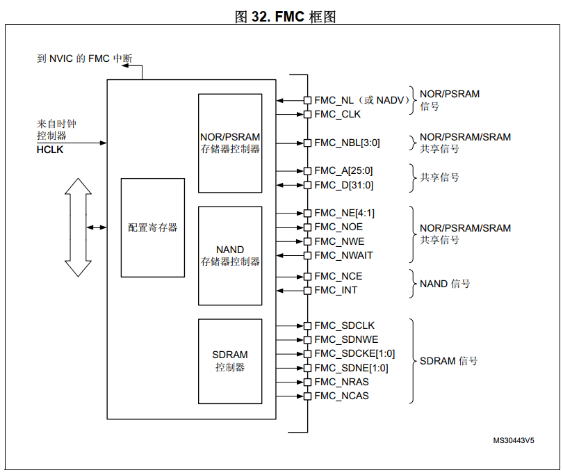
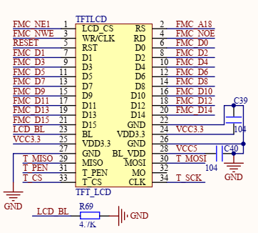
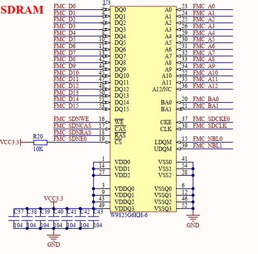

# 单片机总结系列(15) FMC接口模块

FMC接口是ST公司定义的，用于访问同步/异步静态存储器(SRAM), PSRAM, SDRAM(同步动态存储器)和NAND FLASH等存储器的接口，另外部分自带显存的LCD屏幕也使用类似的接口，也可以使用FMC接口访问。和SPI，I2C，SDIO接口相比，FMC由时钟线，片选线和多条数据线构成，是典型的并行访问接口，直接理解起来相对复杂，另外FMC连接的器件如SDRAM，PSRAM也需要很多的配置才能够正常工作，学习和理解FMC和相应器件是比较有挑战性的难题，这里抽丝剥茧，从FMC框架开始，再到器件去理解FMC外设和功能。

## fmc_module

FMC的构成如下所示，由四部分构成。

各组成部分如下所示。

1. AHB接口，主要包含FMC配置寄存器
2. NOR FLASH/PSRAM/SRAM控制器，LCD显存属于类似SRAM的交互。分配区域为0x60000000~0x6FFFFFFF, 容量为4x64MB,
3. SDRAM控制器，分配区域为0xC0000000~0xDFFFFFFF, 容量为512MB
4. Nand控制器，分配区域为0x80000000~0x8FFFFFFF, 容量256MB

基于上述控制器的设计，FMC对应得引脚如下所示。

- NOR_FLASH/PSRAM/SRAM引脚

| 引脚标识 | 引脚功能 | 所属控制器 |
| --- | --- | --- |
| FMC_A[25:0] | 地址总线 | 所有控制器共享 |
| FMC_D[31:0] | 双向数据总线 | 所有控制器共享 |
| FMC_NE[4:1] | 片选信号 | NOR FLASH/PSRAM/SRAM片选 |
| FMC_NOE |  输出使能   | NOR FLASH/PSRAM/SRAM/NAND |
| FMC_NWE |  写入使能   | NOR FLASH/PSRAM/SRAM共享 |
| FMC_NL | NOR FLASH的锁存使能  | NOR FLASH/PSRAM |
| FMC_CLK | 时钟同步 | NOR FLASH/PSRAM时钟同步 |
| FMC_NBL[3:0] | 字节通道输出(高低字节使能) | PSRAM/SRAM/SDRAM(16字节允许写入, 否则不存在) |
| FMC_NWAIT | FLASH就绪等待信号    | NOR FLASH/NAND FLASH |

典型的LCD以SRAM连接如下所示。

- SDRAM引脚

| 引脚标识 | 引脚功能 | 所属控制器 |
| --- | --- | --- |
| SDCKE[1:0] | 存储区域时钟使能 | SDRAM引脚 |
| SDKE[1:0] | 存储区域芯片使能 | SDRAM引脚 |
| FMC_A[12:0] | 地址总线 | 所有控制器共享 |
| FMC_D[31:0] | 双向数据总线 | 所有控制器共享 |
| FMC_BA[1:0] | 存储区域地址 | SDRAM内部BANK选择 |
| FMC_NBL[3:0] | 字节通道输出(高低字节使能) | PSRAM/SRAM/SRAM(16字节允许写入, 否则不存在) |
| FMC_SDCLK | 时钟 | SDRAM引脚 |
| FMC_SDNRAS | 行地址选通 | SDRAM引脚 |
| FMC_SDNCAS | 列地址选通 | SDRAM引脚 |
| FMC_SDNWE | 写入使能 | SDRAM引脚 |

对于FMC的控制，包含引脚配置，FMC功能模块配置，外设模块配置

## 下一章节

[返回目录](./../README.md)

直接开始下一小节: [ch16.CAN接口模块](./ch16.can_interface.md)
