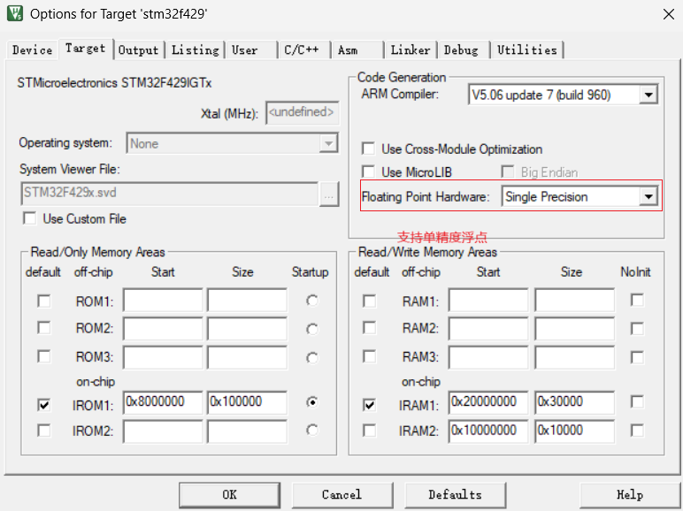
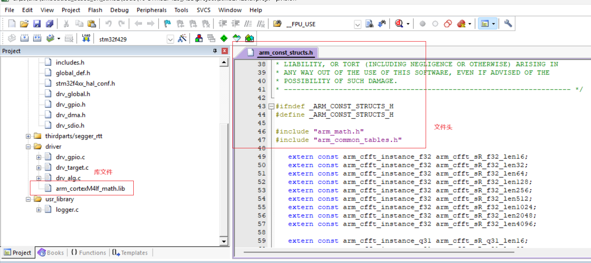

# 单片机技术总结说明(16) 算法应用和FPU应用

对于单片机来说，算法模块是用于加速特定运算，提高运行效率的重要模块。在单片机中，常见支持的算法模块有RNG随机数算法、CRC校验算法、哈希算法、加解密算法等，具体说明如下所示。

- RNG算法，硬件随机数生成器，用于产生可靠的随机数(通过硬件生成的经过验证的随机数比传统软件生成的随机数更安全，可用于加密请求，防止重放攻击等场景)
- CRC算法，循环冗余校验算法，用于检测数据传输过程中是否出现错误，和软件计算方法基本一致，但效率更高
- 哈希算法，用于将任意长度的数据映射到固定长度的哈希值，用于数据完整性校验，防止数据篡改等场景
- 加解密算法，如AES，DES等，用于保护数据的安全性，实现数据的加密和解密，提高可靠性，硬件方式可以降低处理时间，提高芯片处理效率

作为本系列进行说明的单片机型号为STM32F429ZIT6，其支持的算法模块分别是RNG和CRC算法，在本节中进行相应说明。

本节目录如下所示。

- [RNG算法和应用](#rng)
- [CRC算法和应用](#crc)
- [FPU应用](#fpu)
- [总结说明](#summary)
- [下一章节](#next_chapter)

## rng

RNG处理器是一个以连续模拟噪声为基础的随机数发生器，在主机读数时提供一个32位的随机数。对于RNG模块，其框架如下所示。


可以看到，生成和使用随机数都十分简单；主要流程如下所示。

1. 配置RNG_CR寄存器，使能RNG模块。
2. 等待RNG模块准备就绪，即等待RNG_SR寄存器的RDY位为1。
3. 读取RNG_DR寄存器，即可获取随机数。

详细代码如下所示。

```c
static GlobalType_t driver_rng_init(void)
{
    // 启用RNG时钟
    __HAL_RCC_RNG_CLK_ENABLE();
    
    // 初始化RNG结构体
    hrng.Instance = RNG;
    if (HAL_RNG_Init(&hrng) != HAL_OK) {
        return RT_FAIL;
    }
   
    return RT_OK;    
}

// 生成随机数
HAL_StatusTypeDef rng_get_value(uint32_t *val) {
    return HAL_RNG_GenerateRandomNumber(&hrng, val);
}
```

应用代码也十分简单，如下所示。

```c
uint32_t val;
HAL_StatusTypeDef ret;

ret = rng_get_value(&val);
if (ret == HAL_OK) {
    printf("rng value is %d\n", val);
}
```

对于不支持硬件随机数生成器的芯片，也可以使用软件生成随机数，如下所示。

```c
// 包含头文件
#include <stdlib.h>

// 随机数种子初始化
static void sf_rng_init(int seed) {
    srand(seed);
}

int sf_rng_get_value(void)
{
    return rand();
}

// 应用代码
sf_rng_init(0);
int val = sf_rng_get_value();
```

软件生成的随机数不是真正的随机数，而是伪随机数；其生成的随机数是通过算法生成的，生成的随机数是可预测的。另外srand的随机数种子也会影响随机数的生成，如果希望提高随机概率，可以使用浮空外部引脚的ADC采样值、某个外部信号的触发时间、或者其它硬件输入检测作为随机数种子，这样可以提高输出值的随机性。

软件方法的随机性一般不能够保证完全可靠，对于随机性要求高的场景，如数字支付、加密认证等场景，还是需要使用硬件随机数生成器来保证可靠。

## crc

循环冗余校验(CRC)计算单元是根据固定的生成多项式得到CRC计算结果，主要应用于核实数据传输或者数据存储的正确性和完整性。

对于STM32F4来说，其只支持CRC32计算，且多项式的值固定为0x04C11DB7。

框架如下所示。


对应的多项式如下："X^32+X^26+X^23+X^22+X^16+X^12+X^11+X^10+X^8+X^7+X^4+X^2+X+1

详细代码如下所示。

```c
// crc模块初始化
static GlobalType_t driver_crc_init(void)
{   
    // 启用CRC模块时钟
    __HAL_RCC_CRC_CLK_ENABLE();
    
    // 配置CRC模块
    hcrc.Instance = CRC;
    if (HAL_CRC_Init(&hcrc) != HAL_OK) {
        return RT_FAIL;
    }
    
    return RT_OK;
}

uint32_t calc_hw_crc32(uint32_t *pbuffer, uint32_t size)
{
    uint32_t value;
    
    // 获取CRC计算结果
    value = HAL_CRC_Calculate(&hcrc, pbuffer, size);
    
    return value;
}
```

对于STM32F429IGT6的硬件CRC来说，其实现比较鸡肋，有着如下限制。

1. 多项式固定为0x04C11DB7，只支持CRC32
2. 数据起始地址必须4字节对齐
3. 输入数据长度必须为4的倍数

因此使用硬件CRC的场景十分受限，这里建议使用软件CRC计算方法，下面分别介绍CRC8、CRC16和CRC32的软件实现。

- 软件CRC8算法实现如下所示。

```c
#define CRC8_POLYNOMIAL        0x05
#define CRC8_INIT              0xFF

// 计算CRC8输出
uint8_t calc_crc8(uint8_t *ptr, uint32_t len) {
    uint8_t i;
    uint8_t crc = CRC8_INIT;

    // 遍历输入数据
    while (len--) {
        crc ^= *ptr++;
        // 处理每个字节的 8 位
        for (i = 0; i < 8; ++i) {
            if (crc & 0x80) {
                crc = (crc << 1) ^ CRC8_POLYNOMIAL;
            } else {
                crc = (crc << 1);
            }
        }
    }
    return crc;
}
```

对于crc8来说，可以将处理过程中crc数据通过表格的形式存储下来，直接使用查表法进行计算；可以用空间换时间，提高效率。

```c
uint8_t crc8_table[256];

// 生成CRC8表格
void generate_crc8_table(uint8_t polynomial) {
    for (int i = 0; i < 256; i++) {
        uint8_t crc = i;
        for (int j = 0; j < 8; j++) {
            if (crc & 0x80) {
                crc = (crc << 1) ^ polynomial;
            } else {
                crc <<= 1;
            }
        }
        crc8_table[i] = crc;
    }
}

// 查表获取crc值
uint8_t crc8_list(uint8_t *ptr, uint32_t len) {
    uint8_t crc = CRC8_INIT;
    for (size_t i = 0; i < len; i++) {
        crc = crc8_table[crc ^ ptr[i]];
    }
    return crc;
}
```

- 软件CRC16算法实现如下所示。

```c
// 定义 CRC16模式的多项式和初始值
#define CRC16_POLYNOMIAL        0x8005
#define CRC16_INIT              0xFFFF

// 计算CRC16输出
uint16_t calc_crc16(uint8_t *ptr, uint32_t len) {
    uint8_t i;
    uint16_t crc = CRC16_INIT;

    // 遍历输入数据
    while (len--) {
        crc ^= (uint16_t)*ptr++ << 8;
        // 处理每个字节的 8 位
        for (i = 0; i < 8; ++i) {
            if (crc & 0x8000) {
                crc = (crc << 1) ^ CRC16_POLYNOMIAL;
            } else {
                crc = (crc << 1);
            }
        }
    }
    return crc;
}
```

- 软件CRC32算法实现如下所示。

```c
// 计算crc32的算法
#define CRC32_POLYNOMIAL        0x04C11DB7
#define CRC32_INIT              0xFFFFFFFF

// 计算CRC32输出
uint32_t calc_crc32(uint8_t *ptr, uint32_t len) {
    uint8_t i;
    uint32_t crc = CRC32_INIT;

    // 遍历输入数据
    while (len--) {
        crc ^= (uint16_t)*ptr++ << 24;
        // 处理每个字节的 8 位
        for (i = 0; i < 8; ++i) {
            if (crc & 0x80000000) {
                crc = (crc << 1) ^ CRC32_POLYNOMIAL;
            } else {
                crc = (crc << 1);
            }
        }
    }
    return crc;
}
```

本节中说明STM32F4支持的的硬件CRC算法，也包含软件的CRC8、CRC16和CRC32算法实现；CRC算法作为一种校验算法，在数据传输、数据存储等场景中得到了广泛的应用。

## fpu

STM32F429IGT6的硬件FPU支持单精度浮点数计算，在keil中可以通过配置选择是否开启硬件FPU。另外，arm也提供一套自己实现的算法库，基于fpu进行优化的算法库，对于系统支持此算法库，需要以下条件。

- keil配置支持单精度浮点数、以及全局编译宏ARM_MATH_CM4、__FPU_PRESENT=1，其中支持单精度浮点如下所示。



- 导入"arm_const_structs.h"和"arm_cortexM4lf_math.lib"库文件



之后就可以使用arm_math.h头文件中指定的函数进行高性能的浮点数计算，这里列出一些常用的函数。

| 函数名 | 说明 |
| --- | --- |
| arm_add_f32 | 单精度浮点数加法 |
| arm_sub_f32 | 单精度浮点数减法 |
| arm_scale_f32 | 单精度浮点数缩放 |
| arm_abs_f32 | 单精度浮点数绝对值 |
| arm_dot_prod_f32 | 单精度浮点数点积 |
| arm_offset_f32 | 单精度浮点数偏移 |
| arm_negate_f32 | 单精度浮点数取反 |
| arm_copy_f32 | 单精度浮点数复制 |
| arm_fill_f32 | 单精度浮点数填充 |
| arm_conv_f32 | 单精度浮点数卷积 |
| arm_fir_decimate_f32 | 单精度浮点数FIR去采样 |
| arm_fir_interpolate_f32 | 单精度浮点数FIR插值 |
| arm_sqrt_f32 | 单精度浮点数平方根 |
| arm_sin_f32 | 单精度浮点数正弦函数 |
| arm_cos_f32 | 单精度浮点数余弦函数 |
| arm_tan_f32 | 单精度浮点数正切函数 |
| arm_power_f32 | 单精度浮点数幂函数 |
| arm_mean_f32 | 单精度浮点数均值 |
| arm_var_f32 | 单精度浮点数方差 |
| arm_rms_f32 | 单精度浮点数均方根 |
| arm_std_f32 | 单精度浮点数标准差 |
| arm_min_f32 | 单精度浮点数最小值 |
| arm_max_f32 | 单精度浮点数最大值 |
| arm_mul_f32 | 单精度浮点数乘法 |
| arm_cfft_f32 | 单精度浮点数快速傅里叶变换 |

具体示例如下所示。

```c
static GlobalType_t dsp_app(void)
{ 
    //float sqrt
    {
        float32_t in, out;
        
        in = 3.15;   
        if(arm_sqrt_f32(in, &out) == ARM_MATH_SUCCESS)
        {
            PRINT_LOG(LOG_INFO, HAL_GetTick(), "dfu sqrt:%f, %f.", in, out);
        }
    }   
    
    //float cos, sin
    {
        float32_t angle, outSin, outCos;
        
        angle = PI/4;
        outSin = arm_sin_f32(angle);
        outCos = arm_cos_f32(angle);
        PRINT_LOG(LOG_INFO, HAL_GetTick(), "dfu sin:%f, cons:%f.", outSin, outCos);
    }
    

    {
        float32_t vector[] = {1.2, 2.5, 3.5, 11.2, 23.4, 12.5};
        float32_t sum_quare = 0.0;
        float32_t mean_val = 0.0;
        float32_t var_val = 0.0;
        float32_t rms_val = 0.0;
        float32_t std_val = 0.0;
        float32_t min_val = 0.0;
        uint32_t min_index = 0;
        float32_t max_val = 0.0;
        uint32_t max_index = 0;
        
        uint16_t size = sizeof(vector)/sizeof(float32_t);
        
        //sum of square
        arm_power_f32(vector, size, &sum_quare);
        
        //mean
        arm_mean_f32(vector, size, &mean_val);
        
        //variance
        arm_var_f32(vector, size, &var_val);
        
        //root mean square
        arm_rms_f32(vector, size, &rms_val);
        
        //standard deviation
        arm_std_f32(vector, size, &std_val);        
        
        //min
        arm_min_f32(vector, size, &min_val, &min_index);

        //max
        arm_max_f32(vector, size, &max_val, &max_index);
        
        PRINT_LOG(LOG_INFO, HAL_GetTick(), "quare:%f, mean:%f, variance:%f, rms:%f.", sum_quare, mean_val, var_val, rms_val);     
        PRINT_LOG(LOG_INFO, HAL_GetTick(), "std:%f, min:%d, %f, max:%d, %f", std_val, min_index, min_val, max_index, max_val);          
    }
    
    {
        //mult float vector
        float32_t vector1[] = {1.5, 2.5, 6.2};
        float32_t vector2[] = {2.1, 3.5, 5.4};
        float32_t vector3[] = {0.0, 0.0, 0.0};
        arm_mult_f32(vector1, vector2, vector3, 3);
        PRINT_LOG(LOG_INFO, HAL_GetTick(), "vector:%f, %f, %f", vector3[0], vector3[1], vector3[2]);   
    }
    
    //fft
    {
        #define FFT_SRC_SIZE 256
        static float32_t fft_buffer[FFT_SRC_SIZE*2];
        static float32_t fft_outbuffer[FFT_SRC_SIZE*2];
        uint16_t i;
        
        for(i=0; i<FFT_SRC_SIZE; i++)
        {
            //50Hz正弦波,起始相位60°
            fft_buffer[i*2] = 1+arm_cos_f32(2*PI*50*i/FFT_SRC_SIZE+PI/3);
            fft_buffer[i*2+1] = 0;
        }
        
        //cfft变换
        arm_cfft_f32(&arm_cfft_sR_f32_len256, fft_buffer, 0, 1);
        
        //求解模值
        arm_cmplx_mag_f32(fft_buffer, fft_outbuffer, FFT_SRC_SIZE);
    }
    
    return RT_OK;
}
```

arm提供了丰富的数学函数，包括但不限于上述列出的函数，基于FPU进行优化，能够在STM32F429IGT6等支持FPU的处理器上实现高性能的浮点数计算。

## summary

本节中介绍了STM32F4支持的硬件模块RNG和CRC32，以及arm提供的数学函数库。大部分情况下，我们用纯软件或者C库也能实现功能，但基于硬件和FPU优化算法，可以实现更高的计算性能。这对于单片机性能要求较高的应用场景，如实时信号处理、音频处理等，能够提供更好的性能。只有对软硬件实现都有详细的理解，才能对具体方法灵活选择，满足产品开发的功能和性能要求。

## next_chapter

[返回目录](./../README.md)

直接开始下一小节: [FreeRTOS的移植和应用](./ch17.rtos_freertos.md)
