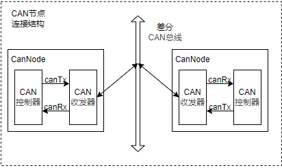
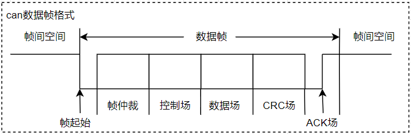
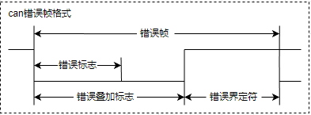
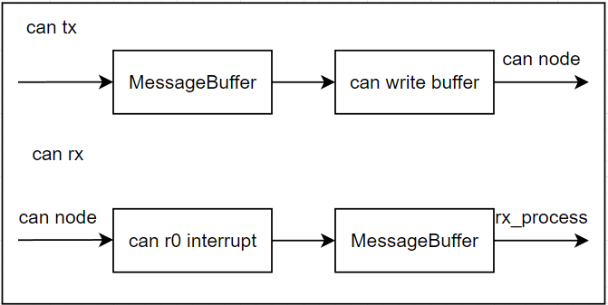

# 单片机总结系列(16) CAN通讯接口

CAN协议(Controller Area Network)，全称控制器局域网协议，是一种串行通讯协议；广泛用于汽车、工业控制、船舶、航空航天等领域。具有以下特点：

- 差分信号传输，具有抗干扰能力强，通讯距离远，实时性好等优点。
- 支持多主机竞争节点模式，理论节点数目不受限制，通过仲裁机制，确保节点根据优先级先后发送数据，可扩展性强。
- 强力的错误检测和纠错能力，可以检测发送和接收过程中的错误，并进行相应的处理。

理解CAN协议，首先要对通信协议有一定的概念；通信协议又称通信规程，是指通信双方对数据传送控制的一种约定。约定中包括对数据格式，同步方式，传送速度，传送步骤，检纠错方式以及控制字符定义等问题做出统一规定，通信双方必须共同遵守，它也叫做链路控制规程。CAN总线传输协议定义了物理接口和帧结构说明，对应通讯协议中的物理层和数据链路层；至于更上层的协议，则由用户根据需求重新定义，如CanOpen协议，CANoe协议等。本节目录说明如下所示。

## can_bus_protocol

对于CAN总线通讯协议，可以分为物理层和数据链路层；常见的连接拓扑如下所示。



由上图可以看到，CAN是以CAN Node为单个节点挂载在CAN Bus上。对于每个CAN Node来说，又由CAN收发器和CAN控制器两部分组成。

1. CAN收发器，对应物理层设备，对于发送，将逻辑数据转换为差分信号；对于接收，将差分信号转换为逻辑数据。
2. CAN控制器，对应数据链路层设备，用于控制CAN收发器，实现CAN协议的物理层和数据链路层规范；如帧同步，帧传输，帧接收，帧发送以及总线仲裁功能实现。一般来说CAN控制器集成在SOC或者MCU芯片中，由软件进行控制。

上述器件对应的协议框架如下所示。

- 物理层，包含了CAN协议的物理层规范，规定了CAN协议的电气特性，如信号的传输方式，信号的电平、传输距离、编码方式等
  - 信号的传输方式：差分信号传输，通过CANH和CANL两根线传输差分信号，通过两者电压差值判断信号状态。若VCANH-VCANL小于阈值为隐性位（逻辑 1），大于阈值为显性位（逻辑 0），总线空闲时处于隐性状态，这种编码方式又称为非归零编码。
- 数据链路层，包含了CAN协议的数据链路层规范，规定了CAN协议的帧结构，帧格式，帧同步方式，帧传输方式等
  - 帧结构：CAN协议的帧结构由帧起始、仲裁场、控制场、数据场、CRC场、应答场组成。
  - 帧同步：CAN协议的帧同步方式为显性同步方式，即发送器在发送帧起始标志（SOF）时，将CANH和CANL两根线同时拉低，从而使总线处于显性状态。
  - 帧传输：CAN协议的帧传输方式为异步方式，即发送器和接收器可以同时发送和接收数据，不需要同步。
  - 帧接收：CAN协议的帧接收方式为总线监听方式，即接收器在总线空闲时，检测总线电平，如果总线电平为显性，则接收器认为总线处于空闲状态，此时接收器可以接收数据。

对于应用来说，主要理解数据链路层即可，具体内容如下。

### can_package

CAN数据帧由7个段组成，分别是帧起始（SOF）标志，仲裁场，控制场，数据场，CRC场和ACK场组成，具体格式如下所示。



- 帧起始（SOF）标志数据帧或远程帧的开始，仅由一个“显性”位组成。只有在总线空闲时才允许节点开始发送（信号）。所有节点必须同步于首先开始发送报文的节点的帧起始前沿。
- 仲裁场 由标识符和传送帧类型(RTR)组成的仲裁场，RTR位在数据帧中为显性，在远程帧中为隐性。
- 控制场 由标识符类型控制位IDE，保留位r0，以及帧长度选择位DLC构成的。
- 数据场 由数据帧里的发送数据组成。
- CRC场 由CRC序列（CRC Sequence），以及CRC界定符（CRC Delimiter）。CRC序列之后是CRC界定符，它包含一个单独的“隐性”位。
- ACK场（ACK Field） 2位，包含应答间隙（ACK Slot）和应答界定符（ACK Delimiter），当接收器正确地接收到有效的报文，接收器就会在应答间隙（ACK Slot）期间向发送器发送1“显性”位以示应答。
  - 应答间隙，所有接收到匹配CRC序列的节点会在应答间隙期间用“显性”的位写入发送器的“隐性”位来做出回答。
  - 应答界定符，应答界定符是应答场的第二个位，必须为“隐性”的位。因此，应答间隙（ACK Slot）被两个“隐性”的位所包围，也就是CRC界定符和应答界定符。

其中标准帧和扩展帧的主要区别是仲裁场的不同，具体格式如下所示。


上图中的参数解析如下。

1. RTR位用于区分远程帧和数据帧，其中RTR位为显性位(逻辑0)，代表数据帧；RTR位为隐性位(逻辑1)，代表远程帧。
2. IDE位用于区分标准帧和扩展帧，显性位(逻辑0)，代表标准帧；IDE位为隐性位(逻辑1)，代表扩展帧。
3. 对于扩展帧，在RTR位置填充为隐形位的SRR，用于保证确保扩展帧优先级更低
4. r0和r1为保留位，保留位必须为显性位。
5. 标识符字段由11位或29位组成，其中11位标识符为标准标识符，29位标识符为扩展标识符。

在通讯过程中，“显性”具有“优先”的意味，只要有一个单元输出显性电平，总线上即为显性电平；当节点检测到线上电平与发送位电平不一致时，如果此时在仲裁场或者控制场，则退出总线竞争；如果不在此场段，则产生错误事件(在帧ACK场和错误帧传输时除外)。基于上述机制，实现CAN的总线仲裁。

1. 对目的不同ID的CAN节点发送数据，因为ID从高位到低位发送，ID值小的节点会更晚发送隐形位，因此具有更高的优先级。
2. 数据帧的RTR为显性位，遥控帧RTR为隐性位，目的ID相同时，数据帧具有更高优先级
3. 标准帧的IDE为显性位，扩展帧的IDE为隐性位，目的ID相同时，标准帧具有更高的优先级。

这就是数据帧仲裁的主要机制；参考上述格式，CAN报文包含数据帧，遥控帧，错误帧和过载帧四种类型。

- 数据帧：数据帧将数据从发送器传输到接收器，其格式就是完整的CAN报文格式
- 遥控帧：总线节点发出遥控帧，请求发送具有同一识别符的数据帧，请求帧除了不带数据场，其它字段与数据帧相同
- 错误帧：任何节点检测到总线错误就发出错误帧
- 过载帧：过载帧用以在先行的和后续的数据帧（或远程帧）之间提供附加的延时
- 帧间隔：帧间隔是用于分隔数据帧和遥控帧的帧。数据帧和遥控帧可通过插入帧间隔将本帧与前面的任何帧（数据帧、遥控帧、错误帧、过载帧）分开

数据帧和遥控帧的格式属于上面的标准帧和扩展帧格式，这里不在赘述。

错误帧由不同节点提供的错误标志（Error Flag）的叠加以及错误界定符两部分组成，格式如下。



- 错误标志：有两种形式的错误标志：激活错误标志和认可错误标志。
  - "激活错误”标志由6个连续的“显性”位组成
  - “认可错误”标志由6个连续的“隐性”的位组成，除非被其他节点的“显性”位重写。
- 错误界定符：错误界定符包括8个“隐性”的位。
- 错误标志传送了以后，每一个节点就发送一个“隐性”的位，并一直监视总线直到检测出一个“隐性”的位为止，然后就开始发送其余7个“隐性”位。

过载帧（Overload Frame）包括两个位场：过载标志和过载界定符，其结构如图所示：


有三种过载的情况会引发过载标志的传送。

1.接收器的内部情况，需要延迟下一个数据帧和远程帧。
2.在间歇的第一和第二字节检测到一个“显性”位。
3.如果CAN节点在错误界定符或过载界定符的第8位（最后一位）采样到一个显性位，节点会发送一个过载帧。该帧不是错误帧，错误计数器不会增加。

过载标志:过载标志由6个“显性”的位组成。过载标志的所有形式和“激活错误”标志的一样
过载界定符：过载界定符包括8个“隐性”的位，具体动作与错误界定符一致

帧间隔：数据帧（或远程帧）与遥控帧的隔离是通过帧间空间实现的，无论此先行帧类型如何（错误帧、过载帧）。所不同的是，过载帧与错误帧之前没有帧间空间，多个过载帧之间也不是由帧间空间隔离的。


帧间空间包括间歇、总线空闲的位场。如果“错误认可”的节点已作为前一报文的发送器，则其帧间空间除了间歇、总线空闲外，还包括称作“挂起传送”（暂停发送）的位场。

1. 间歇场，包含3个位隐性位
2. 总线空闲，全隐性电平，没有限制
3. 暂停发送场，8个位隐性位，只在处于被动错误状态的单元刚发送一个消息后的帧间隔中包含的段

上述信息基本包含CAN协议包的数据包格式，仲裁机制，算协议中比较核心的部分；不过如果没有整个CAN通讯的概念，理解起来仍然很迷惑，这很正常，因此这里以STM32的应用实践来显示协议的实现处理。

## stm32_can

对于STM32中CAN模块，主要特点如下。

- 支持2.0A及2.0B Active 版本CAN协议
- 包含三个发送邮箱，可配置的发送优先级
- 两个具有三级深度的接收FIFO，支持可调整的筛选器组
- 支持可配置的重发机制，禁止后，每个发送仅启动一次。如果第一次尝试失败，由于仲裁丢失或错误，硬件将不会自动重新启动消息发送

对于CAN模块的，初始化格式步骤如下。

1. 使能GPIO和CAN相关时钟
2. 初始化GPIO接口，复用为CAN功能
3. 初始化为CAN模块功能
4. 配置CAN过滤器功能，用于定义允许的接收ID范围

具体实现如下。

```c
static CAN_HandleTypeDef hcan1;
static CAN_FilterTypeDef  hcan1_filter;

//------ global function ------
GlobalType_t can_driver_init(void)
{
    GPIO_InitTypeDef GPIO_InitStruct = {0};
    
    // 使能GPIO和CAN相关时钟
    __HAL_RCC_CAN1_CLK_ENABLE();
    __HAL_RCC_GPIOA_CLK_ENABLE();
    
    // 复用GPI功能为CAN模式
    GPIO_InitStruct.Pin = GPIO_PIN_11 | GPIO_PIN_12;
    GPIO_InitStruct.Mode = GPIO_MODE_AF_PP;
    GPIO_InitStruct.Pull = GPIO_NOPULL;
    GPIO_InitStruct.Speed = GPIO_SPEED_FREQ_VERY_HIGH;
    GPIO_InitStruct.Alternate = GPIO_AF9_CAN1;
    HAL_GPIO_Init(GPIOA, &GPIO_InitStruct);
    
    // CAN模式初始化
    hcan1.Instance = CAN1;
    hcan1.Init.Mode = CAN_MODE_LOOPBACK;        // 环回模式，在此模式下，bxCAN 将执行从发送输出到接收输入的内部反馈

    //CAN模块的波特率为 45M/6/(1+6+8) = 500K, 高速CAN是在125K~1M之内，满足要求
    //BitTime = tq + tbs1 + tbs2；tq为同步段，tbs1为同步段到采样点时间，tbs2为采样点到发送点时间
    hcan1.Init.Prescaler = 6;                   // 波特率预分频器，定义时间片的长度
    hcan1.Init.SyncJumpWidth = CAN_SJW_1TQ;     // 再同步跳转宽度，执行再同步时最多可以将位加长或缩短的时间片数目。
    hcan1.Init.TimeSeg1 = CAN_BS1_8TQ;          // 时间段1，定义时间段1中的时间片数目
    hcan1.Init.TimeSeg2 = CAN_BS2_6TQ;          // 时间段2，定义时间段2中的时间片数目
    hcan1.Init.TimeTriggeredMode = DISABLE;     // 用于为接收和发送邮箱生成时间戳值
    
    // 其它功能配置
    hcan1.Init.AutoBusOff = ENABLE;             // 自动的总线关闭管理，一旦监测到128次连续11个隐性位，即通过硬件自动退出总线关闭状态
    hcan1.Init.AutoWakeUp = DISABLE;            // 自动唤醒模式，控制CAN硬件在睡眠模式下接收到消息时的行为。
    hcan1.Init.AutoRetransmission = ENABLE;     // 禁止自动重发送 (No automatic retransmission)
    hcan1.Init.ReceiveFifoLocked = DISABLE;     // 接收FIFO上溢后不锁定，下一条传入消息将覆盖前一条消息，否则丢弃
    hcan1.Init.TransmitFifoPriority = DISABLE;  // 发送 FIFO 优先级 (Transmit FIFO priority)，0由消息标识符确定，1由时间顺序确定
    if (HAL_CAN_Init(&hcan1) != HAL_OK)
    {
        return RT_FAIL;
    }

    // 配置过滤器
    hcan1_filter.FilterIdHigh = 0x0000;                     //32位ID
    hcan1_filter.FilterIdLow = 0x0000;
    hcan1_filter.FilterMaskIdHigh  = 0x0000;                //32位掩码，0不使用此位进行比较，1表示必须匹配
    hcan1_filter.FilterMaskIdLow = 0x0000;  
    hcan1_filter.FilterFIFOAssignment = CAN_FILTER_FIFO0;   //过滤器0关联到FIFO0
    hcan1_filter.FilterBank = 0;                            //过滤器0
    hcan1_filter.FilterMode = CAN_FILTERMODE_IDMASK;
    hcan1_filter.FilterScale = CAN_FILTERSCALE_32BIT;
    hcan1_filter.FilterActivation = ENABLE;                 //激活滤波器0
    hcan1_filter.SlaveStartFilterBank = 14;
    if(HAL_CAN_ConfigFilter(&hcan1, &hcan1_filter) != HAL_OK)
    {
        return RT_FAIL;    
    }

    // 使能中断接受
    HAL_NVIC_SetPriority(CAN1_RX0_IRQn, 0, 0);
    HAL_NVIC_EnableIRQ(CAN1_RX0_IRQn);
    
    // 使能CAN工作和接收中断
    HAL_CAN_ActivateNotification(&hcan1, CAN_IT_RX_FIFO0_MSG_PENDING);
    HAL_CAN_Start(&hcan1);

    return RT_OK;
} 
```

对于STM32来说，错误帧和过载帧由硬件处理；其中数据帧和遥控帧由软件处理，由以下结构体管理。

```c
typedef struct
{
  uint32_t StdId;   // 标准ID，0x0 ~ 0x7FF   
  uint32_t ExtId;   // 扩展ID，0x0 ~ 0x1FFFFFFF
  uint32_t IDE;     // 类型CAN_ID_STD和CAN_ID_EXT
  uint32_t RTR;     // 类型CAN_RTR_DATA和CAN_RTR_REMOTE
  uint32_t DLC;     // 数据长度0 ~ 8
  FunctionalState TransmitGlobalTime; // 时间戳使能，ENABLE/DISABLE，替换pdata[6]和pdata[7]，DLC必须为8
} CAN_TxHeaderTypeDef;
```

用户控制的就是数据帧和遥控帧。数据帧的格式如下所示。

```c
#define MAX_CAN_DLC   8

GlobalType_t can_write_std(uint8_t *data, uint8_t len)
{
    CAN_TxHeaderTypeDef txHeader;
    uint32_t mailbox;
    uint8_t index;
    
    if (len > MAX_CAN_DLC) {
        return RT_FAIL;
    }
    
    // 定义标准帧
    txHeader.IDE = CAN_ID_STD;
    txHeader.StdId = CAN_STD_ID_DATA; // 标准ID
    txHeader.RTR = CAN_RTR_DATA;      // 数据帧
    txHeader.DLC = len;               // 数据长度
    
    while(HAL_CAN_AddTxMessage(&hcan1, &txHeader, data, &mailbox) != HAL_OK)
    {
        index++;
        if (index > 50)
        {
            return RT_FAIL;
        }
        vTaskDelay(1);
    }
   
    return RT_OK;
}
```

远程帧格式如下。

```c
GlobalType_t can_write_ext(uint8_t *data, uint8_t len)
{
    CAN_TxHeaderTypeDef txHeader;
    uint32_t mailbox;
    uint8_t index;
    
    if (len > MAX_CAN_DLC) {
        return RT_FAIL;
    }
    
    // 定义扩展ID
    txHeader.IDE = CAN_ID_EXT;          // 扩展ID
    txHeader.ExtId = CAN_EXT_ID_DATA;
    txHeader.RTR = CAN_RTR_DATA;
    txHeader.DLC = len;
    
    while(HAL_CAN_AddTxMessage(&hcan1, &txHeader, data, &mailbox) != HAL_OK)
    {
        index++;
        if (index > 50)
        {
            return RT_FAIL;
        }
        vTaskDelay(1);
    }
   
    return RT_OK;
}
```

接收数据则使用CAN中断回调函数，具体实现如下。

```c
void CAN1_RX0_IRQHandler(void)
{
    HAL_CAN_IRQHandler(&hcan1);
}

// 接收数据，投递到缓存中
void HAL_CAN_RxFifo0MsgPendingCallback(CAN_HandleTypeDef* hcan)
{
    uint8_t Data[8];
    CAN_RxHeaderTypeDef RxMessage;
    BaseType_t xHigherPriorityTaskWoken = pdFALSE; 

    if (HAL_CAN_GetState(&hcan1) != RESET)
    {
        HAL_CAN_GetRxMessage(&hcan1, CAN_RX_FIFO0, &RxMessage, Data);
        
        // 投递到缓存中
        xMessageBufferSendFromISR( can_info.xRxMessageBuffer,
                                ( void * ) Data,
                                RxMessage.DLC,
                                &xHigherPriorityTaskWoken );
    }
                                            
    portYIELD_FROM_ISR( xHigherPriorityTaskWoken );
}
```

在实现中基于freertos的消息队列来实现数据的接收和发送，具体框架如下。



本例程详细代码见：[基于FreeRTOS的CAN通讯代码](./../code/16-STM32F429_CAN/)

## next_chapter

[返回目录](./../README.md)

直接开始下一小节: [USB接口和USB协议](./ch17.usb_interface_protocol.md)