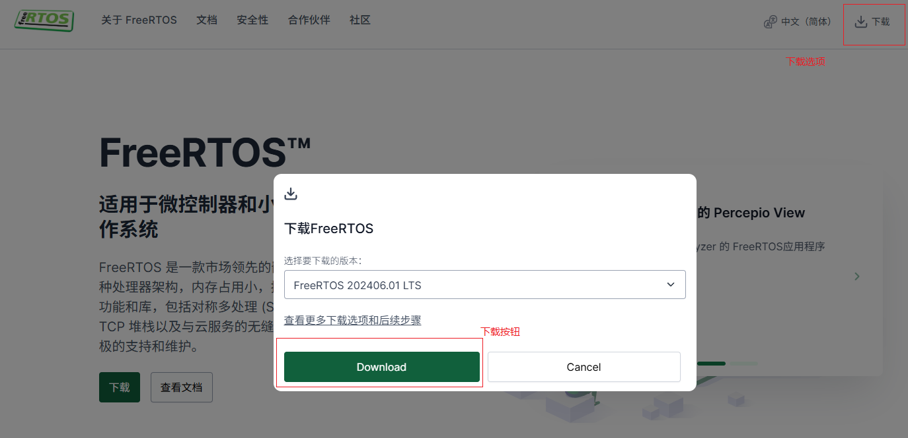
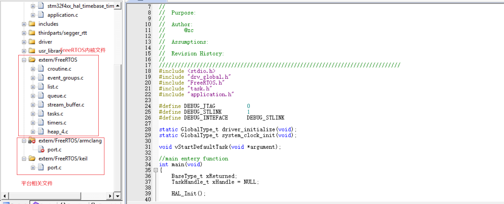
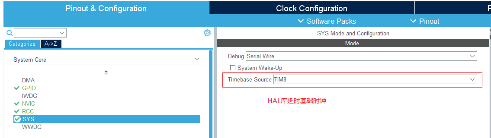
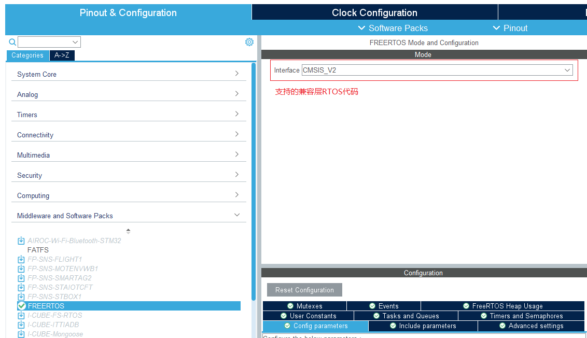
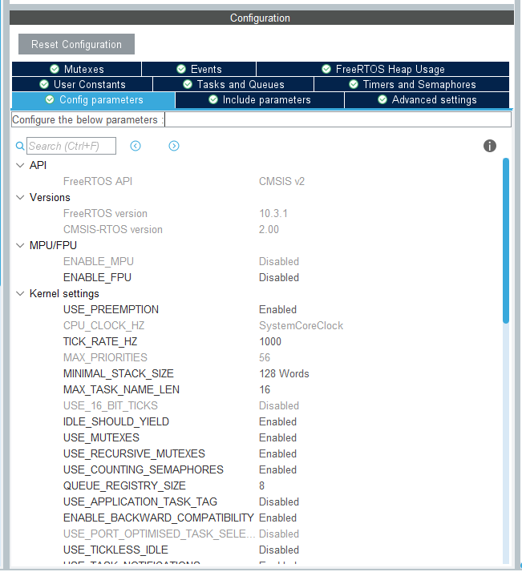
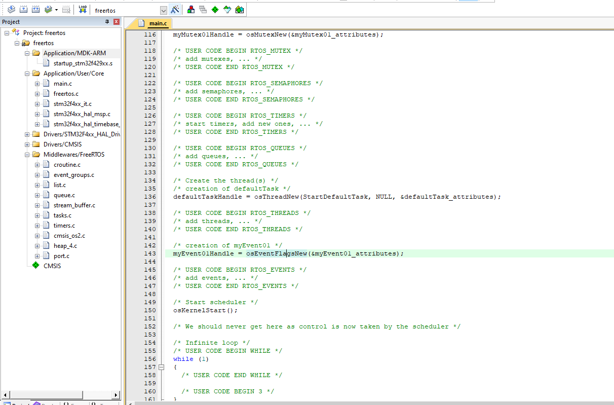

# 单片机技术总结说明(17) FreeRTOS的移植和应用

FreeRTOS是完全开源的嵌入式实时系统，具有内存占用小、执行时间短、支持多任务、支持多种调度算法等特点。其移植和应用也比较简单，只需要根据不同的平台进行简单的配置即可。FreeRTOS基于MIT开源协议，对于个人和商业使用都十分友好。FreeRTOS的另一个重要特点是其附加功能的独立性比较好，单独移植和使用FreeRTOS十分简单，如果有其它需求，也很容易适配各类网络协议，因此广泛用于工业制造、医学设备、影像设备中。

上述都是RTOS的主要优点，不过在单片机开发中，为什么要使用RTOS？事实上，在这篇之前的文章中，都是使用裸机开发来实现功能的，RTOS并不是一个必选项。使用主循环、中断通过状态机管理(类协程机制)的前后台系统，在时延要求的情况下使用定时器进行处理，采用DMA中断的方式进行数据收发，理论上裸机也能实现复杂的应用程序。工作中场景要求如果达到us级别，往往RTOS软件也做不到准确时延，都是由硬件如定时器、DMA和中断等直接处理。

看到这里，你可能越发觉得为什么用RTOS？其实相比裸机，RTOS是增加一点资源占用的情况下，大幅度的降低了开发难度。例如支持设备间通讯(CAN、USART)、外部器件读取(i2c、spi)、GUI刷新的设备；如果使用裸机，就需要维护复杂的状态检测、事件触发和通讯状态管理的机制，每一部分都要保证不发生堵塞，检查状态循环处理；来保证在主循环执行时不因为超时导致通讯超时、刷新帧率降低等问题。而使用RTOS后，就可以天然将上述功能拆分成多个任务来管理，降低了系统中各模块的耦合以及系统复杂度，除非时延要求
特别严格，大部分情况下，分配到不同任务就可以实现目标，这正是RTOS的优势所在。在应用中，如果设备的资源允许，这里还是建议优先使用RTOS，这样对于后期的功能扩展和维护，会更加方便。这里讲解了为什么使用RTOS，后续将以FreeRTOS为例，开始进行说明。

本节主要包含以下几个方面。

- FreeRTOS的下载、系统移植。
- FreeRTOS的文件结构和配置功能说明。
- FreeRTOS的任务创建和系统启动。
- FreeRTOS常用任务管理和线程同步方法

其官方文档地址：<https://www.freertos.org/zh-cn-cmn-s/Documentation/00-Overview>

理解了这些知识，后面就可以进一步在此基础上扩展应用功能；本节的目录如下所示。

- [下载、移植和任务创建](#freertos_transplant)
  - [手动移植FreeRTOS](#self_transplant)
  - [STM32CubeMX生成FreeRTOS工程](#stm32cubemx_transplant)
- [配置功能选项](#freertos_config)
- [任务管理和线程同步方法](#freertos_sync)
  - [任务创建和管理](#task)
  - [任务通知接口](#notification)
  - [队列](#queues)
  - [流缓冲区](#stream_buffers)
  - [消息缓冲区](#message_buffers)
  - [信号量和互斥锁](#semaphores)
  - [软件定时器](#software_timers)
  - [事件组和标志](#event_groups)
- [总结说明](#summary)
- [下一章节](#next_chapter)

## freertos_transplant

对于FreeRTOS的移植，比较早的版本就是去官网下载开源代码；根据平台添加工程，将开源代码添加到工程中，在修改系统支持即可。不过目前主流单片机芯片都支持通过图形化界面直接生成带FreeRTOS的代码，例如ST的STM32CubeMX、英飞凌的Dave工具等。这里的话将对两种方式都进行说明，可以方便更深刻的理解FreeRTOS的移植过程。

### self_transplant

对于自行移植，主要步骤如下所示。

- 下载FreeRTOS的源码，解压并提取关键文件。

首先去官网主界面，具体网址: <https://www.freertos.org/zh-cn-cmn-s>；然后再右上角点击下载，选择Download即可下载，详细如下所示。



或者去github下载最新版本也可以，具体网址: <https://github.com/FreeRTOS/FreeRTOS>，选择Releases下的某一个版本，我个人习惯使用最新的版本。

- 解压文件，将FreeRTOS的核心文件添加到工程中。

解压后的核心文件在目录中的FreeRTOS-LTS/FreeRTOS/FreeRTOS-Kernel中，其结构如下。


文件说明如下。

| 文件 | 说明 |
| --- | --- |
| croutine.c | 协程实现文件 |
| event_groups.c | 事件组实现文件 |
| list.c | 链表实现文件 |
| queue.c | 队列实现文件 |
| stream_buffer.c | 流缓冲区实现文件 |
| tasks.c | 任务实现文件 |
| timers.c | 软件定时器实现文件 |
| heap_4.c | 内存管理实现文件 |
| port.c | 涉及平台相关的实现文件 |

其中heap_4.c是FreeRTOS的内存管理实现文件，用于动态分配和释放内存。对于FreeRTOS包含的内存管理方式，主要有以下几种。

- heap_1： 最简单，不允许释放内存。
- heap_2： 允许释放内存，但不会合并相邻的空闲块。
- heap_3： 简单包装了标准 malloc() 和 free()，以保证线程安全。
- heap_4： 合并相邻的空闲块以避免碎片化。包含绝对地址放置选项。
- heap_5： 如同 heap_4，能够跨越多个不相邻内存区域的堆。

这里选择heap_4作为内存管理方式，主要是因为它能够合并相邻的空闲块，避免碎片化，同时也包含绝对地址放置选项，方便在一些特殊情况下使用。

port.c文件包含了FreeRTOS与平台相关的代码，主要是与中断、上下文切换等功能相关。在portable目录下，主要包含三个类型。

- GCC/port.c: 主要针对gcc和armclang编译器的移植文件(对应keil compiler v6)。
- IAR/port.c： 主要针对IAR Embedded Workbench编译器的移植文件。
- RVDS/port.c： 主要针对Keil MDK-ARM中的ARMCC编译器的移植文件(对应keil compiler v5)

基于上述文件说明，此时开始添加文件到工程中，添加后目录情况如下所示。



之后实现最基本的任务创建和系统启动即可，具体代码如下所示。

```c
// 启动任务
void vStartDefaultTask(void *argument)
{
    set_os_on();
    
    // driver initialize.
    driver_initialize();

    // application initialize.
    application_init();
    
    for (;;) 
    {
        LED_TOGGLE;
        
        PRINT_LOG(LOG_INFO, HAL_GetTick(), "freertos run!");
        
        vTaskDelay(1000);
    }
}

// main entery function
int main(void)
{  
    BaseType_t xReturned;
    TaskHandle_t xHandle = NULL;

    // 创建任务
    xReturned = xTaskCreate(vStartDefaultTask, "default task", 512, NULL, tskIDLE_PRIORITY, &xHandle); 
    
    if (xReturned != pdPASS) {
        PRINT_LOG(LOG_ERROR, HAL_GetTick(), "defaukt task create failed!");
    }
    
    // 启动任务调度器
    vTaskStartScheduler();

    while (1)
    {
    }
}
```

另外如果开启了静态分配任务，那么就需要实现vApplicationGetIdleTaskMemory和vApplicationGetTimerTaskMemory函数，用于分配空闲任务和定时器任务的栈空间。之所以需要实现这两个函数，是因为在FreeRTOS系统中，会默认创建空闲任务和定时器任务，而这两个任务的栈空间是需要在系统启动前就分配好的，如果开启静态分配任务，就需要从外部导入静态存储，需要实现如下代码放置在任务中。

```c
// 获取空闲任务的栈信息
StackType_t xIdleTaskStack[100];
StaticTask_t xIdleTaskTCB;

void vApplicationGetIdleTaskMemory( StaticTask_t ** ppxIdleTaskTCBBuffer,
                                    StackType_t ** ppxIdleTaskStackBuffer,
                                    configSTACK_DEPTH_TYPE * puxIdleTaskStackSize )
{
    *ppxIdleTaskTCBBuffer = &xIdleTaskTCB;
    *ppxIdleTaskStackBuffer = xIdleTaskStack;
    *puxIdleTaskStackSize = 100;
}

// 获取定时器任务的栈信息
StackType_t xIimerTaskStack[configTIMER_TASK_STACK_DEPTH];
StaticTask_t xTimerTaskTCB;
void vApplicationGetTimerTaskMemory( StaticTask_t ** ppxTimerTaskTCBBuffer,
                                     StackType_t ** ppxTimerTaskStackBuffer,
                                     configSTACK_DEPTH_TYPE * puxTimerTaskStackSize )
{
    *ppxTimerTaskTCBBuffer = &xTimerTaskTCB;
    *ppxTimerTaskStackBuffer = xIimerTaskStack;
    *puxTimerTaskStackSize = configTIMER_TASK_STACK_DEPTH;
}
```

### stm32cubemx_transplant

对于stm32cubemx实现移植freertos，就比较简单，具体步骤如下所示。

1. 将HAL库的时钟从Systick切换到普通Timer时钟，这是因为在FreeRTOS中，会使用Systick作为系统节拍，同时使用会有冲突(也可以FreeRTOS创建完成后，将HAL_IncTick()添加到FreeRTOS/portable/port.c中，不过这样每次重新生成项目时，HAL_IncTick()会丢失，不建议)。
2.在Middleware and Software Packs中添加FreeRTOS项目。
3. 进行FreeRTOS项目配置，添加任务，并设置任务优先级，生成项目即可。
4. 在生成项目中，添加需要处理的任务，此时可以实现FreeRTOS功能。

具体流程如下所示。

- 切换时钟，在System Core/SYS选项下Timebase Source选择Timer。



- 添加FreeRTOS项目，在Middleware and Software Packs中添加FreeRTOS项目。



- 配置FreeRTOS项目，在FreeRTOS选项下，添加任务，并设置任务优先级，生成项目即可。



在这个下面的选项定义了FreeRTOS的配置选项，具体功能介绍如下。

| 选项 | 说明 |
| --- | --- |
| Mutexes | 用于添加互斥锁和递归互斥锁对象，对应SemaphoreHandle_t。 |
| Events | 用于添加事件对象，对应EventGroupHandle_t。 |
| FreeRTOS Heap Usage | 显示内存使用情况。 |
| User Constants | 定义用户常量，如任务栈大小，任务优先级等。 |
| Tasks and Queues | 添加任务和队列对象，对应TaskHandle_t和QueueHandle_t。 |
| Timers and Semaphore | 添加定时器对象和信号量对象，对应TimerHandle_t和SemaphoreHandle_t。 |
| Configs Parameters | 定义用户参数，如任务栈大小，任务优先级等。 |
| Include Parameters | 定义系统支持的接口API，宏定义扩展。 |
| Advanced Settings | 其它扩展的设置。 |

理论上在各项下面添加需要的任务、信号量、队列、软件定时器等，就能满足软件功能需求，不过实践上一般按照需求自行添加，自动生成的一般集中在main.c文件中，不方便后续模块化管理。

对于FreeRTOS，最主要的配置项就是在Configs Parameters下面进行配置，关键参数其实对应下节的freertos_config中的选项，具体说明如下。

| 选项 | 说明 |
| --- | --- |
| USE_PREEMOPTION | 开启抢占式调度(支持任务根据优先级抢占) |
| TICK_RATE_HZ | 系统节拍频率 |
| MINIMAL_STACK_SIZE | 任务栈最小大小 |
| MAX_TASK_NAME_LEN | 任务名称最大长度 |
| TOTAL_HEAP_SIZE | 系统总堆大小，动态申请的所有资源如任务栈、信号量、队列等，都从这里申请 |
| Memory Management scheme | 动态内存管理方案，对应选项heap_1~heap_5 |
| TIMER_TASK_PRIORITY | 定时器任务优先级 |
| TIMER_QUEUE_LENGTH | 定时器任务队列长度 |
| TIMER_TASK_STACK_DEPTH | 定时器任务栈大小 |
| LIBRARY_LOWEST_INTERRUPT_PRIORITY | 库支持的中断优先级最低的优先级 |
| LIBRARY_MAX_SYSCALL_INTERRUPT_PRIORITY | 库支持的最高系统调用中断优先级 |

修改上述内容完成后，即可进行生成项目，并编译运行，具体如下所示。



## freertos_config

前面讲述了如何移植和启动FreeRTOS任务，这里继续讲述FreeRTOS的配置选项，定义在FreeRTOSConfig.h文件中。这里进行详细说明。

```c
#ifndef FREERTOS_CONFIG_H
#define FREERTOS_CONFIG_H

// 开启FPU和MPU支持
#define configENABLE_FPU                         1
#define configENABLE_MPU                         0

// 开启抢占式调度(支持任务根据优先级抢占)
#define configUSE_PREEMPTION                     1

#define configSUPPORT_STATIC_ALLOCATION          1 // 开启静态分配任务
#define configSUPPORT_DYNAMIC_ALLOCATION         1 // 开启动态分配任务
#define configUSE_IDLE_HOOK                      0 // 开启空闲任务钩子函数
#define configUSE_TICK_HOOK                      0 // 开启系统节拍钩子函数
#define configCPU_CLOCK_HZ                       ( SystemCoreClock )    // cpu的实际时钟频率
#define configTICK_RATE_HZ                       ((TickType_t)1000)     // 系统节拍频率
#define configMAX_PRIORITIES                     ( 56 )                 // 最大任务优先级
#define configMINIMAL_STACK_SIZE                 ((uint16_t)128)        // 最小任务栈大小(空闲任务也会选择)
#define configTOTAL_HEAP_SIZE                    ((size_t)38400)        // 总堆大小，动态分配都会从这里分配
#define configMAX_TASK_NAME_LEN                  ( 24 ) // 最大任务名称长度  
#define configUSE_TRACE_FACILITY                 1      // 开启跟踪设施(用于调试)               
#define configUSE_16_BIT_TICKS                   0      // 开启16位节拍计数器
#define configUSE_MUTEXES                        1      // 开启互斥锁
#define configQUEUE_REGISTRY_SIZE                8      // 队列注册表大小
#define configUSE_RECURSIVE_MUTEXES              1      // 开启递归互斥锁
#define configUSE_COUNTING_SEMAPHORES            1      // 开启计数信号量
#define configUSE_PORT_OPTIMISED_TASK_SELECTION  0      // 开启端口优化任务选择

#define configMESSAGE_BUFFER_LENGTH_TYPE         size_t // 消息缓冲区长度类型

// 开启协程
#define configUSE_CO_ROUTINES                    0
#define configMAX_CO_ROUTINE_PRIORITIES          ( 2 )

// 开启定时器
#define configUSE_TIMERS                         1
#define configTIMER_TASK_PRIORITY                ( 2 ) 
#define configTIMER_QUEUE_LENGTH                 10
#define configTIMER_TASK_STACK_DEPTH             256

// 开启任务相关API函数
#define INCLUDE_vTaskPrioritySet             1
#define INCLUDE_uxTaskPriorityGet            1
#define INCLUDE_vTaskDelete                  1
#define INCLUDE_vTaskCleanUpResources        0
#define INCLUDE_vTaskSuspend                 1
#define INCLUDE_vTaskDelayUntil              1
#define INCLUDE_vTaskDelay                   1
#define INCLUDE_xTaskGetSchedulerState       1
#define INCLUDE_xTimerPendFunctionCall       1
#define INCLUDE_xQueueGetMutexHolder         1
#define INCLUDE_uxTaskGetStackHighWaterMark  1
#define INCLUDE_xTaskGetCurrentTaskHandle    1
#define INCLUDE_eTaskGetState                1

// 定义中断优先级位
#ifdef __NVIC_PRIO_BITS
 /* __BVIC_PRIO_BITS will be specified when CMSIS is being used. */
 #define configPRIO_BITS         __NVIC_PRIO_BITS
#else
 #define configPRIO_BITS         4
#endif

// 数值越低，优先级越高
// 设置最低可能的中断优先级
#define configLIBRARY_LOWEST_INTERRUPT_PRIORITY   15

// 设置最高可能的中断优先级，优先级高于此值的中断不能调用FreeRTOS API函数
#define configLIBRARY_MAX_SYSCALL_INTERRUPT_PRIORITY 5

// 设置内核中断优先级
#define configKERNEL_INTERRUPT_PRIORITY 		( configLIBRARY_LOWEST_INTERRUPT_PRIORITY << (8 - configPRIO_BITS) )

// 设置系统调用中断优先级
#define configMAX_SYSCALL_INTERRUPT_PRIORITY 	( configLIBRARY_MAX_SYSCALL_INTERRUPT_PRIORITY << (8 - configPRIO_BITS) )

// 定义断言函数
#define configASSERT( x ) if ((x) == 0) {taskDISABLE_INTERRUPTS(); for( ;; );}

// 定义系统调用中断处理函数
// SVC中断处理函数，用于系统调用
// PortPendSVHandler中断处理函数，用于任务切换
// SysTick中断处理函数，用于系统节拍
#define vPortSVCHandler    SVC_Handler
#define xPortPendSVHandler PendSV_Handler
#define xPortSysTickHandler SysTick_Handler

#endif /* FREERTOS_CONFIG_H */
```

## freertos_sync

FreeRTOS支持一系列用于任务管理和线程同步方法，包括任务创建、任务删除、任务挂起、任务恢复、任务优先级设置、任务通知、队列、流缓冲区、消息缓冲区、信号量、软件定时器、事件组等。

这些方法在FreeRTOS的API文档中都有详细的说明。

参考网址如下: <https://www.freertos.org/zh-cn-cmn-s/Documentation/00-Overview>，查看其中的API引用章节即可，不过这里还是分小节列出API接口，并且举例说明关键接口的功能，用于快速理解FreeRTOS的接口应用。

对于FreeRTOS的接口，有以下几个注意事项。

- 对于FreeRTOS创建资源的接口(包含任务和其它事件申请等)，包含static和非static两类接口，static接口表示使用外部的存储空间，非static接口表示使用内部的heap空间，heap空间大小通过FreeRTOS.h中的configTOTAL_HEAP_SIZE宏定义来配置。
- 对于访问资源的接口，范围中断接口和非中断接口，范围中断接口表示在ISR中调用，非中断接口表示在非ISR中调用。
- 如果在中断中调用FreeRTOS的API接口，需要中断优先级不得高于configLIBRARY_MAX_SYSCALL_INTERRUPT_PRIORITY(值越小，优先级越高)，否则会导致系统异常。

### task

task接口定义在"task.h"目录中，实现对于任务创建、删除、挂起、恢复、优先级设置、任务通知等操作，是FreeRTOS的基础功能模块。

task的主要接口定义如下。

| 接口名称 | 功能 |
| --- | --- |
| xTaskCreate/xTaskCreateStatic | 创建任务 |
| vTaskDelete | 删除已经创建的任务 |
| vTaskDelay | 延迟指定时间 |
| vTaskDelayUntil/xTaskDelayUntil | 延迟指定时间，直到指定时间 |
| vTaskPrioritySet | 设置任务优先级 |
| vTaskSuspend | 挂起任务 |
| vTaskResume/vTaskResumeFromISR | 恢复任务 |
| vTaskAbortDelay | 取消任务延迟 |
| uxTaskPriorityGet/uxTaskPriorityGetFromISR | 获取任务优先级 |
| uxTaskBasePriorityGet/uxTaskBasePriorityGetFromISR | 获取任务基础优先级 |
| task_ENTER_CRITICAL/task_EXIT_CRITICAL | 进入/退出临界区 |
| task_ENTER_CRITICAL_FROM_ISR/task_EXIT_CRITICAL_FROM_ISR | 进入/退出临界区(ISR) |
| vTaskStartScheduler | 启动任务调度器 |
| vTaskEndScheduler | 结束任务调度器 |
| vTaskSuspendAll | 挂起所有任务 |
| xTaskResumeAll | 恢复所有任务 |
| vTaskSetupTick | 设置系统节拍 |
| vTaskCatchTicks | 捕获系统节拍 |

对于上述接口，比较核心的API如下所示。

```c
/// @brief 创建任务
/// @param pvTaskCode 任务函数指针
/// @param pcName 任务名称
/// @param uxStackDepth 任务栈大小
/// @param pvParameters 任务参数
/// @param uxPriority 任务优先级
/// @param pxCreatedTask 任务句柄
/// @return BaseType_t 创建任务结果
BaseType_t xTaskCreate( TaskFunction_t pvTaskCode,
                        const char * const pcName,
                        const configSTACK_DEPTH_TYPE uxStackDepth,
                        void *pvParameters,
                        UBaseType_t uxPriority,
                        TaskHandle_t *pxCreatedTask
                    );

/// @brief 延迟指定时间
/// @param xTicksToDelay 延迟时间，单位为系统节拍
void vTaskDelay( const TickType_t xTicksToDelay );

/// @brief 挂起任务
/// @param xTaskToSuspend 要挂起的任务句柄
void vTaskSuspend( TaskHandle_t xTaskToSuspend );

/// @brief 恢复任务
/// @param xTaskToResume 要恢复的任务句柄
void vTaskResume( TaskHandle_t xTaskToResume );
```

具体示例如下所示。

```c
TaskHandle_t xTask1Handle = NULL;

void vTaskFunc(void *pvParameters)
{
    while(1)
    {
        // 任务代码
        vTaskDelay(pdMS_TO_TICKS(1000)); // 延时1秒
    }
}

void vTask1(void *pvParameters)
{
    // 任务1代码
    vTaskSuspend(xTask1Handle);

    vTaskDelay(pdMS_TO_TICKS(100)); // 延时1秒

    // 任务1代码
    vTaskResume(xTask1Handle);

    while(1)
    {
        // 任务代码
        vTaskDelay(pdMS_TO_TICKS(1000)); // 延时1秒
    }
}

// 创建任务
int main(int argc, const char *argv[])
{
    BaseType_t xReturn;
    
    xReturn = xTaskCreate(
        vTaskFunc,                  // 任务函数指针
        "Task1",                    // 任务名称
        configMINIMAL_STACK_SIZE,   // 任务栈大小
        NULL,                       // 任务参数
        tskIDLE_PRIORITY,           // 任务优先级
        &xTask1Handle               // 任务句柄
    );

    // 启动任务调度器
    vTaskStartScheduler();
}
```

### notification

notification接口用于实现对于任务通知的操作，是FreeRTOS的基础功能模块。

notification的主要接口定义如下。

| 接口名称 | 功能 |
| --- | --- |
| xTaskNotifyGive/xTaskNotifyGiveFromISR | 给任务发送通知，从索引0处发送通知 |
| xTaskNotifyGiveIndexed/xTaskNotifyGiveIndexedFromISR | 给任务的指定索引发送通知 |
| ulTaskNotifyTake | 等待任务通知，总是从索引0处等待通知 |
| ulTaskNotifyTakeIndexed | 等待任务通知，从指定索引处等待通知 |
| xTaskNotify/xTaskNotifyFromISR | 给任务发送通知 |
| xTaskNotifyAndQuery/xTaskNotifyAndQueryFromISR | 给任务发送通知并查询通知状态 |
| xTaskNotifyWait | 等待任务通知 |
| xTaskNotifyStateClear | 清除任务通知状态 |
| ulTaskNotifyValueClear | 清除任务通知值 |

对于上述接口，比较核心的API如下所示。

```c
/// @brief 给任务发送通知
/// @param xTaskToNotify 要通知的任务句柄
/// @return BaseType_t 通知结果
BaseType_t xTaskNotifyGive( TaskHandle_t xTaskToNotify );

/// @brief 等待任务通知(二进制或计数信号量)
/// @param xClearCountOnExit 是否清除任务通知值
/// @param xTicksToWait 等待时间，单位为系统节拍
/// @return uint32_t 任务通知值
uint32_t ulTaskNotifyTake( BaseType_t xClearCountOnExit,
                           TickType_t xTicksToWait );


/// @brief 给任务发送通知(包含状态和值)
/// @param xTaskToNotify 要通知的任务句柄
/// @param ulValue 要发送的通知值
/// @param eAction 通知操作类型
/// @return BaseType_t 通知结果
BaseType_t xTaskNotify( TaskHandle_t xTaskToNotify,
                         uint32_t ulValue,
                         eNotifyAction eAction );

/// eNotifyAction对应说明
/// eNoAction：不进行任何操作
/// eSetBits：设置通知位
/// eIncrement：增加通知值
/// eSetValueWithOverwrite：设置通知值(覆盖旧值)
/// eSetValueWithoutOverwrite：设置通知值(不覆盖旧值)

/// @brief 等待任务通知(包含状态和值)
/// @param ulBitsToClearOnEntry 进入等待前要清除的通知位
/// @param ulBitsToClearOnExit 退出等待前要清除的通知位
/// @param pulNotificationValue 指向存储任务通知值的变量指针
/// @param xTicksToWait 等待时间，单位为系统节拍
/// @return BaseType_t 等待结果
BaseType_t xTaskNotifyWait( uint32_t ulBitsToClearOnEntry,
                             uint32_t ulBitsToClearOnExit,
                             uint32_t *pulNotificationValue,
                             TickType_t xTicksToWait );
```

具体示例如下所示。

```c
static TaskHandle_t xTask1Handle = NULL;
static TaskHandle_t xTask2Handle = NULL;

void Task1(void *pvParameters)
{
    // 向任务2发送的索引0发送通知
    xTaskNotifyGive(xTask2Handle);

    // 向任务2发送的索引0发送通知值0x1234
    xTaskNotify(xTask2Handle, 0x1234, eSetValueWithoutOverwrite);
}

void Task2(void *pvParameters)
{    
    uint32_t ulNotifiedValue = 0;

    for (;;)
    {
        // 等待任务1发送的索引0的通知
        ulTaskNotifyTake(pdTRUE, portMAX_DELAY);
    
        // 等待任务1发送的索引0的通知值为0x1234

        xTaskNotifyWaitIndexed( 0x00,      /* Don't clear any notification bits on entry. */
                                ULONG_MAX, /* Reset the notification value to 0 on exit. */
                                &ulNotifiedValue, /* Notified value pass out in
                                                     ulNotifiedValue. */
                                portMAX_DELAY );  /* Block indefinitely. */
        if (ulNotifiedValue == 0x1234)
        {
            // 处理通知值为0x1234的情况
        }
    }
}
```

### queues

队列是定义在"queue.h"目录中的数据结构，用于在任务之间传递数据。对于FreeRTOS来说，queue是一种FIFO(先进先出)的数据结构，基于创建时指定的每个队列元素的大小进行数据传递。至于每个队列元素的格式，可以是整型、数组、结构体等，根据实际需求进行定义。

队列的主要接口定义如下。

| 接口名称 | 功能 |
| --- | --- |
| xQueueCreate/xQueueCreateStatic | 创建队列 |
| xQueueReset | 重置队列 |
| xQueueSend/xQueueSendFromISR | 发送数据到队列 |
| xQueueSendToFront/xQueueSendToFrontFromISR | 发送数据到队列前端 |
| xQueueSendToBack/xQueueSendToBackFromISR | 发送数据到队列后端 |
| xQueueReceive/xQueueReceiveFromISR | 从队列接收数据 |
| xQueueOverwrite/xQueueOverwriteFromISR | 覆盖队列前端数据 |
| xQueuePeek/xQueuePeekFromISR | 查看队列前端数据 |
| vQueueAddToRegistry | 注册队列到队列注册表 |
| vQueueUnregisterQueue | 从队列注册表中注销队列 |
| pcQueueGetName | 获取队列名称 |
| xQueueGetStaticBuffer | 获取静态队列缓冲区 |

对于上述接口，比较核心的API如下所示。

```c
/// @brief 创建队列
/// @param uxQueueLength 队列长度(元素数量)
/// @param uxItemSize 每个队列元素的大小(字节数)
/// @return QueueHandle_t 队列句柄
QueueHandle_t xQueueCreate( UBaseType_t uxQueueLength,
                            UBaseType_t uxItemSize );
                       
/// @brief 发送数据到队列
/// @param xQueue 队列句柄
/// @param pvItemToQueue 要发送的数据指针
/// @param xTicksToWait 等待时间，单位为系统节拍
/// @return BaseType_t 发送结果
BaseType_t xQueueSend(
                    QueueHandle_t xQueue,
                    const void * pvItemToQueue,
                    TickType_t xTicksToWait
                    );

/// @brief 从队列接收数据
/// @param xQueue 队列句柄
/// @param pvBuffer 接收数据的缓冲区指针
/// @param xTicksToWait 等待时间，单位为系统节拍
/// @return BaseType_t 接收结果
BaseType_t xQueueReceive(
                          QueueHandle_t xQueue,
                          void *pvBuffer,
                          TickType_t xTicksToWait
);
```

具体示例如下所示。

```c
#include "FreeRTOS.h"
#include "queue.h"

// 定义队列句柄
QueueHandle_t xQueue = NULL;

void Task1(void *pvParameters)
{
    uint16_t data = 1;
    
    while (1)
    {
        // 向队列发送数据
        xQueueSend(xQueue, &data, portMAX_DELAY);
        data++;
        vTaskDelay(100);
    }
}

void Task2(void *pvParameters)
{
    uint16_t received_data = 0;
    
    while (1)
    {
        // 从队列接收数据
        if (xQueueReceive(xQueue, &received_data, portMAX_DELAY) == pdPASS)
        {
            // 处理接收到的数据
        }
    }
}

int main(int argc, char const *argv[])
{
    // 创建队列
    xQueue = xQueueCreate(10, sizeof(uint16_t));
    
    // 创建任务1和任务2
    xTaskCreate(Task1, "Task1", 128, NULL, 1, &xTask1Handle);
    xTaskCreate(Task2, "Task2", 128, NULL, 1, &xTask2Handle);
    
    // 启动调度器
    vTaskStartScheduler();
    
    return 0;
}
```

### stream_buffers

流缓冲区是定义在"stream_buffer.h"目录中的数据结构，用于在任务之间传递数据。对于FreeRTOS来说，stream_buffer基于流来传递数据，而不是基于队列或者数据帧。对于接收方，到达设置阈值时，会触发通知并读取流缓冲区中的数据。

流缓冲区的主要接口定义如下。

| 函数名称 | 功能 |
| --- | --- |
| xStreamBufferCreate/xStreamBufferCreateStatic | 创建流缓冲区 |
| xStreamBufferSend/xStreamBufferSendFromISR | 发送数据到流缓冲区 |
| xStreamBufferReceive/xStreamBufferReceiveFromISR | 从流缓冲区接收数据 |
| vStreamBufferDelete | 删除流缓冲区 |
| xStreamBufferBytesAvailable | 获取流缓冲区中可用字节数 |
| xStreamBufferSpaceAvailable | 获取流缓冲区中可用空间数 |
| xStreamBufferSetTriggerLevel | 设置触发阈值 |
| xStreamBufferReset/xStreamBufferResetFromISR | 重置流缓冲区 |
| xStreamBufferIsEmpty | 判断流缓冲区是否为空 |
| xStreamBufferIsFull | 判断流缓冲区是否已满 |
| uxStreamBufferGetStreamBufferNotificationIndex | 获取流缓冲区触发阈值索引 |
| vStreamBufferSetStreamBufferNotificationIndex | 设置流缓冲区触发阈值索引 |
| xStreamBatchingBufferCreate/xStreamBatchingBufferCreateStatic | 创建批量流缓冲区 |

对于上述接口，比较核心的API如下所示。

```c
/// @brief 创建流缓冲区
/// @param xBufferSizeBytes 流缓冲区大小(字节数)
/// @param xTriggerLevelBytes 触发阈值(字节数)
/// @return StreamBufferHandle_t 流缓冲区句柄
StreamBufferHandle_t xStreamBufferCreate( size_t xBufferSizeBytes,
                                           size_t xTriggerLevelBytes );

/// @brief 设置流缓冲区触发阈值
/// @param xStreamBuffer 流缓冲区句柄
/// @param xTriggerLevel 触发阈值(字节数)
/// @return BaseType_t 设置结果
BaseType_t xStreamBufferSetTriggerLevel( StreamBufferHandle_t xStreamBuffer,
                                         size_t xTriggerLevel );

/// @brief 发送数据到流缓冲区
/// @param xStreamBuffer 流缓冲区句柄
/// @param pvTxData 要发送的数据指针
/// @param xDataLengthBytes 要发送的数据长度(字节数)
/// @param xTicksToWait 等待时间，单位为系统节拍
/// @return size_t 实际发送的数据长度(字节数)
size_t xStreamBufferSend( StreamBufferHandle_t xStreamBuffer,
                          const void *pvTxData,
                          size_t xDataLengthBytes,
                          TickType_t xTicksToWait );

/// @brief 从流缓冲区接收数据
/// @param xStreamBuffer 流缓冲区句柄
/// @param pvRxData 接收数据的缓冲区指针
/// @param xBufferLengthBytes 接收数据的缓冲区大小(字节数)
/// @param xTicksToWait 等待时间，单位为系统节拍
/// @return size_t 实际接收的数据长度(字节数)
size_t xStreamBufferReceive( StreamBufferHandle_t xStreamBuffer,
                             void *pvRxData,
                             size_t xBufferLengthBytes,
                             TickType_t xTicksToWait );

/// @brief 获取流缓冲区中可用字节数
/// @param xStreamBuffer 流缓冲区句柄
/// @return size_t 可用字节数
size_t xStreamBufferBytesAvailable( StreamBufferHandle_t xStreamBuffer );
```

流缓冲区的实现假定只有一个任务或中断将写入缓冲区（写入器），而且只有一个任务或中断会从缓冲区读取（读取器）。Sender和Receiver为不同的任务或中断是安全的，拥有多个Sender或Receiver在不同的任务是不安全的。在常用的FreeRTOS使用场景下，读取器一般只有一个，写入器可能有多个不同的任务调用，这就需要对Sender进行资源访问的互斥处理。

具体示例如下所示。

```c
#include "FreeRTOS.h"
#include "semphr.h"
#include "stream_buffer.h"

StreamBufferHandle_t xStreamBuffer = NULL;
SemaphoreHandle_t xSemMutex = NULL;

void Task1(void *pvParameters)
{
    uint8_t ucRxData[ 20 ];
    size_t xReceivedBytes;

    while (1)
    {
        xReceivedBytes = xStreamBufferReceive(xStreamBuffer, ucRxData, sizeof(ucRxData), portMAX_DELAY);
        if (xReceivedBytes > 0)
        {
            // 处理接收到的数据
        }
    }
}

void Task2(void *pvParameters)
{
    uint8_t ucTxData[ 20 ];
    size_t xSentBytes;

    while (1)
    {
        // 准备要发送的数据
        if (xSemaphoreTake(xSemMutex, portMAX_DELAY) == pdTRUE)
        {
            xSentBytes = xStreamBufferSend(xStreamBuffer, ucTxData, sizeof(ucTxData), portMAX_DELAY);
            if (xSentBytes > 0)
            {
                // 数据发送成功
            }
            xSemaphoreGive(xSemMutex);
        }

    }
}

int main(int argc, char const *argv[])
{
    //...

    // 创建流缓冲区
    xStreamBuffer = xStreamBufferCreate(256, 4);

    // 创建信号量
    xSemMutex = xSemaphoreCreateMutex();

    //....
    // 创建任务
    xTaskCreate( Task1, "Task1", configMINIMAL_STACK_SIZE, NULL, tskIDLE_PRIORITY + 1, NULL );
    xTaskCreate( Task2, "Task2", configMINIMAL_STACK_SIZE, NULL, tskIDLE_PRIORITY + 1, NULL );

    // 启动调度器
    vTaskStartScheduler();
}
```

### message_buffers

消息缓冲区是定义在"message_buffer.h"目录中的数据结构，用于在任务之间传递数据。对于FreeRTOS来说，message_buffer基于数据帧来传递数据，对端按照数据帧的长度进行数据读取。

消息缓存区的主要接口定义如下。

| 函数名称 | 功能 |
| --- | --- |
| xMessageBufferCreate/xMessageBufferCreateStatic | 创建消息缓冲区 |
| xMessageBufferSend/xMessageBufferSendFromISR | 发送数据到消息缓冲区 |
| xMessageBufferReceive/xMessageBufferReceiveFromISR | 从消息缓冲区接收数据 |
| vMessageBufferDelete | 删除消息缓冲区 |
| xMessageBufferSpaceAvailable | 获取消息缓冲区中可用空间数 |
| xMessageBufferReset/xMessageBufferResetFromISR | 重置消息缓冲区 |
| xMessageBufferIsEmpty | 判断消息缓冲区是否为空 |
| xMessageBufferIsFull | 判断消息缓冲区是否已满 |
| xMessageBufferGetStaticBuffer | 获取静态消息缓冲区 |

对于上述接口，比较核心的API如下所示。

```c
/// @brief 创建消息缓冲区
/// @param xBufferSizeBytes 消息缓冲区大小(字节数)
/// @return MessageBufferHandle_t 消息缓冲区句柄
MessageBufferHandle_t xMessageBufferCreate( size_t xBufferSizeBytes );

/// @brief 发送数据到消息缓冲区
/// @param xMessageBuffer 消息缓冲区句柄    
/// @param pvTxData 要发送的数据指针
/// @param xDataLengthBytes 要发送的数据长度(字节数)
/// @param xTicksToWait 等待时间，单位为系统节拍
/// @return size_t 实际发送的数据长度(字节数)
size_t xMessageBufferSend( MessageBufferHandle_t xMessageBuffer,
                           const void *pvTxData,
                           size_t xDataLengthBytes,
                           TickType_t xTicksToWait );

/// @brief 从消息缓冲区接收数据
/// @param xMessageBuffer 消息缓冲区句柄
/// @param pvRxData 接收数据的缓冲区指针
/// @param xBufferLengthBytes 接收数据的缓冲区大小(字节数)
/// @param xTicksToWait 等待时间，单位为系统节拍
/// @return size_t 实际接收的数据长度(字节数)
size_t xMessageBufferReceive( MessageBufferHandle_t xMessageBuffer,
                              void *pvRxData,
                              size_t xBufferLengthBytes,
                              TickType_t xTicksToWait );
```

消息缓冲区的实现和流缓冲区类型，都是假定只有一个任务或中断将写入缓冲区（写入器），而且只有一个任务或中断会从缓冲区读取（读取器）。Sender和Receiver为不同的任务或中断是安全的，拥有多个Sender或Receiver在不同的任务是不安全的。在常用的FreeRTOS使用场景下，读取器一般只有一个，写入器可能有多个不同的任务调用，这就需要对Sender进行资源访问的互斥处理。

具体示例如下所示。

```c
#include "FreeRTOS.h"
#include "semphr.h"
#include "message_buffer.h"

MessageBufferHandle_t xMessageBuffer = NULL;
SemaphoreHandle_t xSemMutex = NULL;

void Task1(void *pvParameters)
{
    uint8_t ucRxData[ 20 ];
    size_t xReceivedBytes;

    while (1)
    {
        xReceivedBytes = xMessageBufferReceive(xMessageBuffer, ucRxData, sizeof(ucRxData), portMAX_DELAY);
        if (xReceivedBytes > 0)
        {
            // 处理接收到的数据
        }
    }
}

void Task2(void *pvParameters)
{
    uint8_t ucTxData[ 20 ];
    size_t xSentBytes;

    while (1)
    {
        // 准备要发送的数据
        if (xSemaphoreTake(xSemMutex, portMAX_DELAY) == pdTRUE)
        {
            xSentBytes = xMessageBufferSend(xMessageBuffer, ucTxData, sizeof(ucTxData), portMAX_DELAY);
            if (xSentBytes > 0)
            {
                // 数据发送成功
            }
            xSemaphoreGive(xSemMutex);
        }

    }
}

int main(int argc, char const *argv[])
{
    //...

    // 创建流缓冲区
    xMessageBuffer = xMessageBufferCreate(256);

    // 创建信号量
    xSemMutex = xSemaphoreCreateMutex();

    //....
    // 创建任务
    xTaskCreate( Task1, "Task1", configMINIMAL_STACK_SIZE, NULL, tskIDLE_PRIORITY + 1, NULL );
    xTaskCreate( Task2, "Task2", configMINIMAL_STACK_SIZE, NULL, tskIDLE_PRIORITY + 1, NULL );

    // 启动调度器
    vTaskStartScheduler();
}
```

### semaphores

信号量是定义在"semphr.h"目录中的数据结构，用于实现线程同步。对于FreeRTOS来说，信号量主要包含二值信号量、计数信号量、互斥锁和递归互斥锁。在大部分情况下，使用notification机制即可满足需求，速度更快且内存效率更高，需要根据实际情况选择。

注意: 互斥锁和信号量最本质的区别是，互斥锁具有优先级继承机制， 但信号量没有。因此，信号量是实现同步的更好选择（任务之间或任务与中断之间），也是实施简单互斥方面的更好选择。

信号量的主要接口定义如下。

| 函数名称 | 功能 |
| --- | --- |
| xSemaphoreCreateBinary/xSemaphoreCreateBinaryStatic | 创建二值信号量 |
| xSemaphoreCreateCounting/xSemaphoreCreateCountingStatic | 创建计数信号量 |
| xSemaphoreCreateMutex/xSemaphoreCreateMutexStatic | 创建互斥锁 |
| xSemaphoreCreateRecursiveMutex/xSemaphoreCreateRecursiveMutexStatic | 创建递归互斥锁 |
| xSemaphoreGetMutexHolder | 获取互斥锁的持有者任务句柄 |
| uxSemaphoreGetCount | 获取信号量的当前计数 |
| xSemaphoreTake/xSemaphoreTakeFromISR | 获取信号量 |
| xSemaphoreTakeRecursive | 获取递归互斥锁 |
| xSemaphoreGive/xSemaphoreGiveFromISR | 释放信号量 |
| xSemaphoreGiveRecursive | 释放递归互斥锁 |
| vSemaphoreDelete | 删除信号量 |

对于上述接口，比较核心的API如下所示。

```c
/// @brief 创建二值信号量，初始计数为0
/// @return SemaphoreHandle_t 信号量句柄
SemaphoreHandle_t xSemaphoreCreateBinary( void );

/// @brief 创建计数信号量
/// @param uxMaxCount 最大计数值
/// @param uxInitialCount 初始计数数值
SemaphoreHandle_t xSemaphoreCreateCounting( UBaseType_t uxMaxCount,
                                            UBaseType_t uxInitialCount);

/// @brief 创建互斥锁
/// @return SemaphoreHandle_t 信号量句柄
SemaphoreHandle_t xSemaphoreCreateMutex( void );
```

具体示例如下所示。

```c
#include "FreeRTOS.h"
#include "semphr.h"

SemaphoreHandle_t xSemBinary = NULL;
SemaphoreHandle_t xSemMutex = NULL;

void Task1(void *pvParameters)
{
    while (1)
    {
        // 等待二值信号量
        xSemaphoreTake(xSemBinary, portMAX_DELAY);
        // 执行任务1的代码
    }
}

void Task2(void *pvParameters)
{
    while (1)
    {
        // 等待互斥锁
        xSemaphoreTake(xSemMutex, portMAX_DELAY);

        // 执行任务2的代码

        xSemaphoreGive(xSemMutex);

        // 延迟100ms
        vTaskDelay(pdMS_TO_TICKS(100));

        xSemaphoreGive(xSemBinary);
    }
}

int main(int argc, char const *argv[])
{ 
    //...

    // 创建二值信号量
    xSemBinary = xSemaphoreCreateBinary();
    // 创建互斥锁
    xSemMutex = xSemaphoreCreateMutex();

    //...
    // 创建任务
    xTaskCreate( Task1, "Task1", configMINIMAL_STACK_SIZE, NULL, tskIDLE_PRIORITY + 1, NULL );
    xTaskCreate( Task2, "Task2", configMINIMAL_STACK_SIZE, NULL, tskIDLE_PRIORITY + 1, NULL );

    // 启动调度器
    vTaskStartScheduler();
}
```

### software_timers

软件定时器是定义在"timers.h"目录中的数据结构，用于实现软件定时器。软件定时器是Freertos提供的，基于任务和队列实现，单次或者周期性执行的函数，用于在指定的时间间隔内触发事件。

软件定时器的主要接口定义如下。

| 函数名称 | 功能 |
| --- | --- |
| xTimerCreate | 创建软件定时器 |
| xTimerIsTimerActive | 查询软件定时器是否激活 |
| xTimerStart/xTimerStartFromISR | 启动软件定时器 |
| xTimerStop/xTimerStopFromISR | 停止软件定时器 |
| xTimerChangePeriod/xTimerChangePeriodFromISR | 修改软件定时器的周期 |
| xTimerDelete | 删除软件定时器 |
| xTimerReset/xTimerResetFromISR | 重置软件定时器 |
| pvTimerGetTimerID | 获取软件定时器的ID |
| vTimerSetReloadMode | 设置软件定时器的重载模式 |
| vTimerSetTimerID | 设置软件定时器的ID |
| xTimerPendFunctionCall/xTimerPendFunctionCallFromISR | 挂起软件定时器的回调函数 |
| pcTimerGetName | 获取软件定时器的名称 |
| xTimerGetPeriod | 获取软件定时器的周期 |
| xTimerGetExpiryTime | 获取软件定时器的到期时间 |
| xTimerGetReloadMode | 获取软件定时器的重载模式 |

对于上述接口，比较核心的API如下所示。

```c
/// @brief 创建软件定时器
/// @param pcTimerName 定时器的名称
/// @param xTimerPeriod 定时器的周期，单位为tick
/// @param uxAutoReload 是否自动重载，1为自动重载，0为非自动重载
/// @param pvTimerID 定时器的ID
/// @param pxCallbackFunction 定时器的回调函数
/// @return TimerHandle_t 定时器句柄
TimerHandle_t xTimerCreate
                ( const char * const pcTimerName,
                const TickType_t xTimerPeriod,
                const UBaseType_t uxAutoReload,
                void * const pvTimerID,
                TimerCallbackFunction_t pxCallbackFunction );

/// @brief 启动软件定时器
/// @param xTimer 定时器句柄
/// @param xBlockTime 阻塞时间，单位为tick
/// @return BaseType_t 启动状态，pdPASS为成功，pdFAIL为失败
BaseType_t xTimerStart( TimerHandle_t xTimer,
                TickType_t xBlockTime );

/// @brief 停止软件定时器
/// @param xTimer 定时器句柄
/// @param xBlockTime 阻塞时间，单位为tick
/// @return BaseType_t 停止状态，pdPASS为成功，pdFAIL为失败
 BaseType_t xTimerStop( TimerHandle_t xTimer,
                        TickType_t xBlockTime );

```

具体示例如下所示。

```c
#include "FreeRTOS.h"
#include "timers.h"

TimerHandle_t xTimer = NULL;

void vTimerCallback( TimerHandle_t xTimer )
{
    // 定时器回调函数
}

int main(int argc, char const *argv[])
{ 
    //...

    xTimer = xTimerCreate( "Timer",
                            pdMS_TO_TICKS(1000),
                            pdTRUE,
                            NULL,
                            vTimerCallback );
    if( xTimer != NULL )
    {
        xTimerStart( xTimer, portMAX_DELAY );
    }

    vTaskStartScheduler();
}
```

### event_groups

事件组是定义在"event_groups.h"目录中的数据结构，用于实现事件组。事件组是Freertos提供的，基于任务和队列实现，多个任务之间进行事件传递，多个任务之间进行事件同步。

事件组的主要接口定义如下。

| 函数名称 | 功能 |
| --- | --- |
| xEventGroupCreate/xEventGroupCreateStatic | 创建事件组 |
| xEventGroupDelete | 删除事件组 |
| xEventGroupWaitBits/xEventGroupWaitBitsFromISR | 等待事件组中的事件 |
| xEventGroupSetBits/xEventGroupSetBitsFromISR | 设置事件组中的事件 |
| xEventGroupClearBits/xEventGroupClearBitsFromISR | 清除事件组中的事件 |
| xEventGroupGetBits/xEventGroupGetBitsFromISR | 获取事件组中的事件 |
| xEventGroupSync | 同步事件组中的事件 |
| xEventGroupGetStaticBuffer | 获取静态事件组中的事件 |

对于上述接口，比较核心的API如下所示。

```c
/// @brief 创建事件组
/// @return EventGroupHandle_t 事件组句柄
EventGroupHandle_t xEventGroupCreate( void );

/// @brief 等待事件组中的事件
/// @param xEventGroup 事件组句柄
/// @param uxBitsToWaitFor 要等待的事件位
/// @param xClearOnExit 是否在退出时清除事件位
/// @param xWaitForAllBits 是否等待所有事件位
/// @param xTicksToWait 等待时间，单位为tick
/// @return EventBits_t 等待到的事件位
EventBits_t xEventGroupWaitBits(
                      const EventGroupHandle_t xEventGroup,
                      const EventBits_t uxBitsToWaitFor,
                      const BaseType_t xClearOnExit,
                      const BaseType_t xWaitForAllBits,
                      TickType_t xTicksToWait );

/// @brief 设置事件组中的事件
/// @param xEventGroup 事件组句柄
/// @param uxBitsToSet 要设置的事件位
/// @return EventBits_t 设置后的事件位
EventBits_t xEventGroupSetBits( EventGroupHandle_t xEventGroup,
                                const EventBits_t uxBitsToSet );
```

具体示例如下所示。

```c
#include "FreeRTOS.h"
#include "event_groups.h"

EventGroupHandle_t xEventGroup = NULL;

void vTask1(void *pvParameters)
{
    for (;;)
    {
       EventBits_t uxEventBits = xEventGroupWaitBits( xEventGroup,
                             ( EventBits_t ) 0x03,
                             pdTRUE,
                             pdTRUE,
                             portMAX_DELAY );

        if ( uxEventBits & ( EventBits_t ) 0x01 ) {
            // 任务1处理事件1
        }

        if ( uxEventBits & ( EventBits_t ) 0x02 ) {
            // 任务1处理事件2
        }
    }
}

void vTask2(void *pvParameters)
{
    for (;;)
    {
        xEventGroupSetBits( xEventGroup,
                            ( EventBits_t ) 0x01 );
    }
}

int main(int argc, char const *argv[])
{
    //...

    xEventGroup = xEventGroupCreate();

    vTaskStartScheduler();
}
```

## summary

在本节中，对于FreeRTOS的应用场景、移植和配置方法、任务管理和线程同步方法、队列、流缓冲区、消息缓冲区、信号量、软件定时器、事件组等内容进行了详细的介绍。其实对于FreeRTOS学习，还有另一个维度，就是了解其背后的工作和设计实现原理，不过一方面并不能快速运用的产品开发中，另一个也不是一篇文章就能讲解清楚，反而从应用角度出发，掌握这些知识已经足够在产品中使用，才是更有效的思路。不过在不同的场景下，还是需要有选择的使用相应接口实现功能。只触发单个事件，使用semaphore接口；中断中使用带ISR后缀的API；如果有固定长度的数据传输，使用queue接口；不定长数据格式包则使用message_buffer；多个事件组合则使用event_groups；短时互斥使用临界区，长时间资源互斥使用mutex。根据不同的场景需求有着相应的实践方案，熟练掌握并运用，才算真正的掌握FreeRTOS的功能应用。

## next_chapter

[返回目录](./../README.md)

直接开始下一小节: [rt-thread的移植和应用](./ch18.rtos_rtthread.md)
