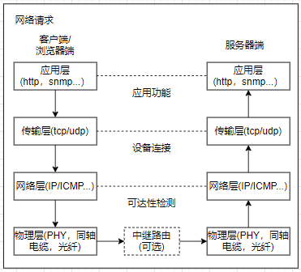
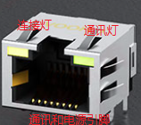
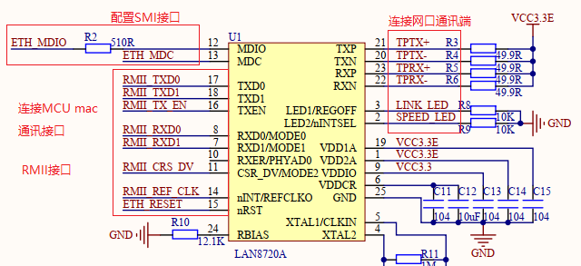
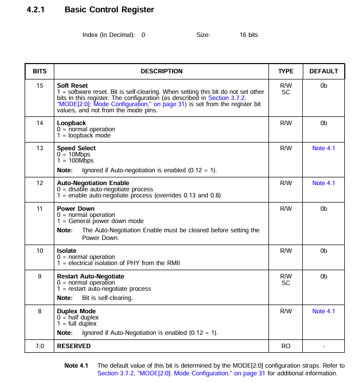
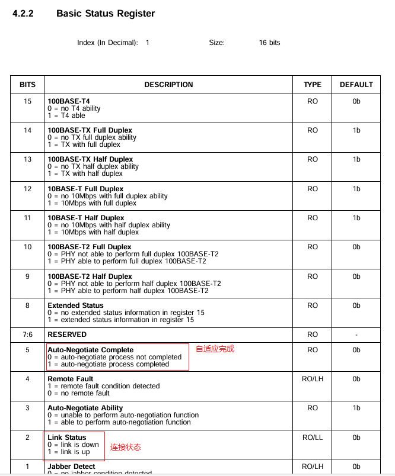

# 单片机技术总结说明(19) ETH模块和TCP/IP通讯

ETH的配置和应用可以说是STM32中最复杂的应用。从最基础的IP层实现ping通讯都需要如下的步骤。

1. ETH硬件驱动实现, 包含I/O的配置, ETH功能配置(DMA和中断使能, MAC设置)等。
2. PHY芯片的初始化, 一般基于SMI接口, 进行寄存器配置, 如PHY芯片的时钟, 中断使能, 工作模式等。
3. 协议栈的移植, 包含协议栈的配置和兼容层的实现, 如lwip协议栈, lwip兼容层的实现。
4. 基于RTOS的协议栈移植，还需要实现RTOS的任务调度，以及对于协议栈的兼容。

当完成上述步骤后, 才能实现协议栈支持的基础功能, 如ping、dhcp、socket通讯等功能。对于具体的网络应用, 还需要在此基础上实现http、mqtt、telnet、snmp等应用层协议开发后实现。网络应用可以说是单片机最复杂的应用之一, 远不是一篇文章能描述清楚的；这里也只能抛砖引玉, 从应用的角度去整理和总结网络相关的知识, 更深入的学习还需要配合其它书籍了解。

本节目录如下。

- [TCP/IP协议分析](#protocol_analysis)
- [硬件接口和驱动](#stm32_eth)
  - [硬件接口说明](#stm32_hardware)
- [STM32CubeMX构建LWIP应用](#stm32cubex_lwip)
- [LWIP代码关键代码分析](#code_analysis)
  - [物理层配置](#phyiscal_layer)
- [LWIP应用接口实现](#application)
- [LWIP网络开发问题和解决办法](#issue_fix)
- [功能总结](#summary)
- [下一章节](#next_chapter)

本节配合例程: **code/19-STM32F429_LWIP/project/stm32f429.uvprojx**

## protocol_analysis

通讯协议的学习其实一直是嵌入式应用中的难点, 很多时候即使开发出涉及多种类型的物联网设备, 仍然不求甚解。我也是在多年的学习和整理后, 有了一套自己的理解。通讯协议可以理解为约定不同设备进行交互的一套方法的总和； 虽然因为应用场景的不同, 有不同的层级和功能, 但最核心的都可以理解为如下结构。

- 物理层: 通讯之间物理硬件，常见的约定如下所示。
   - 通讯连接方式: 有线或无线
   - 通讯物理接口：RJ45, USB-TYPEC, COM口
   - 工作电平: 3.3V、5V或者其它电平
   - 工作频段(2.4G, 4G)
   - 信号的解析和生成方法
- 协议层: 确定数据的格式, 常见内容如下。
   - 帧格式: 如帧头, 数据长度, 协议版本信息, 数据包格式, 校验码等。
- 应用层: 用于定义具体功能需求的应用功能。
   
物理层一般由国际组织进行定义，芯片和器件的生产厂商根据标准协议实现；常见硬件如ETH PHY、USB PHY、WIFI、蓝牙芯片等。对于使用者可以不用去关心具体的实现细节, 不过在器件选型、硬件设计和布线时需要考虑辐射和干扰问题, 这部分经常被忽略, 但往往是产品设计稳定可靠的关键。基于协议层, 可以将两个设备建立逻辑上的连接, 从而在多设备互联的情况下实现一对一或多对多的通讯, 对于复杂的通讯协议, 往往在进一步分解成多层协议格式来应对不同的应用场景。协议层往往只会定义大体的框架结构, 由设计者根据产品的需求进行填充来实现具体的应用，也是嵌入式软件中最常涉及的部分。我们正常的分层概念，其中物理层代表实际的硬件接口，协议层和应用层都是组包和解包的软件处理逻辑，所谓的层级都是虚拟的人为分层。

依托这种经验对TCP/IP进行理解, 可以有着进一步的认知。

- 网络接口层对应的就是物理层, 定义了物理接口, 线缆, 电平, 数据格式, 冲突处理等；包含设备驱动(PHY, MAC配置)， ARP和RARP等通讯媒介细节。
  - ARP协议：地址解析协议，用于根据IP地址查找MAC地址。
  - RARP协议：反向地址解析协议，用于根据MAC地址查找IP地址。
- 网络层可以理解为属于上述协议层, 网络层提供路由, 寻址功能, 保证对端的可达性，主要包含IP、ICMP、IGMP协议。
  - IP协议：网际协议，将数据尽可能快的从源节点送到目的节点(不可靠，无连接)。
  - ICMP协议: 如ping包就是基于该协议实现的，常用来做网路状况的测试。
  - IGMP协议：用于多播组成员的管理，如加入、退出、查询等。
- 传输层同样可以理解为属于协议层，提供端对端的通讯连接，主要包含TCP、UDP协议。
  - TCP特点提供可靠的端对端通讯，通过三次握手建立连接，四次挥手断开连接。
  - UDP特点提供不可靠的端对端通讯，不保证数据的可靠到达，也不保证数据的顺序到达。
- 应用层则是在协议层基础上定义，实现的应用功能。开发者通过应用层从而完成具体功能的实现，如http、ftp、telnet、mqtt、snmp等服务。
  - HTTP协议: 超文本传输协议，是一种应用层协议，用于在Web浏览器和Web服务器之间传输超文本。
  - FTP协议：文件传输协议，用于在网络上进行文件的上传和下载。
  - TELNET协议：终端仿真协议，用于在网络上远程登录和控制其他设备。
  - MQTT协议：消息队列遥测传输协议，是一种基于发布/订阅模式的轻量级通讯协议，用于在物联网设备之间进行通信。
  - SNMP协议：简单网络管理协议，用于在网络中管理和监控设备。

其中网络请求和应答的格式如下所示。

网络请求：



网络应答：


网络请求和应答组成了一次完整的通讯过程，其流程和处理是镜像的，按照相同的格式封装和解包数据，这就能够保证在物理空间上不同设备之间的通讯能够正常进行；可以理解流程如下所示。

1. 发送端将待发送数据经过一层层组包，最后调用驱动程序，通过网卡发送，如果复杂的话要经过多个路由器，到达接收端。
2. 接收端获得数据开始一层层解包，最后由接收端指定层处理。因为组包和解包过程遵循着协议是完全透明的，那么相同的位置接收端和发送端的数据是一致的，就像实际物理连接起来一样，而为了区分协议不同的通讯功能，便有了分层的定义。

数据交互的框架如下所示。

```c
// 发送端发送数据流程
translate_data -> tcp_process() -> ip_process() -> eth_translate() -> tdata......

// 接收端接收数据流程
receive_data <- tcp_process() <- ip_process() <- eth_receive()  <- rdata......
```

发送端处理就是将用户数据加上对应得首部并传递给下一层，最后通过网卡发送出去，这个过程称为封装；而接收端处理就是接收数据，去掉各层协议加上的报文首部，并检查报文首部的协议标识，从而确定接收的上层协议，这个过程称为解包；完整的TCP/IP数据格式如下所示。


可以看到，通过TCP/IP协议的一层层的封装和解包，数据在发送端和接收端之间进行传递。对于TCP/IP设备来说，其发送端和接收端根据类型的不同，包含C/S类型和B/S类型。

1. C/S类型：传统的客户端软件/服务器模式，客户端和服务器通过UDP/TCP协议进行通讯。
2. B/S类型：浏览器/服务器模式，通过浏览器HTTP/HTTPS协议进行通讯，实现web应用。

上述资料描述了网络相关的协议栈，以及数据报文的解析，对网络也就有了一定的认识；下面以STM32开发板为例实践网络相关的功能。

## stm32_eth

对于STM32中使用TCP/IP通讯, 其中分为外部硬件结构、内部驱动处理、协议栈移植和应用实现四个部分组成，具体如下所示。

1. 外部硬件结构：包括网络接口、ETH PHY芯片和ETH MAC控制器组成。
2. 内部驱动处理：配置ETH MAC驱动，实现模块初始化、数据接收和发送，以及数据处理。
3. 协议栈移植: 移植RTOS和LWIP协议栈，适配协议栈功能。
4. 应用实现：完成协议栈功能，完成上层应用，如socket客户端/socket服务端(tcp/udp)等。

在下面会进行详细说明。

### stm32_hardware

对于硬件结构，其中网口是连接网线，对外通讯的物理接口；一般设计使用rj-45接口，其样式如下所示。



对于系统来说，设计上是百兆带宽，因此只需要1、2、3、6四个引脚通讯，另外网线使用差分传输，因此两组引脚构成一组通讯数据发送。两个LED灯分别表示网口连接和网口通讯状态。

| 引脚名称 | 引脚功能 |
| ---- | ---- |
| TXP | 网口发送数据引脚+ |
| TXN | 网口发送数据引脚- |
| RXP | 网口接收数据引脚+ |
| RXN | 网口接收数据引脚- |
| LED_Y(黄灯) | 网口连接状态 |
| LED_G(绿灯) | 网口通讯状态 |

连接引脚的就是我们常说的PHY芯片，PHY芯片的功能主要完成模数转换。发送数据时，将MCU的数字信号转变为模拟信号进行发送；接收数据时，将接收的模拟信号转变为数字信号进行处理。PHY芯片支持网速和工作方式的软件配置或自动协商，是网络活动中比较重要的部分。对于大部分MCU芯片，PHY都未集成到芯片中，需要外置PHY芯片配合使用。对于本例程，使用的PHY芯片为LAN8720A，其结构如下所示。



PHY芯片的连接包含三类接口，连接网口外部通讯的接口、连接MCU的通讯口(MII/RMII)以及用于配置PHY芯片的SMI接口；这里主要说明后两种接口。

- SMI接口

| SMI接口名称 | 引脚名称 | 引脚功能 |
| ---- | ---- | ---- |
| SMI_CLK | ETH_MDC | SMI时钟 |
| SMI_DAT | ETH_MDIO | SMI数据 |

SMI接口用于PHY芯片的配置，PHY芯片的配置主要包含PHY芯片的时钟和数据，以及PHY芯片的配置参数。另一个就是通讯接口。

- RMII接口

| RMII接口名称 | 引脚名称 | 引脚功能 |
| ---- | ---- | ---- |
| TXD0 | ETH_TXD0 | 网口发送数据0 |
| TXD1 | ETH_TXD1 | 网口发送数据1 |
| TX_EN | ETH_TX_EN | 网口发送使能 |
| RXD0 | ETH_RXD0 | 网口接收数据0 |
| RXD1 | ETH_RXD1 | 网口接收数据1 |
| RX_ER/PHY0ADDR | ETH_RX_ER | 网口接收错误状态位 |
| REF_CLK | ETH_REF_CLK | 时钟通讯接口 |
| CRS_DV | ETH_CRS_DV | PHY校验状态位，确定接收数据是否有效 |

MII/RMII接口用于数据通讯，其中包含发送和接收数据，以及时钟通讯接口和校验状态位。对于PHY芯片配置，其原理和那些I2C配置并没有区别，其内部有一套寄存器管理功能和查询状态，这里以LAN8720A为例，其关键信息包含PHY芯片的地址和关键寄存器参数。

手册可参考链接: https://atta.szlcsc.com/upload/public/pdf/source/20151012/1457707444106.pdf

其中地址信息如下所示，因为硬件上只有一个网口，不需要考虑多PHY情况，地址为0。


关键寄存器信息主要是控制寄存器和状态寄存器。其中控制寄存器如下所示。



包含设置PHY芯片工作方式，如100M/10M，全双工/半双工，自动协商。



状态寄存器则包含PHY芯片状态，工作模式、连接状态等。对于不同PHY芯片，其位置地址，寄存器功能可能都不一致，这就需要调整驱动去适配。下面开始基于STM32CubeMax配置来实现LWIP协议栈。

## stm32cubex_lwip

在接触LWIP时候，STM32CubeMX还不存在，只能自己参考网络上的教程去移植，步骤如下所示。

1. 完成ETH驱动的移植，这部分参考官方例程中的ethernetif.c文件。
2. 移植嵌入式实时系统RTOS，最初使用μC/OS-II，后来使用FreeRTOS，其实LWIP也支持非RTOS实现；不过这种情况在实际产品较少，这里不在赘述。
3. 将LWIP协议添加到工程中，实现协议兼容层，这部分主要在sys_arch.c和sys_arch.h中实现。
4. 完成协议栈的配置，主要在lwipopts.h中进行配置。
5. 在主函数代码中添加协议栈初始化代码，设置ip，子网掩码，网关或启用dhcp功能，并初始化协议栈，创建相应任务。
6. 实现上层应用，如socke客户端/socket服务端(tcp/udp)，http服务器等。

记得我第一次从无到有调通LWIP整个流程，并运行稳定，花了大概有一个多月的时间；后续在这基础上实现http/telnet/snmp等应用，又大概花费了接近三个月时间，才差不多完善整个项目。不过如今使用英飞凌的DAVE、以及ST的STM32CubeMX工具，通过生成代码的方式实现LWIP应用，大概只花了1~2天的时间，就完整实现了LWIP的移植和调试的工作。可以说大幅度降低了开发难度；这里以ST芯片为例，描述如何通过STM32CubeMX来实现LWIP应用。

### program_create

- 选择STM32F429IGT6，配置时钟晶振，工作频率，调试接口等。


- 配置FreeRTOS，其中SysTick作为系统时钟，HAL库的时钟源切换到TIM1。


- 启动ETH模块，修改接口为RMII模块，接收长度为1536，中断接收模式，并根据硬件原理图调整GPIO。

通过上节可以知道连接使用的是RMII模式，PHY芯片对应LAN8720芯片，进行相应的配置。


- 添加LWIP协议，选择底层的rtos，并配置协议栈，并选择对应的phy芯片。


此时可以使用STM32CubeMX生成MDK-ARM的代码。

考虑到PHY复位引脚问题，还需要增加I2C驱动接口，用于启动前复位PHY芯片，支持芯片功能，代码如下。

```c
// 通过i2c接口复位STM32的PHY芯片，放置在I2C初始化之后，ETH初始化之前
#define PCF8574_ADDR            0x40
#define PCF8574_I2C_TIMEOUT     10
static void phy_hw_reset(void)
{
    uint8_t data = 0xff;
    
    HAL_I2C_Master_Transmit(&hi2c2, PCF8574_ADDR | 0x00, &data, 1, PCF8574_I2C_TIMEOUT);   
    HAL_Delay(10);
    
    data = 0x7f;
    HAL_I2C_Master_Transmit(&hi2c2, PCF8574_ADDR | 0x00, &data, 1, PCF8574_I2C_TIMEOUT);
    HAL_Delay(10);
}
```

此时代码理论上编译通过后，可以连接以太网。


通过ping命令测试网络是否正常，具体如下所示。


## code_analysis

这里说下比较关键的代码文件。

1. Application/User/Core/main.c：主循环入口代码，进行驱动初始化，rtos使能和任务创建。
2. Application/User/LWIP/Target/ethernetif.c：PHY物理层驱动代码，phy和mac的配置，网络数据的物理层接收和发送。
3. Drivers/BSP/Components/lan8742.c：phy芯片代码，适配phy驱动地址和通讯交互，需要和硬件保持一致。
4. FreeRTOSConfig.h：freertos管理的配置文件，用于控制rtos的资源。
5. lwipopts.h：lwip管理的配置文件，用于控制lwip的资源。

### phyiscal_layer

对于LWIP协议来说，物理层包含两部分的配置，分别是PHY芯片初始化配置和内部的MAC层配置，以及数据的接收和发送功能。对于PHY芯片初始化，主要包含接口初始化、PHY软复位和状态获取功能；其代码如下所示。

```c
/* Set PHY IO functions */
LAN8742_RegisterBusIO(&LAN8742, &LAN8742_IOCtx);

/* Initialize the LAN8742 ETH PHY */
LAN8742_Init(&LAN8742);

if (hal_eth_init_status == HAL_OK)
{
    // 获取PHY连接状态，设计上开启线程实时检测，否则插入和拔出无法及时检测
    PHYLinkState = LAN8742_GetLinkState(&LAN8742);

    /* Get link state */
    if(PHYLinkState <= LAN8742_STATUS_LINK_DOWN)
    {
        netif_set_link_down(netif);
        netif_set_down(netif);
    }
    else
    {
        // 获取PHY工作模式
        switch (PHYLinkState)
        {
            case LAN8742_STATUS_100MBITS_FULLDUPLEX:
                duplex = ETH_FULLDUPLEX_MODE;
                speed = ETH_SPEED_100M;
            break;
            case LAN8742_STATUS_100MBITS_HALFDUPLEX:
                duplex = ETH_HALFDUPLEX_MODE;
                speed = ETH_SPEED_100M;
            break;
            case LAN8742_STATUS_10MBITS_FULLDUPLEX:
                duplex = ETH_FULLDUPLEX_MODE;
                speed = ETH_SPEED_10M;
            break;
            case LAN8742_STATUS_10MBITS_HALFDUPLEX:
                duplex = ETH_HALFDUPLEX_MODE;
                speed = ETH_SPEED_10M;
            break;
            default:
                duplex = ETH_FULLDUPLEX_MODE;
                speed = ETH_SPEED_100M;
            break;
        }

        // 配置到MAC中更新
        HAL_ETH_GetMACConfig(&heth, &MACConf);
        MACConf.DuplexMode = duplex;
        MACConf.Speed = speed;
        HAL_ETH_SetMACConfig(&heth, &MACConf);

        HAL_ETH_Start_IT(&heth);

        /*For Quick Process interrupt, not enable*/
        __HAL_ETH_DMA_DISABLE_IT(&heth, ETH_DMAIER_FBEIE | ETH_DMAIER_AISE | ETH_DMAIER_RBUIE);

        netif_set_up(netif);
        netif_set_link_up(netif);

        /* USER CODE BEGIN PHY_POST_CONFIG */

        /* USER CODE END PHY_POST_CONFIG */
    }
}
```

对于物理层另一个就是配置MAC功能，主要是配置MAC的工作模式、帧检测、硬件检查等功能；选择合适的配置可以提高发送和接收效率，避免错误帧丢失。对于MAC的配置，代码如下所示。

```c
ETH_MACConfigTypeDef macconf;
ETH_DMAConfigTypeDef dmaconf;

/*--------------- ETHERNET MAC registers default Configuration --------------*/
macconf.Watchdog = DISABLE;                                                 //关闭看门狗，允许超长帧
macconf.Jabber = DISABLE;                                                   //关闭jabber定时器，允许超长帧
macconf.InterPacketGapVal = ETH_INTERFRAMEGAP_96BIT;                        //发送帧帧间间隙，96bit
macconf.CarrierSenseDuringTransmit = DISABLE;                               //发送载波侦听功能，关闭后异常直接丢弃
macconf.ReceiveOwn = ENABLE;                                                //是否接收自身帧
macconf.LoopbackMode = DISABLE;                                             //回环模式
macconf.ChecksumOffload = ENABLE;                                           //IPv4帧的CRC检查, 硬件CRC检查
macconf.RetryTransmission = DISABLE;                                        //自动重传，延时BackOffLimit后发送(半双工有效)
macconf.AutomaticPadCRCStrip = DISABLE;                                     //自动填充/CRC剥离处理不执行，转发所有帧
macconf.BackOffLimit = ETH_BACKOFFLIMIT_10;                                 //发送发生冲突后，重发前等待的随机时间间隙数目(半双工有效)
macconf.DeferralCheck = DISABLE;                                            //顺延检验(半双工有效)
macconf.PauseTime = 0x0U;                                                   //控制帧Pause时间域的值，流控相关
macconf.ZeroQuantaPause = DISABLE;
macconf.PauseLowThreshold = ETH_PAUSELOWTHRESHOLD_MINUS4;                   //PAUSE低阈值
macconf.ReceiveFlowControl = DISABLE;                                       //接收流控使能，能够处理Pause帧，关闭一段时间 
macconf.TransmitFlowControl = DISABLE;                                      //发送流控使能，支持发送Pause帧
macconf.Speed = ETH_SPEED_100M;                                             // 100M速度 - 自适应后，会适配和PHY一致
macconf.DuplexMode = ETH_FULLDUPLEX_MODE;                                   // 全双工模式 - 自适应后，会适配和PHY一致
macconf.UnicastPausePacketDetect = DISABLE;                                 // 单播Pause帧检测 
macconf.ForwardRxErrorPacket = DISABLE;                                     // 不接收错误帧(异常帧丢弃)
macconf.ForwardRxUndersizedGoodPacket = DISABLE;                            // 不接收超短帧(低于协议要求的帧)
macconf.DropTCPIPChecksumErrorPacket = ENABLE;                              // 自动丢弃校验和错误的TCP/IP包

// MAC功能配置
HAL_ETH_SetMACConfig(&heth, &macconf);

dmaconf.DropTCPIPChecksumErrorFrame = ENABLE;
dmaconf.ReceiveStoreForward = ENABLE;                                       //接收数据超过阈值转发
dmaconf.FlushRxPacket = ENABLE;                                             //描述符被占用和接收FIFO不可用时清空FIFO(解决堵塞)
dmaconf.TransmitStoreForward = ENABLE;                                      //存储转发模式，只有完整帧才能够提交
dmaconf.TransmitThresholdControl = ETH_TRANSMITTHRESHOLDCONTROL_128BYTES;   //发送阈值为128Bytes
dmaconf.ForwardErrorFrames = DISABLE;                                       //不发送错误帧(异常帧丢弃)
dmaconf.ForwardUndersizedGoodFrames = DISABLE;                              //不发送超短帧(低于协议要求的帧)
dmaconf.ReceiveThresholdControl = ETH_RECEIVEDTHRESHOLDCONTROL_32BYTES;     //DMA接收阈值为32Bytes
dmaconf.SecondFrameOperate = DISABLE;                                       //DMA直接发送第二个帧，不需要之前帧回复
dmaconf.AddressAlignedBeats = ENABLE;                                       //传输地址对齐
dmaconf.BurstMode = ETH_BURSTLENGTH_FIXED;                                  //固定的突发
dmaconf.RxDMABurstLength = ETH_RXDMABURSTLENGTH_32BEAT;                     //DMA突发接收传输32字
dmaconf.TxDMABurstLength = ETH_TXDMABURSTLENGTH_32BEAT;                     //DMA突发发送传输32字
dmaconf.EnhancedDescriptorFormat = ENABLE;                                  //增强描述符格式使能，时间戳和校验和检测使能时，必须使能此位
dmaconf.DescriptorSkipLength = 0x0U;                                        //描述符跳跃长度，不跳跃
dmaconf.DMAArbitration = ETH_DMAARBITRATION_ROUNDROBIN_RXTX_1_1;            //发送和接收比例(上传数据时重要) 2:1

// DMA收发功能配置
HAL_ETH_SetDMAConfig(&heth, &dmaconf);
```

接下来就是数据收发的代码，其中接收由中断产生，由ETH_Handler处理，产生信号通知接收线程处理，具体实现位于ethernetif.c中。

```c
void ETH_IRQHandler(void)
{
    BaseType_t yield;
    
    // 接收中断
    if (__HAL_ETH_DMA_GET_IT(&heth, ETH_DMASR_RS))
    {
        __HAL_ETH_DMA_CLEAR_IT(&heth, ETH_DMASR_RS | ETH_DMASR_NIS);
        xSemaphoreGiveFromISR(RxPktSemaphore, &yield);
    }

    // 发送中断
    if (__HAL_ETH_DMA_GET_IT(&heth, ETH_DMASR_TS))
    {
        __HAL_ETH_DMA_CLEAR_IT(&heth, ETH_DMASR_TS | ETH_DMASR_NIS);
        xSemaphoreGiveFromISR(TxPktSemaphore, &yield);
    }
    
    portYIELD_FROM_ISR(yield);
}
```

接下来就是数据收发代码，具体实现位于ethernetif.c中。

```c
// 数据接收处理
void ethernetif_input(void* argument)
{
  struct pbuf *p = NULL;
  struct netif *netif = (struct netif *) argument;

  for( ;; )
  {
    if (osSemaphoreAcquire(RxPktSemaphore, TIME_WAITING_FOR_INPUT) == osOK)
    {
      do
      {
        // 从物理层接收数据
        p = low_level_input( netif );
        if (p != NULL)
        {
          // 投递到邮箱，等待IP层处理
          if (netif->input( p, netif) != ERR_OK )
          {
            pbuf_free(p);
          }
        }
      } while(p!=NULL);
    }
  }
}

// 数据发送处理
err_t
ethernet_output(struct netif * netif, struct pbuf * p,
                const struct eth_addr * src, const struct eth_addr * dst,
                u16_t eth_type) {
  struct eth_hdr *ethhdr;
  u16_t eth_type_be = lwip_htons(eth_type);

  // ......

  LWIP_ASSERT_CORE_LOCKED();

  ethhdr = (struct eth_hdr *)p->payload;
  ethhdr->type = eth_type_be;
  SMEMCPY(&ethhdr->dest, dst, ETH_HWADDR_LEN);
  SMEMCPY(&ethhdr->src,  src, ETH_HWADDR_LEN);

  LWIP_ASSERT("netif->hwaddr_len must be 6 for ethernet_output!",
              (netif->hwaddr_len == ETH_HWADDR_LEN));
  LWIP_DEBUGF(ETHARP_DEBUG | LWIP_DBG_TRACE,
              ("ethernet_output: sending packet %p\n", (void *)p));

  /* send the packet */
  return netif->linkoutput(netif, p);

pbuf_header_failed:
  LWIP_DEBUGF(ETHARP_DEBUG | LWIP_DBG_TRACE | LWIP_DBG_LEVEL_SERIOUS,
              ("ethernet_output: could not allocate room for header.\n"));
  LINK_STATS_INC(link.lenerr);
  return ERR_BUF;
}
```

### lwip_config

下面开始说明LWIP协议中的功能。对于LWIP来说，其移植主要分为以下部分，包含LWIP模块的初始化、系统兼容层的实现以及LWIP协议栈的配置。LWIP的初始化比较简单，实现位于lwip.c文件中，按照顺序调用如下接口即可，具体如下所示。

```c
void MX_LWIP_Init(void)
{
  NetInfo_t *net_info_ptr = get_net_info();
    
  /* IP addresses initialization */
  IP_ADDRESS[0] = net_info_ptr->ipaddr[0];
  IP_ADDRESS[1] = net_info_ptr->ipaddr[1];
  IP_ADDRESS[2] = net_info_ptr->ipaddr[2];
  IP_ADDRESS[3] = net_info_ptr->ipaddr[3];
  NETMASK_ADDRESS[0] = net_info_ptr->netmask[0];
  NETMASK_ADDRESS[1] = net_info_ptr->netmask[1];
  NETMASK_ADDRESS[2] = net_info_ptr->netmask[2];
  NETMASK_ADDRESS[3] = net_info_ptr->netmask[3];
  GATEWAY_ADDRESS[0] = net_info_ptr->gateway[0];
  GATEWAY_ADDRESS[1] = net_info_ptr->gateway[1];
  GATEWAY_ADDRESS[2] = net_info_ptr->gateway[2];
  GATEWAY_ADDRESS[3] = net_info_ptr->gateway[3];

/* USER CODE BEGIN IP_ADDRESSES */
/* USER CODE END IP_ADDRESSES */

  /* Initilialize the LwIP stack with RTOS */
  tcpip_init( NULL, NULL );

  /* IP addresses initialization without DHCP (IPv4) */
  IP4_ADDR(&ipaddr, IP_ADDRESS[0], IP_ADDRESS[1], IP_ADDRESS[2], IP_ADDRESS[3]);
  IP4_ADDR(&netmask, NETMASK_ADDRESS[0], NETMASK_ADDRESS[1] , NETMASK_ADDRESS[2], NETMASK_ADDRESS[3]);
  IP4_ADDR(&gw, GATEWAY_ADDRESS[0], GATEWAY_ADDRESS[1], GATEWAY_ADDRESS[2], GATEWAY_ADDRESS[3]);

  /* add the network interface (IPv4/IPv6) with RTOS */
  netif_add(&gnetif, &ipaddr, &netmask, &gw, NULL, &ethernetif_init, &tcpip_input);

  /* Registers the default network interface */
  netif_set_default(&gnetif);

  if (netif_is_link_up(&gnetif))
  {
    /* When the netif is fully configured this function must be called */
    netif_set_up(&gnetif);
  }
  else
  {
    /* When the netif link is down this function must be called */
    netif_set_down(&gnetif);
  }

  /* Set the link callback function, this function is called on change of link status*/
  netif_set_link_callback(&gnetif, ethernet_link_status_updated);

  /* Create the Ethernet link handler thread */
/* USER CODE BEGIN H7_OS_THREAD_NEW_CMSIS_RTOS_V2 */
  memset(&attributes, 0x0, sizeof(osThreadAttr_t));
  attributes.name = "EthLink";
  attributes.stack_size = INTERFACE_THREAD_STACK_SIZE;
  attributes.priority = osPriorityBelowNormal;
  osThreadNew(ethernet_link_thread, &gnetif, &attributes);
/* USER CODE END H7_OS_THREAD_NEW_CMSIS_RTOS_V2 */

/* USER CODE BEGIN 3 */

/* USER CODE END 3 */
}
```

至于系统兼容层，对应sys_arch.c，主要实现如下接口，这里使用STM32CubeMAX直接生成，可以说简化了很多的操作。

```c
// 系统初始化
void sys_init(void);

// 邮箱相关实现接口
u32_t sys_arch_mbox_fetch(sys_mbox_t *mbox, void **msg, u32_t timeout)
u32_t sys_arch_mbox_tryfetch(sys_mbox_t *mbox, void **msg)

err_t sys_mbox_new(sys_mbox_t *mbox, int size);
err_t sys_mbox_post(sys_mbox_t *mbox, void *msg);
err_t sys_mbox_trypost(sys_mbox_t *mbox, void *msg);
err_t sys_mbox_trypost_fromisr(sys_mbox_t *mbox, void *msg);
int sys_mbox_valid(sys_mbox_t *mbox)
void sys_mbox_set_invalid(sys_mbox_t *mbox)
void sys_mbox_free(sys_mbox_t *mbox);

// 保护相关接口
sys_prot_t sys_arch_protect(void);
void sys_arch_unprotect(sys_prot_t pval);

// 信号量sem相关接口
err_t sys_sem_new(sys_sem_t *sem, u8_t count);
int sys_sem_valid(sys_sem_t *sem);
void sys_sem_set_invalid(sys_sem_t *sem);
void sys_sem_signal(sys_sem_t *sem);
void sys_sem_free(sys_sem_t *sem);
u32_t sys_arch_sem_wait(sys_sem_t *sem, u32_t timeout);

// mutex相关接口
err_t sys_mutex_new(sys_mutex_t *mutex);
void sys_mutex_lock(sys_mutex_t *mutex);
void sys_mutex_unlock(sys_mutex_t *mutex);
void sys_mutex_free(sys_mutex_t *mutex);

// 线程相关接口
sys_thread_t sys_thread_new(const char *name, lwip_thread_fn thread , void *arg, int stacksize, int prio)
```

这一节主要说明lwipopts.h中的主要配置项，这里提供我在应用中调整的比较完善的配置。

```c
/* USER CODE BEGIN Header */
/**
  ******************************************************************************
  * File Name          : Target/lwipopts.h
  * Description        : This file overrides LwIP stack default configuration
  *                      done in opt.h file.
  ******************************************************************************
  * @attention
  *
  * Copyright (c) 2024 STMicroelectronics.
  * All rights reserved.
  *
  * This software is licensed under terms that can be found in the LICENSE file
  * in the root directory of this software component.
  * If no LICENSE file comes with this software, it is provided AS-IS.
  *
  ******************************************************************************
  */
/* USER CODE END Header */

/* Define to prevent recursive inclusion --------------------------------------*/
#ifndef __LWIPOPTS__H__
#define __LWIPOPTS__H__

#include "main.h"

/*-----------------------------------------------------------------------------*/
/* Current version of LwIP supported by CubeMx: 2.1.2 -*/
/*-----------------------------------------------------------------------------*/

/* Within 'USER CODE' section, code will be kept by default at each generation */
/* USER CODE BEGIN 0 */

/* USER CODE END 0 */

#ifdef __cplusplus
 extern "C" {
#endif

/* STM32CubeMX Specific Parameters (not defined in opt.h) ---------------------*/
/* Parameters set in STM32CubeMX LwIP Configuration GUI -*/
/*----- WITH_RTOS enabled (Since FREERTOS is set) -----*/
#define WITH_RTOS 1
/*----- CHECKSUM_BY_HARDWARE enabled -----*/
#define CHECKSUM_BY_HARDWARE 1
/*-----------------------------------------------------------------------------*/

/* LwIP Stack Parameters (modified compared to initialization value in opt.h) -*/
/* Parameters set in STM32CubeMX LwIP Configuration GUI -*/
/*----- Value in opt.h for MEM_ALIGNMENT: 1 -----*/
#define MEM_ALIGNMENT 4                //字节对齐(和CPU的位数有关,32位设置为4)
/*----- Value in opt.h for LWIP_ETHERNET: LWIP_ARP || PPPOE_SUPPORT -*/
#define LWIP_ETHERNET 1
/*----- Value in opt.h for LWIP_DNS_SECURE: (LWIP_DNS_SECURE_RAND_XID | LWIP_DNS_SECURE_NO_MULTIPLE_OUTSTANDING | LWIP_DNS_SECURE_RAND_SRC_PORT) -*/
#define LWIP_DNS_SECURE 7
/*----- Value in opt.h for TCP_SND_QUEUELEN: (4*TCP_SND_BUF + (TCP_MSS - 1))/TCP_MSS -----*/
//#define TCP_SND_QUEUELEN 9
/*----- Value in opt.h for TCP_SNDLOWAT: LWIP_MIN(LWIP_MAX(((TCP_SND_BUF)/2), (2 * TCP_MSS) + 1), (TCP_SND_BUF) - 1) -*/
//#define TCP_SNDLOWAT 1071
/*----- Value in opt.h for TCP_SNDQUEUELOWAT: LWIP_MAX(TCP_SND_QUEUELEN)/2, 5) -*/
#define TCP_SNDQUEUELOWAT 5
/*----- Value in opt.h for TCP_WND_UPDATE_THRESHOLD: LWIP_MIN(TCP_WND/4, TCP_MSS*4) -----*/
//#define TCP_WND_UPDATE_THRESHOLD 536
/*----- Value in opt.h for LWIP_NETIF_LINK_CALLBACK: 0 -----*/
#define LWIP_NETIF_LINK_CALLBACK 1
/*----- Value in opt.h for TCPIP_THREAD_STACKSIZE: 0 -----*/
#define TCPIP_THREAD_STACKSIZE 1024
/*----- Value in opt.h for TCPIP_THREAD_PRIO: 1 -----*/
#define TCPIP_THREAD_PRIO 24
/*----- Value in opt.h for TCPIP_MBOX_SIZE: 0 -----*/
#define TCPIP_MBOX_SIZE 6
/*----- Value in opt.h for SLIPIF_THREAD_STACKSIZE: 0 -----*/
#define SLIPIF_THREAD_STACKSIZE 1024
/*----- Value in opt.h for SLIPIF_THREAD_PRIO: 1 -----*/
#define SLIPIF_THREAD_PRIO 3
/*----- Value in opt.h for DEFAULT_THREAD_STACKSIZE: 0 -----*/
#define DEFAULT_THREAD_STACKSIZE 1024
/*----- Value in opt.h for DEFAULT_THREAD_PRIO: 1 -----*/
#define DEFAULT_THREAD_PRIO 3
/*----- Value in opt.h for DEFAULT_UDP_RECVMBOX_SIZE: 0 -----*/
#define DEFAULT_UDP_RECVMBOX_SIZE 6
/*----- Value in opt.h for DEFAULT_TCP_RECVMBOX_SIZE: 0 -----*/
#define DEFAULT_TCP_RECVMBOX_SIZE 6
/*----- Value in opt.h for DEFAULT_ACCEPTMBOX_SIZE: 0 -----*/
#define DEFAULT_ACCEPTMBOX_SIZE 6
/*----- Value in opt.h for RECV_BUFSIZE_DEFAULT: INT_MAX -----*/
#define RECV_BUFSIZE_DEFAULT 2000000000
/*----- Value in opt.h for LWIP_STATS: 1 -----*/
#define LWIP_STATS 0
/*----- Value in opt.h for CHECKSUM_GEN_IP: 1 -----*/
#define CHECKSUM_GEN_IP 0
/*----- Value in opt.h for CHECKSUM_GEN_UDP: 1 -----*/
#define CHECKSUM_GEN_UDP 0
/*----- Value in opt.h for CHECKSUM_GEN_TCP: 1 -----*/
#define CHECKSUM_GEN_TCP 0
/*----- Value in opt.h for CHECKSUM_GEN_ICMP: 1 -----*/
#define CHECKSUM_GEN_ICMP 0
/*----- Value in opt.h for CHECKSUM_GEN_ICMP6: 1 -----*/
#define CHECKSUM_GEN_ICMP6 0
/*----- Value in opt.h for CHECKSUM_CHECK_IP: 1 -----*/
#define CHECKSUM_CHECK_IP 0
/*----- Value in opt.h for CHECKSUM_CHECK_UDP: 1 -----*/
#define CHECKSUM_CHECK_UDP 0
/*----- Value in opt.h for CHECKSUM_CHECK_TCP: 1 -----*/
#define CHECKSUM_CHECK_TCP 0
/*----- Value in opt.h for CHECKSUM_CHECK_ICMP: 1 -----*/
#define CHECKSUM_CHECK_ICMP 0
/*----- Value in opt.h for CHECKSUM_CHECK_ICMP6: 1 -----*/
#define CHECKSUM_CHECK_ICMP6 0
/*----- Default Value for LWIP_DBG_MIN_LEVEL: LWIP_DBG_LEVEL_ALL ---*/
#define LWIP_DBG_MIN_LEVEL LWIP_DBG_LEVEL_SERIOUS
/*-----------------------------------------------------------------------------*/
/* USER CODE BEGIN 1 */

/* USER CODE END 1 */
#define LWIP_SO_RCVTIMEO                1
#define LWIP_SO_SNDTIMEO                1

//*****************************************************************************
//
// ---------- Platform specific locking ----------
//
//*****************************************************************************
#define SYS_LIGHTWEIGHT_PROT            1             //临界中断保护开关(多任务模式下开启)
#define NO_SYS                          0             //使用自定义LWIP配置 为1则只使用超轻量级LWIP配置

//*****************************************************************************
//
// ---------- Memory options ----------
//
//*****************************************************************************
#define MEM_LIBC_MALLOC                 0               //采用LWIP自带函数分配动态内存
#define MEM_LIBC_MALLOC                 0               //内存池不通过内存堆来分配
#define MEM_SIZE                        8*1024          //堆内存大
#define MEMP_SANITY_CHECK               0               //mem_free调用后检查链表是否有循环
#define MEMP_OVERFLOW_CHECK             0               //lwip堆内存溢出检查 
#define MEM_USE_POOLS                   0               //内存堆不通过内存池分配
#define MEM_USE_POOLS_TRY_BIGGER_POOL   0               //申请内存失败不选择大内存池
#define MEMP_USE_CUSTOM_POOLS           0               //同上
    

//*****************************************************************************
//
// ---------- Internal Memory Pool Sizes ----------
//
//*****************************************************************************
#define MEMP_NUM_PBUF                   60              //来自memp的PBUF_ROM(ROM内存池)和PBUF_REF(RAM内存池)数目最大总和
#define MEMP_NUM_RAW_PCB                4               //RAW连接的PCB数目(需要LWIP RAW有效)
#define MEMP_NUM_UDP_PCB                4               //能够同时连接的UDP的PCB数目
#define MEMP_NUM_TCP_PCB                (TCP_WND + TCP_SND_BUF)/TCP_MSS  //能够同时连接的TCP的PCB数目 12
#define MEMP_NUM_TCP_PCB_LISTEN         2               //能够同时监听的TCP的PCB数目 by zc 2015.10.30
#define MEMP_NUM_TCP_SEG                40              //80 能够同时在队列里的TCP的PCB数目
#define MEMP_NUM_REASSDATA               8              //最大同时等待重装的IP包数目，是整个IP包，不是IP分片
#define MEMP_NUM_ARP_QUEUE              30              //最大等待回复ARP请求的数目(ARP_QUEUEING有效)
#define MEMP_NUM_IGMP_GROUP             8               //多播组同时接收数据的最大成员数目(LWIP_IGMP有效)
#define MEMP_NUM_SYS_TIMEOUT            20              //能够同时激活的超时连接数目(NO_SYS==0有戏)
#define MEMP_NUM_NETBUF                 10              //netbufs结构的数目
#define MEMP_NUM_NETCONN                16              //netconns结构的数目
#define MEMP_NUM_TCPIP_MSG_API          40              //tcpip_msg结构的最大数目，用于callback和API的通讯 by zc
#define MEMP_NUM_TCPIP_MSG_INPKT        40              //tcpip_msg接受数据包结构的最大数目 by zc

//*****************************************************************************
//
// ---------- ARP options ----------
//
//*****************************************************************************
#define LWIP_ARP                        1               //ARP协议允许 
#define ARP_TABLE_SIZE                  10              //ARP维护的表项大小
#define ARP_QUEUEING                    1               //硬件地址解析时，将发送数据包计入队列
#define ETHARP_TRUST_IP_MAC             0               //所有IP数据包都会直接引起ARP table的更新，为0则非表项内IP-MAC关系会引起ARP请求,可以避免IP欺骗，不过会造成延时
#define ETHARP_SUPPORT_VLAN             0               //非虚拟局域网，为1则仅虚拟局域网通讯有效

//*****************************************************************************
//
// ---------- IP options ----------
//
//*****************************************************************************
#define IP_FORWARD                      0           //不允许不匹配数据包转发,多接口时为1
#define IP_OPTIONS_ALLOWED              1           //带IP选项数据包允许 为0则丢弃所有IP数据包
#define IP_FRAG_USES_STATIC_BUF         1           //IP分片使用静态缓冲区
#define IP_FRAG_MAX_MTU                 1500        //IP分片最大缓冲容量
#define IP_DEFAULT_TTL                  255         //IP数据包最大经历设备数目
#define IP_SOF_BROADCAST                0           //IP发送广播包过滤
#define IP_SOF_BROADCAST_RECV           0           //IP接收广播包过滤

//*****************************************************************************
//
// ---------- ICMP options ----------
//
//*****************************************************************************
#define LWIP_ICMP                       1           //开启ping包接收/发送
#define ICMP_TTL                       (IP_DEFAULT_TTL) //ping包最大经历设备数目
#define LWIP_BROADCAST_PING             0           //不回复广播ping包
#define LWIP_MULTICAST_PING             0           //不回复多播ping包

//*****************************************************************************
//
// ---------- RAW options ----------
//
//*****************************************************************************
#define LWIP_RAW                        0           //无操作系统基于回调函数驱动
#define RAW_TTL                         (IP_DEFAULT_TTL) //应用层数据传输次数(基于IP层的TTL)

//*****************************************************************************
//
// ---------- UDP options ----------
//
//*****************************************************************************
#define LWIP_UDP                        1            //启用UDP协议(snmp协议基于此)
#define LWIP_UDPLITE                    1            //UDP协议启用精简版
#define UDP_TTL                         (IP_DEFAULT_TTL)    //UDP数据包传输次数
#define LWIP_NETBUF_RECVINFO            0            //接收到的数据包除首个外其它不附加目的地址和端口

//*****************************************************************************
//
// ---------- TCP options ----------
//
//*****************************************************************************
#define LWIP_TCP                        1               //启用TCP协议(http协议基于此)
#define TCP_TTL                         (IP_DEFAULT_TTL)//TCP数据包传输次数
#define TCP_WND                         6*TCP_MSS       //tcp窗口大小
#define TCP_MAXRTX                      12              //最大允许重传TCP数据包数目
#define TCP_SYNMAXRTX                   6               //最大允许重传SYN连接包数目
#define TCP_QUEUE_OOSEQ                 (LWIP_TCP)      //TCP接收队列外数据块排序
#define TCP_MSS                         1460            //tcp报文最大分段长度
#define TCP_CALCULATE_EFF_SEND_MSS      1               //tcp预计发送的分段长度，为1则根据窗口大小分配
#define TCP_SND_BUF                     (8*TCP_MSS)     //TCP发送缓冲区  zc 7.1                                     
#define TCP_SND_QUEUELEN                (4*(TCP_SND_BUF/TCP_MSS))   //TCP发送队列长度
#define TCP_SNDLOWAT                    (TCP_SND_BUF/4)             //TCP可发送数据长度
#define TCP_LISTEN_BACKLOG              1               //TCP多连接允许  
#define TCP_DEFAULT_LISTEN_BACKLOG      0xff            //TCP连接和半连接的总数 
#define LWIP_TCP_TIMESTAMPS             0               //TCP时间戳选项
#define TCP_WND_UPDATE_THRESHOLD        (TCP_WND / 6)   //TCP窗口更新阈值

//TCP定时器设置选项
#define  TCP_MSL                         10000UL        //TCP连接存在时间 单位ms
//#define  TCP_FIN_WAIT_TIMEOUT     20000UL             //FIN等到ACK应答时间 单位ms
#define  TCP_TMR_INTERVAL                1              //TCP定时器计数间隔 20ms

//*****************************************************************************
// 
// ---------- Internal Memory Pool Sizes ----------
//
//*****************************************************************************
#define  PBUF_LINK_HLEN                 14              //为处理以太网头申请的包长度(本地MAC地址+远端MAC地址+协议类型) 6+6+2
#define  PBUF_POOL_BUFSIZE              256             //单个内存池长度，要考虑到4字节对齐和最佳大小
#define  ETH_PAD_SIZE                   0               //以太网填充长度，stm32设置为0 根据发送包判断
#define  PBUF_POOL_SIZE                 64              //内存池数量

//*****************************************************************************
//
// ---------- Sequential layer options ----------
//
//*****************************************************************************
#define LWIP_TCPIP_CORE_LOCKING         0               //?
#define LWIP_NETCONN                    1               //应用层使用NETCONN相关函数

//*****************************************************************************
//
// ---------- TCP KEEPLIVE ----------
//
//*****************************************************************************
#define LWIP_TCP_KEEPALIVE              1               //tcp保活定时器
#define TCP_KEEPIDLE_DEFAULT            60000           //保活时间 60s
#define TCP_KEEPINTVL_DEFAULT           10000           //保活探测 10s
#define TCP_KEEPCNT_DEFAULT             9U  

#ifdef __cplusplus
}
#endif
#endif /*__LWIPOPTS__H__ */
```

## application

移植完成LWIP完成后，应用的实现就可以参考Linux端的socket应用。这里以TCP客户端为例，主要涉及的接口如下所示。

```c
// 创建socket句柄
// domain: AF_INET 表示ipv4
// type: SOCK_STREAM 表示tcp协议
// protocol: 0 表示默认协议
#define socket(domain,type,protocol)              lwip_socket(domain,type,protocol)
int lwip_socket(int domain, int type, int protocol);

// 连接服务器
// s: socket句柄
// name: 服务器地址
// namelen: 服务器地址长度
#define connect(s,name,namelen)                   lwip_connect(s,name,namelen)
int lwip_connect(int s, const struct sockaddr *name, socklen_t namelen)

// 设置socket选项
// s: socket句柄
// level: 选项级别
// optname: 选项名
// optval: 选项值
// optlen: 选项值长度
#define setsockopt(s,level,optname,opval,optlen)  lwip_setsockopt(s,level,optname,opval,optlen)
int lwip_setsockopt(int s, int level, int optname, const void *optval, socklen_t optlen)

// 接受连接
// s: socket句柄
// addr: 客户端地址
// addrlen: 客户端地址长度
// 返回值: 新的socket句柄
#define accept(s,addr,addrlen)                    lwip_accept(s,addr,addrlen)
int lwip_accept(int s, struct sockaddr *addr, socklen_t *addrlen)

// 绑定地址
// s: socket句柄
// name: 本地地址
// namelen: 本地地址长度
// 返回值: 0 成功 其它失败
#define bind(s,name,namelen)                      lwip_bind(s,name,namelen)
int lwip_bind(int s, const struct sockaddr *name, socklen_t namelen)

// 接收数据
// s: socket句柄
// mem: 接收数据指针
// len: 接收数据长度
// 返回值: 接收数据长度
#define read(s,mem,len)                           lwip_read(s,mem,len)
ssize_t lwip_read(int s, void *mem, size_t len);

// 发送数据
// s: socket句柄
// data: 数据指针
// size: 数据长度
// 返回值: 发送数据长度
#define write(s,dataptr,len)                      lwip_write(s,dataptr,len)
ssize_t lwip_write(int s, const void *data, size_t size)

// 关闭socket句柄
// s: socket句柄
#define close(s)                                  lwip_close(s)
int lwip_close(int s)
```

结合上述代码，基于socket的客户端的实现如下所示。

```c
void logger_client_task(void *argument)
{
    struct sockaddr_in server_addr;

    ip_addr_t ipaddr;
    int bytes_received;

    IP4_ADDR(&ipaddr, NetInfo.serverip[0],
                NetInfo.serverip[1],
                NetInfo.serverip[2],
                NetInfo.serverip[3]);
    server_addr.sin_family = AF_INET;
    server_addr.sin_port = htons(NetInfo.logger_port);
    server_addr.sin_addr.s_addr = ipaddr.addr; //0x2801000a

    for( ;; )
    {
        //等待网线连接，才进行socket连接
        if (!netif_link_up()) {
            vTaskDelay(1000);
            continue;
        }

        //1. 创建socket句柄，其中SOCK_STREAM代表tcp协议
        loggerfd = socket(AF_INET, SOCK_STREAM, 0);
        if (loggerfd== -1) {
            PRINT_LOG(LOG_ERROR, xTaskGetTickCount(), "logger Socket Alloc Failed!");
            vTaskDelay(1000);
            continue;
        }

        //2. 连接服务器端，指定IP地址和端口
        is_logger_connected = connect(loggerfd, (struct sockaddr *)&server_addr, sizeof(struct sockaddr));
        if (is_logger_connected == -1) {
            //PRINTLOG(LOG_WARN, xTaskGetTickCount(), "logger Socket Connect Failed");
            lwip_close(loggerfd);
            vTaskDelay(3000);
            continue;
        } else {
            int flag;
            struct timeval console_time;

            //3. 配置tcp连接超时，当一段时间不接收或者发送时，断开连接
            console_time.tv_sec = 6;
            console_time.tv_usec = 0;
            setsockopt(loggerfd, IPPROTO_TCP, TCP_NODELAY, (void *)&flag, sizeof(int));
            setsockopt(loggerfd, SOL_SOCKET, SO_RCVTIMEO, (char*)&console_time, sizeof(console_time));
            console_time.tv_sec = 2;
            setsockopt(loggerfd, SOL_SOCKET, SO_SNDTIMEO, (char*)&console_time, sizeof(console_time));

            for( ;; ) {
                //4. 等待数据接收，并处理接收数据
                bytes_received = recv(loggerfd, logger_recv_buffer, LOGGER_RECV_BUFFER_SIZE, 0);
                if(bytes_received <= 0) {
                    vTaskDelay(10);
                    if(is_logger_connected == -1)
                        break;
                    PRINT_LOG(LOG_WARN, xTaskGetTickCount(), "no cycle send every 6 second for logger!!!");
                } else {
                    logger_recv_buffer[bytes_received] = '\0';
                    PRINT_LOG(LOG_WARN, xTaskGetTickCount(), "tcp receive:%s", logger_recv_buffer);
                }
            }

            //5.检测到连接断开，关闭socket，释放资源
            is_logger_connected = -1;
            close(loggerfd);
            loggerfd= -1;
            vTaskDelay(1000);  //connect 1000ms peroid, when no link
        }
    }    
}
```

如此，简单的tcp socket例程实现；它主要实现功能为接收远端的数据，并打印到调试口上。

## issue_fix

这里分享我在使用产品开发和量产时遇到的问题和解决办法。

### issue-01

PHY和MAC连接使用MII模式，但是芯片的MII_ER脚硬件未连接，悬空，导致接收时偶发性的丢包。

原因: MII_ER在MII模式下是帧错误检测，悬空时电平抖动，部分包被判断为错误帧丢弃。

解决办法: 硬件上强制把MII_ER脚拉低或者连接PHY对应引脚上，或者软件配置不丢弃错误帧。

### issue-02

PHY芯片被生产更换为另一款同样封装的芯片，导致访问网络卡顿。

原因: 原PHY芯片停售，工厂采购了同封装的另一款PHY芯片，未通知，读取内部寄存器状态不一致，导致初始化时未选择正确的工作模式和速度

解决办法: 驱动里增加读PHY芯片id代码，兼容了这款PHY芯片。

### issue-03

网线中继使用普通导线，且和电源线并排，当功率大时发生断网。

原因: 硬件和结构设计，有一段需要经过狭窄通道；为了通过方便，省事两端用了网线，中间通道部分直接走的合封线中的几根普通线作为网线。现象为工作中，正常情况通讯正常，应用层在电机启动或者堵撞时，有概率会连接超时(应用层有重发机制，所以属于概率性，大概1%左右)。

解决办法：刚开始被归为应用层问题，后来通过"ping命令+电机堵撞"场景模拟，发现ping断开，网口也会短时间停止闪烁，确定是硬件问题；进一步分析确定为网线中继问题，后修改为全程都使用网线解决。之前测试未发现原因是测试机和量产机器连线不同，测试机直接外接网线直连，量产机才添加中继线。

### issue-04

网络上IP层数据包过多，导致访问LWIP卡顿。

原因: 在FPGA管理的环网链路中，使用单片机实现服务器应用；单片机同样会收到大量的环网内数据包，来不及处理，丢弃了正常包，造成卡顿。

解决办法: lwip的底层数据接收流程eth interrupt => ethernetif_input => tcpip_thread，在这一步调用对应的接收函数进行处理，丢弃环网内的数据包。这里解决办法是将丢弃提前，在ethernetif_input中过滤ip目的地址非广播包以及自己ip地址的数据报文。

## summary

至此，关于STM32上的LWIP应用进行了简单的说明。随着STM32CubeMX和其它芯片代码生成工具的发展，在单片机实现网络应用已经越来越简单。不过没有深入去理解PHY，MAC和LWIP，以及TCP/IP协议，当开发中如果遇到网络无法连接，通讯丢包，或者应用层断开等问题，解决起来反而要去理解由SDK生成的代码框架，其实难度反而增大了。这并不是说不该用SDK，既然能大幅度提高效率，使用SDK反而是最优选择。

不过在学习单片机网络应用过程中，还是要花时间去看执行的流程，不能生成完代码，ping通了就认为学习掌握了网络知识，这是远远不足的。如果时间充足，还是单步调试下，配合代码理解网络的执行流程，LWIP的代码还是比较经典的C语言开源代码，值得深入学习。

这里推荐相关书籍，希望对大家有帮助。

- 讲述协议的《TCP/IP详解卷一：协议》
- 讲解应用的书籍《嵌入式网络那些事:LwIP协议深度剖析与实战演练》

## next_chapter

[返回目录](./../README.md)

直接开始下一小节: [低功耗应用说明](./ch20.lower_power.md)
