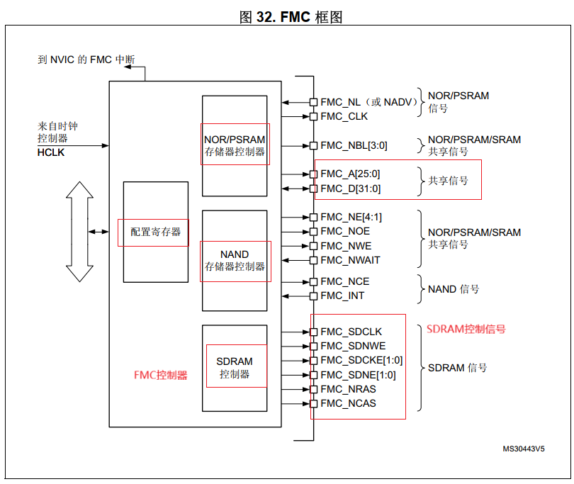
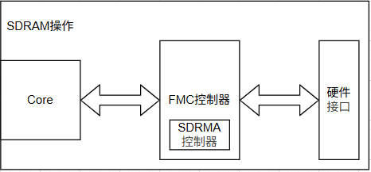
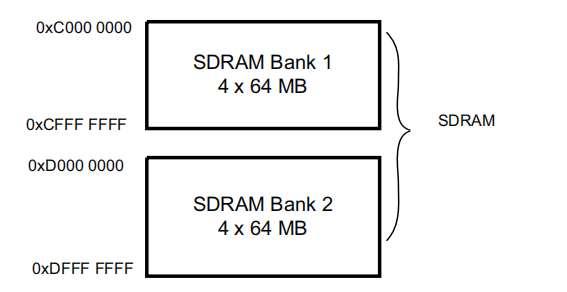
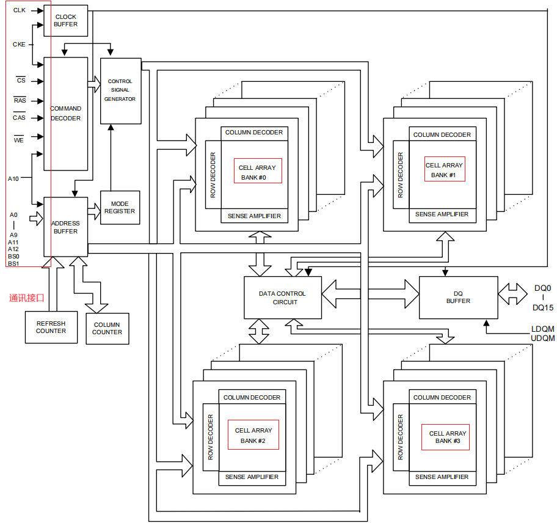
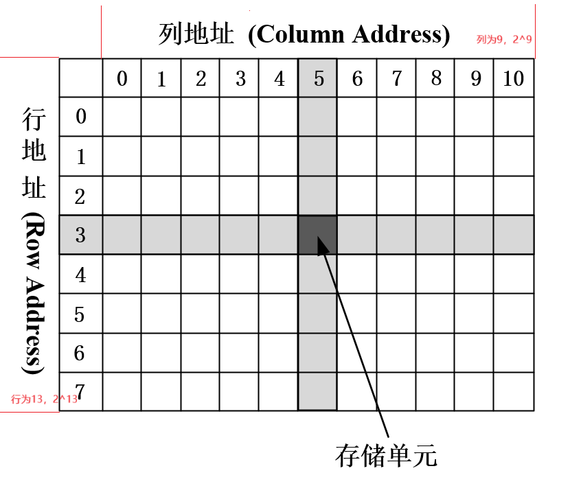
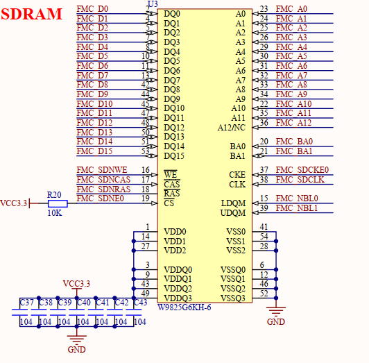
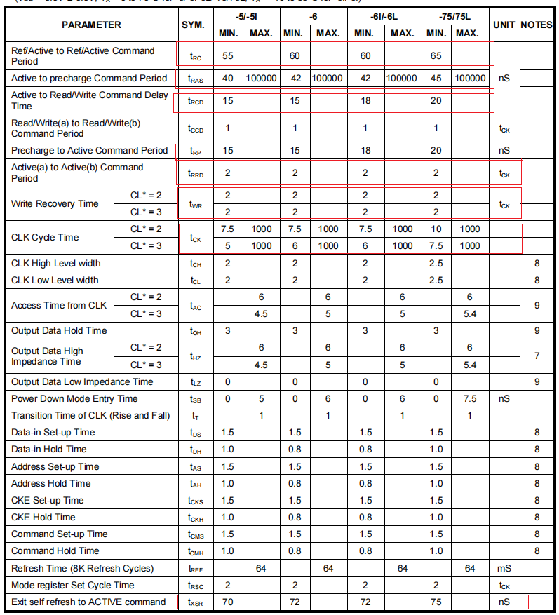
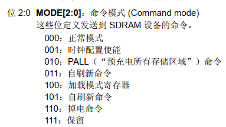
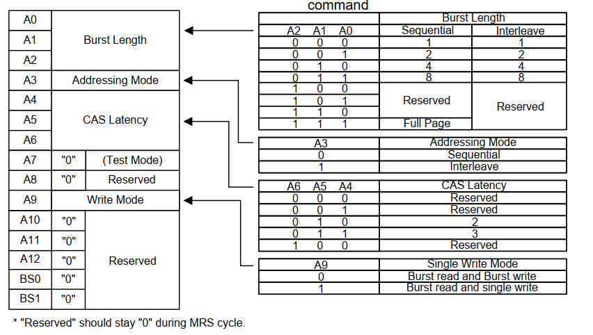
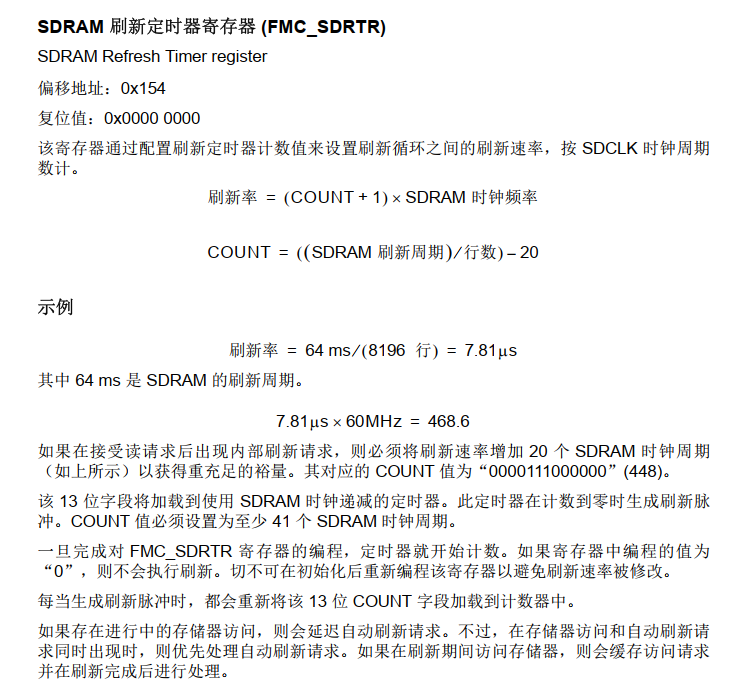

# 单片机技术总结说明(19) FMC接口和SDRAM应用

FMC接口是STM32中用于访问同步/异步静态存储器(SRAM)、PSRAM、SDRAM(同步动态存储器)和NAND FLASH等存储器的接口，另外自带显存的LCD屏幕也使用类似的接口，也可以使用FMC接口访问。和SPI，I2C，SDIO接口相比，FMC由时钟线、片选线和多条数据线构成，是典型的并行访问接口，从接口来说也更加复杂。另外FMC连接的器件如SDRAM、PSRAM、FLASH同时需要很多的配置才能够正常工作。使用成熟驱动实现功能还算简单，但系统的梳理相关知识，涉及原理就比较复杂。本章节从单片机和SDRAM器件两部分来总结相关知识。

本节目录如下所示。

- [STM32 FMC接口说明](#embed_fmc_interface)
- [SDRAM芯片说明](#embed_sdram_chip)
- [SDRAM芯片驱动开发](#embed_sdram_chip)
- [SDRAM内存访问方法](#sdram_memory)
- [总结说明](#summary)
- [下一章节](#next_chapter)

## embed_fmc_interface

对于STM32F4的FMC模块，其功能描述如下所示。



可以看到，FMC模块由配置寄存器、PSRAM/SRAM/NOR FLASH存储控制器、SDRAM存储控制器、Nand控制器四部分组成，具体说明如下。

- 配置寄存器，位于AHB总线上，用于配置硬件FMC模块功能的寄存器，包括使能FMC模块、选择FMC接口类型、设置FMC接口参数等。
- PSRAM/SRAM/NOR FLASH存储控制器，用于实现类似于RAM区域静态访问的控制器，直接进行读写，LCD显存也属于类似SRAM的交互。
- SDRAM存储控制器，专门用于SDRAM访问的控制器，能够根据配置自动管理SDRAM的刷新操作，确保数据的正确性。
- Nand控制器，专门用于NAND FLASH访问的控制器，能够处理相应的NAND FLASH访问接口，包括读取、写入、擦除等操作。

注意：对于早期的STM32的芯片(如stm32f103)，使用的FSMC接口，不支持动态刷新，无法使用SDRAM扩展存储；FMC接口扩展支持了动态刷新，能够使用SDRAM扩展存储。

上述讲述了适用于三种不同类型的存储器件，不过本篇中主要关注SDRAM扩展存储方案的说明。对于SDRAM控制器来说，主要包含存储器接口信号、读写逻辑实现两部分组成。

其中存储器接口信号如下所示。

| SDRAM接口信号 | I/O特性 | 说明 |
| --- | --- | --- |
| SDCLK | Output | SDRAM时钟信号，同步沿 |
| SDCKE[1:0] | Output | SDRAM存储区域1/2的时钟使能信号 |
| SDNE[1:0] | Output | SDRAM存储区域1/2的芯片使能信号 |
| A[12:0] | Output | 地址线 |
| D[31:0] | Input/Output | 通讯数据线 |
| BA[1:0] | Output | 地址线扩展线 |
| NRAS | Output | 行地址选通信号 |
| NCAS | Output | 列地址选通信号 |
| SDNWE | Output | 写入使能信号 |
| NBL[3:0] | Output | 写访问的输出字节屏蔽 |

对于上述接口，整理说明如下。

- SDCLK是整体的同步时钟，所有后续接口都依赖SDCLK同步。
- 对于SDCKE和SDNE的理解，需要知晓对于SDRAM支持控制两个区域，这两个信号就是对不同区域的使能信号，控制相应信号。
- A、BA、NRAS、CRAS四组信号组成了地址线，BA扩展了地址线，NRAS和NCAS是行和列地址选通信号。对于具体的地址，先选择行、再选择列，就可以定位到具体的地址。
- SDNWE写入使能信号，高电平有效，可以进行相应的读写操作。
- D[31:0]是通讯数据线，用于实际的数据读写操作，实际硬件可以只使用其中的一部分，如只使用D[15:0]，则表示只支持16位数据访问。
- NBL[3:0]是写访问的输出字节屏蔽信号，用于对D[31:0]数据进行字节屏蔽，只写入指定的字节。使用场景为进行32位，16位，8位等字节的写入操作时，NBL可以置位相应位来禁止写入来实现非对齐访问。

整个过程的硬件结构如下所示。



其中Core是单片机读写的主控制，执行我们常见的读写操作，如`*(volatile uint16_t*)0xC0000000 = 0x1234;`，就是一个典型的写操作。此操作如果在SDRAM区域内，会通知FMC模块中的SDRAM控制器；SDRAM控制器则根据配置，转换为硬件时序进行写入操作。对于整个SDRAM工作流程，很多时候理解起来是有些晦涩的，下面从数据访问的角度来说明下。对于FMC支持的映射SDRAM区域，包含两个区域，分别是SDRAM1和SDRAM2，具体如下所示。



对应范围如下所示。

| SDRAM区域 | 地址范围 | 说明 |
| --- | --- | --- |
| SDRAM1 | 0xC0000000 - 0xCFFFFFFF | 映射SDRAM1区域 |
| SDRAM2 | 0xD0000000 - 0xDFFFFFFF | 映射SDRAM2区域 |

- 当数据访问0xC0000000 - 0xCFFFFFFF范围时，此时SDCKE[0]和SDNE[0]会被置位，表示选SDRAM1区域。
- 然后根据实际的地址，先后执行行和列的选择（先执行行选择，再进行列选择）。
- 根据SDNWE信号，通过数据位进行写入或读取操作，根据写入位数的不同，执行NBL[3:0]屏蔽遮掩。

上述流程都通过FMC模块中的SDRAM控制器实现，不需要用户手动管理，控制器会根据配置自动管理SDRAM的读写和刷新操作，确保数据的正确性。

## embed_sdram_chip

上节从FMC接口说明连接接口，这里以SDRAM芯片W9825G6KH6为例，说明下SDRAM芯片的工作原理。



其中左边为SDRAM的引脚接口，具体功能说明如下所示。

| 引脚信号 | 对应FMC接口 | 功能说明 |
| --- | --- | --- |
| CLK | SDCLK | SDRAM时钟信号，同步沿 |
| CKE | SDCKE0 | SDRAM存储区域1的时钟使能信号 |
| CS | SDNE0 | SDRAM存储区域1的芯片使能信号 |
| RAS | NRAS | SDRAM存储区域1的行地址选通信号 |
| CAS | NCAS | SDRAM存储区域1的列地址选通信号 |
| WE | SDNWE | SDRAM存储区域1的写入使能信号 |
| A[12:0] | A[12:0] | 地址线，13位地址线 |
| BS[1:0] | BA[1:0] | 地址线扩展线 |
| DQ[15:0] | D[15:0] | 数据线，16位数据线 |

其他引脚信号在上节都已经进行了说明，这里主要描述下BA[1:0]地址线扩展线；对于芯片来说，内部有4个存储区域，分别是BANK#0 ~ BANK#3，每个存储区域有16位数据宽度，13位地址宽度。通过BA[1:0]地址线扩展线，就可以选择不同的存储区域，进行相应的读写操作；对应选择目录如下。

| BA[1:0] | 功能说明 |
| --- | --- |
| 00 | 选择BANK#0 |
| 01 | 选择BANK#1 |
| 10 | 选择BANK#2 |
| 11 | 选择BANK#3 |

简单来说，SDRAM内部可以理解为一个存储阵列，包含4个BANK存储区域；对于每个存储区域，内部可以看到一组存储表格，其BANK的格式如下所示。



则SDRAM的空间容量如下：

- 每个BANK存储区域有16位数据宽度，列地址有9位，行地址有13位，容量为`16/8*2^9*2^13 = 2^23 = 8MB`。
- SDRAM共有4个BANK存储区域，因此SDRAM的总容量为`4*8MB = 32MB`。

对于SDRAM的寻址，就是选择不同的BANK存储区域，然后根据行地址和列地址，定位到具体的存储位置。

- 先根据BA[1:0]地址线扩展线，选择不同的BANK存储区域。
- 然后根据A[12:0]地址线，先选择行地址，再选择列地址，就可以定位到具体的存储位置。
- 最后根据SDNWE信号，进行写入或读取操作。

可以看到和上述的FMC接口说明的硬件连接线的操作是一致的。

## sdram_chip_driver

对于SDRAM驱动来说，主要实现包含以下流程。

1. 配置SDRAM连接的硬件连接接口。
2. 配置SDRAM的模块功能，包含选择行、列、块、数据宽度和时序。
3. 向SDRAM发送指令，进行SDRAM器件的初始化操作。
4. 此时就可以当作普通存储区域，进行读写操作。

这里先确认下硬件连接的接口，在原理图中如下所示。



根据原理图和上节说明的SDRAM特性，具有以下特点。

- SDRAM片选和时钟使能信号为SDNE0和SDCKE0，则对应SDRAM的区域1，这个在配置中选定FMC_SDRAM_BANK1。
- SDRAM内部每个Bank存储区域中列地址有9位，行地址有13位，每个存储单元有16位数据宽度。
- SDRAM内部共有4个BANK，对应配置FMC_SDRAM_INTERN_BANKS_NUM_4。

具体驱动实现如下所示。

```c
// 配置SDRAM连接的驱动实现
static GlobalType_t sdram_hardware_init(void)
{
    FMC_SDRAM_TimingTypeDef SdramTiming = {0};
    GPIO_InitTypeDef GPIO_InitStruct ={0};
  
    // 使能FMC和GPIO相关时钟
    __HAL_RCC_FMC_CLK_ENABLE();
    __HAL_RCC_GPIOF_CLK_ENABLE();
    __HAL_RCC_GPIOC_CLK_ENABLE();   
    __HAL_RCC_GPIOG_CLK_ENABLE();   
    __HAL_RCC_GPIOE_CLK_ENABLE();    
    __HAL_RCC_GPIOD_CLK_ENABLE();  
    
    // 初始化FMC引脚
    GPIO_InitStruct.Pin = GPIO_PIN_0|GPIO_PIN_1|GPIO_PIN_2|GPIO_PIN_3
                          |GPIO_PIN_4|GPIO_PIN_5|GPIO_PIN_11|GPIO_PIN_12
                          |GPIO_PIN_13|GPIO_PIN_14|GPIO_PIN_15;
    GPIO_InitStruct.Mode = GPIO_MODE_AF_PP;
    GPIO_InitStruct.Pull = GPIO_NOPULL;
    GPIO_InitStruct.Speed = GPIO_SPEED_FREQ_VERY_HIGH;
    GPIO_InitStruct.Alternate = GPIO_AF12_FMC;
    HAL_GPIO_Init(GPIOF, &GPIO_InitStruct);

    GPIO_InitStruct.Pin = GPIO_PIN_0|GPIO_PIN_2|GPIO_PIN_3;
    GPIO_InitStruct.Mode = GPIO_MODE_AF_PP;
    GPIO_InitStruct.Pull = GPIO_NOPULL;
    GPIO_InitStruct.Speed = GPIO_SPEED_FREQ_VERY_HIGH;
    GPIO_InitStruct.Alternate = GPIO_AF12_FMC;
    HAL_GPIO_Init(GPIOC, &GPIO_InitStruct);

    GPIO_InitStruct.Pin = GPIO_PIN_0|GPIO_PIN_1|GPIO_PIN_2|GPIO_PIN_3
                          |GPIO_PIN_4|GPIO_PIN_5|GPIO_PIN_8|GPIO_PIN_15;
    GPIO_InitStruct.Mode = GPIO_MODE_AF_PP;
    GPIO_InitStruct.Pull = GPIO_NOPULL;
    GPIO_InitStruct.Speed = GPIO_SPEED_FREQ_VERY_HIGH;
    GPIO_InitStruct.Alternate = GPIO_AF12_FMC;
    HAL_GPIO_Init(GPIOG, &GPIO_InitStruct);

    GPIO_InitStruct.Pin = GPIO_PIN_0|GPIO_PIN_1|GPIO_PIN_7|GPIO_PIN_8|GPIO_PIN_9|GPIO_PIN_10
                          |GPIO_PIN_11|GPIO_PIN_12|GPIO_PIN_13|GPIO_PIN_14
                          |GPIO_PIN_15;
    GPIO_InitStruct.Mode = GPIO_MODE_AF_PP;
    GPIO_InitStruct.Pull = GPIO_NOPULL;
    GPIO_InitStruct.Speed = GPIO_SPEED_FREQ_VERY_HIGH;
    GPIO_InitStruct.Alternate = GPIO_AF12_FMC;
    HAL_GPIO_Init(GPIOE, &GPIO_InitStruct);

    GPIO_InitStruct.Pin = GPIO_PIN_8|GPIO_PIN_9|GPIO_PIN_10|GPIO_PIN_11
                          |GPIO_PIN_12|GPIO_PIN_13|GPIO_PIN_14|GPIO_PIN_15
                          |GPIO_PIN_0|GPIO_PIN_1|GPIO_PIN_4|GPIO_PIN_5
                          |GPIO_PIN_7;
    GPIO_InitStruct.Mode = GPIO_MODE_AF_PP;
    GPIO_InitStruct.Pull = GPIO_NOPULL;
    GPIO_InitStruct.Speed = GPIO_SPEED_FREQ_VERY_HIGH;
    GPIO_InitStruct.Alternate = GPIO_AF12_FMC;
    HAL_GPIO_Init(GPIOD, &GPIO_InitStruct);
  
    // 配置SDRAM模块功能
    hsdram1.Instance = FMC_SDRAM_DEVICE;
    hsdram1.Init.SDBank = FMC_SDRAM_BANK1;  // 选择SDRAM的区域，支持BANK1和BANK2，分别对应2个存储区域
    
    hsdram1.Init.ColumnBitsNumber = FMC_SDRAM_COLUMN_BITS_NUM_9;        // 列地址位宽，9位
    hsdram1.Init.RowBitsNumber = FMC_SDRAM_ROW_BITS_NUM_13;             // 行地址位宽，13位
    hsdram1.Init.MemoryDataWidth = FMC_SDRAM_MEM_BUS_WIDTH_16;          // 数据宽度，16位
    hsdram1.Init.InternalBankNumber = FMC_SDRAM_INTERN_BANKS_NUM_4;     // SDRAM内部BANK数量，4个BANK
    hsdram1.Init.CASLatency = FMC_SDRAM_CAS_LATENCY_3;                  // CAS延迟，3个HCLK周期
    hsdram1.Init.WriteProtection = FMC_SDRAM_WRITE_PROTECTION_DISABLE;  // 写保护，默认关闭
    hsdram1.Init.SDClockPeriod = FMC_SDRAM_CLOCK_PERIOD_2;              // SDRAM时钟周期，AHB周期的一半(90M)
    hsdram1.Init.ReadBurst = FMC_SDRAM_RBURST_ENABLE;                   // 读取突发，默认开启
    hsdram1.Init.ReadPipeDelay = FMC_SDRAM_RPIPE_DELAY_1;               // 读取管道延迟，1个HCLK周期

    // 配置SDRAM的时序参数，参考SDRAM数据手册
    /* AHB Clock 180M, FMC SDRAM Clock 180/2=90M 11.1ns */
    /* TPRD:min=2*tck=20ns => 2*11.1ns*/
    SdramTiming.LoadToActiveDelay = 2;
    /* TXSR:min=75ns=> 8*11.1ns */     
    SdramTiming.ExitSelfRefreshDelay = 8;
    /* TRAS:min=45~100000ns=> 6*11.1ns */ 
    SdramTiming.SelfRefreshTime = 6;
    /* TRC: min=65ns => 6*11.1ns*/
    SdramTiming.RowCycleDelay = 6;
    /* TWR: min=1+2ns(1+1*11.1ns)*/
    SdramTiming.WriteRecoveryTime = 2;
    /* TRP: min=20ns => 2x11.1ns*/
    SdramTiming.RPDelay = 2;
    /* TRCD:min=20ns => 2x11.1ns*/
    SdramTiming.RCDDelay = 2;

    if (HAL_SDRAM_Init(&hsdram1, &SdramTiming) != HAL_OK) {
        return RT_FAIL;
    }

    return RT_OK;
}
```

上述驱动中大部分参数配置，都是根据硬件连接以及SDRAM的数据手册来实现的，前面也已经进行了说明。这里重点说明的是时序参数的配置，手册中的说明如下。



关于SDRAM相关的时序信号，主要如下所示。

| 时序信号 | 功能说明 | 时间周期 | 
| --- | --- | --- |
| Tck | 控制SDRAM时钟周期，7.5~1000ns | 这里是AHB周期的一半(90M)，对应11.1ns |
| TPRD | 加载到激活延迟时间，最小2*tck(20ns) | 设置为2 |
| TXSR | 退出自刷新延迟时间，最小75ns | 设置为8 |
| TRAS | 自刷新时间，限制为40ns~100us | 设置为6 |
| TRC | 行周期延迟时间，超过65ns | 设置为6 |
| TWR | 写恢复时间，最小2*tck(20ns) | 设置为2 |
| TRP | 行预充电延迟时间，最小20ns | 设置为2 |
| TRCD | 行到列切换延迟时间，最小20ns | 设置为2 |

根据上述时序，就可以完成FMC相关的接口配置，用于适配SDRAM硬件。下一步就是配置SDRAM的寄存器，实现工作前的准备时序命。对于SDRAM控制器，支持的命令如下所示。



这些命令的功能描述如下。

| 命令 | 数值 | 功能 | 
| --- | --- | --- |
| FMC_SDRAM_CMD_NORMAL_MODE | 0x001 | 正常模式 |
| FMC_SDRAM_CMD_CLK_ENABLE | 0x002 | 时钟使能 |
| FMC_SDRAM_CMD_PALL | 0x003 | 预充电所有行 |
| FMC_SDRAM_CMD_AUTOREFRESH_MODE | 0x004 | 自动刷新模式 |
| FMC_SDRAM_CMD_LOAD_MODE | 0x005 | 加载模式 |
| FMC_SDRAM_CMD_SELFREFRESH_MODE | 0x006 | 自刷新模式 |
| FMC_SDRAM_CMD_POWERDOWN_MODE | 0x007 | 功耗模式 |

上述大部分命令都是激活SDRAM功能，只有FMC_SDRAM_CMD_LOAD_MODE命令是用于配置SDRAM的模式寄存器，具体如下。



- Burst Length: 突发长度，支持1、2、4、8个数据传输。
- Addressing Mode: 寻址模式，支持顺序突发和随机突发，对应Burst Type属性，一般为顺序突发。
- CAS Latency: CAS延迟，支持2、3、4个HCLK周期，这里可配置为2/3个时钟周期。
- Operating Mode: 操作模式，标准模式和测试模式，一般为标准模式。
- Write Burst Mode: 写突发模式，支持单写和双写。

参考上述描述，可以实现SDRAM的初始化时序，代码如下所示。

```c
// 发送初始化SDRAM的命令
static GlobalType_t sdram_initialize_sequence(void)
{
    uint32_t temp;
    GlobalType_t result;

    result = sdram_send_command(0, FMC_SDRAM_CMD_CLK_ENABLE, 1, 0);         // 时钟使能
    HAL_Delay(1);
    result &= sdram_send_command(0, FMC_SDRAM_CMD_PALL, 1, 0);              // 预充电所有行
    result &= sdram_send_command(0, FMC_SDRAM_CMD_AUTOREFRESH_MODE, 1, 0);  // 自动刷新模式

    temp = (uint32_t)SDRAM_MODEREG_BURST_LENGTH_1
            | SDRAM_MODEREG_BURST_TYPE_SEQUENTIAL
            | SDRAM_MODEREG_CAS_LATENCY_3           
            | SDRAM_MODEREG_OPERATING_MODE_STANDARD 
            | SDRAM_MODEREG_WRITEBURST_MODE_SINGLE;  

    result &= sdram_send_command(0, FMC_SDRAM_CMD_LOAD_MODE, 1, temp);      // 配置模式寄存器
    
    return result;
}

// 发送SDRAM命令的接口
static GlobalType_t sdram_send_command(uint8_t bank, uint8_t cmd, uint8_t refresh, uint16_t regval)
{
    uint32_t target_bank=0;
    FMC_SDRAM_CommandTypeDef Command;

    if(bank == 0) {
        target_bank = FMC_SDRAM_CMD_TARGET_BANK1;   // 命令发送到SDRAM的BANK1区域
    } else if(bank == 1) {
        target_bank = FMC_SDRAM_CMD_TARGET_BANK2;   // 命令发送到SDRAM的BANK2区域
    }

    Command.CommandMode = cmd;                      // 发送的命令
    Command.CommandTarget = target_bank;            // 命令发送目标
    Command.AutoRefreshNumber = refresh;            // 刷新次数
    Command.ModeRegisterDefinition = regval;        // 模式寄存器定义
    if(HAL_SDRAM_SendCommand(&hsdram1, &Command, 0x1000) != HAL_OK)
        return RT_FAIL;
    
    return RT_OK;
}
```

对于SDRAM还有另外一个知识点，需要配置SDRAM刷新定时器寄存器，其功能说明参考如下所示。



这里配置总线为90Mhz，则计数为`64*10^3/8196*90 - 20 = 682.7`，这里使用683作为刷新计数器的配置，具体代码如下所示。

```c
// sdram初始化流程
GlobalType_t drv_sdram_init(void)
{
    GlobalType_t result;
    
    result =  sdram_hardware_init();
    if(result == RT_OK)
    {
        /* initialize sdram command sequence */
        result = sdram_initialize_sequence();

        if(result == RT_OK)
        {
            /* Set the refresh rate counter
                COUNT = refresh_peroid/peroid/lines - 20 
                refresh peroid is 64ms, lines 2^13, clock is 11.1ns
                64*10^3/8196*90 - 20 = 682.7
                Set the device refresh counter */
            HAL_SDRAM_ProgramRefreshRate(&hsdram1, 683);
            
            sdram_memory_test();
        }
        else
        {
            PRINT_LOG(LOG_INFO, HAL_GetTick(), "sdram_initialize_sequence failed!");
        }
    }
    else
    {
        PRINT_LOG(LOG_INFO, HAL_GetTick(), "sdram_hardware_init failed!");
    }

    PRINT_LOG(LOG_INFO, HAL_GetTick(), "sdram_hardware_init success!");
    return result;
}
```

## sdram_memory

对于SDRAM的使用方法，就和普通的内存一样，通过地址访问来进行数据的读写操作。这里包含两种使用方法。

- 通过地址强制转换以指针的方式进行访问。
- 使用gcc扩展的___attribute__((__section__()))__将数组映射到SDRAM区域，进行访问。

具体测试代码如下所示。

```c
static uint32_t test_sdram[100] __attribute__((section(".ARM.__at_0xC0000000")));

void sdram_memory_test(void)
{
    volatile uint32_t *p = (volatile uint32_t *)0xC0000000;

    // 进行SDRAM内存写入操作
    *p = 0x12345678;
    *(p+1) = 0x87654321;

    // 进行SDRAM内存读取操作
    if (*p == 0x12345678 && *(p+1) == 0x87654321) {
        PRINT_LOG(LOG_INFO, HAL_GetTick(), "sdram_memory_test success!");
    }

    for (int i = 0; i < 100; i++) {
        test_sdram[i] = i;
    }

    // 进行SDRAM内存读取操作
    for (int i = 0; i < 100; i++) {
        if (test_sdram[i] != i) {
            PRINT_LOG(LOG_INFO, HAL_GetTick(), "sdram_memory_test failed!");
            break;
        }
    }
    PRINT_LOG(LOG_INFO, HAL_GetTick(), "sdram_memory_test success!");
}
```   

在实际开发中，两种方法都可以使用。我个人倾向于使用数组映射的方法，编译时数组会进行越界检查，变量不会使用到相同的地址范围，指针方式则放弃了检查，需要使用时注意；当然作为大范围缓存时，如LTDC的映射区域，可以使用类似指针的方式访问，没必要在定义数组；根据具体的应用场景和需求选择合适的方法，才是最佳实践之道。

## summary

本节中，主要从FMC接口、SDRAM芯片说明、SDRAM芯片驱动开发和应用等方面进行了介绍。作为并行接口设备，数目众多的I/O端口、复杂的时序要求和操作逻辑，使得SDRAM的配置和应用相对来说更加复杂。不过结合STM32中FMC模块的关于SDRAM控制器的设计，以及SDRAM的数据手册，就可以发现所有的功能和配置都是一体两面。FMC作为主控设备执行地址访问转变为硬件时序的操作，修改指定块表中的相应存储结构。对于开发者来说，就隐藏了复杂的操作细节；只需要配置完成后，当作内存使用即可。不过在学习中，还是要理解SDRAM和FMC SDRAM控制器的相关知识，才能更好的开发和实现应用。

## next_chapter

[返回目录](./../README.md)

直接开始下一小节: [单片机中的存储介质和应用](./ch20.storage_used.md)

