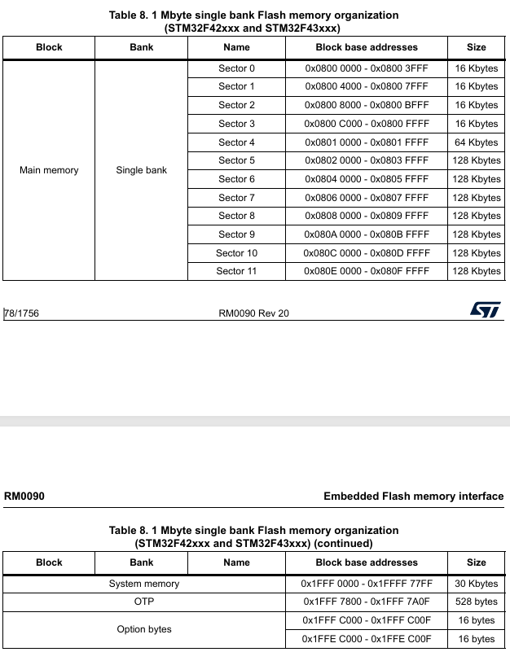
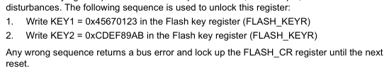
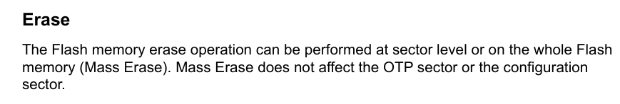
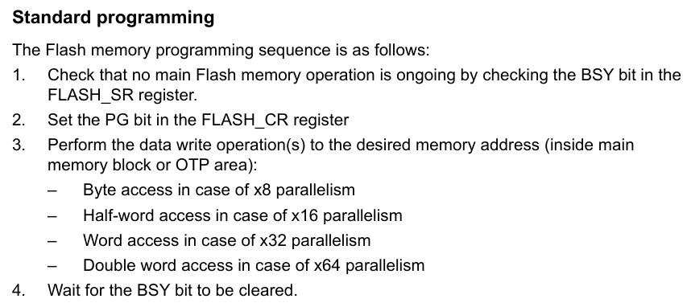
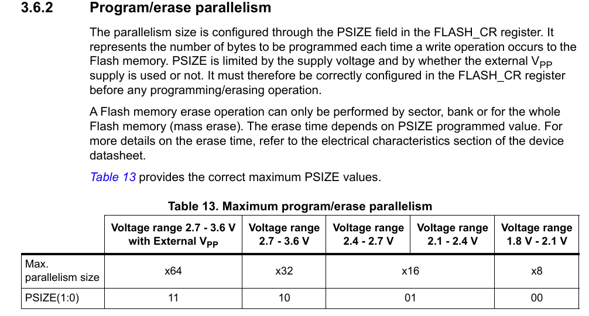

# 单片机技术总结说明(20) FLASH功能说明

对于单片机应用来说，经常需要掉电仍然保存一些数据，如用户修改的配置信息、记录的设备状态等；如果主板上设计外挂有EPPROM、SPI FLASH、SdCard等存储设备，可以直接使用这些外部空间来存储数据。对于没有外挂存储设备的情况，使用内部FLASH来存储数据也是可行的选择。内部FLASH的数据读取迅速、简单，相比外挂器件更方便；产品中禁止调试，存储在内部FLASH的数据也更不容易被读取。以STM32F4为例，其内部也将FLASH给分配成不同的块，支持用户存储数据。

本节中从FLASH读写操作和存储管理两个方面进行介绍，具体目录如下所示。

- [flash模块说明](#flash)
  - [flash读取数据](#flash_read)
  - [flash写入数据](#flash_write)
- [总结说明](#summary)
- [下一章节](#next_chapter)

## flash

以STM32F429为例，对应的FLASH分区如下所示。



根据上述分区所示，整个FLASH由主存储区、系统存储区、OTP区域和选项字节区域组成，具体功能分别如下所示。

- 主存储区（main memory）: 主存储区范围为0x08000000 ~ 0x080FFFFF，有12个块，其中4个16KB、1个64KB和7个128KB的块，总共1024KB，即1MB的存储容量。执行代码和数据存储一般都使用主存储区存储，可通过一定时序和指令时序读写操作，是我们日常使用最多的区域。
- 系统存储区（system memory）: 系统存储区范围为0x1FFF0000 ~ 0x1FFF7FFF，这部分是STM32F4在芯片生产时固化的程序存储的区域，主要做DFU功能支持(如串口、USB下载等)，用户无法访问此区域。
- OTP区域（one time programmable memory）: OTP区域范围为0x1FFF7800 ~ 0x1FFF7A0F，这个是一次性可编程区域，共528字节，其中前面512字节可以用来存储一次性的用户数据，后面16字节用于锁定对应块。OTP区域写入后不支持擦除，可以用来限制软件版本、签名标志等安全相关的数据存储，不过是一次性的，因此不理解时不要去尝试。
- 选项字节区域（option bytes）: 选项字节区域范围为0x1FFFC000 ~ 0x1FFFC000F、0x1FFEC000 ~ 0x1FFEC00F，这个区域主要预留一些寄存器用来配置FLASH的读写保护、待机/停机、软件/硬件看门狗功能，和主存储区一样，可以通过一定时序和指令进行读写操作。

这里说的FLASH读写操作，主要说的就是对主存储器的读写功能实现，下面分别对内部flash的读写功能进行介绍。

### flash_read

对于FLASH的读操作，已经被映射到内部的存储空间，用户可以像访问内存一样访问，不需要额外的处理。另外配合结构体和指针，可以轻松提取出FLASH中数据，具体代码如下所示。

```c
// 从FLASH中读取数据
// 读取直接按照字节读，比较简单
FlashType_t flash_read(uint32_t address, uint8_t *pbuffer, uint32_t size)
{
    uint16_t index;
    
    for(index=0; index<size; index++) 
    {
        pbuffer[index] = *((uint8_t *)(address+index));
    }
    return FLASH_OK;    
}

// 按照字读取，这里长度需要按照int型转换后的个数
FlashType_t flash_read_word(uint32_t address, uint32_t *pbuffer, uint32_t size)
{
    uint16_t index;
    
    for(index=0; index<size; index++) 
    {
        pbuffer[index] = *((uint32_t *)(address+index));
    }
    return FLASH_OK;    
}

// 从0x08000000地址读取64字节数据到buf中
uint8_t buf[64];
flash_read(0x08010000, buf, 64);

// 读取数据结构体
__packed struct data_t
{
    uint32_t id;
    uint8_t name[16];
    uint8_t age;
    uint8_t reserved[30];
};
struct data_t *pdata = (struct data_t *)0x08010000;
uint32_t id = pdata->id;    // 读取id字段
uint8_t age = pdata->age;  // 读取age字段
```

可以看到，对于内部FLASH的读取操作，可以采用直接访问内存的方式，也可以采用结构体和指针的方式提取数据；不过需要注意的是，在存储结构体数据时要考虑数据对齐的问题，才能够保证实际数据和预期一致。

当然，FLASH中还有一个特性影响执行正确率和读取效率，就是FLASH读访问延时。内核的执行很快，而FLASH的读访问速度相对较慢，这就导致了在读取数据时可能会出现数据不一致的情况。为了解决这个问题，需要根据具体的工作电压和HCLK时钟频率来确定FLASH的读取延时，这个需要根据具体的工作电压和HCLK时钟频率来确定。使用STM32CubexMX生成代码时会根据时钟计算，例如180MHz的HCLK，工作电压为3.3V，对应的就是5个时钟的延迟。具体代码如下所示。

```c
//AHBCLK    = SYSCLK    =180Mhz
//APB1CLK   = AHBCLK/4  =45M 
//APB1TIME  = APB1CLK*2 =90M 
//APB2CLK   = AHBCLK/2  =90M
//APB2TIME  =APB2*2     =180M   
RCC_ClkInitStruct.ClockType = RCC_CLOCKTYPE_HCLK|RCC_CLOCKTYPE_SYSCLK
                        |RCC_CLOCKTYPE_PCLK1|RCC_CLOCKTYPE_PCLK2;
RCC_ClkInitStruct.SYSCLKSource = RCC_SYSCLKSOURCE_PLLCLK;
RCC_ClkInitStruct.AHBCLKDivider = RCC_SYSCLK_DIV1;
RCC_ClkInitStruct.APB1CLKDivider = RCC_HCLK_DIV4;
RCC_ClkInitStruct.APB2CLKDivider = RCC_HCLK_DIV2;

// FLASH读取延时
if (HAL_RCC_ClockConfig(&RCC_ClkInitStruct, FLASH_LATENCY_5) != HAL_OK)
{
    return RT_FAIL;
}
```

### flash_write

对于FLASH来说，都是需要先擦除才能正确写入，内部FLASH也不例外，不过在此基础上为了安全，需要增加解锁/锁定功能，对应流程如下所示。

- 解锁FLASH读写，在特定寄存器写入相应值。



可以看到，先后向FLASH_KEYR寄存器写入解锁值0x45670123，再写入解锁值0xCDEF89AB，即可完成解锁。

- 擦除FLASH指定页，需要先向FLASH_CR寄存器写入擦除指令，再等待擦除完成。



可以看到，对于FLASH的擦除分为sector擦除，Bank擦除(仅双Bank的芯片支持)和全片擦除(Mass erase)两种方式，其中全片擦除耗时较长，一般不使用，主要的是使用sector擦除。当然即使是全片擦除，也只会擦除主存储区，不会影响系统存储区、OTP区域和选项字节区域。

- 写入FLASH数据，需要先向FLASH_CR寄存器写入指令，再等待写入完成。对于STM32F4来说，支持8-bit、16-bit、32-bit、64-bit写入。根据8bit写入可以不考虑数据长度问题，但效率较低，16-bit、32-bit、64-bit写入时，数据长度分别要是2、4、8字节的倍数，否则会多写或者少写数据，边界问题需要注意并处理，否则可能出错，关于写入流程如下所示。



- 锁定FLASH读写，在特定寄存器写入相应值，此时一次流程结束。

对于HAL库来说，已经将上述流程封装成接口，用户只需要调用对应的函数即可，具体代码如下所示。

```c
// 从地址获取对应的sector
uint16_t flash_get_sector(uint32_t address)
{
	if (address < FLASH_SECTOR1_ADDRESS) {
   		return FLASH_SECTOR_0; 
    } else if (address < FLASH_SECTOR2_ADDRESS) {
        return FLASH_SECTOR_1;
    } else if (address < FLASH_SECTOR3_ADDRESS) {
        return FLASH_SECTOR_2;
    } else if (address < FLASH_SECTOR4_ADDRESS) {
        return FLASH_SECTOR_3;
    } else if (address < FLASH_SECTOR5_ADDRESS) {
        return FLASH_SECTOR_4;
    } else if (address < FLASH_SECTOR6_ADDRESS) {
        return FLASH_SECTOR_5;
    } else if (address < FLASH_SECTOR7_ADDRESS) {
        return FLASH_SECTOR_6;
    } else if (address < FLASH_SECTOR8_ADDRESS) {
        return FLASH_SECTOR_7;
    } else if (address < FLASH_SECTOR9_ADDRESS) {
        return FLASH_SECTOR_8;
    } else if (address < FLASH_SECTOR10_ADDRESS) {
        return FLASH_SECTOR_9;
    } else if (address < FLASH_SECTOR11_ADDRESS) {
        return FLASH_SECTOR_10;
    } else {
        return FLASH_SECTOR_11;
    }
}

// 根据sector擦除指定扇区
FlashType_t flash_erase_device(uint32_t sector, uint32_t nb_sectors)
{
    FLASH_EraseInitTypeDef FlashEraseInit = {0};
    uint32_t sector_error;
    
    HAL_FLASH_Unlock(); 

    //erase page0
    FlashEraseInit.TypeErase = FLASH_TYPEERASE_SECTORS;     // 按SECTORS擦除
    FlashEraseInit.Banks = FLASH_BANK_1;                    // 擦除BANK1区域，此型号只有BANK_1
    FlashEraseInit.Sector = sector;                         // 擦除的起始扇区
    FlashEraseInit.NbSectors = nb_sectors;                  // 擦除的扇区数
    FlashEraseInit.VoltageRange = FLASH_VOLTAGE_RANGE_3;    // 擦除时FLASH工作电压范围
    
    if(HAL_FLASHEx_Erase(&FlashEraseInit, &sector_error) != HAL_OK)  
    {
        HAL_FLASH_Lock(); 
        return FLASH_ERROR;
    }

    HAL_FLASH_Lock(); 
    return FLASH_OK;
}

// 写FLASH设备，按字写入
FlashType_t flash_write_word(uint32_t address, uint32_t *pbuffer, uint32_t size)
{
    uint32_t index;
    
    // 写入地址必须是4字节对齐
    if (address % 4 != 0) {
        return FLASH_ERROR;
    }

    // 如果写入地址或大小不是4字节对齐，有两种处理方式
    // 1. 直接返回错误，此时比较简单(提前暴露问题，不然后续会发生就会多写或者少写，有隐患)
    // 2. 申请4字节对齐的内存，将数据复制进去，写入后释放内存
    if (((uint32_t)pbuffer)%4 != 0) {
        return FLASH_ERROR;
    }

    HAL_FLASH_Unlock();       
    for(index=0; index<size; index++)
    {
        if(HAL_FLASH_Program(FLASH_TYPEPROGRAM_WORD, address+index*4, pbuffer[index]) != HAL_OK)
        {
            HAL_FLASH_Lock();
            return FLASH_ERROR;
        }
    } 
    HAL_FLASH_Lock();
    return FLASH_OK;
}

// 写FLASH设备，按字节写入，不需要考虑对齐和长度问题，不过效率较低
FlashType_t flash_write(uint32_t address, uint8_t *pbuffer, uint32_t size)
{
    uint32_t index;

    HAL_FLASH_Unlock();       
    for(index=0; index<size; index++)
    {
        if(HAL_FLASH_Program(FLASH_TYPEPROGRAM_BYTE, address+index, pbuffer[index]) != HAL_OK)
        {
            HAL_FLASH_Lock();
            return FLASH_ERROR;
        }
    } 
    HAL_FLASH_Lock();
    
    return FLASH_OK;
}
```

擦除代码就是指定擦除块、起始扇区、扇区长度即可完成擦除；不过这里面有个知识点并没有说明，就是擦除时FLASH工作电压范围，对于STM32F4来说，不同工作电压对应擦除时不同的并行位数，也就影响着擦除时间。位数和工作电压关系如下所示。



这里设定的FLASH_VOLTAGE_RANGE_3表示工作电压为2.7~3.6V，对应擦除时并行位数为32位。

## summary

本节中，主要讲解flash的功能，包括FLASH块结构，擦除、读取和写入操作，并封装成相应的接口用于后续处理。FLASH作为存储设备，主要用于存储程序代码和数据，读取时和其他内部存储一致；写入时则需要擦除的指令时序才能正常执行，完成数据处理流程；掌握FLASH功能，对于实现升级代码也可以事半功倍，值得花时间去理解学习。

## next_chapter

[返回目录](./../README.md)

直接开始下一小节: [低功耗应用](./ch21.lower_power.md)
