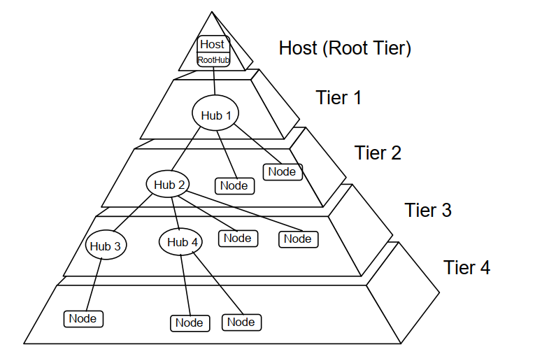
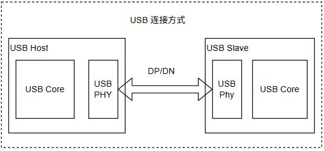
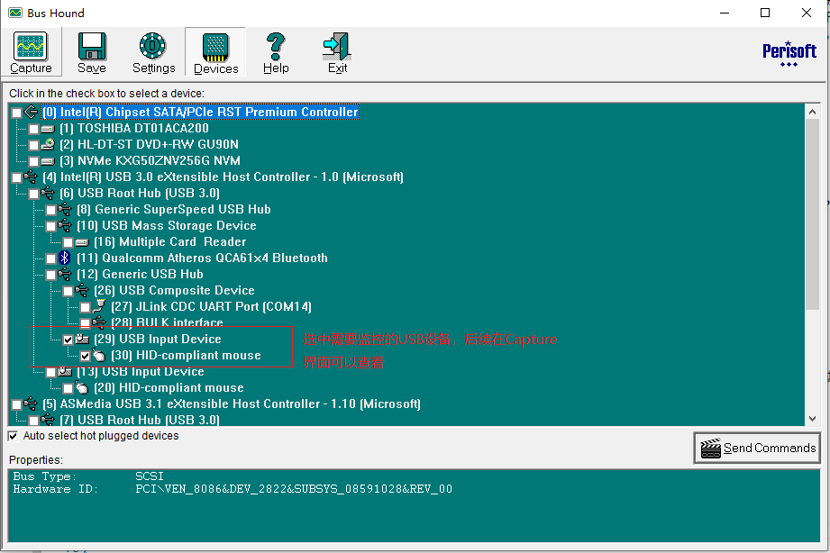
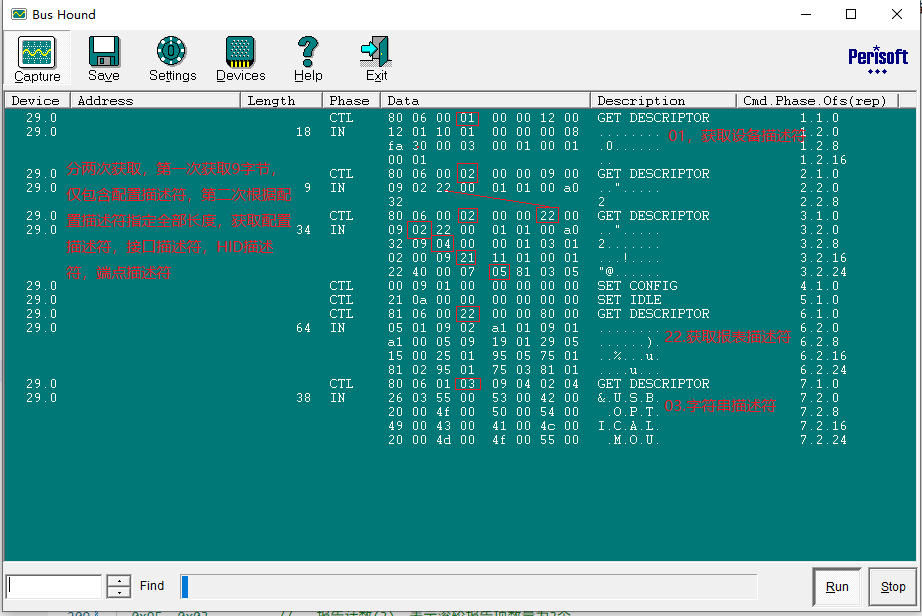
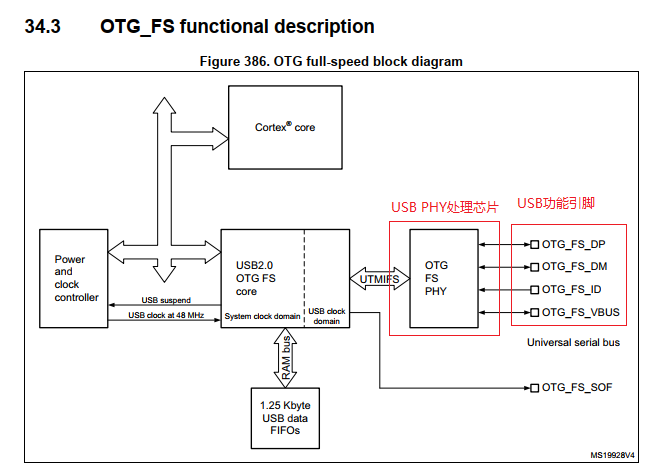
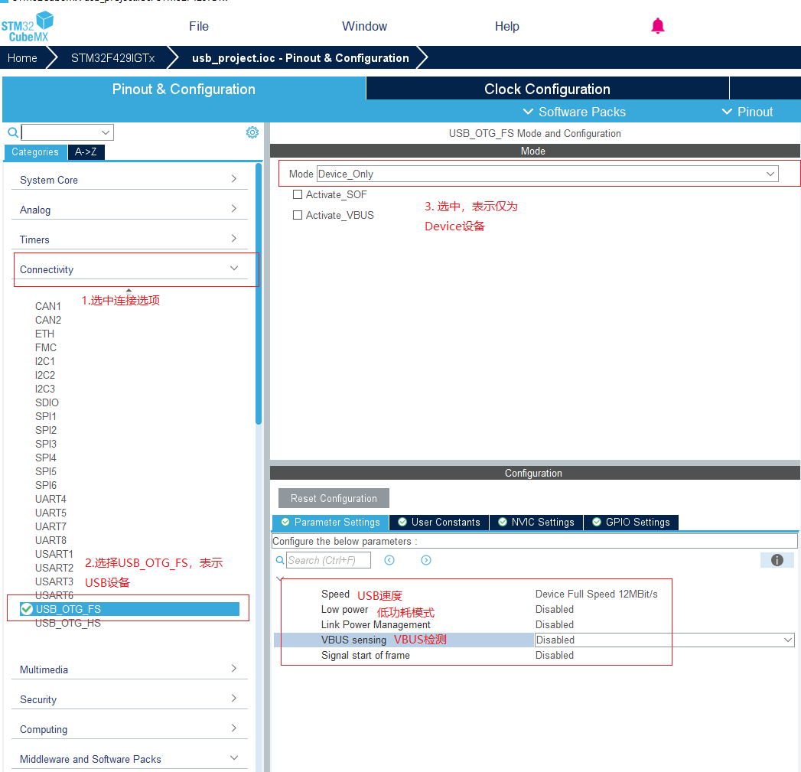
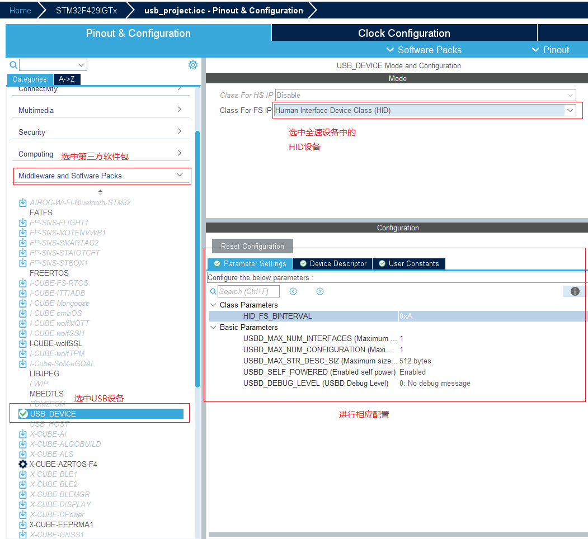
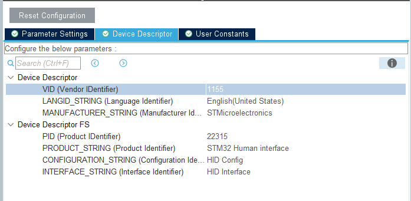

# 单片机技术总结说明(25) USB协议和从机应用实现

USB（Universal Serial Bus）通讯协议是一种通用的串行总线标准，是连接计算机和外部设备的标准接口规范。USB协议按照版本分为USB1.0、USB2.0、USB3.0以及最新的USB4.0等，作为通用的串行总线标准，具有通用性强、即插即用、兼容性高等特点，具体如下所示。

1. 通用性强：USB接口作为PC端口的事实标准，支持大量的设备，包括鼠标、键盘、摄像头、USB存储设备、打印机等等。同时，USB协议也广泛用于嵌入式系统、移动设备和消费设备中，是比较通用的串行总线协议。
2. 即插即用：支持热插拔，设备连接后自动识别和配置，降低使用门槛。同时支持通过驱动定制功能，可以满足不同应用场景的需求。
3. 兼容性高：对于USB设备，高版本协议接口一般兼容低版本的USB协议。这样支持高版本协议接口的设备，仍然可以在底版本接口上使用。通过向下兼容，可以支持更多的设备，特别是一些老旧的设备，更新迭代的成本小。
4. 支持热插拔：可以在不关闭设备的情况下插拔USB设备，方便使用。
5. 可扩展性：采用星型拓扑级联，通过USB Hub可扩展连接多个设备。

在USB的设备类型中，分为主机(Host)和设备(Device)两种不同模式；其中主机通常是计算机或者支持USB-Host的主设备，负责管理USB总线上的通讯，控制设备的断开和连接、发送数据传输请求等。主机是USB系统的核心控制者，支持通过集线器(USB Hub)连接多个从机设备。设备(Device)则是连接在USB总线上的外部设备，从功能上来说，分类为大容量存储设备、HID设备、音频设备等。

USB是十分复杂的协议，本文的实现也参考大量的资料进行总结，这里分享相关的书籍和文章进行说明。

- <Universal Serial Bus Specification V1.1>
- <Universal Serial Bus Specification V2.0>
- <STM32_USB_HID分析>
- <圈圈教你玩USB>

本篇中将以USB Device为例，介绍USB协议和从机应用实现，具体目录如下所示。

- [USB协议说明](#usb_protocol)
  - [USB描述符](#usb_descriptor)

## usb_protocol

USB体系基于协议由USB Host、USB Device以及之间的硬件连接组成。其中USB设备包含USB功能设备和USB Hub设备，USB Hub是一类扩展USB总线连接的设备，通过USB Hub最多可以支持7层，也就是最多允许5层USB Hub级联，整个连接框架如下所示。



USB Hub是一类专用的USB扩展设备，用于扩展USB总线连接，一般由专用USB扩展芯片配合控制MCU实现，其软件部分涉及USB协议不多，这里重点描述由Host和Device直连的USB框架。其连接方式如下所示。



对于主从模式的USB框架，通讯由主机发起，从机响应主机的请求，主机会定期轮询从机状态。对于两个标准的USB设备，其连接由4根线组成，分别是D+, D-，VBUS和GND，具体功能如下所示。

| 线名 | 功能 |
| --- | --- |
| D+ | 数据线，用于传输数据 |
| D- | 数据线，用于传输数据 |
| VBUS | 电源线，用于提供5V电压 |
| GND | 地线，用于连接设备和主机的共地 |

其中D+和D-线采用差分电压的方式进行数据传输。在USB主机上，D+和D-上默认都连接下拉电阻，则没有接入时都保持低电平。对于USB从机，高速设备D+线连接1.5KΩ的上拉电阻，并通过后续握手协议区分高速模式，低速设备则在D-线连接上拉电阻。当设备接入主机时，可通过D+或D-的电平判断是否由设备接入；并能够判断是否为高速设备和低速设备。

从通讯结构来说，USB通讯协议由三部分组成；包含总线接口层、协议层和应用层，功能分别如下所示。

- 总线接口层：负责USB设备与USB主机之间的物理连接和数据传输。它定义了USB设备的引脚连接、数据传输速率和信号电平等。
- 协议层：负责USB设备和主机之间的通信协议。它定义了数据的传输格式、数据的交换方式和错误处理机制等，实现设备枚举、数据传输调度和错误检测等。
- 应用层：负责USB设备的功能实现。它定义了USB设备的操作接口、数据处理逻辑和应用程序的接口等。

协议层主要进行USB设备和主机之间的枚举，这里USB设备和主机之间可通过协商，确定设备的速度和配置，同时也会进行设备的识别和配置。对于USB设备来说，部分设备不需要额外的驱动就可以连接PC，这类主要是标准类别的USB设备，如USB鼠标、键盘、游戏杆或者大容量存储设备，如U盘、基于闪存的存储和媒体播放器等；当然还有windows vista系统已经支持的WinUSB设备。考虑到本篇不会涉及PC端驱动的开发，因此从机部分都以标准类别的USB设备实现，不涉及PC端的驱动开发。应用层则是在适配USB功能后，实现具体的动作，如鼠标运动、键盘通知，U盘数据传输等功能。

根据协议和USB事务分类，USB协议支持控制传输、批量传输、中断传输和同步传输等方式，具体如下所示。

- 控制传输：用于设备枚举和配置，包括设备的识别、配置、请求和响应等。
- 批量传输：用于传输大量数据，如文件传输、数据存储等。
- 中断传输：用于小数据，低延迟传输，如传感器数据、键盘输入等。
- 同步传输：用于实时数据传输，如音频、视频等。

USB定义了总线结构、物理连接、和数据传输协议等，不过这只解决了数据传输的通路，作为Host并不知道Device具体有哪些功能？这就需要通过USB描述符来进行说明，在USB枚举过程中，Host会通过GET_DESCRIPTOR请求获取Device的描述符，从而了解Device的功能和规格。

### bus_hound_analysis

这里配合bus hound软件进行配合说明。在进行抓包前，先简单讲解下bus hound的使用方法。如果只是抓包，使用方法比较简单，我们就关注Capture、Settings和Device三个界面。

1. Capture：显示实际的抓包数据，会包含些备注信息。
2. Settings：设置抓包参数，如抓包模式、过滤条件、保存文件名；简单工作使用默认即可，可以不进行修改。
3. Device：显示当前的USB设备信息，勾选指定的USB设备即可；不确定是否是选择正确的设备，可以移除在插入USB设备，观察过程中对应USB设备是否进行相应变化。

Capture界面后续抓包会分析，这里注意描述下Device界面，形式如下。



可以看到，勾选了USB设备后，在Capture点击RUN按钮，就会开始抓包。

注意: BUS Hound软件需要配置为管理员模式运行，才能正确的抓取数据。

这里以鼠标设备通过bus hound进行抓包分析数据。



这里比较关键的是Length、Phase、Data和Description列字段，具体说明如下。

1. Length表示数据包的长度。
2. Phase表示数据包传输的阶段，CTL表示是Host主机下发的控制命令，IN表示是Device从机返回的信息数据
3. Data则是实际数据包的内容。
4. Description则是对Data的说明，包含一定的可用信息。

其中主机下发的为控制命令，其格式如下所示。

| 字段 | 长度 |说明 |
| --- | --- | --- |
| bmRequestType | 1字节 | 请求类型，高4位表示方向，低4位表示类型 |
| bRequest | 1字节 | 请求码，用于指定具体的操作或功能 |
| wValue | 2字节 | 请求参数，根据具体的请求码有不同的含义 |
| wIndex | 2字节 | 请求参数，根据具体的请求码有不同的含义 |
| wLength | 2字节 | 请求数据的长度 |

对于bmRequestType字段，具体含义如下。

D7: 数据传输方向，1表示主机到设备，0表示设备到主机。
D6~D5 : 命令的类型，00表示标准请求命令; 01表示类请求命令; 10表示用户定义的请求命令; 11保留
D4~D0 : 命令的接收对象，00表示设备，01表示接口，10表示端点，11保留

bRequest字段，表示请求码如下所示。

| 请求命令名称 | 请求码(bRequest) | 功能 |
| --- | --- | --- |
| Get_Status | 0x00 | 获取设备状态 |
| Clear_Feature | 0x01 | 清除设备功能 |
| Set_Feature | 0x03 | 设置设备功能 |
| Set_Address | 0x05 | 设置设备地址 |
| Get_Descriptor | 0x06 | 获取描述符 |
| Set_Descriptor | 0x07 | 设置描述符 |
| Get_Configuration | 0x08 | 获取设备配置 |
| Set_Configuration | 0x09 | 设置设备配置 |
| Get_Interface | 0x0A | 获取设备接口 |
| Set_Interface | 0x0B | 设置设备接口 |
| Synch_Frame | 0x0C | 同步帧 |

wValue字段，表示请求参数，在获取描述符请求中，对应相应的描述符类型(在usb_descriptor中进行详细说明)。

wIndex字段，表示请求参数，在获取描述符请求中，对应相应的描述符索引。

WLength字段，表示请求的数据包长度。

可以看到，通过获取设备描述符、配置描述符、接口描述符、HID描述符、端点描述符确定配置信息，再通过HID报表描述确定后续数据传输的参数，之后就可以再协议中解析通讯数据，转换HID数据为位置或者按键信息，进行相应处理。对于USB描述符的说明，可以参考下小节。

### usb_descriptor

USB描述符是一种用于描述USB设备和主机之间通信参数的结构体，它包含了设备的基本信息、端点配置、接口功能等。通过USB描述符，Host可以了解Device的功能和规格，从而进行正确的配置和数据传输。按照描述功能类型的不同，分为如下几种描述符。

- 设备描述符(Device Descriptor)：用于描述USB设备的基本信息，如设备的类、子类别、协议版本、最大Packet大小等。
- 配置描述符(Configuration Descriptor)：用于描述USB设备的配置信息，如设备支持的接口数量、最大电流等。
- 接口描述符(Interface Descriptor)：用于描述USB设备的接口信息，如接口的编号、端点数目、接口所使用的类和子类别、协议版本等。
- 端点描述符(Endpoint Descriptor)：用于描述USB设备的端点信息，如端点的地址、方向、类型、最大Packet大小等。
- 字符串描述符(String Descriptor)：用于描述USB设备的字符串信息，如厂商名称、产品名称等。

当然对于特定类型的USB设备，其还有一些特殊的描述符，如HID描述符、MSOS描述符等，这些只有声明为相应的接口描述类型才会请求。对于单个USB设备，其支持的设备描述符只有一个、配置描述符至少有一个；接口描述符数目则根据配置描述符中指定的接口数量而变化，而端点描述符的数目根据接口描述符的配置请求来管理。字符串描述符则是单独获取的设备信息，并不是必须的。可以看到，除了字符串描述符外，其它描述符是一层一层的递进关系，通过获取上一层描述符的配置，解析才能确定下一层描述符需要的数目；这里具有多个接口描述符的设备被称为USB复合设备。

对于描述的特性，整理表格如下所示。

| 类型 | 描述符 | 应用 | 数值 |
| --- | --- | --- | --- |
| 标准 | 设备描述符(Device) | 所有设备必须有，只能是一个 | 01 |
| 标准 | 配置描述符(Configuration) | 所有设备必须有，至少一个 | 02 |
| 标准 | 字符串描述符(String) | 可选，根据设备是否需要描述字符串而变化 | 03 |
| 标准 | 接口描述符(Interface) | 根据接口数目确认 | 04 |
| 标准 | 端点描述符(Endpoint) | 除端点0外，每个端点必须有，根据接口描述符中的端点数量而变化 | 05 |
| 标准 | 设备限定符(Device Qualifier) | 支持全速和高速的设备必须有一个，一般设备没有 | 06 |
| 标准 | HID描述符(HID) | HID设备必须要有 | 21 |
| HID | 报表描述符(Report) | HID设备必须要有报表描述符 | 22 |
| HID | 实体描述符(Physical) | 可选的实体描述符 | 23 |

这里以USB HID设备为例，说明USB描述符的应用。

- USB HID设备描述符

```c
//=========================================
// Device descriptor	设备描述符
// =========================================
__ALIGN_BEGIN uint8_t USBD_FS_DeviceDesc[USB_LEN_DEV_DESC] __ALIGN_END =
{
  0x12,                       // bLength = 18，该描述符长度为18字节
  USB_DESC_TYPE_DEVICE,       // bDescriptorType = 01，表明是设备描述符
  0x00,                       // bcdUSB，USB设备版本号=2.0
  0x02,                       
  0x00,                       // DeviceClass，设备类码，HID设备为0，类别在接口描述符中定义
  0x00,                       // DeviceSubClass，设备子类码，DeviceClass为0时该字段必须为0
  0x00,                       // bDevicePortocol，协议码，DeviceClass为0时该字段必须为0
  USB_MAX_EP0_SIZE,           // bMaxPacketSize0，端点0的最大包尺寸
  LOBYTE(USBD_VID),           // bVendor，厂商ID，由USB协议规范组织申请确定
  HIBYTE(USBD_VID),           
  LOBYTE(USBD_PID_FS),        // bProduct，产品ID，由USB开发者确定
  HIBYTE(USBD_PID_FS),        
  0x00,                       // bcdDevice，设备版本号为2.00
  0x02,
  USBD_IDX_MFC_STR,           // iManufacturer，厂商字符串的索引值，见字符串描述符
  USBD_IDX_PRODUCT_STR,       // iProduct，产品字符串的索引值，见字符串描述符
  USBD_IDX_SERIAL_STR,        // iSerialNumber，产品序列号字符串的索引值，见字符串描述符
  USBD_MAX_NUM_CONFIGURATION  // bNumConfigurations，配置数目只有1个
};
```

这里比较关键的参数是DeviceClass、DeviceSubClass、bDevicePortocol和bNumConfigurations。

1. DeviceClass：设备类码，用于描述设备的功能类别，如HID设备为0x00，音频设备为0x01等。
2. DeviceSubClass：设备子类码，用于描述设备的具体功能，如HID设备的子类码为0x00。
3. bDevicePortocol：协议码，用于描述设备的通信协议，如HID设备的协议码为0x00。
4. bNumConfigurations：配置数目，用于描述设备支持的配置数量，一般为1个。

- USB配置描述符、接口描述符、端点描述符

```c
/* USB HID device FS Configuration Descriptor */
__ALIGN_BEGIN static uint8_t USBD_HID_CfgDesc[USB_HID_CONFIG_DESC_SIZ] __ALIGN_END =
{
  // 配置描述符(Configuration Descriptor)
  0x09,                        // bLength = 9，该描述符长度为9字节
  USB_DESC_TYPE_CONFIGURATION, // bDescriptorType = 02，表明是配置描述符
  USB_HID_CONFIG_DESC_SIZ,     // wTotalLength 配置、接口、端点和HID描述符的总和字节数
  0x00,
  0x01,                        // bNumInterfaces = 1，该配置包含1个接口
  0x01,                        // bConfigurationValue = 1，配置值为1
  0x00,                        // iConfiguration = 0，无字符串描述符描述该配置
  0xE0,                        // bmAttributes = 0xE0，总线供电，支持远程唤醒
  USBD_MAX_POWER,              // bMaxPower，最大功耗为USBD_MAX_POWER，单位为2mA

  // 接口描述符(Interface Descriptor)
  0x09,                                               // bLength = 9，该描述符长度为9字节
  USB_DESC_TYPE_INTERFACE,                            // bDescriptorType = 04，表明是接口描述符
  0x00,                                               // bInterfaceNumber = 0，接口号为0
  0x00,                                               // bAlternateSetting = 0，表示此接口无替代设置值
  0x01,                                               // bNumEndpoints = 1，本接口的端点数目，HID设备使用端点1
  0x03,                                               // bInterfaceClass = 03，表示该设备是HID类别
  0x01,                                               // bInterfaceSubClass = 01，表示支持启动接口
  0x02,                                               // bInterfaceProtocol = 02，鼠标接口  
  0x00,                                               // iInterface = 0，无字符串描述符描述该接口

  // HID描述符(HID Descriptor)
  /* 18 */
  0x09,                                               // bLength = 9，该描述符长度为9字节
  HID_DESCRIPTOR_TYPE,                                // bDescriptorType = 21，表明是HID描述符
  0x11,                                               // bcdHID = 0x1100，HID类规格版本号为1.11
  0x01,
  0x00,                                               // bCountryCode = 0，硬件目标国家码，0表示未指明
  0x01,                                               // bNumDescriptors = 1，后续描述符数量为1个
  0x22,                                               // bDescriptorType = 34，描述符类别，表示支持的描述符是报表描述符
  HID_MOUSE_REPORT_DESC_SIZE,                         // wDescriptorLength, 表示支持的报表描述符的长度
  0x00,

  // 端点描述符(Endpoint Descriptor)
  0x07,                                               // bLength = 7，该描述符长度为7字节
  USB_DESC_TYPE_ENDPOINT,                             // bDescriptorType = 05，表明是端点描述符
  HID_EPIN_ADDR,                                      // bEndpointAddress = 0x81，端点地址为0x81，方向为IN
  0x03,                                               // bmAttributes = 0x03，中断端点
  HID_EPIN_SIZE,                                      // wMaxPacketSize = 64，最大包尺寸为64字节
  0x00,
  HID_FS_BINTERVAL,                                   // bInterval = 0x08，轮询间隔为8ms
};
```

对于HID设备，还包含比较特殊的HID描述符，用于描述HID设备的功能和特性。分为HID报告描述符、HID特征描述符和HID字符串描述符。

- HID报告描述符：用于描述HID设备的报告格式，包括报告ID、报告类型（输入、输出、特征）、报告项（如按钮、轴、特征）等。
- HID特征描述符：用于描述HID设备的特征，如报告描述符的长度、报告描述符的偏移量等。
- HID字符串描述符：用于描述HID设备的字符串信息，如厂商名称、产品名称、序列号等。

其中HID报告描述符的格式如下所示。

```c
__ALIGN_BEGIN static uint8_t HID_MOUSE_ReportDesc[HID_MOUSE_REPORT_DESC_SIZE] __ALIGN_END =
{
  0x05, 0x01,        // 用法页(Usage Page)，0x01表示通用桌面控件
  0x09, 0x02,        // 用法(Usage)，0x02表示鼠标
  0xA1, 0x01,        // 集合(Collection)，0x01表示应用集合
  0x09, 0x01,        //   用法(Usage)，0x01表示指针
  0xA1, 0x00,        //   集合(Collection)，0x00表示物理集合
  0x05, 0x09,        //   用法页(Usage Page)，0x09表示按钮
  0x19, 0x01,        //   用法最小值(Usage Minimum)，0x01表示按钮1
  0x29, 0x03,        //   用法最大值(Usage Maximum)，0x03表示按钮3
  0x15, 0x00,        //   逻辑最小值(Logical Minimum)，0表示逻辑最小值为0
  0x25, 0x01,        //   逻辑最大值(Logical Maximum)，0x01表示逻辑最大值为1
  0x95, 0x03,        //   报告计数(Report Count)，0x03表示报告项数量为3个
  0x75, 0x01,        //   报告大小(Report Size)，0x01表示报告项大小为1位
  0x81, 0x02,        //   输入(Input)，0x02表示数据、变量、绝对模式
  0x95, 0x01,        //   报告计数(Report Count)，0x01表示报告项数量为1个
  0x75, 0x05,        //   报告大小(Report Size)，0x05表示报告项大小为5位
  0x81, 0x01,        //   输入(Input)，0x01表示常量、数组、绝对模式
  0x05, 0x01,        //   用法页(Usage Page)，0x01表示通用桌面控件
  0x09, 0x30,        //   用法(Usage)，0x30表示X轴
  0x09, 0x31,        //   用法(Usage)，0x31表示Y轴
  0x09, 0x38,        //   用法(Usage)，0x38表示滚轮
  0x15, 0x81,        //   逻辑最小值(-127)，表示滚轮最小值为-127
  0x25, 0x7F,        //   逻辑最大值(127)，表示滚轮最大值为127
  0x75, 0x08,        //   报告大小(8)，表示滚轮报告项大小为8位
  0x95, 0x03,        //   报告计数(3)，表示滚轮报告项数量为3个
  0x81, 0x06,        //   输入(Input)，0x06表示数据、变量、相对模式
  0xC0,              //   End Collection                       */
  0x09, 0x3C,        //   用法(Motion Wakeup)                */
  0x05, 0xFF,        //   用法页(Reserved 0xFF)           */
  0x09, 0x01,        //   用法(0x01)                         */
  0x15, 0x00,        /*   Logical Minimum (0)                  */
  0x25, 0x01,        /*   Logical Maximum (1)                  */
  0x75, 0x01,        /*   Report Size (1)                      */
  0x95, 0x02,        /*   Report Count (2)                     */
  0xB1, 0x22,        /*   Feature (Data,Var,Abs,NoWrp)         */
  0x75, 0x06,        /*   Report Size (6)                      */
  0x95, 0x01,        /*   Report Count (1)                     */
  0xB1, 0x01,        /*   Feature (Const,Array,Abs,NoWrp)      */
  0xC0               /* End Collection                         */
};
```

关于USB协议中识别USB设备和处理描述符的流程说明完毕，下面以STM32 USB Deivce从机的实现为例，进一步解释USB协议功能。

## stm32_usb_frame

USB协议从功能上来说适用性广、兼容性强，反过来也代表了USB软硬件功能上复杂，这里以STM32F429的从机为例，验证USB的实现。对于STM32的USB来说，框架如下所示。



对于USB OTG FS功能模块，STM32F429通过AHB总线访问（AHB频率必须大于 14.2Mhz），其中48Mhz的USB时钟，是来自时钟树图里面的PLL48CK（和SDIO共用）。对于USB内部，支持1.5K的FIFO，用于通讯数据的收发缓存处理。

另外USB支持四路引脚，功能描述如下。

| 引脚 | 功能 |
| --- | --- |
| OTG_FS_DM | 数据线D-，用于传输数据 |
| OTG_FS_DP | 数据线D+，用于传输数据 |
| OTG_FS_ID | 识别线，用于识别设备是主机还是从机 |
| OTG_FS_VBUS | 5V电压线，用于提供5V电压 |
| OTG_FS_SOF | SOF线，用于音频流等同步传输 |

只从原理上说明STM32的USB的实现是比较抽象的，这里还是以USB Device的实践为例，从代码解析角度结合协议来进行分析说明。

对于标准的USB设备，其工作流程如下所示。

1. 设备连接：用户插入设备，主机根据D+/D-引脚检测到硬件变化，判断设备插入，此时主机会对设备进行复位，重置设备的状态。
2. 设备枚举：复位总线主机通过一系列请求（如GET_DESCRIPTOR命令）识别和配置设备。
3. 数据传输：主机和设备根据配置进行数据传输，支持控制、批量、中断和等时传输。
4. 设备断开：用户拔出设备，主机释放资源，一次完整的USB工作流程结束。

其中设备枚举的过程，就是上述主机HOST通过一系列请求，获取从机Device的信息，然后进行配置和处理，最终实现数据传输的过程。

### usb_hid

在前面我们了解了USB协议识别的过程，也从实践上分析了USB HID设备的识别和配置过程。这里我们以STM32 Device HID为例，进一步说明USB HID设备的实现。对于早期版本的USB实现，需要手动移植，配置描述符，进行初始化和处理。不过目前基于STM32CubeMX, 可以直接生成USB HID设备的代码，简化了开发流程。其流程如下所示。

- 在系统中添加USB硬件驱动，需要使能USB时钟，固定为48M，另外是开启USB OTG FS功能模块。



可以看到，USB模块的配置项其实很少，对应的代码如下所示。

```c
USBD_StatusTypeDef USBD_LL_Init(USBD_HandleTypeDef *pdev)
{
    /* Init USB Ip. */
    if (pdev->id == DEVICE_FS) {
        /* Link the driver to the stack. */
        hpcd_USB_OTG_FS.pData = pdev;
        pdev->pData = &hpcd_USB_OTG_FS;

        hpcd_USB_OTG_FS.Instance = USB_OTG_FS;
        hpcd_USB_OTG_FS.Init.dev_endpoints = 4;             // 支持4个端点，硬件确定
        hpcd_USB_OTG_FS.Init.speed = PCD_SPEED_FULL;        // 全速模式
        hpcd_USB_OTG_FS.Init.dma_enable = DISABLE;          // 目前直接配置不支持使能DMA
        hpcd_USB_OTG_FS.Init.phy_itface = PCD_PHY_EMBEDDED; // 嵌入PHY，不需要外部PHY
        hpcd_USB_OTG_FS.Init.Sof_enable = DISABLE;          // 不使能SOF中断(帧首同步中断)
        hpcd_USB_OTG_FS.Init.low_power_enable = DISABLE;    // 不使能低功耗模式支持(低功耗模式USB不关闭)
        hpcd_USB_OTG_FS.Init.lpm_enable = DISABLE;          // 连接功率管理(F429不支持)
        hpcd_USB_OTG_FS.Init.vbus_sensing_enable = DISABLE; // 不使能VBUS电平监控
        hpcd_USB_OTG_FS.Init.use_dedicated_ep1 = DISABLE;   // 不使能专用端点1(端点0)
        if (HAL_PCD_Init(&hpcd_USB_OTG_FS) != HAL_OK)
        {
            Error_Handler( );
        }

        HAL_PCDEx_SetRxFiFo(&hpcd_USB_OTG_FS, 0x80);
        HAL_PCDEx_SetTxFiFo(&hpcd_USB_OTG_FS, 0, 0x40);
        HAL_PCDEx_SetTxFiFo(&hpcd_USB_OTG_FS, 1, 0x80);
    }
    return USBD_OK;
}
```

对于下一步就是配置USB HID设备描述符和方法。



按照STM32CubeMX的生成方法，配置步骤如下所示。

1. 打开Middleware and Software Packs选项，选择USB Device设备。
2. 在USB Device选项中，选择HID设备类型，配置HID设备的参数。

对于HID参数的信息，分为两部分配置，包含HID设备的参数和HID报告的参数。

- HID_FS_BINTERVAL：HID设备的报告间隔，最大值为255，单位为毫秒。
- USBD_MAX_NUM_INTERFACES：支持最大的接口数，默认值为1。
- USBD_MAX_NUM_CONFIGURATION：支持最大的配置数，默认值为1。
- USBD_MAX_STR_DESC_SIZ ：最大的字符串描述符大小，默认值为128。
- USBD_SELF_POWERED（启用自供电）：可选Enable、Disable，此处选择Enable表示USB设备有自己的电源供应，不需要从USB总线上获取电力。
- USBD_DEBUG_LEVEL: 调试等级，可选0、1、2、3，此处选择0表示不启用调试功能, 1表示启用基本调试功能, 2表示启用详细调试功能, 3表示启用最详细调试功能。

另外的选项则是定义描述符的信息，内容如下所示。



这里各选项的含义如下所示。

- VID(Vendor ID)：供应商ID，16位整数，用于标识设备的供应商。
- LANGID_STR(语言ID字符串)：语言ID字符串，用于标识设备的支持语言。
- MANUFACTURER_STR(制造商字符串)：制造商字符串，用于标识设备的制造商。
- PID(Product ID)：产品ID，16位整数，用于标识设备的具体产品。
- PRODUCT_STR(产品字符串)：产品字符串，用于标识设备的具体产品。
- CONFIGURATION_STR(配置字符串)：配置字符串，用于标识设备的配置信息。
- INTERFACE_STR(接口字符串)：接口字符串，用于标识设备的接口信息。

这些信息会在USB枚举过程中被主机识别和配置，用于描述设备的基本信息，可以在STM32CubeMX生成时配置。生成代码关于USB的文件如下所示。

| 文件 | 描述 |
| --- | --- |
| usb_device.c | USB初始化代码，包含USB模块初始化、HID类配置和USB使能调用 |
| usbd_desc.c | USB设备描述符和各描述符字符串定义，以及相应的处理接口 |
| usbd_conf.c | USB模块硬件的初始化代码，定义USB物理层的处理接口 |
| usbd_core.c | USB模块核心代码，包含USB枚举过程和数据传输处理 |
| usbd_ctlreq.c | USB控制命令处理代码，对应USB规范的控制命令处理 |
| usbd_ioreq.c | USB数据传输处理代码，通知主机数据传输的接口 |
| usbd_hid.c | HID类设备代码，包含HID处理接口、配置描述符、接口描述符、端点描述符和相应的处理 |

对于上述大部分代码，都是USB协议本身的实现，我们可以去理解，不关注也不影响USB HID设备的正常工作。在应用中，主要开发和调整的时usbd_hid.c文件，内容包含两部分。

1. 更新相应的描述符，来适配功能的需求(这部分参考USB HID规范和之前的描述符功能说明)。
2. 实现HID报告的处理逻辑，向主机发送和接收HID报告。

## next_chapter

[返回目录](./../README.md)

直接开始下一小节: [USB主机应用实现](./ch26.usb_host.md)
