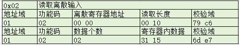

# 单片机总结系列(26) modbus协议解析和应用

Modbus协议是由Modicon开发的，用于工业自动化系统中的通讯协议，Modbus支持串行通讯(RS232, RS485)和以太网通讯。Modbus协议已经成为一个开放的标准，具有简单易懂、灵活性强、易于扩展、开放性和可靠性高等特点。广泛应用于工业自动化控制、智能家居、能源监控、环境监测和智能交通等领域。 Modbus协议根据通讯方式的划分，主要包含如下两大类。

1. 以RTU或ASCII模式进行传输的串行通讯方式，以UART相关的接口TTL, RS232, RS485为主，也支持其它介质如CAN，SPI等。在这个模式下，主要为一主多从的通讯框架。主站作为发起方，负责发送请求信息并接收从站的回应(Modbus-Master)；从站则响应主站的请求，提供数据或执行相应的操作。串行通讯模式下，包含一个主站和至少一个从站，不同从站之间通过地址域来区分。
2. 以TCP模式进行传输的以太网通讯方式，此时系统采用客户端/服务器模式，此时认为客户端就是主站。服务端作为从站，也支持一主多从的通讯框架。

可以看到，modbus的协议部分有RTU，ASCII，TCP三种模式组成，其中RTU和ASCII都是基于串行通讯方式，TCP则是基于网络服务的一主多从结构。在理解这些概念的基础上，就可以进行更深入的掌握协议知识。本篇配合的代码实现参考如下所示。

目录如下所示。

- [modbus串口应用实现和说明](#modbus_serial)
  - [modbus RTU应用实现](#modbus_rtu)  
- [modbus网络应用实现和说明](#modbus_tcp)
- [下一章节](#next_chapter)

本节配合例程:

1. [裸机循环下的freemodbus协议移植和应用](../code/26-1-STM32F429_ModbusNoOS/)
2. [FreeRTOS系统下的freemodbus协议移植和应用](../code/26-2-STM32F429_ModbusOS/)

## modbus_serial

Modbus串行通讯包含RTU和ASCII两种模式，这两种模式的主要区别就是协议的解析方式不同，但具体到软件执行框架和流程是基础一致的。那么如何解析协议，这里讲述我曾经总结的一些方法。协议是约定了多个设备之间交互的方法，为了保证能够正常的数据通讯，能够处理各类问题，因此定义一些约束，符合约束的设备才能够互相联系，这些约束包含如下所示。

1. 物理层，通俗的就是硬件连接方法，包含连接的线缆，物理通讯接口，电平和驱动配置，具体到串行通讯，就涉及串口波特率，数据位，停止位，奇偶校验位，底层的接收和发送接口的实现等
2. 协议层，协议解析和组包发送方法，其中协议解析主要接收对端数据，解析处理，并将解析后信息提交到应用层，协议组包则是将应用层的数据添加协议信息，组包到物理层发送
3. 应用层，处理具体的应用功能，包含业务的数据信息，处理提交和发送业务

其中协议层规定了数据格式，也是RTU和ASCII的最大区别。

### modbus_rtu

Modbus RTU的格式如下所示。

| 地址域 | 功能码 | 数据域 | 校验域 |
| --- | --- | --- | --- |

- 地址域：标识要访问的设备。
- 功能码：表示要执行的操作，如读取保持寄存器、写入单个寄存器等。
- 数据域：包含特定功能的参数或数据。
- 校验码: 用于确保数据传输的准确性，如CRC循环冗余校验。

其中功能码的命令，决定了数据域内的数据格式，常用的功能码如下所示。

| 功能码 | 功能说明 |
| --- | --- |
| 0x01 | 读线圈状态 |
| 0x02 | 读取离散输入 |
| 0x03 | 读取保持寄存器 |
| 0x04 | 读取输入寄存器 |
| 0x05 | 写单个线圈 |
| 0x06 | 写单个保持寄存器 |
| 0x0F | 写多个线圈 |
| 0x10 | 写多个保持寄存器 |

1. 线圈地址(Coil Address): 功能码0x01, 0x05, 0x0F对应操作线圈地址，用于控制输出，通常表示开关状态(ON/OFF)。表示范围从00001到09999，数据类型为二进制。
2. 离散输入地址: 功能码0x02用于读取离散输入, 用于表示输入状态，通常表示开关输入状态。表示范围从10001到19999，数据类型为二进制。
3. 保持寄存器地址(Holding Register Address): 功能码0x03, 0x06对应操作保持寄存器，用于存储和传输数据，通常用于存储设备的配置和参数。表示范围从40001到49999，数据类型为16bit寄存器。
4. 输入寄存器地址(Input Register Address): 功能码0x04对应操作输入寄存器，用于存储和传输只读数据，通常包含设备状态、测量值等。表示范围从30001到39999，数据类型为16bit寄存器。

这里列出测试的命令解析和应答方式。

- 读线圈状态(0x01)

命令请求: 01 01 00 00 00 08 3d cc

返回请求: 01 01 01 10 50 44

- 写单个线圈状态(0x05, 0xFF 0x00表示1, 0x00 0x00为0, 其它则错误)

命令请求: 01 05 00 01 FF 00 dd fa

返回请求: 01 05 00 01 FF 00 dd fa

- 写多个线圈状态(0x0F)

命令请求: 01 0F 00 00 00 04 01 0x0F 7f 5e

返回请求: 01 0F 00 00 00 04 54 08


- 读取离散输入(0x02)

命令请求: 01 02 00 00 00 10 79 c6

返回请求: 01 02 02 31 15 6d e7



- 读取保持寄存器(0x03)

命令请求: 01 03 00 00 00 02 25 3a

返回请求: 01 03 04 10 00 10 01 32 f3

- 写入保持寄存器(0x06)

命令请求: 01 06 00 00 01 0A 08 5d

返回请求: 01 06 00 00 01 0A 08 5d


- 读取输入寄存器(0x04)

命令请求: 01 04 00 00 00 02 25 3a

返回请求: 01 04 04 10 00 10 01 33 44


上面就是modbus RTU的协议部分的格式和通讯协议数据的，这里以Freemodbus slave的实现为例，讲解具体的实现。

FreeModbus slave的主要实现协议部分解析组包的部分，其物理层和应用层的处理需要用户自己实现。物理层主要实现串口数据的接收和发送，其中接收的原理是基于定时器实现的串口空闲检测，判断来接收，这里以stm32+FreeRTOS的实现为例，代码参考: [modbus应用代码](../code/26-2-STM32F429_ModbusOS/)

物理层的实现包含两部分，用于串口通讯控制的portserial.c和porttimer.c, 其中portserial.c实现串口的交互的驱动，具体如下所示。

```c
//portserial.c
void vMBPortSerialEnable( BOOL xRxEnable, BOOL xTxEnable ) //控制串口的发送和接收
void vMBPortClose( void )   //关闭通讯
BOOL xMBPortSerialInit( UCHAR ucPORT, ULONG ulBaudRate, UCHAR ucDataBits, eMBParity eParity ) //串口初始化

//向串口写入单字节数据
BOOL xMBPortSerialPutByte( CHAR ucByte )
{
    while (__HAL_UART_GET_FLAG(&huart2, UART_FLAG_TXE) == RESET)
    {}
    huart2.Instance->DR = ucByte;
    return TRUE;
}

//从串口读取单字节数据
BOOL xMBPortSerialGetByte( CHAR * pucByte )
{
    while (__HAL_UART_GET_FLAG(&huart2, UART_FLAG_RXNE) == RESET)
    {}
    *pucByte = huart2.Instance->DR;

    return TRUE;
}

//数据发送的实现
static void prvvUARTTxReadyISR( void )
{
    pxMBFrameCBTransmitterEmpty(  );
}

//数据接收实现
static void prvvUARTRxISR( void )
{
    pxMBFrameCBByteReceived(  );
}

void USART2_IRQHandler( void )
{
    if (__HAL_UART_GET_FLAG(&huart2, UART_FLAG_RXNE) != RESET)
    {
        prvvUARTRxISR();
    }
    
    if(__HAL_UART_GET_FLAG(&huart2, UART_FLAG_TXE) != RESET
    && __HAL_UART_GET_IT_SOURCE(&huart2, UART_IT_TXE))
    {
         prvvUARTTxReadyISR();
    }
    
    if(__HAL_UART_GET_FLAG(&huart2,  UART_FLAG_ORE | UART_FLAG_PE | UART_FLAG_NE | UART_FLAG_FE) != RESET)
    {
        __HAL_UART_CLEAR_PEFLAG(&huart2);
    }
}
```

porttimer.c则主要负责检测串口完整帧，原理上为当接收到第一个字节数据后，开启定时器，并在接收到每个字节数据是刷新，当通讯结束后，此时不在刷新定时器，定时器超时触发信号，通知接收到完整帧，具体实现如下所示。

```c
static TimerHandle_t xTimer;

//定时器超时回调函数，触发通知主循环接收到完整帧
void vTimerCallback( TimerHandle_t xTimer )
{
    EnterCriticalSection();
    ( void )pxMBPortCBTimerExpired(  );
    ExitCriticalSection();
}

//初始化定时器，基于波特率设置超时时间
BOOL
xMBPortTimersInit( USHORT usTim1Timerout50us )
{
    xTimer = xTimerCreate("Timer", 
        (50 * usTim1Timerout50us)/(1000 * 1000 / configTICK_RATE_HZ) + 4,
         pdFALSE,
         ( void * ) 0,
         vTimerCallback
       );
         
    if (xTimer) {
        return TRUE;
    }
    return FALSE;
}  

//开启定时器，刷新定时器计数
void
vMBPortTimersEnable(  )
{
    BaseType_t xHigherPriorityTaskWoken = pdFALSE;
    
    if(IS_IRQ()) {
        xTimerResetFromISR(xTimer, &xHigherPriorityTaskWoken);
        xTimerStartFromISR( xTimer, &xHigherPriorityTaskWoken);
    }
    else {
        xTimerReset(xTimer, 0);
        xTimerStart(xTimer, 0);
    }
}

//关闭定时器
void
vMBPortTimersDisable(  )
{
    BaseType_t xHigherPriorityTaskWoken = pdFALSE;
    
    if(IS_IRQ()) {
        xTimerStopFromISR(xTimer, &xHigherPriorityTaskWoken);
    }
    else {
        xTimerStop(xTimer, 0);
    }
}
```

应用层则包含寄存器的处理和操作循环，其中循环事务如下所示。

```c
#define MODBUS_RUN_MODE 0

void mb_process_task(void *argument)
{
    eMBErrorCode eStatus;

#if MODBUS_RUN_MODE == 0 
    //rtu协议交互初始化
    eStatus = eMBInit( MB_RTU, MODBUS_DEF_ADDRESS, 0, MODBUS_DEF_UBAUD, MODBUS_DEF_PARITY );
    if( eStatus != MB_ENOERR  ) {
        PRINT_LOG(LOG_ERROR, xTaskGetTickCount(), "eMBInit RTU Mode Failed!");
        return;
    }
#elif MODBUS_RUN_MODE == 1
    //ascii协议交互初始化
    eStatus = eMBInit( MB_ASCII, MODBUS_DEF_ADDRESS, 0, MODBUS_DEF_UBAUD, MODBUS_DEF_PARITY );
    if( eStatus != MB_ENOERR  ) {
        PRINT_LOG(LOG_ERROR, xTaskGetTickCount(), "eMBInit ASCII Mode Failed!");
        return;
    }
#elif MODBUS_RUN_MODE == 2
    //modbus tcp交互初始化
    eStatus = eMBTCPInit(MODBUS_DEF_TCP_PORT);
    if( eStatus != MB_ENOERR  ) {
        PRINT_LOG(LOG_ERROR, xTaskGetTickCount(), "eMBInit TCP Mode Failed!");
        return;
    }
#endif
    
    //开启modbus应用
    eStatus = eMBEnable(  );
    if(eStatus != MB_ENOERR)
    {
        PRINT_LOG(LOG_ERROR, xTaskGetTickCount(), "eMBEnable failed:%d!", eStatus);
    }
        
    while(1)
    {
        //循环处理modbus业务
        eStatus = eMBPoll();
        if(eStatus != MB_ENOERR)
        {
            PRINT_LOG(LOG_ERROR, xTaskGetTickCount(), "eMBPoll failed:%d!", eStatus);
        }
    }
}
```

寄存器处理则如下所示。

```c
//对应功能码如下所示
//功能码: 01(0x01), 读线圈状态，读取连续的值(每个寄存器代表1bit数据)，可读可写
//功能码: 05(0x05), 写单个线圈(0xFF 0x00表示1, 0x00 0x00为0, 其它则错误)
//功能码: 15(0x0F), 写多个线圈
#define REG_COIL_START           0x0001
#define REG_COIL_NREGS           48         //divisible by 8
static UCHAR   usRegCoilBuf[REG_COIL_NREGS/8] = {0x10, 0xf2, 0x35, 0x00, 0x00, 0x00};
eMBErrorCode eMBRegCoilsCB( UCHAR * pucRegBuffer, USHORT usAddress, USHORT usNCoils, eMBRegisterMode eMode )
{
    UCHAR *pucStartRegBuffer = pucRegBuffer;

    /* check if we away of table size */
    if (usAddress < REG_COIL_START
    || usAddress + usNCoils > REG_COIL_START+REG_COIL_NREGS) {
        return MB_ENOREG;
    } 
    
    //covert to register list
    usAddress -= REG_COIL_START;

    switch (eMode)
    {
        case MB_REG_WRITE:
            while( usNCoils > 0 ) {
                xMBUtilSetBits( usRegCoilBuf, usAddress, (uint8_t)( usNCoils > 8 ? 8 : usNCoils ), *pucStartRegBuffer++ );
                if (usNCoils > 8) {
                    usNCoils -= 8;
                    usAddress += 8;
                } else {
                    break;
                }
            }
            break;
        case MB_REG_READ:
            while( usNCoils > 0 ) {
                *pucStartRegBuffer++ = xMBUtilGetBits(usRegCoilBuf, usAddress, ( uint8_t )( usNCoils > 8 ? 8 : usNCoils ) );
                if (usNCoils > 8) {
                    usNCoils -= 8;
                    usAddress += 8;
                } else {
                    break;
                }
            }
            break;
    }

    return MB_ENOERR;
}

//对应功能码如下所示
//功能码: 02(0x02), 读取离散输入(每个寄存器代表1bit数据)，只读
#define REG_DISCRETE_START           0x0001
#define REG_DISCRETE_NREGS           48         //divisible by 8
static UCHAR   usRegDiscreateBuf[REG_DISCRETE_NREGS/8] = {0x31, 0x15, 0x01, 0x00, 0x01, 0x01};  
eMBErrorCode eMBRegDiscreteCB( UCHAR * pucRegBuffer, USHORT usAddress, USHORT usNDiscrete )
{
    eMBErrorCode eStatus = MB_ENOERR;

    /* check if we away of table size */
    if (usAddress <  REG_COIL_START
    || usAddress + usNDiscrete > REG_DISCRETE_START + REG_DISCRETE_NREGS) {
        return MB_ENOREG;
    }
    
    usAddress -= REG_COIL_START;
    while (usNDiscrete > 0) {
        *pucRegBuffer++ = xMBUtilGetBits(usRegDiscreateBuf, usAddress, (uint8_t)( usNDiscrete > 8 ? 8 : usNDiscrete ) );
        
        if(usNDiscrete > 8) {
            usNDiscrete -= 8;
            usAddress += 8;
        } else {
            break;
        }
    }
    return eStatus;    
}

//对应功能码如下所示
//功能码: 03(0x03), 读取保持寄存器((每个寄存器代表16bit数据)
//功能码: 06(0x06), 写入保持寄存器((每个寄存器代表16bit数据)
#define REG_HOLDING_START           0x0001
#define REG_HOLDING_NREGS           10
static USHORT   usRegHoldingBuf[REG_HOLDING_NREGS] = {0x1000, 0x1001, 0x1002, 0x1003};
eMBErrorCode eMBRegHoldingCB( UCHAR * pucRegBuffer, USHORT usAddress, USHORT usNRegs, eMBRegisterMode eMode )
{
    eMBErrorCode    eStatus = MB_ENOERR;
    int             iRegIndex;

    if (usAddress <  REG_HOLDING_START
    || usAddress + usNRegs > REG_HOLDING_START + REG_HOLDING_NREGS) {
        return MB_ENOREG;
    }
    
    iRegIndex = usAddress - REG_HOLDING_START;
    switch (eMode) {                                       
        case MB_REG_READ:
            while (usNRegs > 0) {
                *pucRegBuffer++ = (usRegHoldingBuf[iRegIndex] >> 8);            
                *pucRegBuffer++ = (usRegHoldingBuf[iRegIndex] & 0xFF); 
                iRegIndex++;
                usNRegs--;
            }                            
            break;
        case MB_REG_WRITE:
            while (usNRegs > 0) {         
                usRegHoldingBuf[iRegIndex] = *pucRegBuffer++ << 8;
                usRegHoldingBuf[iRegIndex] |= *pucRegBuffer++;
                iRegIndex++;
                usNRegs--;
            }
            break;
    }

    return eStatus;
}

//对应功能码如下所示
//功能码: 04, 读取输入寄存器(每个数据2字节)
#define REG_INPUT_START           0x0001
#define REG_INPUT_NREGS           10
static USHORT   usRegInputBuf[REG_INPUT_NREGS] = {0x1000, 0x1001, 0x1002, 0x1003};
eMBErrorCode eMBRegInputCB(UCHAR * pucRegBuffer, USHORT usAddress, USHORT usNRegs)
{
    eMBErrorCode    eStatus = MB_ENOERR;
    int             iRegIndex;
    
    if (usAddress <  REG_INPUT_START
    || usAddress + usNRegs > REG_INPUT_START + REG_INPUT_NREGS) {
        return MB_ENOREG;
    }
    
    iRegIndex = usAddress - REG_INPUT_START;
    while (usNRegs>0)  {
        *pucRegBuffer++ = ( unsigned char )( usRegInputBuf[iRegIndex] >> 8 );
        *pucRegBuffer++ = ( unsigned char )( usRegInputBuf[iRegIndex] & 0xFF );
        iRegIndex++;
        usNRegs--;
    }

    return eStatus;
}
```

至此，关于Modbus RTU的移植主要包含三部分实现。

1. 物理层实现串口通讯相关驱动接口
2. 应用层则包含实现协议主体的接口
3. 另外则是操作具体寄存器的功能接口

## modbus_tcp

mobus_tcp的格式如下所示。

| Transaction Identifier | Protocol Identifier | Length | Unit Identifier | Function Code | Data |
| --- | --- | --- | --- | --- | --- |
| 事务处理标识符 | 协议标识符 | 长度 | 单元标识符 | 功能码 | 数据 |
| 2 字节 | 2 字节 | 2 字节 | 1 字节 | 1 字节 | 0 到 252 字节 |

- 事务处理标识符: 用于匹配请求和响应消息
- 协议标识符: 标识Modbus应用协议
- 长度: 指示后续数据单元的长度
- 单元标识符: 从设备的地址，用于区分不同的从设备
- 功能码: 指示操作类型，如读、写等，其中功能码和Modbus RTU一致
- 数据: 根据功能码的不同，数据部分可能包含地址、数量等信息

这里列出部分测试的命令解析和应答方式。

- 读线圈状态(0x01)

命令请求: 00 00 00 00 00 06 01 01 00 00 00 20

返回请求: 00 00 00 00 00 07 01 01 04 10 01 01 00

- 写单个线圈状态(0x05, 0xFF 0x00表示1, 0x00 0x00为0, 其它则错误)

命令请求: 00 00 00 00 00 06 01 05 00 00 FF 00

返回请求: 00 00 00 00 00 06 01 05 00 00 FF 00

- 写多个线圈状态(0x0F)

命令请求: 00 00 00 00 00 09 01 0F 00 00 00 10 02 1C A0

返回请求: 00 00 00 00 00 09 01 0F 00 00 00 10


对于寄存器的处理，Modbus TCP的处理和Modbus RTU的机制一致，主要差别为底层物理层通讯接口和协议解析的差异，而对于移植来说，则实现TCP服务器即可，如下所示。

```c
#define TCP_RX_BUFFER_SIZE      1024

static int server_fd, client_fd;
static UCHAR rx_buffer[TCP_RX_BUFFER_SIZE];
static int rx_size;
static osThreadId_t mbTcpHandle;
static const osThreadAttr_t mbTcpTask_attributes = {
  .name = "mbtcp_task",
  .stack_size = 1024 * 1,
  .priority = (osPriority_t) osPriorityHigh,
};

//实现modbus tcp服务器线程
void mb_tcp_process_task(void *argument)
{
    struct sockaddr_in server_addr;
    struct sockaddr_in client_addr;
    socklen_t client_addr_len;
    int opt = 1;
    USHORT port = *(USHORT *)argument;
    
    server_fd = socket(AF_INET, SOCK_STREAM, 0);
    if (server_fd == -1) 
    {
        PRINT_LOG(LOG_ERROR, xTaskGetTickCount(), "无法创建socket\n");
        return;
    }

    setsockopt(server_fd, SOL_SOCKET, SO_REUSEADDR, &opt, sizeof(opt));

    // 定义服务器地址结构
    memset(&server_addr, 0, sizeof(server_addr));
    server_addr.sin_family = AF_INET;
    server_addr.sin_addr.s_addr = htonl(INADDR_ANY);
    server_addr.sin_port = htons(port);

    // 绑定socket到服务器地址
    if (bind(server_fd, (struct sockaddr*)&server_addr, sizeof(server_addr)) < 0) {
        PRINT_LOG(LOG_ERROR, xTaskGetTickCount(), "can't bind to socket %d\n", port);
        return;
    }

    // 监听socket
    listen(server_fd, 3);

    PRINT_LOG(LOG_INFO, xTaskGetTickCount(), "server listen success, fd:%d, port:%d", server_fd, port);

    while (1) 
    {
        //接收客户端连接
        client_addr_len = sizeof(client_addr);
        client_fd = accept(server_fd, (struct sockaddr*)&client_addr, &client_addr_len);
        if (client_fd < 0) {
            PRINT_LOG(LOG_ERROR, xTaskGetTickCount(), "client accept failed!");
            continue;
        }

        PRINT_LOG(LOG_INFO, xTaskGetTickCount(), "client connect success!");

        while (1) 
        {
            rx_size = recv(client_fd, rx_buffer, TCP_RX_BUFFER_SIZE, 0);
            if (rx_size < 0) 
            {
                PRINT_LOG(LOG_ERROR, xTaskGetTickCount(), "recv data failed");
                break;
            } 
            else if (rx_size == 0) 
            {
                PRINT_LOG(LOG_ERROR, xTaskGetTickCount(), "client client failed");
                break;
            }
            else
            {
                //接收到数据，通知应用层处理
                xMBPortEventPost(EV_FRAME_RECEIVED);
            }
        }
        
        //检测失败，断开现有连接
        close(client_fd);
        client_fd = -1;
    }
}

BOOL
xMBTCPPortInit(USHORT usTCPPort)
{
    mbTcpHandle = osThreadNew(mb_tcp_process_task, &usTCPPort, &mbTcpTask_attributes);
    if(mbTcpHandle == NULL)
    {
        return FALSE;
    }

    return TRUE;
}

void
vMBTCPPortDisable(void)
{
    close(client_fd);
    client_fd = -1;
}

//读取接收数据，提交到上层协议解析
BOOL
xMBTCPPortGetRequest(UCHAR **ppucMBTCPFrame, USHORT *usTCPLength)
{
    *ppucMBTCPFrame = &rx_buffer[0];
    *usTCPLength = rx_size;
    return TRUE;
}

//发送数据
BOOL
xMBTCPPortSendResponse(const UCHAR *pucMBTCPFrame, USHORT usTCPLength)
{
    int ret;
    BOOL bFrameSent = FALSE;

    if (client_fd)
    {
        ret = send(client_fd, (void *)pucMBTCPFrame, usTCPLength, 0);
        if (ret == usTCPLength)
        {
            bFrameSent = TRUE;
        }
    }
    return bFrameSent;
}
```

至此，关于Modbus RTU/TCP的讲解完成。本文主要以协议格式为基础，freemodbus的移植和应用为核心，讲解modbus需要了解的知识。不过因为篇幅原因，只能抛砖引玉；如果希望彻底掌握modbus协议，还需要自己去移植，调试验证，才能有更深入的了解。

## next_chapter

[返回目录](./../README.md)

直接开始下一小节: [其它嵌入式知识总结](./chx1.other_summy.md)
